<h1 style="color:skyblue;text-align:center">Vue学习笔记</h1>


# 概述

Vue (发音为 /vjuː/，类似 view) 是一款用于构建用户界面的 JavaScript 框架。它基于标准 HTML、CSS 和 JavaScript 构建，并提供了一套声明式的、组件化的编程模型，帮助你高效地开发用户界面。无论是简单还是复杂的界面，Vue 都可以胜任。

- **声明式渲染**：Vue 基于标准 HTML 拓展了一套模板语法，使得我们可以声明式地描述最终输出的 HTML 和 JavaScript 状态之间的关系。
- **响应性**：Vue 会自动跟踪 JavaScript 状态并在其发生变化时响应式地更新 DOM。


## 特点

Vue 是一个框架，也是一个生态。其功能覆盖了大部分前端开发常见的需求。但 Web 世界是十分多样化的，不同的开发者在 Web 上构建的东西可能在形式和规模上会有很大的不同。考虑到这一点，Vue 的设计非常注重灵活性和“可以被逐步集成”这个特点。根据你的需求场景，你可以用不同的方式使用 Vue：

- 无需构建步骤，渐进式增强静态的 HTML
- 在任何页面中作为 Web Components 嵌入
- 单页应用 (SPA)
- 全栈 / 服务端渲染 (SSR)
- Jamstack / 静态站点生成 (SSG)
- 开发桌面端、移动端、WebGL，甚至是命令行终端中的界面


## 官网

https://cn.vuejs.org/


## 单文件组件

在大多数启用了构建工具的 Vue 项目中，我们可以使用一种类似 HTML 格式的文件来书写 Vue 组件，它被称为**单文件组件** (也被称为 `*.vue` 文件，英文 Single-File Components，缩写为 **SFC**)。顾名思义，Vue 的单文件组件会将一个组件的逻辑 (JavaScript)，模板 (HTML) 和样式 (CSS) 封装在同一个文件里。

```vue
<template>
  <button @click="count++">Count is: {{ count }}</button>
</template>

<script>
export default {
  data() {
    return {
      count: 0,
    }
  }
}
</script>


<style scoped>
button {
  font-weight: bold;
}
</style>
```


## 选项式API和组合式API

使用选项式 API，我们可以用包含多个选项的对象来描述组件的逻辑，例如 `data`、`methods` 和 `mounted`。选项所定义的属性都会暴露在函数内部的 `this` 上，它会指向当前的组件实例

通过组合式 API，我们可以使用导入的 API 函数来描述组件逻辑。在单文件组件中，组合式 API 通常会与 \<script setup> 搭配使用。这个 setup attribute 是一个标识，告诉 Vue 需要在编译时进行一些处理，让我们可以更简洁地使用组合式 API。比如，\<script setup> 中的导入和顶层变量/函数都能够在模板中直接使用。


# 环境准备

## 安装脚手架

前提需要nodejs，vue/cli requires Node ^12.0.0 || >= 14.0.0


命令如下：

```sh
npm install -g @vue/cli
```

* -g 参数表示全局安装，这样在任意目录都可以使用 vue 脚本创建项目


```sh
PS C:\Users\mao> npm install -g @vue/cli
npm WARN deprecated apollo-server-express@3.12.0: The `apollo-server-express` package is part of Apollo Server v2 and v3, which are now deprecated (end-of-life October 22nd 2023). This package's functionality is now found in the `@apollo/server` package. See https://www.apollographql.com/docs/apollo-server/previous-versions/ for more details.
npm WARN deprecated subscriptions-transport-ws@0.11.0: The `subscriptions-transport-ws` package is no longer maintained. We recommend you use `graphql-ws` instead. For help migrating Apollo software to `graphql-ws`, see https://www.apollographql.com/docs/apollo-server/data/subscriptions/#switching-from-subscriptions-transport-ws    For general help using `graphql-ws`, see https://github.com/enisdenjo/graphql-ws/blob/master/README.md
npm WARN deprecated apollo-server-types@3.8.0: The `apollo-server-types` package is part of Apollo Server v2 and v3, which are now deprecated (end-of-life October 22nd 2023). This package's functionality is now found in the `@apollo/server` package. See https://www.apollographql.com/docs/apollo-server/previous-versions/ for more details.
npm WARN deprecated apollo-server-core@3.12.0: The `apollo-server-core` package is part of Apollo Server v2 and v3, which are now deprecated (end-of-life October 22nd 2023). This package's functionality is now found in the `@apollo/server` package. See https://www.apollographql.com/docs/apollo-server/previous-versions/ for more details.
npm WARN deprecated apollo-server-env@4.2.1: The `apollo-server-env` package is part of Apollo Server v2 and v3, which are now deprecated (end-of-life October 22nd 2023). This package's functionality is now found in the `@apollo/utils.fetcher` package. See https://www.apollographql.com/docs/apollo-server/previous-versions/ for more details.
npm WARN deprecated apollo-reporting-protobuf@3.4.0: The `apollo-reporting-protobuf` package is part of Apollo Server v2 and v3, which are now deprecated (end-of-life October 22nd 2023). This package's functionality is now found in the `@apollo/usage-reporting-protobuf` package. See https://www.apollographql.com/docs/apollo-server/previous-versions/ for more details.
npm WARN deprecated apollo-server-errors@3.3.1: The `apollo-server-errors` package is part of Apollo Server v2 and v3, which are now deprecated (end-of-life October 22nd 2023). This package's functionality is now found in the `@apollo/server` package. See https://www.apollographql.com/docs/apollo-server/previous-versions/ for more details.
npm WARN deprecated apollo-datasource@3.3.2: The `apollo-datasource` package is part of Apollo Server v2 and v3, which are now deprecated (end-of-life October 22nd 2023). See https://www.apollographql.com/docs/apollo-server/previous-versions/ for more details.
npm WARN deprecated apollo-server-plugin-base@3.7.2: The `apollo-server-plugin-base` package is part of Apollo Server v2 and v3, which are now deprecated (end-of-life October 22nd 2023). This package's functionality is now found in the `@apollo/server` package. See https://www.apollographql.com/docs/apollo-server/previous-versions/ for more details.
npm WARN deprecated source-map-resolve@0.5.3: See https://github.com/lydell/source-map-resolve#deprecated
npm WARN deprecated resolve-url@0.2.1: https://github.com/lydell/resolve-url#deprecated
npm WARN deprecated urix@0.1.0: Please see https://github.com/lydell/urix#deprecated
npm WARN deprecated source-map-url@0.4.1: See https://github.com/lydell/source-map-url#deprecated
C:\Users\mao\AppData\Roaming\npm\vue -> C:\Users\mao\AppData\Roaming\npm\node_modules\@vue\cli\bin\vue.js

> @apollo/protobufjs@1.2.7 postinstall C:\Users\mao\AppData\Roaming\npm\node_modules\@vue\cli\node_modules\@apollo\protobufjs
> node scripts/postinstall


> @apollo/protobufjs@1.2.6 postinstall C:\Users\mao\AppData\Roaming\npm\node_modules\@vue\cli\node_modules\apollo-reporting-protobuf\node_modules\@apollo\protobufjs
> node scripts/postinstall

npm WARN node-fetch@2.6.11 requires a peer of encoding@^0.1.0 but none is installed. You must install peer dependencies yourself.
npm WARN ws@7.5.9 requires a peer of bufferutil@^4.0.1 but none is installed. You must install peer dependencies yourself.
npm WARN ws@7.5.9 requires a peer of utf-8-validate@^5.0.2 but none is installed. You must install peer dependencies yourself.

+ @vue/cli@5.0.8
added 853 packages from 491 contributors in 535.031s
PS C:\Users\mao>
```


## 创建项目

可以使用命令`vue ui`来手动创建项目，也可以使用idea创建项目


### vue ui

使用图形向导来创建 vue 项目


```sh
PS C:\Users\mao> vue ui
🚀  Starting GUI...
🌠  Ready on http://localhost:8000
```


点击新建项目


等待创建成功


### idea创建项目

打开idea，点击新建项目，选择js，再选择vue.js


输入项目名称


等待创建


项目结构如下：


## 运行项目

点击package.json文件中serve前的运行按钮


或者直接点击运行按钮


或者直接输入命令：

```sh
npm run serve
```


## 修改端口

文档地址：https://webpack.js.org/configuration/dev-server/#devserverport


打开 vue.config.js 添加


更改成：


```js
const {defineConfig} = require('@vue/cli-service')
module.exports = defineConfig({
    transpileDependencies: true,
    devServer:
        {
            port: 8083,
        }
})

```


## 添加代理

为了避免前后端服务器联调时， fetch、xhr 请求产生跨域问题，需要配置代理


打开 vue.config.js 添加


```js
const {defineConfig} = require('@vue/cli-service')
module.exports = defineConfig({
    transpileDependencies: true,
    devServer:
        {
            port: 8083,
            proxy:
                {
                    'api': {
                        target: "http://localhost:9090",
                        changeOrigin: true
                    },
                    'api2': {
                        target: "http://localhost:9091",
                        changeOrigin: true
                    }
                }
        }
})
```


## Vue 项目结构

```
├─assets
├─components
├─router
├─store
└─views
```


* assets - 静态资源
* components - 可重用组件
* router - 路由
* store - 数据共享
* views - 视图组件


以后还会添加

* api - 跟后台交互，发送 fetch、xhr 请求，接收响应
* plugins - 插件


# Vue 组件

## 说明

Vue 的组件文件以 .vue 结尾，每个组件由三部分组成

```vue
<template></template>

<script></script>

<style></style>
```


* template 模板部分，由它生成 html 代码
* script 代码部分，控制模板的数据来源和行为
* style 样式部分


入口组件是 App.vue，内容如下：

```vue
<template>
  
  <HelloWorld msg="Welcome to Your Vue.js App"/>
</template>

<script>
import HelloWorld from './components/HelloWorld.vue'

export default {
  name: 'App',
  components: {
    HelloWorld
  }
}
</script>

<style>
#app {
  font-family: Avenir, Helvetica, Arial, sans-serif;
  -webkit-font-smoothing: antialiased;
  -moz-osx-font-smoothing: grayscale;
  text-align: center;
  color: #2c3e50;
  margin-top: 60px;
}
</style>
```


## 入门程序

编写hello world


```vue
<template>

  <div>
    <h1 class="test">{{ msg }}</h1>
    <h2 class="test">my name is {{name}}</h2>
  </div>

</template>

<script>

export default {
  data()
  {
    return {
      msg: "hello world",
      name: "张三"
    }
  }
}
</script>

<style>
.test {
  color: crimson;
}

</style>
```


运行结果如下：


解释

* export default 导出组件对象，供 main.js 导入使用
* 这个对象有一个 data 方法，返回一个**对象**，给 template 提供数据
* `{{}}` 在 Vue 里称之为插值表达式，用来**绑定** data 方法返回的**对象**属性，**绑定**的含义是数据发生变化时，页面显示会同步变化


**注意：template 内只能有一个根元素**


## 文本插值

新建一个vue文件，名字为App2.vue：


```vue
<template>
  <div>
    <h1>{{ name }} </h1>
    <h1>是否成年：{{ age >= 18 ? '成年' : '未成年' }}</h1>
    <h1>5年后年龄：{{ age + 5 }}</h1>
  </div>

</template>

<script>
export default {
  name: "App2",
  data()
  {
    return {
      name: "李四",
      age: 19
    }
  }
}
</script>

<style scoped>

</style>
```


更改main.js

```js
import { createApp } from 'vue'
import App from './App2.vue'

createApp(App).mount('#app')
```


在vue.config.js中添加`lintOnSave:false,`

```js
const {defineConfig} = require('@vue/cli-service')
module.exports = defineConfig({
    transpileDependencies: true,
    lintOnSave:false,
    devServer:
        {
            port: 8083,
            proxy:
                {
                    'api': {
                        target: "http://localhost:9090",
                        changeOrigin: true
                    },
                    'api2': {
                        target: "http://localhost:9091",
                        changeOrigin: true
                    }
                }
        }
})
```


运行


注意：

* `{{}}` 里只能绑定一个属性，绑定多个属性需要用多个 `{{}}` 分别绑定
* 插值内可以进行简单的表达式计算


## 属性绑定

v-bind指令

简写方式：可以省略 v-bind 只保留冒号


```vue
<template>
  <div>
    <input type="text" v-bind:value="name">
    <br>
    <input type="text" :value="address">
    <br>
    <input type="number" :value="age">

  </div>
</template>

<script>
export default {
  name: "App3",
  data()
  {
    return {
      name: "张三",
      age: 17,
      address: "中国湖南"
    }
  }
}
</script>

<style scoped>

</style>
```


## 事件绑定

```vue
<template>
  <div>
    <input type="number" :value="number1" v-on:click="m1">
    <br>
    <input type="number" :value="number2" @click="m2">
    <br>
    <input type="text" :value="name" @change="m3()">
  </div>
</template>

<script>
export default {
  name: "App4",
  data()
  {
    return {
      number1: 100,
      number2: 300,
      name: "张三",
    }
  },
  methods:
      {
        m1()
        {
          console.log("点击执行m1")
          this.number1++;
        },
        m2()
        {
          console.log("点击执行m2")
          this.number2++;
        },
        m3()
        {
          console.log("更改事件执行m3")
          console.log(this.name)
        }
      }
}
</script>

<style scoped>

</style>
```


* 简写方式：可以把 v-on: 替换为 @
* 在 methods 方法中的 this 代表的是 data 函数返回的数据对象


### 事件修饰符

在处理事件时调用 `event.preventDefault()` 或 `event.stopPropagation()` 是很常见的。尽管我们可以直接在方法内调用，但如果方法能更专注于数据逻辑而不用去处理 DOM 事件的细节会更好。

为解决这一问题，Vue 为 `v-on` 提供了**事件修饰符**。修饰符是用 `.` 表示的指令后缀，包含以下这些：

- `.stop`
- `.prevent`
- `.self`
- `.capture`
- `.once`
- `.passive`


```html
<!-- 单击事件将停止传递 -->
<a @click.stop="doThis"></a>

<!-- 提交事件将不再重新加载页面 -->
<form @submit.prevent="onSubmit"></form>

<!-- 修饰语可以使用链式书写 -->
<a @click.stop.prevent="doThat"></a>
```


### 按键修饰符

在监听键盘事件时，我们经常需要检查特定的按键。Vue 允许在 `v-on` 或 `@` 监听按键事件时添加按键修饰符。

```html
<!-- 仅在 `key` 为 `Enter` 时调用 `submit` -->
<input @keyup.enter="submit" />
```

可以直接使用 `KeyboardEvent.key` 暴露的按键名称作为修饰符，但需要转为 kebab-case 形式。


### 按键别名

Vue 为一些常用的按键提供了别名：

- `.enter`
- `.tab`
- `.delete` (捕获“Delete”和“Backspace”两个按键)
- `.esc`
- `.space`
- `.up`
- `.down`
- `.left`
- `.right`


你可以使用以下系统按键修饰符来触发鼠标或键盘事件监听器，只有当按键被按下时才会触发。

- `.ctrl`
- `.alt`
- `.shift`
- `.meta`


> 在 Mac 键盘上，meta 是 Command 键。在 Windows 键盘上，meta 键是 Windows 键


### 鼠标按键修饰符

- `.left`
- `.right`
- `.middle`

这些修饰符将处理程序限定为由特定鼠标按键触发的事件。


## 双向绑定

当改变html代码时，js代码中的数据并没有变化


解决方式是使用v-model 实现双向绑定

* 用 v-model 实现双向绑定，即
  * javascript 数据可以同步到表单标签
  * 反过来用户在表单标签输入的新值也会同步到 javascript 这边
* 双向绑定只适用于表单这种带【输入】功能的标签，其它标签的数据绑定，单向就足够了
* 复选框这种标签，双向绑定的 javascript 数据类型一般用数组


```vue
<template>
  <div>
    <input type="text" v-model="name" @change="m1">
    <br>
    <input type="number" v-model="age" @change="m2">
  </div>
</template>

<script>
export default {
  name: "App5",
  data()
  {
    return {
      name: "张三",
      age: 19,
    }
  },
  methods:
      {
        m1()
        {
          console.log("m1")
          console.log(this.name)
        },
        m2()
        {
          console.log("m2")
          console.log(this.age)
        }
      },
  mounted()
  {
    window.setInterval(() =>
    {
      this.age++;
    }, 5000)
  }
}
</script>

<style scoped>

</style>
```


## 计算属性

直接使用方法计算：

```vue
<template>
  <div>
    <h3>{{ fullName() }}</h3>
    <h3>{{ fullName() }}</h3>
    <h3>{{ fullName() }}</h3>
    <h3>{{ fullName() }}</h3>
  </div>
</template>

<script>
export default {
  name: "App6",
  data()
  {
    return {
      firstName: '三',
      lastName: '张'
    }
  },
  methods:
      {
        fullName()
        {
          //模拟延时
          for (let i = 0; i < 100000; i++)
          {
            for (let j = 0; j < 30000; j++)
            {

            }
          }
          console.log('进入了 fullName方法')
          console.log(new Date().getTime())
          return this.lastName + this.firstName;
        }
      }
}
</script>

<style scoped>

</style>
```


4个标签，一共计算了4次，调用了4次方法


使用computed：

```vue
<template>
  <div>
    <h3>{{ fullName }}</h3>
    <h3>{{ fullName }}</h3>
    <h3>{{ fullName }}</h3>
    <h3>{{ fullName }}</h3>
  </div>
</template>

<script>
export default {
  name: "App6",
  data()
  {
    return {
      firstName: '三',
      lastName: '张'
    }
  },
  methods:
      {
        /*fullName()
        {
          //模拟延时
          for (let i = 0; i < 100000; i++)
          {
            for (let j = 0; j < 30000; j++)
            {

            }
          }
          console.log('进入了 fullName方法')
          console.log(new Date().getTime())
          return this.lastName + this.firstName;
        }*/
      },
  computed:
      {
        fullName()
        {
          //模拟延时
          for (let i = 0; i < 100000; i++)
          {
            for (let j = 0; j < 30000; j++)
            {

            }
          }
          console.log('进入了 fullName方法')
          console.log(new Date().getTime())
          return this.lastName + this.firstName;
        }
      }
}
</script>

<style scoped>

</style>
```


4个标签，一共只计算了1次，调用了1次方法，大大缩短了页面加载时间，避免了重复计算


* 普通方法调用必须加 ()，没有缓存功能
* 计算属性使用时就把它当属性来用，不加 ()，有缓存功能：
  * 一次计算后，会将结果缓存，下次再计算时，只要数据没有变化，不会重新计算，直接返回缓存结果


## 条件渲染

条件渲染有两个标签：

* v-if
* v-show


### v-if

```vue
<template>
  <div>
    <p>
      是否成年：
      <strong v-if="age>=18">是</strong>
      <strong v-else>不是</strong>
    </p>
    <p>
      是否为中国人：
      <strong v-if="address==='中国'">是</strong>
      <strong v-else>不是</strong>
    </p>
  </div>
</template>

<script>
export default {
  name: "App8",
  data()
  {
    return {
      age: 17,
      address: "中国"
    }
  }
}
</script>

<style scoped>

</style>
```


更改数据：

```vue
<template>
  <div>
    <p>
      是否成年：
      <strong v-if="age>=18">是</strong>
      <strong v-else>不是</strong>
    </p>
    <p>
      是否为中国人：
      <strong v-if="address==='中国'">是</strong>
      <strong v-else>不是</strong>
    </p>
  </div>
</template>

<script>
export default {
  name: "App8",
  data()
  {
    return {
      age: 19,
      address: "美国"
    }
  }
}
</script>

<style scoped>

</style>
```


### v-show

```vue
<template>
  <div>
    <p>
      是否成年：
      <strong v-show="age>=18">是</strong>
      <strong v-show="age<18">不是</strong>
    </p>
    <p>
      是否为中国人：
      <strong v-show="address==='中国'">是</strong>
      <strong v-show="address!=='中国'">不是</strong>
    </p>
  </div>
</template>

<script>
export default {
  name: "App9",
  data()
  {
    return {
      age: 17,
      address: "中国"
    }
  }
}
</script>

<style scoped>

</style>
```


### 区别

1. v-if后面能加v-else或者v-else-if，v-show不能


2. v-if本质上是选择性地添加或生成dom数上的标签，v-show无论条件是否成立，都会在dom数上添加标签，但是可能会有display: none


v-if渲染后的页面代码：


v-show渲染后的页面代码：


总的来说，`v-if` 有更高的切换开销，而 `v-show` 有更高的初始渲染开销。因此，如果需要频繁切换，则使用 `v-show` 较好；如果在运行时绑定条件很少改变，则 `v-if` 会更合适


## 列表渲染

```vue
<template>
  <div>
    <table>
      <tr>
        <td>id</td>
        <td>姓名</td>
        <td>性别</td>
        <td>年龄</td>
      </tr>
      <tr v-for="student of studentList" :key="student.id">
        <td>{{ student.id }}</td>
        <td>{{ student.name }}</td>
        <td>{{ student.sex }}</td>
        <td>{{ student.age }}</td>
      </tr>
    </table>
  </div>


</template>

<script>
export default {
  name: "App10",
  data()
  {
    return {
      studentList: (function ()
      {
        const data = []
        for (let i = 0; i < 20; i++)
        {
          data.push({
            id: 1000 + i,
            name: "姓名" + (i + 1),
            age: Math.round(Math.random() * 10 + 10),
            sex: Math.random() > 0.5 ? "男" : "女"
          })
        }
        return data;
      }())
    }
  }
}
</script>

<style scoped>

</style>
```


打印序号：

```vue
<template>
  <div>
    <table>
      <tr>
        <td>序号</td>
        <td>id</td>
        <td>姓名</td>
        <td>性别</td>
        <td>年龄</td>
      </tr>
      <tr v-for="(student,index) of studentList" :key="student.id">
        <td>{{ index + 1 }}</td>
        <td>{{ student.id }}</td>
        <td>{{ student.name }}</td>
        <td>{{ student.sex }}</td>
        <td>{{ student.age }}</td>
      </tr>
    </table>
  </div>


</template>

<script>
export default {
  name: "App11",
  data()
  {
    return {
      studentList: (function ()
      {
        const data = []
        for (let i = 0; i < 20; i++)
        {
          data.push({
            id: 1000 + i,
            name: "姓名" + (i + 1),
            age: Math.round(Math.random() * 10 + 10),
            sex: Math.random() > 0.5 ? "男" : "女"
          })
        }
        return data;
      }())
    }
  }
}
</script>

<style scoped>

</style>
```


* v-if 和 v-for 不能用于同一个标签
* v-for 需要配合特殊的标签属性 key 一起使用，并且 key 属性要绑定到一个能起到唯一标识作用的数据上


## v-text

显示文本

```vue
<template>
  <div>
    <p v-text="text1"></p>
    <p v-text="text2"></p>
  </div>
</template>

<script>
export default {
  name: "App12",
  data()
  {
    return {
      text1: "hello",
      text2: "<h1>你好</h1>",

    }
  }
}

</script>

<style scoped>

</style>
```


* v-text标签只显示文本，不解析和渲染标签
* 使用v-text后，不能添加值，比如\<p v-text="text1">123\</p>


## v-html

```vue
<template>
  <div>
    <p v-html="text1"></p>
    <p v-html="text2"></p>
  </div>
</template>

<script>
export default {
  name: "App13",
  data()
  {
    return {
      text1: "hello",
      text2: "<h1>你好</h1>",
    }
  }
}

</script>

<style scoped>

</style>
```


* 渲染html标签，有XSS攻击风险


## 重用组件

Vue重用组件是指可以被多个Vue实例重复使用的组件。这些组件可以包含自定义的状态和事件处理程序，并且可以在整个应用程序中共享。重用组件可以减少代码冗余，提高开发效率，并使代码更加模块化和可维护。

在Vue中，可以使用\<component>标签来定义重用组件


在Components下添加MyButton.vue


MyButton.vue内容：

```vue
<template>
  <div class="button" :class="[type,size]">
    -
    <slot></slot>
    -
  </div>
</template>

<script>
export default {
  name: "MyButton",
  props: ["type", "size"]
}
</script>

<style scoped>
.button {
  display: inline-block;
  text-align: center;
  border-radius: 30px;
  margin: 5px;
  font: bold 12px/25px Arial, sans-serif;
  padding: 0 2px;
  text-shadow: 1px 1px 1px rgba(255, 255, 255, .22);
  box-shadow: 1px 1px 1px rgba(0, 0, 0, .29), inset 1px 1px 1px rgba(255, 255, 255, .44);
  transition: all 0.15s ease;
}

.button:hover {
  box-shadow: 1px 1px 1px rgba(0, 0, 0, .29), inset 1px 1px 2px rgba(0, 0, 0, .5);
}

.button:active {
  box-shadow: inset 1px 1px 2px rgba(0, 0, 0, .8);
}

.primary {
  background-color: #1d6ef9;
  color: #b5e3f1;
}

.danger {
  background-color: rgb(196, 50, 50);
  color: white;
}

.success {
  background-color: #a5cd4e;;
  color: #3e5706;
}

.small {
  height: 25px;
  font-size: 14px;
  line-height: 25px;
}

.middle {
  height: 30px;
  font-size: 18px;
  line-height: 30px;
}

.large {
  height: 35px;
  font-size: 22px;
  line-height: 35px;
}
</style>

```


* props : 自定义组件属性
* slot : 插槽，用户


使用MyButton.vue：

```vue
<template>
  <div>
    <h1>组件测试</h1>
    <br>
    <my-button type="primary" size="small">12345</my-button>
    <my-button type="primary" size="middle">12345</my-button>
    <my-button type="primary" size="large">12345</my-button>
    <br>
    <my-button type="danger" size="small">12345</my-button>
    <my-button type="danger" size="middle">12345</my-button>
    <my-button type="danger" size="large">12345</my-button>
    <br>
    <my-button type="success" size="small">12345</my-button>
    <my-button type="success" size="middle">12345</my-button>
    <my-button type="success" size="large">12345</my-button>
    <br>

  </div>

</template>

<script>
import MyButton from '@/components/MyButton'

export default {
  name: "App14",
  components: {MyButton},
  data()
  {
    return {}
  }
}
</script>

<style scoped>

</style>
```


MyLink.vue

```vue
<template>
  <a :class="[size]" :href="link">
    <slot></slot>
  </a>
</template>

<script>
export default {
  name: "MyLink",
  props: ['size', 'link']
}
</script>

<style scoped>
a {
  color: tomato;
  text-decoration: none;
  display: flex;
  justify-content: center;
  align-items: center;
  text-align: center;
  padding: 0;
  list-style-type: none;
  font-family: sans-serif;
  text-transform: capitalize;
  position: relative;
  margin: 0.8em;
}

/* 添加了左右两个圆点 */
a::before, a::after {
  content: '';
  position: absolute;
  width: 0.6em;
  height: 0.6em;
  background-color: gainsboro;
  top: calc(50% - 0.3em);
  border-radius: 50%;
  transition: 0.5s cubic-bezier(0.5, -0.5, 0.25, 1.5);
}

a::before {
  left: 0;
  z-index: -1;
}

a::after {
  right: 0;
  z-index: -2;
}

/* 添加悬浮效果 */
a:hover {
  color: deeppink;
}

/* 给前后伪元素添加悬浮效果，注意先后顺序，先是hover后是伪元素 */
a:hover::before, a:hover::after {
  width: 100%;
  height: 100%;
  border-radius: 0;
  background-color: dodgerblue;
}

a:hover::before {
  top: 0;
  left: -0.2em;
}

a:hover::after {
  right: -0.2em;
  filter: brightness(0.8);
}

.small {
  font-size: 22px;
  width: 10em;
  height: 2em;
  line-height: 2em;
}

.middle {
  font-size: 25px;
  width: 10em;
  height: 2em;
  line-height: 2em;
}

.large {
  font-size: 28px;
  width: 10em;
  height: 2em;
  line-height: 2em;
}

</style>
```


使用MyLink.vue

```vue
<template>
  <my-link link="https://www.bilibili.com/" size="small">b站官网</my-link>
  <my-link link="https://www.bilibili.com/" size="middle">b站官网</my-link>
  <my-link link="https://www.bilibili.com/" size="large">b站官网</my-link>
</template>

<script>
import MyLink from '@/components/MyLink'
export default {
  name: "App15",
  components: {MyLink}
}
</script>

<style scoped>

</style>
```


# 生命周期

## 概述

每个 Vue 组件实例在创建时都需要经历一系列的初始化步骤，比如设置好数据侦听，编译模板，挂载实例到 DOM，以及在数据改变时更新 DOM。在此过程中，它也会运行被称为生命周期钩子的函数，让开发者有机会在特定阶段运行自己的代码。


## 注册周期钩子

```js
export default {
  mounted() {
    console.log(`the component is now mounted.`)
  },
  setup(){
    console.log(`the component is now setup.`)
  }
}
```


所有生命周期钩子函数的 `this` 上下文都会自动指向当前调用它的组件实例

避免用箭头函数来定义生命周期钩子，因为如果这样的话你将无法在函数中通过 `this` 获取组件实例


## 生命周期图示


## 生命周期函数

### beforeCreate

在组件实例初始化完成之后立即调用

会在实例初始化完成、props 解析之后、`data()` 和 `computed` 等选项处理之前立即调用。


### created

在组件实例处理完所有与状态相关的选项后调用。

当这个钩子被调用时，以下内容已经设置完成：响应式数据、计算属性、方法和侦听器。然而，此时挂载阶段还未开始，因此 `$el` 属性仍不可用


### beforeMount

在组件被挂载之前调用

当这个钩子被调用时，组件已经完成了其响应式状态的设置，但还没有创建 DOM 节点。它即将首次执行 DOM 渲染过程。


### mounted

在组件被挂载之后调用


组件在以下情况下被视为已挂载：

* 所有同步子组件都已经被挂载。(不包含异步组件或 `<Suspense>` 树内的组件)
* 其自身的 DOM 树已经创建完成并插入了父容器中。注意仅当根容器在文档中时，才可以保证组件 DOM 树也在文档中。


这个钩子通常用于执行需要访问组件所渲染的 DOM 树相关的作用


### beforeUpdate

在组件即将因为一个响应式状态变更而更新其 DOM 树之前调用。

这个钩子可以用来在 Vue 更新 DOM 之前访问 DOM 状态


### updated

在组件因为一个响应式状态变更而更新其 DOM 树之后调用

**不要在 updated 钩子中更改组件的状态，这可能会导致无限的更新循环！**


### beforeUnmount

在一个组件实例被卸载之前调用。

当这个钩子被调用时，组件实例依然还保有全部的功能。


### unmounted

在一个组件实例被卸载之后调用。


一个组件在以下情况下被视为已卸载：

- 其所有子组件都已经被卸载。
- 所有相关的响应式作用 (渲染作用以及 `setup()` 时创建的计算属性和侦听器) 都已经停止。


### errorCaptured

在捕获了后代组件传递的错误时调用。

错误可以从以下几个来源中捕获：

- 组件渲染
- 事件处理器
- 生命周期钩子
- `setup()` 函数
- 侦听器
- 自定义指令钩子
- 过渡钩子


这个钩子带有三个实参：错误对象、触发该错误的组件实例，以及一个说明错误来源类型的信息字符串。

这个钩子可以通过返回 `false` 来阻止错误继续向上传递


### activated

若组件实例是keepalive缓存树的一部分，当组件被插入到 DOM 中时调用


### deactivated

若组件实例是keepalive缓存树的一部分，当组件从 DOM 中被移除时调用


# 侦听器

## 概述

计算属性允许我们声明性地计算衍生值。然而在有些情况下，我们需要在状态变化时执行一些“副作用”：例如更改 DOM，或是根据异步操作的结果去修改另一处的状态。

Vue侦听器是提供给开发者可以用来监测某些数据的变化，从而针对这些数据的变化进行某些操作

侦听器本质上是一个函数，如果要监听哪一个数据的变化，就把那个数据作为函数名


## 示例

在选项式 API 中，我们可以使用 watch 选项在每次响应式属性发生变化时触发一个函数。


```vue
<template>

  <div>
    <h2>uuid: {{ uuid }}</h2>
    <el-button type="success" size="large" @click="uuid=generateUUID()">点击更改uuid</el-button>
    <br>
    <br>
    <el-input v-model="count" type="number" style="width: 200px"/>
  </div>

</template>

<script>

export default {
  name: "App39",
  data()
  {
    return {
      uuid: '',
      count: 100
    }
  },
  watch:
      {
        uuid()
        {
          console.log("检测到uuid更改，当前uuid为" + this.uuid)
        },
        count()
        {
          console.log("检测到count更改，当前count为" + this.count)
        }
      },
  methods:
      {
        generateUUID()
        {
          let d = new Date().getTime()
          if (window.performance && typeof window.performance.now === "function")
          {
            d += performance.now(); //use high-precision timer if available
          }
          return 'xxxxxxxx-xxxx-4xxx-yxxx-xxxxxxxxxxxx'.replace(/[xy]/g, function (c)
          {
            const r = (d + Math.random() * 16) % 16 | 0
            d = Math.floor(d / 16);
            return (c === 'x' ? r : (r & 0x3 | 0x8)).toString(16);
          });
        }
      },
  mounted()
  {
    const uuid = this.generateUUID();
    console.log(uuid)
    this.uuid = uuid
  }
}
</script>

<style scoped>

</style>
```


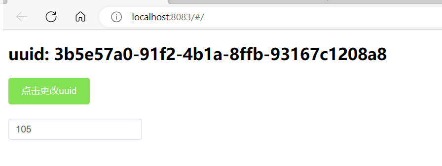


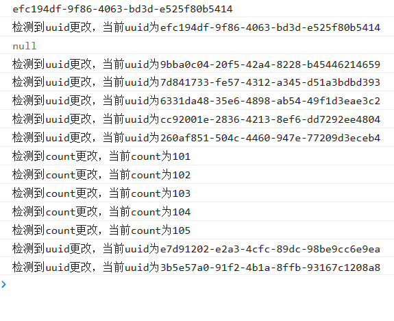


## 深层侦听器

`watch` 默认是浅层的：被侦听的属性，仅在被赋新值时，才会触发回调函数，而嵌套属性的变化不会触发

```vue
<template>

  <div>
    <h2>uuid: {{ data.uuid }}</h2>
    <el-button type="success" size="large" @click="data.uuid=generateUUID()">点击更改uuid</el-button>
    <br>
    <br>
    <el-input v-model="data.count" type="number" style="width: 200px"/>
  </div>

</template>

<script>

export default {
  name: "App40",
  data()
  {
    return {
      data: {
        uuid: '',
        count: 100
      }
    }
  },
  watch:
      {
        data()
        {
          console.log("检测到uuid或者count更改，当前uuid为" + this.data.uuid)
          console.log("检测到uuid或者count更改，当前count为" + this.data.count)
        },
      },
  methods:
      {
        generateUUID()
        {
          let d = new Date().getTime()
          if (window.performance && typeof window.performance.now === "function")
          {
            d += performance.now(); //use high-precision timer if available
          }
          return 'xxxxxxxx-xxxx-4xxx-yxxx-xxxxxxxxxxxx'.replace(/[xy]/g, function (c)
          {
            const r = (d + Math.random() * 16) % 16 | 0
            d = Math.floor(d / 16);
            return (c === 'x' ? r : (r & 0x3 | 0x8)).toString(16);
          });
        }
      },
  mounted()
  {
    const uuid = this.generateUUID();
    console.log(uuid)
    this.data.uuid = uuid
  }
}
</script>

<style scoped>

</style>

```


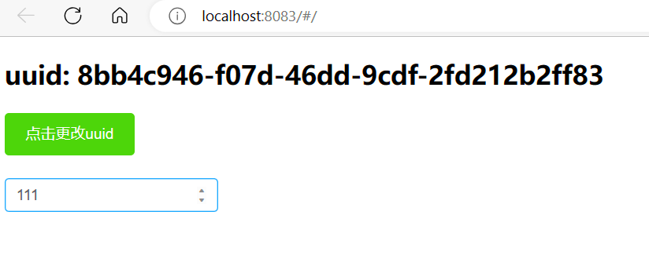


如果想侦听所有嵌套的变更，你需要深层侦听器

深度侦听需要遍历被侦听对象中的所有嵌套的属性，当用于大型数据结构时，开销很大。因此请只在必要时才使用它，并且要留意性能。


```vue
<template>

  <div>
    <h2>uuid: {{ data.uuid }}</h2>
    <el-button type="success" size="large" @click="data.uuid=generateUUID()">点击更改uuid</el-button>
    <br>
    <br>
    <el-input v-model="data.count" type="number" style="width: 200px"/>
  </div>

</template>

<script>

export default {
  name: "App41",
  data()
  {
    return {
      data: {
        uuid: '',
        count: 100
      }
    }
  },
  watch:
      {
        data:
            {
              handler(newValue, oldValue)
              {
                // 注意：在嵌套的变更中，
                // 只要没有替换对象本身，
                // 那么这里的 `newValue` 和 `oldValue` 相同
                console.log(newValue, oldValue)
                console.log("检测到uuid或者count更改，当前uuid为" + this.data.uuid)
                console.log("检测到uuid或者count更改，当前count为" + this.data.count)
              },
              deep: true
            },
      },
  methods:
      {
        generateUUID()
        {
          let d = new Date().getTime()
          if (window.performance && typeof window.performance.now === "function")
          {
            d += performance.now(); //use high-precision timer if available
          }
          return 'xxxxxxxx-xxxx-4xxx-yxxx-xxxxxxxxxxxx'.replace(/[xy]/g, function (c)
          {
            const r = (d + Math.random() * 16) % 16 | 0
            d = Math.floor(d / 16);
            return (c === 'x' ? r : (r & 0x3 | 0x8)).toString(16);
          });
        }
      },
  mounted()
  {
    const uuid = this.generateUUID();
    console.log(uuid)
    this.data.uuid = uuid
  }
}
</script>

<style scoped>

</style>
```


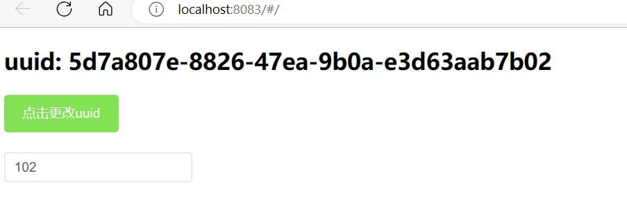


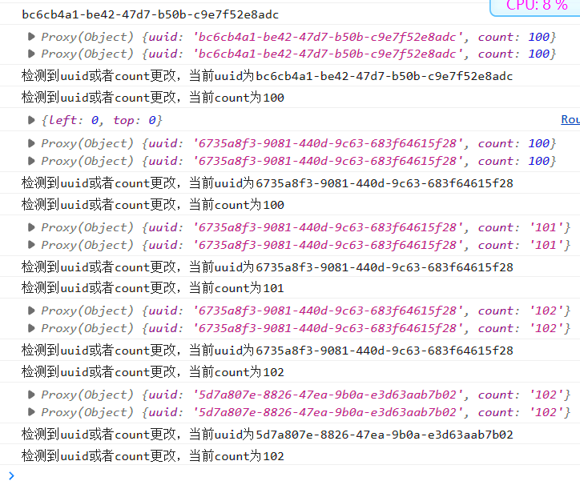


## 即时回调的侦听器

`watch` 默认是懒执行的：仅当数据源变化时，才会执行回调。但在某些场景中，我们希望在创建侦听器时，立即执行一遍回调。举例来说，我们想请求一些初始数据，然后在相关状态更改时重新请求数据。

我们可以用一个对象来声明侦听器，这个对象有 `handler` 方法和 `immediate: true` 选项，这样便能强制回调函数立即执行


回调函数的初次执行就发生在 `created` 钩子之前。Vue 此时已经处理了 `data`、`computed` 和 `methods` 选项


```vue
<template>

  <div>
    <h2>uuid: {{ data.uuid }}</h2>
    <el-button type="success" size="large" @click="data.uuid=generateUUID()">点击更改uuid</el-button>
    <br>
    <br>
    <el-input v-model="data.count" type="number" style="width: 200px"/>
  </div>

</template>

<script>

export default {
  name: "App42",
  data()
  {
    return {
      data: {
        uuid: '',
        count: 100
      }
    }
  },
  watch:
      {
        data:
            {
              handler(newValue, oldValue)
              {
                // 注意：在嵌套的变更中，
                // 只要没有替换对象本身，
                // 那么这里的 `newValue` 和 `oldValue` 相同
                console.log(newValue, oldValue)
                console.log("检测到uuid或者count更改，当前uuid为" + this.data.uuid)
                console.log("检测到uuid或者count更改，当前count为" + this.data.count)
              },
              deep: true,
              immediate: true
            },
      },
  methods:
      {
        generateUUID()
        {
          let d = new Date().getTime()
          if (window.performance && typeof window.performance.now === "function")
          {
            d += performance.now(); //use high-precision timer if available
          }
          return 'xxxxxxxx-xxxx-4xxx-yxxx-xxxxxxxxxxxx'.replace(/[xy]/g, function (c)
          {
            const r = (d + Math.random() * 16) % 16 | 0
            d = Math.floor(d / 16);
            return (c === 'x' ? r : (r & 0x3 | 0x8)).toString(16);
          });
        }
      },
  mounted()
  {
    console.log("mounted方法执行")
    const uuid = this.generateUUID();
    console.log(uuid)
    this.data.uuid = uuid
  },
  created()
  {
    console.log("created方法执行")
  }
}
</script>

<style scoped>

</style>
```


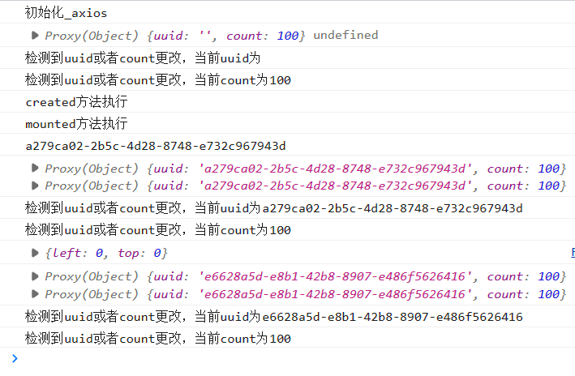


## 回调的触发时机

当你更改了响应式状态，它可能会同时触发 Vue 组件更新和侦听器回调。

默认情况下，用户创建的侦听器回调，都会在 Vue 组件更新**之前**被调用。这意味着你在侦听器回调中访问的 DOM 将是被 Vue 更新之前的状态。

如果想在侦听器回调中能访问被 Vue 更新**之后**的 DOM，你需要指明 `flush: 'post'` 选项


```js
 watch: {
    key: {
      handler() {},
      flush: 'post'
    }
  }
```


## 命令式地创建

我们也可以使用组件实例的 `$watch()` 方法来命令式地创建一个侦听器


```vue
<template>

  <div>
    <h2>uuid: {{ data.uuid }}</h2>
    <el-button type="success" size="large" @click="data.uuid=generateUUID()">点击更改uuid</el-button>
    <br>
    <br>
    <el-input v-model="data.count" type="number" style="width: 200px"/>
    <br>
    <el-input v-model="age" type="number" style="width: 200px"/>
    <br>
    <br>
    <el-button type="success" size="large" @click="createWatch">点击创建age的watch</el-button>
    <br>
  </div>

</template>

<script>

export default {
  name: "App42",
  data()
  {
    return {
      data: {
        uuid: '',
        count: 100
      },
      age: 18,
    }
  },
  watch:
      {
        data:
            {
              handler(newValue, oldValue)
              {
                // 注意：在嵌套的变更中，
                // 只要没有替换对象本身，
                // 那么这里的 `newValue` 和 `oldValue` 相同
                console.log(newValue, oldValue)
                console.log("检测到uuid或者count更改，当前uuid为" + this.data.uuid)
                console.log("检测到uuid或者count更改，当前count为" + this.data.count)
              },
              deep: true,
              immediate: true
            },
      },
  methods:
      {
        generateUUID()
        {
          let d = new Date().getTime()
          if (window.performance && typeof window.performance.now === "function")
          {
            d += performance.now(); //use high-precision timer if available
          }
          return 'xxxxxxxx-xxxx-4xxx-yxxx-xxxxxxxxxxxx'.replace(/[xy]/g, function (c)
          {
            const r = (d + Math.random() * 16) % 16 | 0
            d = Math.floor(d / 16);
            return (c === 'x' ? r : (r & 0x3 | 0x8)).toString(16);
          });
        },
        createWatch()
        {
          this.$watch('age', (newAge) =>
          {
            //console.log(newAge)
            console.log("检测到age更改，当前uuid为" + this.age)
          })
        }
      },
  mounted()
  {
    console.log("mounted方法执行")
    const uuid = this.generateUUID();
    console.log(uuid)
    this.data.uuid = uuid
  },
  created()
  {
    console.log("created方法执行")
  }
}
</script>

<style scoped>

</style>
```


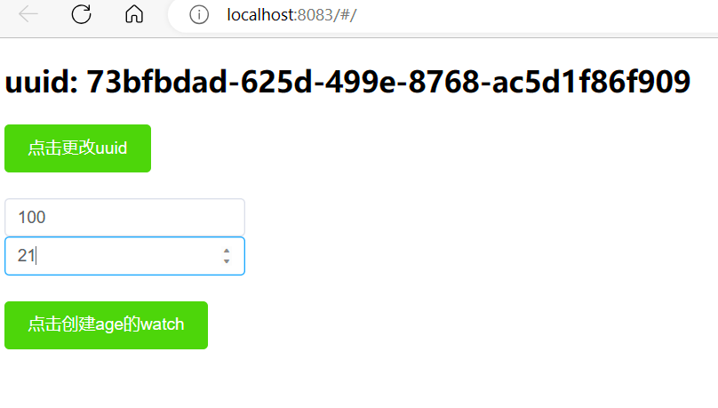

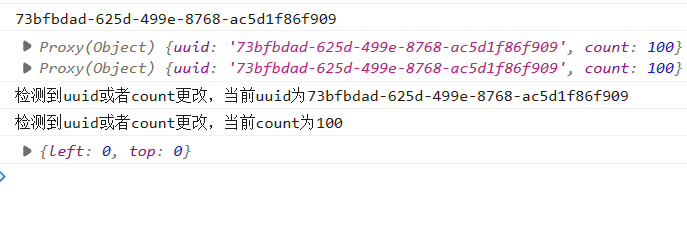


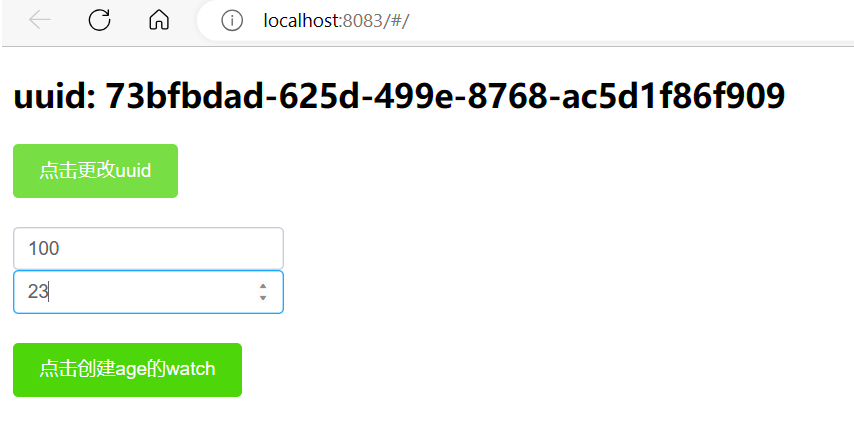


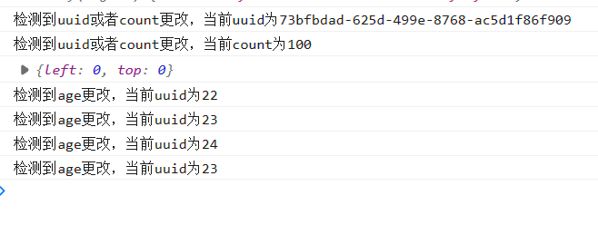


## 停止侦听器

用 `watch` 选项或者 `$watch()` 实例方法声明的侦听器，会在宿主组件卸载时自动停止。因此，在大多数场景下，你无需关心怎么停止它。

在少数情况下，你的确需要在组件卸载之前就停止一个侦听器，这时可以调用 `$watch()` API 返回的函数

```js
const unwatch = this.$watch('foo', callback)

// ...当该侦听器不再需要时
unwatch()
```


```vue
<template>

  <div>
    <h2>uuid: {{ data.uuid }}</h2>
    <el-button type="success" size="large" @click="data.uuid=generateUUID()">点击更改uuid</el-button>
    <br>
    <br>
    <el-input v-model="data.count" type="number" style="width: 200px"/>
    <br>
    <el-input v-model="age" type="number" style="width: 200px"/>
    <br>
    <br>
    <el-button type="success" size="large" @click="createWatch">点击创建age的watch</el-button>
    <br>
    <br>
    <el-button type="success" size="large" @click="removeWatch">点击移除age的watch</el-button>
  </div>

</template>

<script>

export default {
  name: "App42",
  data()
  {
    return {
      data: {
        uuid: '',
        count: 100
      },
      age: 18,
      unwatch: () =>
      {
        console.log("当前还未注册age的监听器")
      }
    }
  },
  watch:
      {
        data:
            {
              handler(newValue, oldValue)
              {
                // 注意：在嵌套的变更中，
                // 只要没有替换对象本身，
                // 那么这里的 `newValue` 和 `oldValue` 相同
                console.log(newValue, oldValue)
                console.log("检测到uuid或者count更改，当前uuid为" + this.data.uuid)
                console.log("检测到uuid或者count更改，当前count为" + this.data.count)
              },
              deep: true,
              immediate: true
            },
      },
  methods:
      {
        generateUUID()
        {
          let d = new Date().getTime()
          if (window.performance && typeof window.performance.now === "function")
          {
            d += performance.now(); //use high-precision timer if available
          }
          return 'xxxxxxxx-xxxx-4xxx-yxxx-xxxxxxxxxxxx'.replace(/[xy]/g, function (c)
          {
            const r = (d + Math.random() * 16) % 16 | 0
            d = Math.floor(d / 16);
            return (c === 'x' ? r : (r & 0x3 | 0x8)).toString(16);
          });
        },
        createWatch()
        {
          this.unwatch = this.$watch('age', (newAge) =>
          {
            //console.log(newAge)
            console.log("检测到age更改，当前uuid为" + this.age)
          })
        },
        removeWatch()
        {
          //console.log(typeof this.unwatch)
          console.log("移除age的监听器")
          this.unwatch()
          this.unwatch = () =>
          {
            console.log("当前还未注册age的监听器")
          }
        }
      },
  mounted()
  {
    console.log("mounted方法执行")
    const uuid = this.generateUUID();
    console.log(uuid)
    this.data.uuid = uuid
  },
  created()
  {
    console.log("created方法执行")
  }
}
</script>

<style scoped>

</style>
```


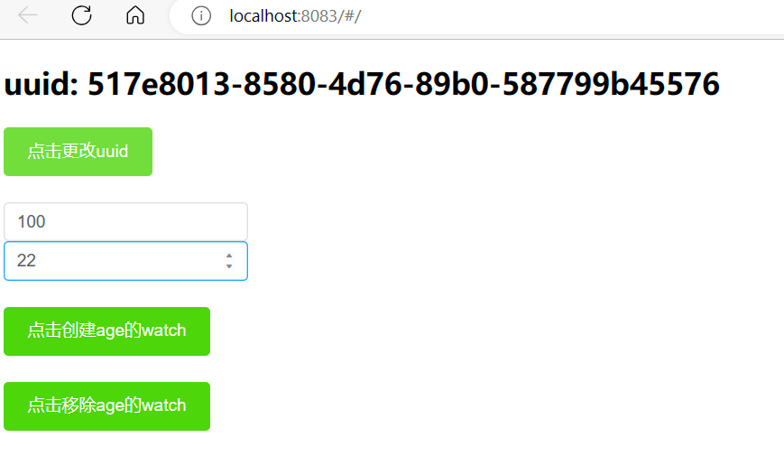


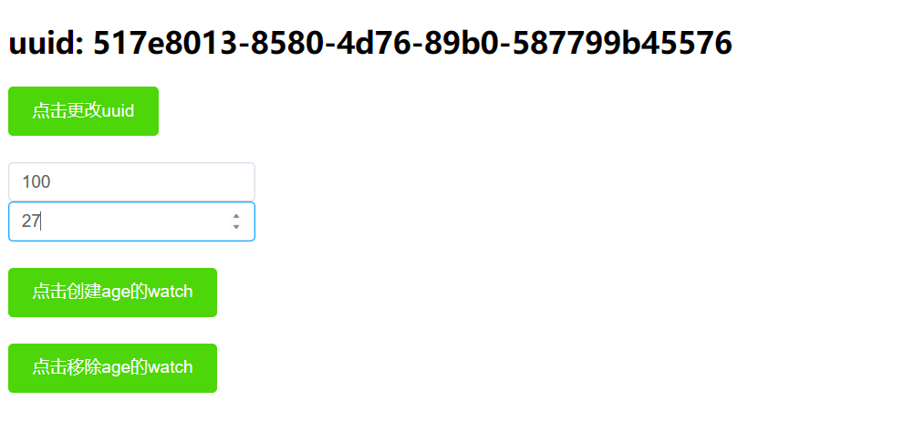


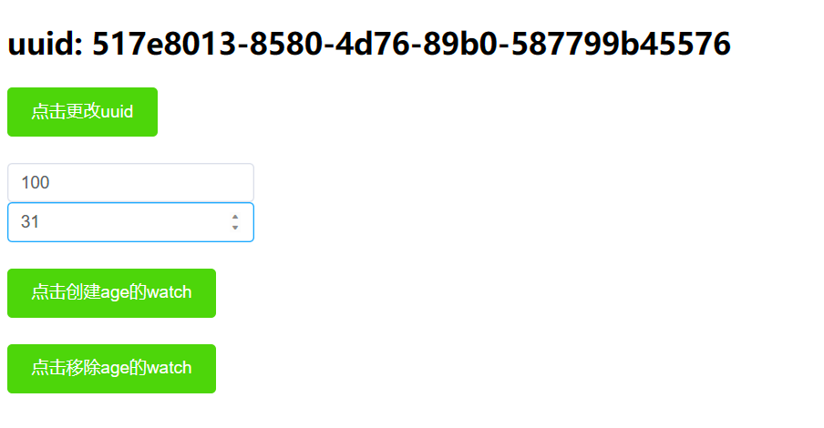


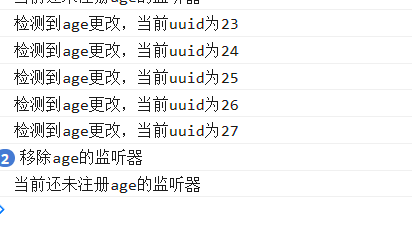


# 模板引用

## 概述

虽然 Vue 的声明性渲染模型为你抽象了大部分对 DOM 的直接操作，但在某些情况下，我们仍然需要直接访问底层 DOM 元素。要实现这一点，我们可以使用特殊的 `ref` attribute

`ref` 是一个特殊的 attribute，它允许我们在一个特定的 DOM 元素或子组件实例被挂载后，获得对它的直接引用。


## 访问模板引用

挂载结束后引用都会被暴露在 `this.$refs` 之上

只可以**在组件挂载后**才能访问模板引用。如果你想在模板中的表达式上访问 `$refs.input`，在初次渲染时会是 `null`

```vue
<template>
  <div>
    <input type="text" value="test" ref="input">
  </div>
</template>

<script>
export default {
  name: "App45",

  mounted()
  {
    console.log(this.$refs.input)
    console.log("value:", this.$refs.input.value)
    console.log("type:", this.$refs.input.type)
    this.$refs.input.value = "123456789";
    console.log("value:", this.$refs.input.value)

    this.$refs.input.focus();
  }
}
</script>

<style scoped>

</style>
```


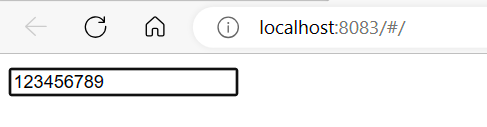


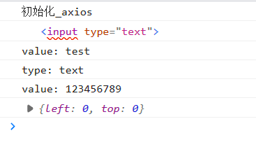


## v-for 中的模板引用

当在 `v-for` 中使用模板引用时，相应的引用中包含的值是一个数组

ref 数组**并不**保证与源数组相同的顺序


```vue
<template>
  <div>
    <ui>
      <li v-for="item of itemList" ref="items">
        {{ item }}
      </li>
    </ui>
  </div>
</template>

<script>
export default {
  name: "App46",
  data()
  {
    return {
      itemList: ['1', '2', '3', '4', '5']
    }
  },
  mounted()
  {
    console.log(this.$refs.items)
  }
}
</script>

<style scoped>

</style>
```


## 函数模板引用

除了使用字符串值作名字，`ref` attribute 还可以绑定为一个函数，会在每次组件更新时都被调用。该函数会收到元素引用作为其第一个参数

```html
<input :ref="(el) => { /* 将 el 赋值给一个数据属性或 ref 变量 */ }">
```


这里需要使用动态的 `:ref` 绑定才能够传入一个函数。当绑定的元素被卸载时，函数也会被调用一次，此时的 `el` 参数会是 `null`


```vue
<template>
  <div>
    <input type="text" v-model="d" :ref="foo">
  </div>
</template>

<script>
export default {
  name: "App47",
  data()
  {
    return {
      d: "10000",
    }
  },
  methods: {
    foo(el)
    {
      console.log("调用一次 当前value："+el.value)
      console.log(el)
    }
  }
}
</script>

<style scoped>

</style>
```


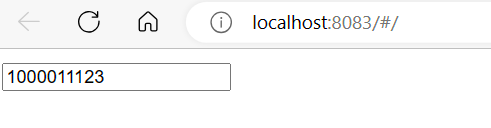


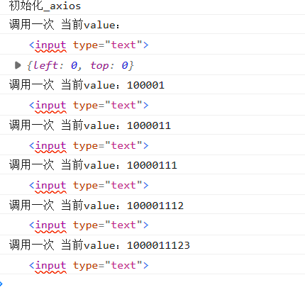


## 组件上的 ref

模板引用也可以被用在一个子组件上。这种情况下引用中获得的值是组件实例：

```vue
<script>
import Child from './Child.vue'

export default {
  components: {
    Child
  },
  mounted() {
    // this.$refs.child 是 <Child /> 组件的实例
  }
}
</script>

<template>
  <Child ref="child" />
</template>
```

`expose` 选项可以用于限制对子组件实例的访问


# Axios

## 概述

axios 它的底层是用了 XMLHttpRequest（xhr）方式发送请求和接收响应，xhr 相对于之前讲过的 fetch api 来说，功能更强大，但由于是比较老的 api，不支持 Promise，axios 对 xhr 进行了封装，使之支持 Promise，并提供了对请求、响应的统一拦截功能


## 安装

命令：

```sh
npm install axios -S
```


```sh
PS D:\程序\2023Q3\vue-test> npm install axios -S
npm WARN optional SKIPPING OPTIONAL DEPENDENCY: fsevents@2.3.2 (node_modules\fsevents):
npm WARN notsup SKIPPING OPTIONAL DEPENDENCY: Unsupported platform for fsevents@2.3.2: wanted {"os":"darwin","arch":"any"} (current: {"os":"win32","arch":"x64"})

+ axios@1.4.0
added 6 packages from 18 contributors, removed 7 packages and audited 980 packages in 8.948s

90 packages are looking for funding
  run `npm fund` for details

found 0 vulnerabilities

PS D:\程序\2023Q3\vue-test>
```


如果在dependencies下出现axios依赖，证明安装成功


## 导入

命令：

```sh
import axios from 'axios'
```


axios 默认导出一个对象，这里的 import 导入的就是它默认导出的对象


## 方法

|                请求                |  备注   |
| :--------------------------------: | :-----: |
|      axios.get(url[, config])      | get方法 |
|    axios.delete(url[, config])     |         |
|     axios.head(url[, config])      |         |
|    axios.options(url[, config])    |         |
| axios.post(url[, data[, config]])  |         |
|  axios.put(url[, data[, config]])  |         |
| axios.patch(url[, data[, config]]) |         |


* config - 选项对象、例如查询参数、请求头...
* data - 请求体数据、最常见的是 json 格式数据
* get、head 请求无法携带请求体，这应当是浏览器的限制所致（xhr、fetch api 均有限制）
* options、delete 请求可以通过 config 中的 data 携带请求体


## 配置

|      名称       |                            含义                            |
| :-------------: | :--------------------------------------------------------: |
|     baseURL     |                    将自动加在 url 前面                     |
|     headers     |                   请求头，类型为简单对象                   |
|     params      |  跟在 URL 后的请求参数，类型为简单对象或 URLSearchParams   |
|      data       | 请求体，类型有简单对象、FormData、URLSearchParams、File 等 |
| withCredentials |         跨域时是否携带 Cookie 等凭证，默认为 false         |
|  responseType   |                   响应类型，默认为 json                    |


```js
const _axios = axios.create({
    baseURL: 'http://localhost:8080',
    withCredentials: true
});
```

* 生产环境希望 xhr 请求不走代理，可以用 baseURL 统一修改
* 希望跨域请求携带 cookie，需要配置 withCredentials: true，服务器也要配置 allowCredentials = true，否则浏览器获取跨域返回的 cookie 时会报错


## 示例

```vue
<template>

</template>

<script>
import axios from 'axios'

export default {
  name: "App16",
  data()
  {
    return {
      resp: null
    }
  },
  methods:
      {
        testGet()
        {
          axios.get("/api/testGet").then((resp) =>
          {
            console.log(resp);
            this.resp = resp;
          }).catch((error) =>
          {
            console.log(error);
          })
        },
        testPost()
        {
          axios.post("/api/testPost").then((resp) =>
          {
            console.log(resp);
            this.resp = resp;
          }).catch((error) =>
          {
            console.log(error);
          })
        },
        test()
        {
          //axios发起ajax请求
          axios({
            //请求的方式：
            method: "post",
            //请求的url:
            url: "/api/testPost",
            //url参数：
            params:
                {
                  a: 1,
                  b: 2,
                  c: 3
                },
            //头信息：
            headers:
                {
                  token: "123456"
                },
            //请求体参数：
            data:
                {
                  a1: 11,
                  b2: 22,
                  c3: 33
                },
          }).then(response =>
          {
            console.log(response);
            this.resp = response;
          }).catch(error =>
          {
            console.log(error);
          })
        }
      },
  mounted()
  {
    this.testGet();
    this.testPost();
    this.test();
  }

}
</script>

<style scoped>

</style>
```


## 创建实例

```js
const _axios = axios.create(config);
```

* axios 对象可以直接使用，但使用的是默认的设置
* 用 axios.create 创建的对象，可以覆盖默认设置


## 拦截器

```vue
<script>
import axios from 'axios'

const _axios = axios.create({
  baseURL: 'http://localhost:8083',
  withCredentials: true
});
_axios.interceptors.request.use(
    function (config)
    {
      //在这里添加统一的 headers
      config.headers.auth = "12345678901234567890"
      return config;
    }
)
_axios.interceptors.response.use(
    function (response)
    {
      //2xx 范围内走这里
      console.log("请求成功")
      console.log(response)
      return response;
    },
    function (error)
    {
      //超出 2xx, 比如 4xx, 5xx 走这里
      console.log("请求错误")
      console.log(error)
      return error;
    }
);

console.log("初始化_axios")

export default _axios;
</script>


```


使用：

```vue
<template>
  <div>

  </div>
</template>

<script>
import _axios from "@/components/MyAxios"

export default {
  name: "App17",
  methods:
      {
        test()
        {
          _axios.get("/testGet", (resp) =>
          {
            console.log(resp)
          })
        },
        test2()
        {
          //axios发起ajax请求
          _axios({
            //请求的方式：
            method: "post",
            //请求的url:
            url: "test2",
            //url参数：
            params:
                {

                },
            //头信息：
            headers:
                {
                  auth2: "1312324",
                  token: "12131313131"
                },
            //请求体参数：
            data:
                {a:1},
          }).then(response =>
          {
            console.log(response);

          })
        }
      },
  mounted()
  {
    this.test();
    this.test2();
  }
}
</script>

<style scoped>

</style>

```


# ElementUI

## 概述

Element，一套为开发者、设计师和产品经理准备的基于 Vue 2.0 的桌面端组件库

本人已经学习过，不花过多时间再次学习


官网：https://element.eleme.cn/#/zh-CN


**一致性 Consistency**

- **与现实生活一致：**与现实生活的流程、逻辑保持一致，遵循用户习惯的语言和概念；
- **在界面中一致：**所有的元素和结构需保持一致，比如：设计样式、图标和文本、元素的位置等。


**反馈 Feedback**

- **控制反馈：**通过界面样式和交互动效让用户可以清晰的感知自己的操作；
- **页面反馈：**操作后，通过页面元素的变化清晰地展现当前状态。


**效率 Efficiency**

- **简化流程：**设计简洁直观的操作流程；
- **清晰明确：**语言表达清晰且表意明确，让用户快速理解进而作出决策；
- **帮助用户识别：**界面简单直白，让用户快速识别而非回忆，减少用户记忆负担。


**可控 Controllability**

- **用户决策：**根据场景可给予用户操作建议或安全提示，但不能代替用户进行决策；
- **结果可控：**用户可以自由的进行操作，包括撤销、回退和终止当前操作等。


## vue2安装elementUI

命令：

```sh
npm i element-ui -S
```


```sh
PS D:\程序\2023Q3\vue-test> npm i element-ui -S
npm WARN deprecated core-js@2.6.12: core-js@<3.23.3 is no longer maintained and not recommended for usage due to the number of issues. Because of the V8 engine whims, feature detectio
n in old core-js versions could cause a slowdown up to 100x even if nothing is polyfilled. Some versions have web compatibility issues. Please, upgrade your dependencies to the actual
 version of core-js.

> core-js@2.6.12 postinstall D:\程序\2023Q3\vue-test\node_modules\babel-runtime\node_modules\core-js
> node -e "try{require('./postinstall')}catch(e){}"

Thank you for using core-js ( https://github.com/zloirock/core-js ) for polyfilling JavaScript standard library!

The project needs your help! Please consider supporting of core-js on Open Collective or Patreon: 
> https://opencollective.com/core-js 
> https://www.patreon.com/zloirock 

Also, the author of core-js ( https://github.com/zloirock ) is looking for a good job -)

npm WARN element-ui@2.15.13 requires a peer of vue@^2.5.17 but none is installed. You must install peer dependencies yourself.
npm WARN optional SKIPPING OPTIONAL DEPENDENCY: fsevents@2.3.2 (node_modules\fsevents):
npm WARN notsup SKIPPING OPTIONAL DEPENDENCY: Unsupported platform for fsevents@2.3.2: wanted {"os":"darwin","arch":"any"} (current: {"os":"win32","arch":"x64"})

+ element-ui@2.15.13
added 9 packages from 8 contributors and audited 989 packages in 19.129s

90 packages are looking for funding
  run `npm fund` for details

found 0 vulnerabilities

PS D:\程序\2023Q3\vue-test>
```


**element是支持 vue2.x 的，vue3.x 暂时还不支持 ElementUI**

如果直接使用，将会出现以下错误：


## vue3安装elementUI

命令：

```sh
npm install element-plus --save
```


```sh
PS D:\程序\2023Q3\vue-test> npm install element-plus --save

> vue-demi@0.14.5 postinstall D:\程序\2023Q3\vue-test\node_modules\vue-demi
> node ./scripts/postinstall.js

npm WARN element-ui@2.15.13 requires a peer of vue@^2.5.17 but none is installed. You must install peer dependencies yourself.
npm WARN optional SKIPPING OPTIONAL DEPENDENCY: fsevents@2.3.2 (node_modules\fsevents):
npm WARN notsup SKIPPING OPTIONAL DEPENDENCY: Unsupported platform for fsevents@2.3.2: wanted {"os":"darwin","arch":"any"} (current: {"os":"win32","arch":"x64"})

+ element-plus@2.3.6
added 19 packages from 25 contributors and audited 1008 packages in 67.979s

95 packages are looking for funding
  run `npm fund` for details

found 0 vulnerabilities

PS D:\程序\2023Q3\vue-test>
```


```sh
npm install @element-plus/icons-vue
```


```sh
PS D:\程序\2023Q3\vue-test> npm install @element-plus/icons-vue
npm WARN optional SKIPPING OPTIONAL DEPENDENCY: fsevents@2.3.2 (node_modules\fsevents):
npm WARN notsup SKIPPING OPTIONAL DEPENDENCY: Unsupported platform for fsevents@2.3.2: wanted {"os":"darwin","arch":"any"} (current: {"os":"win32","arch":"x64"})

+ @element-plus/icons-vue@2.1.0
updated 1 package and audited 1000 packages in 4.308s

95 packages are looking for funding
  run `npm fund` for details

found 0 vulnerabilities

PS D:\程序\2023Q3\vue-test>
```


```sh
npm install @vue/shared
```

```sh
PS D:\程序\2023Q3\vue-test> npm install @vue/shared
npm WARN optional SKIPPING OPTIONAL DEPENDENCY: fsevents@2.3.2 (node_modules\fsevents):
npm WARN notsup SKIPPING OPTIONAL DEPENDENCY: Unsupported platform for fsevents@2.3.2: wanted {"os":"darwin","arch":"any"} (current: {"os":"win32","arch":"x64"})

+ @vue/shared@3.3.4
added 1 package from 1 contributor and audited 1000 packages in 3.162s

95 packages are looking for funding
  run `npm fund` for details

found 0 vulnerabilities

PS D:\程序\2023Q3\vue-test>
```


## 引入组件

vue2：

```js
import { createApp } from 'vue'
import App from './App18.vue'

import Vue from 'vue';
import ElementUI from 'element-ui';
import 'element-ui/lib/theme-chalk/index.css';
Vue.use(ElementUI);

createApp(App).mount('#app')
```


vue3：

```js
import { createApp } from 'vue'

import ElementPlus from 'element-plus'
import 'element-plus/dist/index.css'

import App from './App18.vue'

const app = createApp(App)

app.use(ElementPlus)
app.mount('#app')
```


## Button 按钮

```vue
<template>
  <div>
    <el-row>
      <el-button>默认按钮</el-button>
      <el-button type="primary">主要按钮</el-button>
      <el-button type="success">成功按钮</el-button>
      <el-button type="info">信息按钮</el-button>
      <el-button type="warning">警告按钮</el-button>
      <el-button type="danger">危险按钮</el-button>
    </el-row>

    <br>
    <br>

    <el-row>
      <el-button plain>朴素按钮</el-button>
      <el-button type="primary" plain>主要按钮</el-button>
      <el-button type="success" plain>成功按钮</el-button>
      <el-button type="info" plain>信息按钮</el-button>
      <el-button type="warning" plain>警告按钮</el-button>
      <el-button type="danger" plain>危险按钮</el-button>
    </el-row>

    <br>
    <br>

    <el-row>
      <el-button round>圆角按钮</el-button>
      <el-button type="primary" round>主要按钮</el-button>
      <el-button type="success" round>成功按钮</el-button>
      <el-button type="info" round>信息按钮</el-button>
      <el-button type="warning" round>警告按钮</el-button>
      <el-button type="danger" round>危险按钮</el-button>
    </el-row>


  </div>
</template>

<script>

export default {
  name: "App18"
}
</script>

<style scoped>

</style>
```


## Table 表格

```vue
<template>
  <div>

    <el-table
        :data="tableData"
        style="width: 100%">
      <el-table-column
          prop="id"
          label="学号"
          width="180">
      </el-table-column>
      <el-table-column
          prop="name"
          label="姓名"
          width="180">
      </el-table-column>
      <el-table-column
          prop="sex"
          label="性别"
          width="180">
      </el-table-column>
      <el-table-column
          prop="age"
          label="年龄"
          width="180">
      </el-table-column>
    </el-table>

  </div>
</template>

<script>
import {ElMessage} from 'element-plus'

export default {
  name: "App19",
  data()
  {
    return {
      tableData: (function ()
      {
        const data = [];
        for (let i = 0; i < 100; i++)
        {
          data.push({
            id: 100001 + i,
            name: "姓名" + (i + 1),
            sex: Math.random() > 0.5 ? "男" : "女",
            age: Math.round(Math.random() * 10 + 10)
          })
        }
        ElMessage({
          type: 'success',
          message: "加载完成"
        })
        return data;
      }())
    }
  }
}
</script>

<style scoped>

</style>
```


# Vue-Router

## 概述

vue 属于单页面应用，所谓的路由，就是根据浏览器路径不同，用不同的**视图组件**替换这个页面内容展示

vue-router是Vue.js官方的路由插件，它和vue.js是深度集成的，适合用于构建单页面应用。

ue的单页面应用是基于路由和组件的，路由用于设定访问路径，并将路径和组件映射起来。传统的页面应用，是用一些超链接来实现页面切换和跳转的。在vue-router单页面应用中，则是路径之间的切换，也就是组件的切换。路由模块的本质 就是建立起url和页面之间的映射关系。


至于我们为啥不能用a标签，这是因为用Vue做的都是单页应用，就相当于只有一个主的index.html页面，所以你写的标签是不起作用的，你必须使用vue-router来进行管理。


功能包括：

- 嵌套路由映射
- 动态路由选择
- 模块化、基于组件的路由配置
- 路由参数、查询、通配符
- 展示由 Vue.js 的过渡系统提供的过渡效果
- 细致的导航控制
- 自动激活 CSS 类的链接
- HTML5 history 模式或 hash 模式
- 可定制的滚动行为
- URL 的正确编码


## 官网地址和教程

官方网站：https://router.vuejs.org/zh/

教程地址：https://router.vuejs.org/zh/guide/


**vue2和vue3会有所不同**


## 安装

命令：

```sh
npm install vue-router@4
```


```sh
PS D:\程序\2023Q3\vue-test> npm install vue-router@4
npm WARN optional SKIPPING OPTIONAL DEPENDENCY: fsevents@2.3.2 (node_modules\fsevents):
npm WARN notsup SKIPPING OPTIONAL DEPENDENCY: Unsupported platform for fsevents@2.3.2: wanted {"os":"darwin","arch":"any"} (current: {"os":"win32","arch":"x64"})

+ vue-router@4.2.2
added 2 packages from 1 contributor and audited 1002 packages in 6.82s

96 packages are looking for funding
  run `npm fund` for details

found 0 vulnerabilities

PS D:\程序\2023Q3\vue-test>
```


## 入门

src下的router目录创建Router1.vue：


内容如下：

```vue
<script>

import {createRouter, createWebHashHistory} from 'vue-router'
import App from '@/App'
import App2 from '@/App2'
import App3 from '@/App3'
import App4 from '@/App4'
import App5 from '@/App5'
import App6 from '@/App6'
import App7 from '@/App7'
import App8 from '@/App8'
import App9 from '@/App9'
import App10 from '@/App10'
import App11 from '@/App11'
import App12 from '@/App12'
import App13 from '@/App13'
import App15 from '@/App15'
import App14 from '@/App14'
import App16 from '@/App16'
import App17 from '@/App17'
import App18 from '@/App18'
import App19 from '@/App19'


const routes = [
  {
    path: '/',
    component: App
  },
  {
    path: '/app2',
    component: App2
  },
  {
    path: '/app3',
    component: App3
  },
  {
    path: '/app4',
    component: App4
  },
  {
    path: '/app5',
    component: App5
  },
  {
    path: '/app6',
    component: App6
  },
  {
    path: '/app7',
    component: App7
  },
  {
    path: '/app8',
    component: App8
  },
  {
    path: '/app9',
    component: App9
  },
  {
    path: '/app10',
    component: App10
  },
  {
    path: '/app11',
    component: App11
  },
  {
    path: '/app12',
    component: App12
  },
  {
    path: '/app13',
    component: App13
  },
  {
    path: '/app14',
    component: App14
  },
  {
    path: '/app15',
    component: App15
  },
  {
    path: '/app16',
    component: App16
  },
  {
    path: '/app17',
    component: App17
  },
  {
    path: '/app18',
    component: App18
  },
  {
    path: '/app19',
    component: App19
  },
]

const router = createRouter({
  //内部提供了 history 模式的实现。为了简单起见，我们在这里使用 hash 模式。
  history: createWebHashHistory(),
  routes, // `routes: routes` 的缩写
})

export default router

</script>
```


更改main.js


```js
import { createApp } from 'vue'

import ElementPlus from 'element-plus'
import 'element-plus/dist/index.css'

import App from './App20.vue'
import Router1 from '@/router/Router1'

const app = createApp(App)

app.use(ElementPlus)
app.use(Router1)
app.mount('#app')
```


App20.vue：

```vue
<template>

  <div class="all">
    <router-view class="r"></router-view>
  </div>

</template>

<script>
export default {
  name: "App20"
}
</script>

<style scoped>
.all {
  padding: 20px;
  background: #b5e3f1;
}
.r{
  background: cornflowerblue;
}

body {

}
</style>
```


手动更改浏览器地址栏，测试如下：


*  `<router-view>` 起到占位作用，改变路径后，这个路径对应的视图组件就会占据 `<router-view>` 的位置，替换掉它之前的内容


## 跳转

### 概述

有两种方式：

* 使用router-link标签跳转
* 使用js代码跳转


### router-link标签

```vue
<template>

  <el-container>
    <el-aside width="200px">
      <div class="link">

        <!--使用 router-link 组件进行导航 -->
        <!--通过传递 `to` 来指定链接 -->
        <router-link to="/">首页</router-link>
        <br>
        <router-link to="/app2">app2</router-link>
        <br>
        <router-link to="/app3">app3</router-link>
        <br>
        <router-link to="/app4">app4</router-link>
        <br>
        <router-link to="/app5">app5</router-link>
        <br>
        <router-link to="/app6">app6</router-link>
        <br>
        <router-link to="/app7">app7</router-link>
        <br>
        <router-link to="/app8">app8</router-link>
        <br>
        <router-link to="/app9">app9</router-link>
        <br>
        <router-link to="/app10">app10</router-link>
        <br>
        <router-link to="/app11">app11</router-link>
        <br>
        <router-link to="/app12">app12</router-link>
        <br>
        <router-link to="/app13">app13</router-link>
        <br>
        <router-link to="/app14">app14</router-link>
        <br>
        <router-link to="/app15">app15</router-link>
        <br>
        <router-link to="/app16">app16</router-link>
        <br>
        <router-link to="/app17">app17</router-link>
        <br>
        <router-link to="/app18">app18</router-link>
        <br>
        <router-link to="/app19">app19</router-link>

      </div>
    </el-aside>
    <el-container>
      <el-header>路由跳转</el-header>
      <el-main>
        <div class="all">
          <router-view class="r"></router-view>
        </div>
      </el-main>
    </el-container>
  </el-container>

</template>

<script>
export default {
  name: "App21"
}
</script>

<style scoped>
.all {
  padding: 20px;
  background: #b5e3f1;
}

.r {
  background: cornflowerblue;
}

.link{
  background: #42b983;
  height: 100vh;
}
</style>
```


main.js

```vue
import { createApp } from 'vue'

import ElementPlus from 'element-plus'
import 'element-plus/dist/index.css'

import App from './App21.vue'
import Router1 from '@/router/Router1'

const app = createApp(App)

app.use(ElementPlus)
app.use(Router1)
app.mount('#app')
```


我们没有使用常规的 a 标签，而是使用一个自定义组件 router-link 来创建链接。这使得 Vue Router 可以在不重新加载页面的情况下更改 URL，处理 URL 的生成以及编码


### js代码

使用`this.$router.push('/')`来实现跳转


```vue
<template>

  <el-container>
    <el-aside width="200px">
      <div className="link">

        <br>
        <el-input type="text" size="large" autocomplete="false" v-model="to"/>
        <br>
        <el-button type="success" size="large" @click="go">点击跳转</el-button>

      </div>
    </el-aside>
    <el-container>
      <el-header>路由跳转</el-header>
      <el-main>
        <div className="all">
          <router-view className="r"></router-view>
        </div>
      </el-main>
    </el-container>
  </el-container>

</template>

<script>
export default {
  name: "App22",
  data()
  {
    return {
      to: "/",
    }
  },
  methods:
      {
        go()
        {
          console.log("跳转到：" + this.to)
          this.$router.push(this.to);
        }
      }

}
</script>

<style scoped>
.all {
  padding: 20px;
  background: #b5e3f1;
}

.r {
  background: cornflowerblue;
}

.link {
  background: #42b983;
  height: 100vh;
}
</style>
```


## 动态路由

对路由的添加通常是通过 routes 选项来完成的，但是在某些情况下，你可能想在应用程序已经运行的时候添加或删除路由。

动态路由主要通过两个函数实现。`router.addRoute()` 和 `router.removeRoute()`。它们**只**注册一个新的路由，也就是说，如果新增加的路由与当前位置相匹配，就需要你用 `router.push()` 或 `router.replace()` 来**手动导航**，才能显示该新路由


有几个不同的方法来删除现有的路由：

1. 通过添加一个名称冲突的路由。如果添加与现有途径名称相同的途径，会先删除路由，再添加路由：

```js
router.addRoute({ path: '/about', name: 'about', component: About })
// 这将会删除之前已经添加的路由，因为他们具有相同的名字且名字必须是唯一的
router.addRoute({ path: '/other', name: 'about', component: Other })
```


2. 通过调用 `router.addRoute()` 返回的回调
3. 通过使用 `router.removeRoute()` 按名称删除路由：

```js
router.addRoute({ path: '/about', name: 'about', component: About })
// 删除路由
router.removeRoute('about')
```


当路由被删除时，**所有的别名和子路由也会被同时删除**


要将嵌套路由添加到现有的路由中，可以将路由的 *name* 作为第一个参数传递给 `router.addRoute()`，这将有效地添加路由，就像通过 `children` 添加的一样：

```js
router.addRoute({ name: 'admin', path: '/admin', component: Admin })
router.addRoute('admin', { path: 'settings', component: AdminSettings })
```

相当于：

```js
router.addRoute({
  name: 'admin',
  path: '/admin',
  component: Admin,
  children: [{ path: 'settings', component: AdminSettings }],
})
```


Vue Router 提供了两个功能来查看现有的路由：

* `router.hasRoute()`：检查路由是否存在。
* `router.getRoutes()`：获取一个包含所有路由记录的数组。


创建Router2.vue

```vue
<script>

import {createRouter, createWebHashHistory} from 'vue-router'


//此数据可以从后端获取
const routes = [
  {
    id: 1,
    path: '/',
    component: "App"
  },
  {
    id: 2,
    path: '/app2',
    component: "App2"
  },
  {
    id: 3,
    path: '/app3',
    component: "App3"
  },
  {
    id: 4,
    path: '/app4',
    component: "App4"
  },
  {
    id: 5,
    path: '/app5',
    component: "App5"
  },
  {
    id: 6,
    path: '/app6',
    component: "App6"
  },
  {
    id: 7,
    path: '/app7',
    component: "App7"
  },
  {
    id: 8,
    path: '/app8',
    component: "App8"
  },
  {
    id: 9,
    path: '/app9',
    component: "App9"
  },
  {
    id: 10,
    path: '/app10',
    component: "App10"
  },
  {
    id: 11,
    path: '/app11',
    component: "App11"
  },
  {
    id: 12,
    path: '/app12',
    component: "App12"
  },
  {
    id: 13,
    path: '/app13',
    component: "App13"
  },
  {
    id: 14,
    path: '/app14',
    component: "App14"
  },
  {
    id: 15,
    path: '/app15',
    component: "App15"
  },
  {
    id: 16,
    path: '/app16',
    component: "App16"
  },
  {
    id: 17,
    path: '/app17',
    component: "App17"
  },
  {
    id: 18,
    path: '/app18',
    component: "App18"
  },
  {
    id: 19,
    path: '/app19',
    component: "App19"
  },
]

const router = createRouter({
  //内部提供了 history 模式的实现。为了简单起见，我们在这里使用 hash 模式。
  history: createWebHashHistory(),
  routes:[]
})


for (let i = 0; i < routes.length; i++)
{
  const r = routes[i];
  // 动态添加路由
  // 参数1：父路由名称
  // 参数2：路由信息对象
  router.addRoute("a", {
    path: r.path,
    name: r.id,
    //记住符号是 ` 而不是 ' 或者 "
    component: () => import(`@/${r.component}.vue`)
  })
  console.log("添加" + r.path)
}

export default router

</script>
```


修改main.js

```js
import { createApp } from 'vue'

import ElementPlus from 'element-plus'
import 'element-plus/dist/index.css'

import App from './App22.vue'
import Router2 from '@/router/Router2'

const app = createApp(App)

app.use(ElementPlus)
app.use(Router2)
app.mount('#app')
```


## 捕获所有路由或 404 Not found 路由

常规参数只匹配 url 片段之间的字符，用 `/` 分隔。如果我们想匹配**任意路径**，我们可以使用自定义的 *路径参数* 正则表达式，在 *路径参数* 后面的括号中加入 正则表达式 


编写404.vue

```vue
<template>
  <p>404 not found</p>
</template>

<script>
export default {
  name: "404"
}
</script>

<style scoped>
p {
  font-size: 5em;
  color: red;
}
</style>
```


```vue
<script>

import {createRouter, createWebHashHistory} from 'vue-router'


//此数据可以从后端获取
const routes = [
  {
    id: 1,
    path: '/',
    component: "App"
  },
  {
    id: 2,
    path: '/app2',
    component: "App2"
  },
  {
    id: 3,
    path: '/app3',
    component: "App3"
  },
  {
    id: 4,
    path: '/app4',
    component: "App4"
  },
  {
    id: 5,
    path: '/app5',
    component: "App5"
  },
  {
    id: 6,
    path: '/app6',
    component: "App6"
  },
  {
    id: 7,
    path: '/app7',
    component: "App7"
  },
  {
    id: 8,
    path: '/app8',
    component: "App8"
  },
  {
    id: 9,
    path: '/app9',
    component: "App9"
  },
  {
    id: 10,
    path: '/app10',
    component: "App10"
  },
  {
    id: 11,
    path: '/app11',
    component: "App11"
  },
  {
    id: 12,
    path: '/app12',
    component: "App12"
  },
  {
    id: 13,
    path: '/app13',
    component: "App13"
  },
  {
    id: 14,
    path: '/app14',
    component: "App14"
  },
  {
    id: 15,
    path: '/app15',
    component: "App15"
  },
  {
    id: 16,
    path: '/app16',
    component: "App16"
  },
  {
    id: 17,
    path: '/app17',
    component: "App17"
  },
  {
    id: 18,
    path: '/app18',
    component: "App18"
  },
  {
    id: 19,
    path: '/app19',
    component: "App19"
  },
  {
    id: 999,
    path: '/:pathMatch(.*)*',
    component: "views/404"
  },
]

const router = createRouter({
  //内部提供了 history 模式的实现。为了简单起见，我们在这里使用 hash 模式。
  history: createWebHashHistory(),
  routes:[]
})


for (let i = 0; i < routes.length; i++)
{
  const r = routes[i];
  // 动态添加路由
  // 参数1：父路由名称
  // 参数2：路由信息对象
  router.addRoute("a", {
    path: r.path,
    name: r.id,
    //记住符号是 ` 而不是 ' 或者 "
    component: () => import(`@/${r.component}.vue`)
  })
  console.log("添加" + r.path)
}

export default router

</script>
```


## 重置路由

在用户注销时应当重置路由


```vue
<script>

import {createRouter, createWebHashHistory} from 'vue-router'


//此数据可以从后端获取
const routes = [
  {
    id: 1,
    path: '/',
    component: "App"
  },
  {
    id: 2,
    path: '/app2',
    component: "App2"
  },
  {
    id: 3,
    path: '/app3',
    component: "App3"
  },
  {
    id: 4,
    path: '/app4',
    component: "App4"
  },
  {
    id: 5,
    path: '/app5',
    component: "App5"
  },
  {
    id: 6,
    path: '/app6',
    component: "App6"
  },
  {
    id: 7,
    path: '/app7',
    component: "App7"
  },
  {
    id: 8,
    path: '/app8',
    component: "App8"
  },
  {
    id: 9,
    path: '/app9',
    component: "App9"
  },
  {
    id: 10,
    path: '/app10',
    component: "App10"
  },
  {
    id: 11,
    path: '/app11',
    component: "App11"
  },
  {
    id: 12,
    path: '/app12',
    component: "App12"
  },
  {
    id: 13,
    path: '/app13',
    component: "App13"
  },
  {
    id: 14,
    path: '/app14',
    component: "App14"
  },
  {
    id: 15,
    path: '/app15',
    component: "App15"
  },
  {
    id: 16,
    path: '/app16',
    component: "App16"
  },
  {
    id: 17,
    path: '/app17',
    component: "App17"
  },
  {
    id: 18,
    path: '/app18',
    component: "App18"
  },
  {
    id: 19,
    path: '/app19',
    component: "App19"
  },
  {
    id: 999,
    path: '/:pathMatch(.*)*',
    component: "views/404"
  },
]

const router = createRouter({
  //内部提供了 history 模式的实现。为了简单起见，我们在这里使用 hash 模式。
  history: createWebHashHistory(),
  routes: []
})


for (let i = 0; i < routes.length; i++)
{
  const r = routes[i];
  // 动态添加路由
  // 参数1：父路由名称
  // 参数2：路由信息对象
  router.addRoute("a", {
    path: r.path,
    name: r.id,
    //记住符号是 ` 而不是 ' 或者 "
    component: () => import(`@/${r.component}.vue`)
  })
  console.log("添加" + r.path)
}

/**
 * 重置路由
 */
export function resetRouter()
{
  for (let i = 0; i < routes.length; i++)
  {
    const r = routes[i];
    if (r.id === 999)
    {
      break;
    }
    router.removeRoute(r.id);
  }
}

export default router

</script>
```


```vue
<template>

  <el-container>
    <el-aside width="200px">
      <div className="link">

        <br>
        <el-input type="text" size="large" autocomplete="false" v-model="to"/>
        <br>
        <el-button type="success" size="large" @click="go">点击跳转</el-button>
        <br>
        <el-button type="success" size="large" @click="resetRouter">点击重置路由</el-button>

      </div>
    </el-aside>
    <el-container>
      <el-header>路由跳转</el-header>
      <el-main>
        <div className="all">
          <router-view className="r"></router-view>
        </div>
      </el-main>
    </el-container>
  </el-container>

</template>

<script>
import {resetRouter} from '@/router/Router2'

export default {
  name: "App23",
  data()
  {
    return {
      to: "/",
    }
  },
  methods:
      {
        go()
        {
          console.log("跳转到：" + this.to)
          this.$router.push(this.to);
        },
        resetRouter()
        {
          console.log("重置路由")
          resetRouter();
        }
      }

}
</script>

<style scoped>
.all {
  padding: 20px;
  background: #b5e3f1;
}

.r {
  background: cornflowerblue;
}

.link {
  background: #42b983;
  height: 100vh;
}
</style>
```


点击重置后


## 页面刷新问题

页面刷新后，会导致动态添加的路由失效，解决方法是将路由数据存入 sessionStorage 或者 localStorage 


```vue
<script>

import {createRouter, createWebHashHistory} from 'vue-router'


//此数据可以从后端获取
let routes = [
  {
    id: 1,
    path: '/',
    component: "App"
  },
  {
    id: 2,
    path: '/app2',
    component: "App2"
  },
  {
    id: 3,
    path: '/app3',
    component: "App3"
  },
  {
    id: 4,
    path: '/app4',
    component: "App4"
  },
  {
    id: 5,
    path: '/app5',
    component: "App5"
  },
  {
    id: 6,
    path: '/app6',
    component: "App6"
  },
  {
    id: 7,
    path: '/app7',
    component: "App7"
  },
  {
    id: 8,
    path: '/app8',
    component: "App8"
  },
  {
    id: 9,
    path: '/app9',
    component: "App9"
  },
  {
    id: 10,
    path: '/app10',
    component: "App10"
  },
  {
    id: 11,
    path: '/app11',
    component: "App11"
  },
  {
    id: 12,
    path: '/app12',
    component: "App12"
  },
  {
    id: 13,
    path: '/app13',
    component: "App13"
  },
  {
    id: 14,
    path: '/app14',
    component: "App14"
  },
  {
    id: 15,
    path: '/app15',
    component: "App15"
  },
  {
    id: 16,
    path: '/app16',
    component: "App16"
  },
  {
    id: 17,
    path: '/app17',
    component: "App17"
  },
  {
    id: 18,
    path: '/app18',
    component: "App18"
  },
  {
    id: 19,
    path: '/app19',
    component: "App19"
  },
  {
    id: 999,
    path: '/:pathMatch(.*)*',
    component: "views/404"
  },
]

const router = createRouter({
  //内部提供了 history 模式的实现。为了简单起见，我们在这里使用 hash 模式。
  history: createWebHashHistory(),
  routes: []
})

/**
 * 添加路由
 * @param array 数组
 */
function addRoutes(array)
{
  for (let i = 0; i < array.length; i++)
  {
    const r = array[i];
    // 动态添加路由
    // 参数1：父路由名称
    // 参数2：路由信息对象
    router.addRoute("a", {
      path: r.path,
      name: r.id,
      //记住符号是 ` 而不是 ' 或者 "
      component: () => import(`@/${r.component}.vue`)
    })
    console.log("添加" + r.path)
    routes = array;
  }
}

addRoutes(routes);

/**
 * 重置路由
 */
export function resetRouter()
{
  for (let i = 0; i < routes.length; i++)
  {
    const r = routes[i];
    if (r.id === 999)
    {
      break;
    }
    router.removeRoute(r.id);
  }
}

/**
 * 从SessionStorage里加载路由信息
 */
export function loadFromSessionStorage()
{
  console.log('从SessionStorage里加载路由信息')
  console.log(router.getRoutes().length)

  const result = JSON.parse(sessionStorage.getItem("router"))
  console.log(result)
  addRoutes(result);
}

/**
 * 保存路由信息到SessionStorage
 */
export function saveToSessionStorage()
{
  console.log("保存路由到SessionStorage")
  sessionStorage.setItem("router", JSON.stringify(routes))
}

export default router

</script>
```


```vue
<template>

  <el-container>
    <el-aside width="200px">
      <div className="link">

        <br>
        <el-input type="text" size="large" autocomplete="false" v-model="to"/>
        <br>
        <el-button type="success" size="large" @click="go">点击跳转</el-button>
        <br>
        <el-button type="success" size="large" @click="resetRouter">点击重置路由</el-button>
        <br>
        <el-button type="success" size="large" @click="saveToSessionStorage">保存路由信息</el-button>
        <br>
        <el-button type="success" size="large" @click="loadFromSessionStorage">加载路由信息</el-button>

      </div>
    </el-aside>
    <el-container>
      <el-header>路由跳转</el-header>
      <el-main>
        <div className="all">
          <router-view className="r"></router-view>
        </div>
      </el-main>
    </el-container>
  </el-container>

</template>

<script>
import {resetRouter, loadFromSessionStorage, saveToSessionStorage} from '@/router/Router2'

export default {
  name: "App24",
  data()
  {
    return {
      to: "/",
    }
  },
  methods:
      {
        go()
        {
          console.log("跳转到：" + this.to)
          this.$router.push(this.to);
        },
        resetRouter()
        {
          console.log("重置路由")
          resetRouter();
        },
        loadFromSessionStorage()
        {
          loadFromSessionStorage();
        },
        saveToSessionStorage()
        {
          saveToSessionStorage();
        }
      }

}
</script>

<style scoped>
.all {
  padding: 20px;
  background: #b5e3f1;
}

.r {
  background: cornflowerblue;
}

.link {
  background: #42b983;
  height: 100vh;
}
</style>
```


## 嵌套路由

一些应用程序的 UI 由多层嵌套的组件组成。在这种情况下，URL 的片段通常对应于特定的嵌套组件结构，例如：

```sh
/user/johnny/profile                     /user/johnny/posts
+------------------+                  +-----------------+
| User             |                  | User            |
| +--------------+ |                  | +-------------+ |
| | Profile      | |  +------------>  | | Posts       | |
| |              | |                  | |             | |
| +--------------+ |                  | +-------------+ |
+------------------+                  +-----------------+
```


Router3.vue

```vue
<script>

import {createRouter, createWebHashHistory} from 'vue-router'
import App from '@/App'
import App2 from '@/App2'
import App3 from '@/App3'
import App4 from '@/App4'
import App5 from '@/App5'
import App6 from '@/App6'
import App7 from '@/App7'
import App8 from '@/App8'
import App9 from '@/App9'
import App10 from '@/App10'
import App11 from '@/App11'
import App12 from '@/App12'
import App13 from '@/App13'
import App15 from '@/App15'
import App14 from '@/App14'
import App16 from '@/App16'
import App17 from '@/App17'
import App18 from '@/App18'
import App19 from '@/App19'
import C1 from '@/views/C1'
import C2 from '@/views/C2'
import NotFound from '@/views/404.vue'


const routes = [
  {
    path: '/',
    component: App
  },
  {
    path: "/c1",
    component: C1,
    children:
        [
          {
            path: '/c1/app2',
            component: App2
          },
          {
            path: '/c1/app3',
            component: App3
          },
          {
            path: '/c1/app4',
            component: App4
          },
          {
            path: '/c1/app5',
            component: App5
          },
          {
            path: '/c1/app6',
            component: App6
          },
          {
            path: '/c1/app7',
            component: App7
          },
          {
            path: '/c1/app8',
            component: App8
          },
          {
            path: '/c1/app9',
            component: App9
          },
          {
            path: '/c1/app10',
            component: App10
          },
          {
            path: '/c1/app11',
            component: App11
          },
        ]
  },
  {
    path: "/c2",
    component: C2,
    children:
        [
          {
            path: '/c2/app9',
            component: App9
          },
          {
            path: '/c2/app10',
            component: App10
          },
          {
            path: '/c2/app11',
            component: App11
          },
          {
            path: '/c2/app12',
            component: App12
          },
          {
            path: '/c2/app13',
            component: App13
          },
          {
            path: '/c2/app14',
            component: App14
          },
          {
            path: '/c2/app15',
            component: App15
          },
          {
            path: '/c2/app16',
            component: App16
          },
          {
            path: '/c2/app17',
            component: App17
          },
          {
            path: '/c2/app18',
            component: App18
          },
          {
            path: '/c2/app19',
            component: App19
          },
        ]
  },
  {
    path: '/:pathMatch(.*)*',
    component: NotFound
  }
]

const router = createRouter({
  //内部提供了 history 模式的实现。为了简单起见，我们在这里使用 hash 模式。
  history: createWebHashHistory(),
  routes, // `routes: routes` 的缩写
})

export default router

</script>
```


* 要将组件渲染到这个嵌套的 `router-view` 中，我们需要在路由中配置 `children`
* 以 / 开头的嵌套路径将被视为根路径。这允许你利用组件嵌套，而不必使用嵌套的 URL


C1.vue

```vue
<template>

  <el-container>
    <el-container>
      <el-header>嵌套路由-c1</el-header>
      <el-main>
        <div className="all">
          <router-view className="r"></router-view>
        </div>
      </el-main>
    </el-container>
  </el-container>

</template>

<script>
export default {
  name: "App22",
  data()
  {
    return {
      to: "/",
    }
  },
  methods:
      {
        go()
        {
          console.log("跳转到：" + this.to)
          this.$router.push(this.to);
        }
      }

}
</script>

<style scoped>
.all {
  padding: 20px;
  background: #b5e3f1;
}

.r {
  background: cornflowerblue;
}

.link {
  background: #42b983;
  height: 100vh;
}
</style>
```


C2.vue

```vue
<template>

  <el-container>
    <el-container>
      <el-header>嵌套路由-c2</el-header>
      <el-main>
        <div className="all">
          <router-view className="r"></router-view>
        </div>
      </el-main>
    </el-container>
  </el-container>

</template>

<script>
export default {
  name: "App22",
  data()
  {
    return {
      to: "/",
    }
  },
  methods:
      {
        go()
        {
          console.log("跳转到：" + this.to)
          this.$router.push(this.to);
        }
      }

}
</script>

<style scoped>
.all {
  padding: 20px;
  background: #b5e3f1;
}

.r {
  background: cornflowerblue;
}

.link {
  background: #42b983;
  height: 100vh;
}
</style>
```


```vue
<template>

  <el-container>
    <el-aside width="200px">
      <div className="link">

        <br>
        <el-input type="text" size="large" autocomplete="false" v-model="to"/>
        <br>
        <el-button type="success" size="large" @click="go">点击跳转</el-button>

      </div>
    </el-aside>
    <el-container>
      <el-header>路由跳转</el-header>
      <el-main>
        <div className="all">
          <router-view className="r"></router-view>
        </div>
      </el-main>
    </el-container>
  </el-container>

</template>

<script>
export default {
  name: "App25",
  data()
  {
    return {
      to: "/",
    }
  },
  methods:
      {
        go()
        {
          console.log("跳转到：" + this.to)
          this.$router.push(this.to);
        }
      }

}
</script>

<style scoped>
.all {
  padding: 20px;
  background: #b5e3f1;
}

.r {
  background: coral;
}

.link {
  background: #42b983;
  height: 100vh;
}
</style>
```


main.js


```js
import { createApp } from 'vue'

import ElementPlus from 'element-plus'
import 'element-plus/dist/index.css'

import App from './App25.vue'
import Router2 from '@/router/Router3'

const app = createApp(App)

app.use(ElementPlus)
app.use(Router2)
app.mount('#app')
```


测试


## 编程式导航

### push

在 Vue 实例中，你可以通过 $router 访问路由实例。因此你可以调用 `this.$router.push`

想要导航到不同的 URL，可以使用 router.push 方法。这个方法会向 history 栈添加一个新的记录，所以，当用户点击浏览器后退按钮时，会回到之前的 URL。

当你点击 \<router-link> 时，内部会调用这个方法，所以点击 \<router-link :to="..."> 相当于调用 router.push(...)


该方法的参数可以是一个字符串路径，或者一个描述地址的对象：

```js
// 字符串路径
router.push('/users/eduardo')

// 带有路径的对象
router.push({ path: '/users/eduardo' })

// 命名的路由，并加上参数，让路由建立 url
router.push({ name: 'user', params: { username: 'eduardo' } })

// 带查询参数，结果是 /register?plan=private
router.push({ path: '/register', query: { plan: 'private' } })

// 带 hash，结果是 /about#team
router.push({ path: '/about', hash: '#team' })
```


如果提供了 path，params 会被忽略

```js
const username = 'eduardo'
// 我们可以手动建立 url，但我们必须自己处理编码
router.push(`/user/${username}`) // -> /user/eduardo
// 同样
router.push({ path: `/user/${username}` }) // -> /user/eduardo
// 
router.push({ name: 'user', params: { username } }) // -> /user/eduardo
// `params` 不能与 `path` 一起使用
router.push({ path: '/user', params: { username } }) // -> /user
```


### 替换当前位置

它的作用类似于 `router.push`，唯一不同的是，它在导航时不会向 history 添加新记录


|              声明式               |        编程式         |
| :-------------------------------: | :-------------------: |
| `<router-link :to="..." replace>` | `router.replace(...)` |


也可以直接在传递给 router.push 的 routeLocation 中增加一个属性 replace: true：

```js
router.push({ path: '/home', replace: true })
// 相当于
router.replace({ path: '/home' })
```


### 横跨历史

该方法采用一个整数作为参数，表示在历史堆栈中前进或后退多少步，类似于 `window.history.go(n)`


```js
// 向前移动一条记录，与 router.forward() 相同
router.go(1)

// 返回一条记录，与 router.back() 相同
router.go(-1)

// 前进 3 条记录
router.go(3)

// 如果没有那么多记录，静默失败
router.go(-100)
router.go(100)
```


## 命名路由

除了 `path` 之外，你还可以为任何路由提供 `name`。这有以下优点：

- 没有硬编码的 URL
- `params` 的自动编码/解码。
- 防止你在 url 中出现打字错误。
- 绕过路径排序


要链接到一个命名的路由，可以向 `router-link` 组件的 `to` 属性传递一个对象：

```js
<router-link :to="{ name: 'user', params: { username: 'erina' }}">
  User
</router-link>
```


## 命名视图

### 概述

有时候想同时 (同级) 展示多个视图，而不是嵌套展示，例如创建一个布局，有 `sidebar` (侧导航) 和 `main` (主内容) 两个视图，这个时候命名视图就派上用场了。你可以在界面中拥有多个单独命名的视图，而不是只有一个单独的出口。如果 `router-view` 没有设置名字，那么默认为 `default`。


### 使用

示例：

```vue
<router-view class="view left-sidebar" name="LeftSidebar"></router-view>
<router-view class="view main-content"></router-view>
<router-view class="view right-sidebar" name="RightSidebar"></router-view>
```


一个视图使用一个组件渲染，因此对于同个路由，多个视图就需要多个组件。确保正确使用 `components`

```js
const router = createRouter({
  history: createWebHashHistory(),
  routes: [
    {
      path: '/',
      components: {
        default: Home,
        // LeftSidebar: LeftSidebar 的缩写
        LeftSidebar,
        // 它们与 `<router-view>` 上的 `name` 属性匹配
        RightSidebar,
      },
    },
  ],
})
```


App26.vue

```vue
<template>

  <div class="div">
    <hr>
    <router-view class="r1" name="r1"></router-view>
    <hr>
    <router-view class="r2"></router-view>
    <hr>
    <router-view class="r3" name="r3"></router-view>
    <hr>
  </div>

</template>

<script>
export default {
  name: "App26"
}
</script>

<style scoped>
.div{
  background: #b5e3f1;
}
.r1{
  background: blueviolet;
}
.r2{
  background: #42b983;
}

.r3{
  background: darkorange;
}
</style>
```


Router4.vue

```vue
<script>

import {createRouter, createWebHashHistory} from 'vue-router'
import App from '@/App'
import App2 from '@/App2'
import App3 from '@/App3'
import App4 from '@/App4'
import App5 from '@/App5'
import App6 from '@/App6'
import App7 from '@/App7'
import App8 from '@/App8'
import App9 from '@/App9'
import App10 from '@/App10'
import App11 from '@/App11'
import App12 from '@/App12'
import App13 from '@/App13'
import App15 from '@/App15'
import App14 from '@/App14'
import App16 from '@/App16'
import App17 from '@/App17'
import App18 from '@/App18'
import App19 from '@/App19'
import NotFound from '@/views/404'


const routes = [
  {
    path: '/',
    components:
        {
          default: App,
          r1: App2,
          r2: App3,
          r3: App4,
        }
  },
  {
    path: '/app5',
    components:
        {
          default: App5,
          r1: App6,
          r2: App7,
          r3: App8,
        }
  },
  {
    path: '/app9',
    components:
        {
          default: App9,
          r1: App10,
          r2: App11,
          r3: App12,
        }
  },
  {
    path: '/app13',
    component: App13
  },
  {
    path: '/app14',
    component: App14
  },
  {
    path: '/app15',
    component: App15
  },
  {
    path: '/app16',
    component: App16
  },
  {
    path: '/app17',
    component: App17
  },
  {
    path: '/app18',
    component: App18
  },
  {
    path: '/app19',
    component: App19
  },
  {
    path: '/:pathMatch(.*)*',
    component: NotFound
  }
]

const router = createRouter({
  //内部提供了 history 模式的实现。为了简单起见，我们在这里使用 hash 模式。
  history: createWebHashHistory(),
  routes, // `routes: routes` 的缩写
})

export default router

</script>
```


更改main.js


```js
import { createApp } from 'vue'

import ElementPlus from 'element-plus'
import 'element-plus/dist/index.css'

import App from './App26.vue'
import Router2 from '@/router/Router4'

const app = createApp(App)

app.use(ElementPlus)
app.use(Router2)
app.mount('#app')
```


### 嵌套命名视图

我们也有可能使用命名视图创建嵌套视图的复杂布局。这时需要用到的嵌套 `router-view` 组件


```sh
/settings/emails                                       /settings/profile
+-----------------------------------+                  +------------------------------+
| UserSettings                      |                  | UserSettings                 |
| +-----+-------------------------+ |                  | +-----+--------------------+ |
| | Nav | UserEmailsSubscriptions | |  +------------>  | | Nav | UserProfile        | |
| |     +-------------------------+ |                  | |     +--------------------+ |
| |     |                         | |                  | |     | UserProfilePreview | |
| +-----+-------------------------+ |                  | +-----+--------------------+ |
+-----------------------------------+                  +------------------------------+
```


```html
<!-- UserSettings.vue -->
<div>
  <h1>User Settings</h1>
  <NavBar />
  <router-view />
  <router-view name="helper" />
</div>
```


```js
{
  path: '/settings',
  // 你也可以在顶级路由就配置命名视图
  component: UserSettings,
  children: [{
    path: 'emails',
    component: UserEmailsSubscriptions
  }, {
    path: 'profile',
    components: {
      default: UserProfile,
      helper: UserProfilePreview
    }
  }]
}
```


## 重定向

重定向也是通过 routes 配置来完成


下面例子是从 `/home` 重定向到 `/`：

```JS
const routes = [{ path: '/home', redirect: '/' }]
```


重定向的目标也可以是一个命名的路由：

```JS
const routes = [{ path: '/home', redirect: { name: 'homepage' } }]
```


甚至是一个方法，动态返回重定向目标：

```JS
const routes = [
  {
    // /search/screens -> /search?q=screens
    path: '/search/:searchText',
    redirect: to => {
      // 方法接收目标路由作为参数
      // return 重定向的字符串路径/路径对象
      return { path: '/search', query: { q: to.params.searchText } }
    },
  },
  {
    path: '/search',
    // ...
  },
]
```


也可以重定向到相对位置：

```js
const routes = [
  {
    // 将总是把/users/123/posts重定向到/users/123/profile。
    path: '/users/:id/posts',
    redirect: to => {
      // 该函数接收目标路由作为参数
      // 相对位置不以`/`开头
      // 或 { path: 'profile'}
      return 'profile'
    },
  },
]
```


在写 redirect 的时候，可以省略 component 配置，因为它从来没有被直接访问过，所以没有组件要渲染。唯一的例外是嵌套路由：如果一个路由记录有 children 和 redirect 属性，它也应该有 component 属性。


将所有找不到的页面和/app13页面都重定向到404页面：


Router5.vue

```vue
<script>

import {createRouter, createWebHashHistory} from 'vue-router'
import App from '@/App'
import App2 from '@/App2'
import App3 from '@/App3'
import App4 from '@/App4'
import App5 from '@/App5'
import App6 from '@/App6'
import App7 from '@/App7'
import App8 from '@/App8'
import App9 from '@/App9'
import App10 from '@/App10'
import App11 from '@/App11'
import App12 from '@/App12'
import App13 from '@/App13'
import App15 from '@/App15'
import App14 from '@/App14'
import App16 from '@/App16'
import App17 from '@/App17'
import App18 from '@/App18'
import App19 from '@/App19'
import NotFound from '@/views/404'


const routes = [
  {
    path: '/',
    components:
        {
          default: App,
          r1: App2,
          r2: App3,
          r3: App4,
        }
  },
  {
    path: '/app5',
    components:
        {
          default: App5,
          r1: App6,
          r2: App7,
          r3: App8,
        }
  },
  {
    path: '/app9',
    components:
        {
          default: App9,
          r1: App10,
          r2: App11,
          r3: App12,
        }
  },
  {
    path: '/app13',
    component: App13,
    redirect:"/404"
  },
  {
    path: '/app14',
    component: App14
  },
  {
    path: '/app15',
    component: App15
  },
  {
    path: '/app16',
    component: App16
  },
  {
    path: '/app17',
    component: App17
  },
  {
    path: '/app18',
    component: App18
  },
  {
    path: '/app19',
    component: App19
  },
  {
    path: '/404',
    component: NotFound
  },
  {
    path: '/:pathMatch(.*)*',
    redirect:"/404"
  }
]

const router = createRouter({
  //内部提供了 history 模式的实现。为了简单起见，我们在这里使用 hash 模式。
  history: createWebHashHistory(),
  routes, // `routes: routes` 的缩写
})

export default router

</script>
```


main.js

```js
import { createApp } from 'vue'

import ElementPlus from 'element-plus'
import 'element-plus/dist/index.css'

import App from './App26.vue'
import Router2 from '@/router/Router5'

const app = createApp(App)

app.use(ElementPlus)
app.use(Router2)
app.mount('#app')
```


## 重定向别名

重定向是指当用户访问 `/home` 时，URL 会被 `/` 替换，然后匹配成 `/`

**将 `/` 别名为 `/home`，意味着当用户访问 `/home` 时，URL 仍然是 `/home`，但会被匹配为用户正在访问 `/`**


上面对应的路由配置为：

```js
const routes = [{ path: '/', component: Homepage, alias: '/home' }]
```


通过别名，你可以自由地将 UI 结构映射到一个任意的 URL，而不受配置的嵌套结构的限制。使别名以 `/` 开头，以使嵌套路径中的路径成为绝对路径。你甚至可以将两者结合起来，用一个数组提供多个别名


将 / 目录起别名 ['/aaa', '/bbb', '/ccc']，将 /app19 目录起别名 table


Router6.vue

```vue
<script>

import {createRouter, createWebHashHistory} from 'vue-router'
import App from '@/App'
import App2 from '@/App2'
import App3 from '@/App3'
import App4 from '@/App4'
import App5 from '@/App5'
import App6 from '@/App6'
import App7 from '@/App7'
import App8 from '@/App8'
import App9 from '@/App9'
import App10 from '@/App10'
import App11 from '@/App11'
import App12 from '@/App12'
import App13 from '@/App13'
import App15 from '@/App15'
import App14 from '@/App14'
import App16 from '@/App16'
import App17 from '@/App17'
import App18 from '@/App18'
import App19 from '@/App19'
import NotFound from '@/views/404'


const routes = [
  {
    path: '/',
    components:
        {
          default: App,
          r1: App2,
          r2: App3,
          r3: App4,
        },
    alias: ['/aaa', '/bbb', '/ccc']
  },
  {
    path: '/app5',
    components:
        {
          default: App5,
          r1: App6,
          r2: App7,
          r3: App8,
        }
  },
  {
    path: '/app9',
    components:
        {
          default: App9,
          r1: App10,
          r2: App11,
          r3: App12,
        }
  },
  {
    path: '/app13',
    component: App13,
    redirect: "/404"
  },
  {
    path: '/app14',
    component: App14
  },
  {
    path: '/app15',
    component: App15
  },
  {
    path: '/app16',
    component: App16
  },
  {
    path: '/app17',
    component: App17
  },
  {
    path: '/app18',
    component: App18
  },
  {
    path: '/app19',
    component: App19,
    alias: '/table'
  },
  {
    path: '/404',
    component: NotFound
  },
  {
    path: '/:pathMatch(.*)*',
    redirect: "/404"
  }
]

const router = createRouter({
  //内部提供了 history 模式的实现。为了简单起见，我们在这里使用 hash 模式。
  history: createWebHashHistory(),
  routes, // `routes: routes` 的缩写
})

export default router

</script>
```


```js
import { createApp } from 'vue'

import ElementPlus from 'element-plus'
import 'element-plus/dist/index.css'

import App from './App26.vue'
import Router2 from '@/router/Router6'

const app = createApp(App)

app.use(ElementPlus)
app.use(Router2)
app.mount('#app')
```


## 路由组件传参

组件中使用 `$route` 会与路由紧密耦合，这限制了组件的灵活性，因为它只能用于特定的 URL。虽然这不一定是件坏事，但我们可以通过 `props` 配置来解除这种行为


我们可以将下面的代码

```js
const User = {
  template: '<div>User {{ $route.params.id }}</div>'
}
const routes = [{ path: '/user/:id', component: User }]
```

替换成

```js
const User = {
  // 请确保添加一个与路由参数完全相同的 prop 名
  props: ['id'],
  template: '<div>User {{ id }}</div>'
}
const routes = [{ path: '/user/:id', component: User, props: true }]
```


当 `props` 设置为 `true` 时，`route.params` 将被设置为组件的 props


对于有命名视图的路由，你必须为每个命名视图定义 `props` 配置：

```js
const routes = [
  {
    path: '/user/:id',
    components: { default: User, sidebar: Sidebar },
    props: { default: true, sidebar: false }
  }
]
```


当 `props` 是一个对象时，它将原样设置为组件 props

```js
const routes = [
  {
    path: '/promotion/from-newsletter',
    component: Promotion,
    props: { newsletterPopup: false }
  }
]
```


你可以创建一个返回 props 的函数。这允许你将参数转换为其他类型

```js
const routes = [
  {
    path: '/search',
    component: SearchUser,
    props: route => ({ query: route.query.q })
  }
]
```


URL `/search?q=vue` 将传递 `{query: 'vue'}` 作为 props 传给 `SearchUser` 组件


## 不同的历史模式

### 概述

在创建路由器实例时，`history` 配置允许我们在不同的历史模式中进行选择


### Hash 模式

hash 模式是用 `createWebHashHistory()` 创建的

```js
import { createRouter, createWebHashHistory } from 'vue-router'

const router = createRouter({
  history: createWebHashHistory(),
  routes: [
    //...
  ],
})
```


它在内部传递的实际 URL 之前使用了一个哈希字符（`#`）。由于这部分 URL 从未被发送到服务器，所以它不需要在服务器层面上进行任何特殊处理。不过，**它在 SEO 中确实有不好的影响**。

vue-router默认hash模式,使用url的哈希(hash)来模拟一个完整的URL，当URL改变时，页面不会重新加载

`#`号后面的参数不会传送给服务器，兼容性好，不会作为路径的一部分发送给服务器，也就是它不会包括在`HTTP`请求体中，对后端完全没有影响

页面刷新时，会停留在当前页面，不会重新加载


### HTML5 模式

用 `createWebHistory()` 创建 HTML5 模式，推荐使用这个模式：

```js
import { createRouter, createWebHistory } from 'vue-router'

const router = createRouter({
  history: createWebHistory(),
  routes: [
    //...
  ],
})
```


当使用这种历史模式时，URL 会看起来很 "正常"，例如 `https://example.com/user/id`

不过，问题来了。由于我们的应用是一个单页的客户端应用，如果没有适当的服务器配置，用户在浏览器中直接访问 `https://example.com/user/id`，就会得到一个 404 错误。

要解决这个问题，你需要做的就是在你的服务器上添加一个简单的回退路由。如果 URL 不匹配任何静态资源，它应提供与你的应用程序中的 `index.html` 相同的页面

在hash模式下,使用hash符号之前的内容会被包含在请求体中,#号后面的不会发送给服务器

而`history`模式下,前端的`URL`必须和实际向后端发起请求的`URL`保持一致

改变 URL 会引起页面加载


Router7.vue

```vue
<script>

import {createRouter, createWebHistory} from 'vue-router'
import App from '@/App'
import App2 from '@/App2'
import App3 from '@/App3'
import App4 from '@/App4'
import App5 from '@/App5'
import App6 from '@/App6'
import App7 from '@/App7'
import App8 from '@/App8'
import App9 from '@/App9'
import App10 from '@/App10'
import App11 from '@/App11'
import App12 from '@/App12'
import App13 from '@/App13'
import App15 from '@/App15'
import App14 from '@/App14'
import App16 from '@/App16'
import App17 from '@/App17'
import App18 from '@/App18'
import App19 from '@/App19'
import NotFound from '@/views/404'


const routes = [
  {
    path: '/',
    components:
        {
          default: App,
          r1: App2,
          r2: App3,
          r3: App4,
        },
    alias: ['/aaa', '/bbb', '/ccc']
  },
  {
    path: '/app5',
    components:
        {
          default: App5,
          r1: App6,
          r2: App7,
          r3: App8,
        }
  },
  {
    path: '/app9',
    components:
        {
          default: App9,
          r1: App10,
          r2: App11,
          r3: App12,
        }
  },
  {
    path: '/app13',
    component: App13,
    redirect: "/404"
  },
  {
    path: '/app14',
    component: App14
  },
  {
    path: '/app15',
    component: App15
  },
  {
    path: '/app16',
    component: App16
  },
  {
    path: '/app17',
    component: App17
  },
  {
    path: '/app18',
    component: App18
  },
  {
    path: '/app19',
    component: App19,
    alias: '/table'
  },
  {
    path: '/404',
    component: NotFound
  },
  {
    path: '/:pathMatch(.*)*',
    redirect: "/404"
  }
]

const router = createRouter({
  //createWebHistory
  history: createWebHistory(),
  routes, // `routes: routes` 的缩写
})

export default router

</script>
```


main.js

```js
import { createApp } from 'vue'

import ElementPlus from 'element-plus'
import 'element-plus/dist/index.css'

import App from './App26.vue'
import Router2 from '@/router/Router7'

const app = createApp(App)

app.use(ElementPlus)
app.use(Router2)
app.mount('#app')
```


## 导航守卫

### 概述

正如其名，vue-router 提供的导航守卫主要用来通过跳转或取消的方式守卫导航。这里有很多方式植入路由导航中：全局的，单个路由独享的，或者组件级的。

当Router（路由）之间发生跳转时，会触发导航守卫。（url发生改变时就会触发导航守卫）

可以看成路由的钩子函数（生命周期函数），相当于后端spring的拦截器


### 全局前置守卫

可以使用 `router.beforeEach` 注册一个全局前置守卫：

```js
const router = createRouter({ ... })

router.beforeEach((to, from) => {
  // ...
  // 返回 false 以取消导航
  return false
})
```


当一个导航触发时，全局前置守卫按照创建顺序调用。守卫是异步解析执行，此时导航在所有守卫 resolve 完之前一直处于**等待中**。


每个守卫方法接收两个参数：

* 即将要进入的路由对象
* 要离开的路由对象


可以返回的值如下：

* `false`: 取消当前的导航。如果浏览器的 URL 改变了(可能是用户手动或者浏览器后退按钮)，那么 URL 地址会重置到 `from` 路由对应的地址。
* 一个路由地址: 通过一个路由地址跳转到一个不同的地址，就像你调用 router.push() 一样，你可以设置诸如 replace: true 或 name: 'home' 之类的配置。当前的导航被中断，然后进行一个新的导航，就和 from 一样


如果遇到了意料之外的情况，可能会抛出一个 Error。这会取消导航并且调用 router.onError() 注册过的回调。

如果什么都没有，`undefined` 或返回 `true`，**则导航是有效的**，并调用下一个导航守卫


编写Router8.vue，调转的时候，有0.5的概率调转失败，0.5的概率跳转成功，这0.5概率的成功率中，有0.5的概率跳转到/app9页面：

```vue
<script>

import {createRouter, createWebHashHistory} from 'vue-router'
import App from '@/App'
import App2 from '@/App2'
import App3 from '@/App3'
import App4 from '@/App4'
import App5 from '@/App5'
import App6 from '@/App6'
import App7 from '@/App7'
import App8 from '@/App8'
import App9 from '@/App9'
import App10 from '@/App10'
import App11 from '@/App11'
import App12 from '@/App12'
import App13 from '@/App13'
import App15 from '@/App15'
import App14 from '@/App14'
import App16 from '@/App16'
import App17 from '@/App17'
import App18 from '@/App18'
import App19 from '@/App19'
import NotFound from '@/views/404'


const routes = [
  {
    path: '/',
    components:
        {
          default: App,
          r1: App2,
          r2: App3,
          r3: App4,
        },
    alias: ['/aaa', '/bbb', '/ccc']
  },
  {
    path: '/app5',
    components:
        {
          default: App5,
          r1: App6,
          r2: App7,
          r3: App8,
        }
  },
  {
    path: '/app9',
    components:
        {
          default: App9,
          r1: App10,
          r2: App11,
          r3: App12,
        }
  },
  {
    path: '/app13',
    component: App13,
    redirect: "/404"
  },
  {
    path: '/app14',
    component: App14
  },
  {
    path: '/app15',
    component: App15
  },
  {
    path: '/app16',
    component: App16
  },
  {
    path: '/app17',
    component: App17
  },
  {
    path: '/app18',
    component: App18
  },
  {
    path: '/app19',
    component: App19,
    alias: '/table'
  },
  {
    path: '/404',
    component: NotFound
  },
  {
    path: '/:pathMatch(.*)*',
    redirect: "/404"
  }
]

const router = createRouter({
  //内部提供了 history 模式的实现。为了简单起见，我们在这里使用 hash 模式。
  history: createWebHashHistory(),
  routes, // `routes: routes` 的缩写
})

router.beforeEach((to, from) =>
{
  console.log("从" + from.path + "到" + to.path)
  if (to.path === "/404")
  {
    return true;
  }
  //0.5的概率放行
  if (Math.random() > 0.5)
  {
    console.log("放行")
    return true
  }
  console.log("不放行")
  return false
})

router.beforeEach((to, from) =>
{
  console.log("第二个全局前置守卫")
  if (to.path === "/404")
  {
    return true;
  }
  if (Math.random() > 0.5)
  {
    console.log("放行")
    return true
  }
  else
  {
    console.log("转/app9")
    return {path: '/app9'}
  }
})

export default router

</script>
```


在之前的 Vue Router 版本中，也是可以使用 第三个参数 next 的。这是一个常见的错误来源，可以通过 RFC 来消除错误。

**`next` 函数在任何给定的导航守卫中都被严格调用一次。它可以出现多于一次，**但是只能在所有的逻辑路径都不重叠的情况下**，否则钩子永远都不会被解析或报错**（白话理解：给定的导航守卫一**次只能有一个next被运行**）


错误的示例：

```js
// BAD
router.beforeEach((to, from, next) => {
  if (to.name !== 'Login' && !isAuthenticated) next({ name: 'Login' })
  // 如果用户未能验证身份，则 `next` 会被调用两次
  next()
})
```


正确的示例：

```js
// GOOD
router.beforeEach((to, from, next) => {
  if (to.name !== 'Login' && !isAuthenticated) next({ name: 'Login' })
  else next()
})
```


### 全局解析守卫

你可以用 `router.beforeResolve` 注册一个全局守卫。这和 `router.beforeEach` 类似，因为它在**每次导航**时都会触发，不同的是，解析守卫刚好会在导航被确认之前、**所有组件内守卫和异步路由组件被解析之后**调用。


`router.beforeResolve` 是获取数据或执行任何其他操作（如果用户无法进入页面时你希望避免执行的操作）的理想位置。


```js
router.beforeResolve(async to => {
  if (to.meta.requiresCamera) {
    try {
      await askForCameraPermission()
    } catch (error) {
      if (error instanceof NotAllowedError) {
        // ... 处理错误，然后取消导航
        return false
      } else {
        // 意料之外的错误，取消导航并把错误传给全局处理器
        throw error
      }
    }
  }
})
```


### 全局后置钩子

你也可以注册全局后置钩子，然而和守卫不同的是，这些钩子不会接受 `next` 函数也不会改变导航本身：

它们对于分析、更改页面标题、声明页面等辅助功能以及许多其他事情都很有用。

```js
router.afterEach((to, from) => {
  sendToAnalytics(to.fullPath)
})
```


```vue
<script>

import {createRouter, createWebHashHistory} from 'vue-router'
import App from '@/App'
import App2 from '@/App2'
import App3 from '@/App3'
import App4 from '@/App4'
import App5 from '@/App5'
import App6 from '@/App6'
import App7 from '@/App7'
import App8 from '@/App8'
import App9 from '@/App9'
import App10 from '@/App10'
import App11 from '@/App11'
import App12 from '@/App12'
import App13 from '@/App13'
import App15 from '@/App15'
import App14 from '@/App14'
import App16 from '@/App16'
import App17 from '@/App17'
import App18 from '@/App18'
import App19 from '@/App19'
import NotFound from '@/views/404'


const routes = [
  {
    path: '/',
    components:
        {
          default: App,
          r1: App2,
          r2: App3,
          r3: App4,
        },
    alias: ['/aaa', '/bbb', '/ccc']
  },
  {
    path: '/app5',
    components:
        {
          default: App5,
          r1: App6,
          r2: App7,
          r3: App8,
        }
  },
  {
    path: '/app9',
    components:
        {
          default: App9,
          r1: App10,
          r2: App11,
          r3: App12,
        }
  },
  {
    path: '/app13',
    component: App13,
    redirect: "/404"
  },
  {
    path: '/app14',
    component: App14
  },
  {
    path: '/app15',
    component: App15
  },
  {
    path: '/app16',
    component: App16
  },
  {
    path: '/app17',
    component: App17
  },
  {
    path: '/app18',
    component: App18
  },
  {
    path: '/app19',
    component: App19,
    alias: '/table'
  },
  {
    path: '/404',
    component: NotFound
  },
  {
    path: '/:pathMatch(.*)*',
    redirect: "/404"
  }
]

const router = createRouter({
  //内部提供了 history 模式的实现。为了简单起见，我们在这里使用 hash 模式。
  history: createWebHashHistory(),
  routes, // `routes: routes` 的缩写
})

router.beforeEach((to, from) =>
{
  console.log("第一个全局前置守卫")
  if (to.path === "/404")
  {
    return true;
  }
  //0.5的概率放行
  if (Math.random() > 0.5)
  {
    console.log("放行")
    return true
  }
  console.log("不放行")
  return false
})

router.beforeEach((to, from) =>
{
  console.log("第二个全局前置守卫")
  if (to.path === "/404")
  {
    return true;
  }
  if (Math.random() > 0.5)
  {
    console.log("放行")
    return true
  }
  else
  {
    console.log("转/app9")
    return {path: '/app9'}
  }
})

router.afterEach((to, from) =>
{
  console.log("全局后置钩子")
  console.log("从" + from.path + "到" + to.path)
})

export default router

</script>
```


### 路由独享的守卫

可以直接在路由配置上定义 `beforeEnter` 守卫：

```js
const routes = [
  {
    path: '/users/:id',
    component: UserDetails,
    beforeEnter: (to, from) => {
      // reject the navigation
      return false
    },
  },
]
```


`beforeEnter` 守卫 **只在进入路由时触发**，不会在 `params`、`query` 或 `hash` 改变时触发。例如，从 `/users/2` 进入到 `/users/3` 或者从 `/users/2#info` 进入到 `/users/2#projects`。它们只有在 **从一个不同的** 路由导航时，才会被触发。


也可以将一个函数数组传递给 `beforeEnter`

```js
function removeQueryParams(to) {
  if (Object.keys(to.query).length)
    return { path: to.path, query: {}, hash: to.hash }
}

function removeHash(to) {
  if (to.hash) return { path: to.path, query: to.query, hash: '' }
}

const routes = [
  {
    path: '/users/:id',
    component: UserDetails,
    beforeEnter: [removeQueryParams, removeHash],
  },
  {
    path: '/about',
    component: UserDetails,
    beforeEnter: [removeQueryParams],
  },
]
```


Router9.vue

```vue
<script>

import {createRouter, createWebHashHistory} from 'vue-router'
import App from '@/App'
import App2 from '@/App2'
import App3 from '@/App3'
import App4 from '@/App4'
import App5 from '@/App5'
import App6 from '@/App6'
import App7 from '@/App7'
import App8 from '@/App8'
import App9 from '@/App9'
import App10 from '@/App10'
import App11 from '@/App11'
import App12 from '@/App12'
import App13 from '@/App13'
import App15 from '@/App15'
import App14 from '@/App14'
import App16 from '@/App16'
import App17 from '@/App17'
import App18 from '@/App18'
import App19 from '@/App19'
import NotFound from '@/views/404'

function f1()
{
  console.log("第一个路由独享的守卫")
  return true;
}

function f2()
{
  console.log("第二个路由独享的守卫")
  return true;
}

const routes = [
  {
    path: '/',
    components:
        {
          default: App,
          r1: App2,
          r2: App3,
          r3: App4,
        },
    alias: ['/aaa', '/bbb', '/ccc']
  },
  {
    path: '/app5',
    components:
        {
          default: App5,
          r1: App6,
          r2: App7,
          r3: App8,
        },
    beforeEnter: [f1, f2]
  },
  {
    path: '/app9',
    components:
        {
          default: App9,
          r1: App10,
          r2: App11,
          r3: App12,
        },
    beforeEnter: (to, from) =>
    {
      console.log("从" + from.path + "到" + to.path)
      //0.5的概率放行
      if (Math.random() > 0.5)
      {
        console.log("放行")
        return true
      }
      console.log("不放行")
      return false
    }
  },
  {
    path: '/app13',
    component: App13,
    redirect: "/404"
  },
  {
    path: '/app14',
    component: App14,
    beforeEnter: [f1, f2]
  },
  {
    path: '/app15',
    component: App15
  },
  {
    path: '/app16',
    component: App16
  },
  {
    path: '/app17',
    component: App17
  },
  {
    path: '/app18',
    component: App18
  },
  {
    path: '/app19',
    component: App19,
    alias: '/table'
  },
  {
    path: '/404',
    component: NotFound
  },
  {
    path: '/:pathMatch(.*)*',
    redirect: "/404"
  }
]

const router = createRouter({
  //内部提供了 history 模式的实现。为了简单起见，我们在这里使用 hash 模式。
  history: createWebHashHistory(),
  routes, // `routes: routes` 的缩写
})


export default router

</script>
```


### 组件内的守卫

可以在路由组件内直接定义路由导航守卫(传递给路由配置的)

你可以为路由组件添加以下配置：

- `beforeRouteEnter`
- `beforeRouteUpdate`
- `beforeRouteLeave`


```js
const UserDetails = {
  template: `...`,
  beforeRouteEnter(to, from) {
    // 在渲染该组件的对应路由被验证前调用
    // 不能获取组件实例 `this` ！
    // 因为当守卫执行时，组件实例还没被创建！
  },
  beforeRouteUpdate(to, from) {
    // 在当前路由改变，但是该组件被复用时调用
    // 举例来说，对于一个带有动态参数的路径 `/users/:id`，在 `/users/1` 和 `/users/2` 之间跳转的时候，
    // 由于会渲染同样的 `UserDetails` 组件，因此组件实例会被复用。而这个钩子就会在这个情况下被调用。
    // 因为在这种情况发生的时候，组件已经挂载好了，导航守卫可以访问组件实例 `this`
  },
  beforeRouteLeave(to, from) {
    // 在导航离开渲染该组件的对应路由时调用
    // 与 `beforeRouteUpdate` 一样，它可以访问组件实例 `this`
  },
}
```


`beforeRouteEnter` 守卫 **不能** 访问 `this`，因为守卫在导航确认前被调用，因此即将登场的新组件还没被创建。

不过，你可以通过传一个回调给 `next` 来访问组件实例。在导航被确认的时候执行回调，并且把组件实例作为回调方法的参数：


App27.vue

```vue
<template>
  <h1>组件内的守卫</h1>
  <h2>{{$route.query.id}}</h2>
</template>

<script>
export default {
  name: "App27",
  data()
  {
    return {}
  },
  beforeRouteEnter: (to, from) =>
  {
    // 在渲染该组件的对应路由被验证前调用
    // 不能获取组件实例 `this` ！
    // 因为当守卫执行时，组件实例还没被创建！
    console.log("执行 beforeRouteEnter 方法")
  },
  beforeRouteUpdate: (to, from) =>
  {
    // 在当前路由改变，但是该组件被复用时调用
    // 举例来说，对于一个带有动态参数的路径 `/users/:id`，在 `/users/1` 和 `/users/2` 之间跳转的时候，
    // 由于会渲染同样的 `UserDetails` 组件，因此组件实例会被复用。而这个钩子就会在这个情况下被调用。
    // 因为在这种情况发生的时候，组件已经挂载好了，导航守卫可以访问组件实例 `this`
    console.log("执行 beforeRouteUpdate 方法")

  },
  beforeRouteLeave: (to, from) =>
  {
    // 在导航离开渲染该组件的对应路由时调用
    // 与 `beforeRouteUpdate` 一样，它可以访问组件实例 `this`
    console.log("执行 beforeRouteLeave 方法")
  },

}
</script>

<style scoped>

</style>
```


Router10.vue

```vue
<script>

import {createRouter, createWebHashHistory} from 'vue-router'
import App from '@/App'
import App2 from '@/App2'
import App3 from '@/App3'
import App4 from '@/App4'
import App5 from '@/App5'
import App6 from '@/App6'
import App7 from '@/App7'
import App8 from '@/App8'
import App9 from '@/App9'
import App10 from '@/App10'
import App11 from '@/App11'
import App12 from '@/App12'
import App13 from '@/App13'
import App15 from '@/App15'
import App14 from '@/App14'
import App16 from '@/App16'
import App17 from '@/App17'
import App18 from '@/App18'
import App19 from '@/App19'
import App_27 from '@/App27'
import NotFound from '@/views/404'

function f1()
{
  console.log("第一个路由独享的守卫")
  return true;
}

function f2()
{
  console.log("第二个路由独享的守卫")
  return true;
}

const routes = [
  {
    path: '/',
    components:
        {
          default: App,
          r1: App2,
          r2: App3,
          r3: App4,
        },
    alias: ['/aaa', '/bbb', '/ccc']
  },
  {
    path: '/app5',
    components:
        {
          default: App5,
          r1: App6,
          r2: App7,
          r3: App8,
        },
    beforeEnter: [f1, f2]
  },
  {
    path: '/app9',
    components:
        {
          default: App9,
          r1: App10,
          r2: App11,
          r3: App12,
        },
    beforeEnter: (to, from) =>
    {
      console.log("从" + from.path + "到" + to.path)
      //0.5的概率放行
      if (Math.random() > 0.5)
      {
        console.log("放行")
        return true
      }
      console.log("不放行")
      return false
    }
  },
  {
    path: '/app13',
    component: App13,
    redirect: "/404"
  },
  {
    path: '/app14',
    component: App14,
    beforeEnter: [f1, f2]
  },
  {
    path: '/app15',
    component: App15
  },
  {
    path: '/app16',
    component: App16
  },
  {
    path: '/app17',
    component: App17
  },
  {
    path: '/app18',
    component: App18,
  },
  {
    path: '/app19',
    component: App19,
    alias: '/table'
  },
  {
    path: '/app27',
    component: App_27,
  },
  {
    path: '/404',
    component: NotFound
  },
  {
    path: '/:pathMatch(.*)*',
    redirect: "/404"
  }
]

const router = createRouter({
  //内部提供了 history 模式的实现。为了简单起见，我们在这里使用 hash 模式。
  history: createWebHashHistory(),
  routes, // `routes: routes` 的缩写
})


export default router

</script>
```


注意 `beforeRouteEnter` 是支持给 `next` 传递回调的唯一守卫。对于 `beforeRouteUpdate` 和 `beforeRouteLeave` 来说，`this` 已经可用了，所以*不支持* 传递回调，因为没有必要了：

```js
beforeRouteUpdate (to, from) {
  // just use `this`
  this.name = to.params.name
}
```


这个 **离开守卫** 通常用来预防用户在还未保存修改前突然离开。该导航可以通过返回 `false` 来取消。

```js
beforeRouteLeave (to, from) {
  const answer = window.confirm('Do you really want to leave? you have unsaved changes!')
  if (!answer) 
      return false
}
```


```vue
<template>
  <h1>组件内的守卫</h1>
  <h2>{{ $route.query.id }}</h2>
</template>

<script>
import {ElMessage} from 'element-plus'


export default {
  name: "App27",
  data()
  {
    return {
      id: this.$route.query.id
    }
  },
  beforeRouteEnter: (to, from) =>
  {
    // 在渲染该组件的对应路由被验证前调用
    // 不能获取组件实例 `this` ！
    // 因为当守卫执行时，组件实例还没被创建！
    console.log("执行 beforeRouteEnter 方法")
  },
  beforeRouteUpdate: (to, from) =>
  {
    // 在当前路由改变，但是该组件被复用时调用
    // 举例来说，对于一个带有动态参数的路径 `/users/:id`，在 `/users/1` 和 `/users/2` 之间跳转的时候，
    // 由于会渲染同样的 `UserDetails` 组件，因此组件实例会被复用。而这个钩子就会在这个情况下被调用。
    // 因为在这种情况发生的时候，组件已经挂载好了，导航守卫可以访问组件实例 `this`
    console.log("执行 beforeRouteUpdate 方法")

  },
  beforeRouteLeave(to, from)
  {
    // 在导航离开渲染该组件的对应路由时调用
    // 与 `beforeRouteUpdate` 一样，它可以访问组件实例 `this`
    console.log("执行 beforeRouteLeave 方法")
    ElMessage.info({
      message: "即将离开/app27",
      center: true,
    })
    if (this.id === undefined || this.id !== '123')
    {
      ElMessage.error({
        message: "id 参数不为123，无法离开",
        center: true,
      })
      return false
    }
    else
    {
      ElMessage.success({
        message: "成功离开/app27",
        center: true,
      })
      return true
    }
  },

}
</script>

<style scoped>

</style>
```


### 导航解析流程

1. 导航被触发。
2. 在失活的组件里调用 `beforeRouteLeave` 守卫。
3. 调用全局的 `beforeEach` 守卫。
4. 在重用的组件里调用 `beforeRouteUpdate` 守卫(2.2+)。
5. 在路由配置里调用 `beforeEnter`。
6. 解析异步路由组件。
7. 在被激活的组件里调用 `beforeRouteEnter`。
8. 调用全局的 `beforeResolve` 守卫(2.5+)。
9. 导航被确认。
10. 调用全局的 `afterEach` 钩子。
11. 触发 DOM 更新。
12. 调用 `beforeRouteEnter` 守卫中传给 `next` 的回调函数，创建好的组件实例会作为回调函数的参数传入。


## 路由元信息

有时，你可能希望将任意信息附加到路由上，如过渡名称、谁可以访问路由等。这些事情可以通过接收属性对象的`meta`属性来实现，并且它可以在路由地址和导航守卫上都被访问到。定义路由的时候你可以这样配置 `meta` 字段：

```js
const routes = [
  {
    path: '/posts',
    component: PostsLayout,
    children: [
      {
        path: 'new',
        component: PostsNew,
        // 只有经过身份验证的用户才能创建帖子
        meta: { requiresAuth: true }
      },
      {
        path: ':id',
        component: PostsDetail
        // 任何人都可以阅读文章
        meta: { requiresAuth: false }
      }
    ]
  }
]
```


`routes` 配置中的每个路由对象为 **路由记录**。路由记录可以是嵌套的，因此，当一个路由匹配成功后，它可能匹配多个路由记录。

例如，根据上面的路由配置，`/posts/new` 这个 URL 将会匹配父路由记录 (`path: '/posts'`) 以及子路由记录 (`path: 'new'`)。


一个路由匹配到的所有路由记录会暴露为 `$route` 对象(还有在导航守卫中的路由对象)的`$route.matched` 数组。我们需要遍历这个数组来检查路由记录中的 `meta` 字段，但是 Vue Router 还为你提供了一个 `$route.meta` 方法，它是一个非递归合并**所有 `meta`** 字段的（从父字段到子字段）的方法


```js
router.beforeEach((to, from) => {
  // 而不是去检查每条路由记录
  // to.matched.some(record => record.meta.requiresAuth)
  if (to.meta.requiresAuth && !auth.isLoggedIn()) {
    // 此路由需要授权，请检查是否已登录
    // 如果没有，则重定向到登录页面
    return {
      path: '/login',
      // 保存我们所在的位置，以便以后再来
      query: { redirect: to.fullPath },
    }
  }
})
```


```vue
<template>
  <h1>组件内的守卫</h1>
  <h2>id={{ $route.query.id }}</h2>
  <h2>a={{ $route.meta.a }}</h2>
  <h2>b={{ $route.meta.b }}</h2>
</template>

<script>
import {ElMessage} from 'element-plus'


export default {
  name: "App27",
  data()
  {
    return {
      id: this.$route.query.id
    }
  },
  beforeRouteEnter(to, from)
  {
    // 在渲染该组件的对应路由被验证前调用
    // 不能获取组件实例 `this` ！
    // 因为当守卫执行时，组件实例还没被创建！
    console.log("执行 beforeRouteEnter 方法")
    console.log(to.meta.a)
    console.log(to.meta.b)
  },
  beforeRouteUpdate: (to, from) =>
  {
    // 在当前路由改变，但是该组件被复用时调用
    // 举例来说，对于一个带有动态参数的路径 `/users/:id`，在 `/users/1` 和 `/users/2` 之间跳转的时候，
    // 由于会渲染同样的 `UserDetails` 组件，因此组件实例会被复用。而这个钩子就会在这个情况下被调用。
    // 因为在这种情况发生的时候，组件已经挂载好了，导航守卫可以访问组件实例 `this`
    console.log("执行 beforeRouteUpdate 方法")

  },
  beforeRouteLeave(to, from)
  {
    // 在导航离开渲染该组件的对应路由时调用
    // 与 `beforeRouteUpdate` 一样，它可以访问组件实例 `this`
    console.log("执行 beforeRouteLeave 方法")
    ElMessage.info({
      message: "即将离开/app27",
      center: true,
    })
    console.log(typeof this.id)
    if (this.id === undefined || this.id !== '123')
    {
      ElMessage.error({
        message: "id 参数不为123，无法离开",
        center: true,
      })
      return false
    }
    else
    {
      ElMessage.success({
        message: "成功离开/app27",
        center: true,
      })
      return true
    }
  },

}
</script>

<style scoped>

</style>
```


```vue
<script>

import {createRouter, createWebHashHistory} from 'vue-router'
import App from '@/App'
import App2 from '@/App2'
import App3 from '@/App3'
import App4 from '@/App4'
import App5 from '@/App5'
import App6 from '@/App6'
import App7 from '@/App7'
import App8 from '@/App8'
import App9 from '@/App9'
import App10 from '@/App10'
import App11 from '@/App11'
import App12 from '@/App12'
import App13 from '@/App13'
import App15 from '@/App15'
import App14 from '@/App14'
import App16 from '@/App16'
import App17 from '@/App17'
import App18 from '@/App18'
import App19 from '@/App19'
import App_27 from '@/App27'
import NotFound from '@/views/404'

function f1()
{
  console.log("第一个路由独享的守卫")
  return true;
}

function f2()
{
  console.log("第二个路由独享的守卫")
  return true;
}

const routes = [
  {
    path: '/',
    components:
        {
          default: App,
          r1: App2,
          r2: App3,
          r3: App4,
        },
    alias: ['/aaa', '/bbb', '/ccc']
  },
  {
    path: '/app5',
    components:
        {
          default: App5,
          r1: App6,
          r2: App7,
          r3: App8,
        },
    beforeEnter: [f1, f2]
  },
  {
    path: '/app9',
    components:
        {
          default: App9,
          r1: App10,
          r2: App11,
          r3: App12,
        },
    beforeEnter: (to, from) =>
    {
      console.log("从" + from.path + "到" + to.path)
      //0.5的概率放行
      if (Math.random() > 0.5)
      {
        console.log("放行")
        return true
      }
      console.log("不放行")
      return false
    }
  },
  {
    path: '/app13',
    component: App13,
    redirect: "/404"
  },
  {
    path: '/app14',
    component: App14,
    beforeEnter: [f1, f2]
  },
  {
    path: '/app15',
    component: App15
  },
  {
    path: '/app16',
    component: App16
  },
  {
    path: '/app17',
    component: App17
  },
  {
    path: '/app18',
    component: App18,
  },
  {
    path: '/app19',
    component: App19,
    alias: '/table'
  },
  {
    path: '/app27',
    component: App_27,
    meta: {a: 131234, b: 666666}
  },
  {
    path: '/404',
    component: NotFound
  },
  {
    path: '/:pathMatch(.*)*',
    redirect: "/404"
  }
]

const router = createRouter({
  //内部提供了 history 模式的实现。为了简单起见，我们在这里使用 hash 模式。
  history: createWebHashHistory(),
  routes, // `routes: routes` 的缩写
})


export default router

</script>
```


## 数据获取

### 概述

有时候，进入某个路由后，需要从服务器获取数据。例如，在渲染用户信息时，你需要从服务器获取用户的数据。我们可以通过两种方式来实现：

- **导航完成之后获取**：先完成导航，然后在接下来的组件生命周期钩子中获取数据。在数据获取期间显示“加载中”之类的指示。
- **导航完成之前获取**：导航完成前，在路由进入的守卫中获取数据，在数据获取成功后执行导航。

从技术角度讲，两种方式都不错 ，就看你想要的用户体验是哪种。


### 导航完成后获取数据

当你使用这种方式时，我们会马上导航和渲染组件，然后在组件的 created 钩子中获取数据。这让我们有机会在数据获取期间展示一个 loading 状态，还可以在不同视图间展示不同的 loading 状态。


假设我们有一个 `Post` 组件，需要基于 `$route.params.id` 获取文章数据：

```vue
<template>
  <div class="post">
    <div v-if="loading" class="loading">Loading...</div>

    <div v-if="error" class="error">{{ error }}</div>

    <div v-if="post" class="content">
      <h2>{{ post.title }}</h2>
      <p>{{ post.body }}</p>
    </div>
  </div>
</template>
```


```js
export default {
  data() {
    return {
      loading: false,
      post: null,
      error: null,
    }
  },
  created() {
    // watch 路由的参数，以便再次获取数据
    this.$watch(
      () => this.$route.params,
      () => {
        this.fetchData()
      },
      // 组件创建完后获取数据，
      // 此时 data 已经被 observed 了
      { immediate: true }
    )
  },
  methods: {
    fetchData() {
      this.error = this.post = null
      this.loading = true
      // replace `getPost` with your data fetching util / API wrapper
      getPost(this.$route.params.id, (err, post) => {
        this.loading = false
        if (err) {
          this.error = err.toString()
        } else {
          this.post = post
        }
      })
    },
  },
}
```


### 在导航完成前获取数据

通过这种方式，我们在导航转入新的路由前获取数据。我们可以在接下来的组件的 `beforeRouteEnter` 守卫中获取数据，当数据获取成功后只调用 `next` 方法

在为后面的视图获取数据时，用户会停留在当前的界面，因此建议在数据获取期间，显示一些进度条或者别的指示。如果数据获取失败，同样有必要展示一些全局的错误提醒。


```js
export default {
  data() {
    return {
      post: null,
      error: null,
    }
  },
  beforeRouteEnter(to, from, next) {
    getPost(to.params.id, (err, post) => {
      next(vm => vm.setData(err, post))
    })
  },
  // 路由改变前，组件就已经渲染完了
  // 逻辑稍稍不同
  async beforeRouteUpdate(to, from) {
    this.post = null
    try {
      this.post = await getPost(to.params.id)
    } catch (error) {
      this.error = error.toString()
    }
  },
}
```


## 过渡动效

想要在你的路径组件上使用转场，并对导航进行动画处理，需要使用 v-slot API：

```vue
<router-view v-slot="{ Component }">
  <transition name="fade">
    <component :is="Component" />
  </transition>
</router-view>
```


Vue 可能会自动复用看起来相似的组件，从而忽略了任何过渡。幸运的是，可以添加一个 key 属性来强制过渡。这也允许你在相同路由上使用不同的参数触发过渡：

```vue
<router-view v-slot="{ Component, route }">
  <transition name="fade">
    <component :is="Component" :key="route.path" />
  </transition>
</router-view>
```


## 滚动行为

使用前端路由，当切换到新路由时，想要页面滚到顶部，或者是保持原先的滚动位置，就像重新加载页面那样。 vue-router 能做到，而且更好，它让你可以自定义路由切换时页面如何滚动。


**注意: 这个功能只在支持 history.pushState 的浏览器中可用。**


当创建一个 Router 实例，你可以提供一个 `scrollBehavior` 方法：

```js
const router = createRouter({
  history: createWebHashHistory(),
  routes: [...],
  scrollBehavior (to, from, savedPosition) {
    // return 期望滚动到哪个的位置
  }
})
```


`scrollBehavior` 函数接收 `to`和` from` 路由对象

`savedPosition`，只有当这是一个 `popstate` 导航时才可用（由浏览器的后退/前进按钮触发）


该函数可以返回一个 `ScrollToOptions` 位置对象:

```js
const router = createRouter({
  scrollBehavior(to, from, savedPosition) {
    // 始终滚动到顶部
    return { top: 0 }
  },
})
```


可以通过 `el` 传递一个 CSS 选择器或一个 DOM 元素。在这种情况下，`top` 和 `left` 将被视为该元素的相对偏移量：

```js
const router = createRouter({
  scrollBehavior(to, from, savedPosition) {
    // 始终在元素 #main 上方滚动 10px
    return {
      // 也可以这么写
      // el: document.getElementById('main'),
      el: '#main',
      top: -10,
    }
  },
})
```


如果返回一个 falsy 的值，或者是一个空对象，那么不会发生滚动。


按下 后退/前进 按钮时，就会像浏览器的原生表现那样：

```js
const router = createRouter({
  scrollBehavior(to, from, savedPosition) {
    if (savedPosition) {
      return savedPosition
    } else {
      return { top: 0 }
    }
  },
})
```


有时候，我们需要在页面中滚动之前稍作等待。例如，当处理过渡时，我们希望等待过渡结束后再滚动。要做到这一点，你可以返回一个 Promise，它可以返回所需的位置描述符。下面是一个例子，我们在滚动前等待 500ms：

```js
const router = createRouter({
  scrollBehavior(to, from, savedPosition) {
    return new Promise((resolve, reject) => {
      setTimeout(() => {
        resolve({ left: 0, top: 0 })
      }, 500)
    })
  },
})
```


```vue
<script>

import {createRouter, createWebHashHistory} from 'vue-router'
import App from '@/App'
import App2 from '@/App2'
import App3 from '@/App3'
import App4 from '@/App4'
import App5 from '@/App5'
import App6 from '@/App6'
import App7 from '@/App7'
import App8 from '@/App8'
import App9 from '@/App9'
import App10 from '@/App10'
import App11 from '@/App11'
import App12 from '@/App12'
import App13 from '@/App13'
import App15 from '@/App15'
import App14 from '@/App14'
import App16 from '@/App16'
import App17 from '@/App17'
import App18 from '@/App18'
import App19 from '@/App19'
import App_27 from '@/App27'
import App28 from '@/App28'
import NotFound from '@/views/404'

function f1()
{
  console.log("第一个路由独享的守卫")
  return true;
}

function f2()
{
  console.log("第二个路由独享的守卫")
  return true;
}

const routes = [
  {
    path: '/',
    components:
        {
          default: App,
          r1: App2,
          r2: App3,
          r3: App4,
        },
    alias: ['/aaa', '/bbb', '/ccc']
  },
  {
    path: '/app5',
    components:
        {
          default: App5,
          r1: App6,
          r2: App7,
          r3: App8,
        },
    beforeEnter: [f1, f2]
  },
  {
    path: '/app9',
    components:
        {
          default: App9,
          r1: App10,
          r2: App11,
          r3: App12,
        },
    beforeEnter: (to, from) =>
    {
      console.log("从" + from.path + "到" + to.path)
      //0.5的概率放行
      if (Math.random() > 0.5)
      {
        console.log("放行")
        return true
      }
      console.log("不放行")
      return false
    }
  },
  {
    path: '/app13',
    component: App13,
    redirect: "/404"
  },
  {
    path: '/app14',
    component: App14,
    beforeEnter: [f1, f2]
  },
  {
    path: '/app15',
    component: App15
  },
  {
    path: '/app16',
    component: App16
  },
  {
    path: '/app17',
    component: App17
  },
  {
    path: '/app18',
    component: App18,
  },
  {
    path: '/app19',
    component: App19,
    alias: '/table'
  },
  {
    path: '/app27',
    component: App_27,
    meta: {a: 131234, b: 666666}
  },
  {
    path: '/app28',
    component: App28,
  },
  {
    path: '/404',
    component: NotFound
  },
  {
    path: '/:pathMatch(.*)*',
    redirect: "/404"
  }
]

const router = createRouter({
  //内部提供了 history 模式的实现。为了简单起见，我们在这里使用 hash 模式。
  history: createWebHashHistory(),
  routes, // `routes: routes` 的缩写
  scrollBehavior(to, from, savedPosition)
  {
    console.log(savedPosition)
    //return {top: 2000, left: 0}

    // 滚动到锚点
    if (to.hash)
    {
      return {
        selector: to.hash,
        // 平滑滚动
        behavior: 'smooth',
      }
    }

    return new Promise((resolve, reject) =>
    {
      setTimeout(() =>
      {
        resolve({left: 0, top: 2000})
      }, 1000)
    })
  }
})


export default router

</script>
```


```vue
<template>
  <div>

    <el-table
        :data="tableData"
        style="width: 100%">
      <el-table-column
          prop="id"
          label="学号"
          width="180">
      </el-table-column>
      <el-table-column
          prop="name"
          label="姓名"
          width="180">
      </el-table-column>
      <el-table-column
          prop="sex"
          label="性别"
          width="180">
      </el-table-column>
      <el-table-column
          prop="age"
          label="年龄"
          width="180">
      </el-table-column>
    </el-table>

  </div>
</template>

<script>
import {ElMessage} from 'element-plus'

export default {
  name: "App19",
  data()
  {
    return {
      tableData: (function ()
      {
        const data = [];
        for (let i = 0; i < 500; i++)
        {
          data.push({
            id: 100001 + i,
            name: "姓名" + (i + 1),
            sex: Math.random() > 0.5 ? "男" : "女",
            age: Math.round(Math.random() * 10 + 10)
          })
        }
        ElMessage({
          type: 'success',
          message: "加载完成"
        })
        return data;
      }())
    }
  }
}
</script>

<style scoped>

</style>
```


## 动态菜单

```html
<script>
const options = {
    mounted() {
        const serverRoutes = sessionStorage.getItem('serverRoutes');
        const array = JSON.parse(serverRoutes);
        const map = new Map();
        for(const obj of array) {
            map.set(obj.id, obj);
        }
        const top = [];
        for(const obj of array) {
            const parent = map.get(obj.pid);
            if(parent) {
                parent.children ??= [];
                parent.children.push(obj);
            } else {
                top.push(obj);
            }
        }
        this.top = top;
    },
    data() {
        return {
            top: []
        }
    }
}
export default options;
</script>
```


```html
<el-menu router background-color="#545c64" text-color="#fff" active-text-color="#ffd04b" :unique-opened="true">
    <template v-for="m1 of top">
<el-submenu v-if="m1.children" :key="m1.id" :index="m1.path">
    <span slot="title">
        <i :class="m1.icon"></i> {{m1.name}}
        </span>
    <el-menu-item v-for="m2 of m1.children" :key="m2.id" :index="m2.path">
        <span slot="title">
            <i :class="m2.icon"></i> {{m2.name}}
        </span>
        </el-menu-item>
        </el-submenu>
<el-menu-item v-else :key="m1.id" :index="m1.path">
    <span slot="title">
        <i :class="m1.icon"></i> {{m1.name}}
        </span>
        </el-menu-item>
    </template>
</el-menu>
```


# Vuex

## 概述

uex 是一个专门为 Vue.js 应用程序开发的**状态管理模式**，它采用集中式存储管理应用的所有组件状态，并以相应的规则保证状态以一种可预测的方式发生变化。可以理解为：将多个组件共享的变量全部存储在一个对象里面，然后将这个对象放在顶层的 Vue 实例中，让其他组件可以使用，它最大的特点是响应式。

一般情况下，我们会在 Vuex 中存放一些需要在多个界面中进行共享的信息。比如用户的登录状态、用户名称、头像、地理位置信息、商品的收藏、购物车中的物品等，这些状态信息，我们可以放在统一的地方，对它进行保存和管理。

与之对比 localStorage 与 sessionStorage 也能共享数据，但缺点是数据并非响应式


让我们从一个简单的 Vue 计数应用开始：

```js
const Counter = {
  // 状态
  data () {
    return {
      count: 0
    }
  },
  // 视图
  template: `
    <div>{{ count }}</div>
  `,
  // 操作
  methods: {
    increment () {
      this.count++
    }
  }
}

createApp(Counter).mount('#app')
```


这个状态自管理应用包含以下几个部分：

- **状态**，驱动应用的数据源；
- **视图**，以声明方式将**状态**映射到视图；
- **操作**，响应在**视图**上的用户输入导致的状态变化。


但是，当我们的应用遇到**多个组件共享状态**时，单向数据流的简洁性很容易被破坏：

- 多个视图依赖于同一状态。
- 来自不同视图的行为需要变更同一状态。


对于问题一，传参的方法对于多层嵌套的组件将会非常繁琐，并且对于兄弟组件间的状态传递无能为力。对于问题二，我们经常会采用父子组件直接引用或者通过事件来变更和同步状态的多份拷贝。以上的这些模式非常脆弱，通常会导致无法维护的代码。

因此，我们为什么不把组件的共享状态抽取出来，以一个全局单例模式管理呢？在这种模式下，我们的组件树构成了一个巨大的“视图”，不管在树的哪个位置，任何组件都能获取状态或者触发行为！

通过定义和隔离状态管理中的各种概念并通过强制规则维持视图和状态间的独立性，我们的代码将会变得更结构化且易维护。

这就是 Vuex 背后的基本思想


## 教程

https://vuex.vuejs.org/zh/installation.html


**vue2和vue3会有所不同**


## 安装

命令：

```sh
npm install vuex@next --save
```


```sh
PS D:\程序\2023Q3\vue-test> npm install vuex@next --save
npm WARN optional SKIPPING OPTIONAL DEPENDENCY: fsevents@2.3.2 (node_modules\fsevents):
npm WARN notsup SKIPPING OPTIONAL DEPENDENCY: Unsupported platform for fsevents@2.3.2: wanted {"os":"darwin","arch":"any"} (current: {"os":"win32","arch":"x64"})

+ vuex@4.0.2
added 1 package from 1 contributor and audited 1003 packages in 8.203s

96 packages are looking for funding
  run `npm fund` for details

found 0 vulnerabilities

PS D:\程序\2023Q3\vue-test>
```


如果在package.json中看到了`"vuex": "^xxx"`，则安装成功


## 入门

创建src/store/index.js，内容如下：

```js
import {createStore} from 'vuex'

// 创建一个新的 store 实例
const store = createStore({
    state()
    {
        return {
            count: 0,
            name: '',
            age: 18
        }
    },
    mutations: {
        increment(state)
        {
            state.count++
        },
        updateName(state, name)
        {
            state.name = name;
        },
        updateAge(state, age)
        {
            state.age = age;
        }
    }
})

export default store;
```


在 Vue 组件中， 可以通过 `this.$store` 访问store实例

mutations 方法不能直接调用，只能通过 `store.commit(mutation方法名, 参数)` 来间接调用


App29.vue

```vue
<template>
  <div>

    <h1>count数量：{{ $store.state.count }}</h1>
    <br>

    <h1>名字：{{ $store.state.name }}</h1>
    <br>

    <h1>年龄：{{ $store.state.age }}</h1>
    <br>

    <el-button type="success" size="large" @click="f1">count自增</el-button>
    <br>
    <el-input type="text" size="large" v-model="name" @change="f2"></el-input>

    <br>
    <el-input type="number" size="large" autocomplete="年龄" v-model="age" @change="f3"></el-input>

  </div>
</template>

<script>
export default {
  name: "App29",
  data()
  {
    return {
      name: "",
      age: 0,
    }
  },
  methods:
      {
        f1()
        {
          this.$store.commit("increment")
        },
        f2()
        {
          console.log(this.name)
          this.$store.commit("updateName", this.name)
        },
        f3()
        {
          console.log(this.age)
          this.$store.commit("updateAge", this.age)
        }
      }
}
</script>

<style scoped>

</style>
```


main.js


```js
import {createApp} from 'vue'

import ElementPlus from 'element-plus'
import 'element-plus/dist/index.css'

import App from './App29.vue'
import Router2 from '@/router/Router11'
import Store from '@/store/index'

const app = createApp(App)

app.use(ElementPlus)
app.use(Router2)
app.use(Store)
app.mount('#app')
```


由于 store 中的状态是响应式的，在组件中调用 store 中的状态简单到仅需要在计算属性中返回即可。触发变化也仅仅是在组件的 methods 中提交 mutation。


## State

### 在 Vue 组件中获得 Vuex 状态

由于 Vuex 的状态存储是响应式的，从 store 实例中读取状态最简单的方法就是在计算属性中返回某个状态

```vue
<template>
  <div>

    <h1>count数量：{{ count }}</h1>
    <br>

    <h1>名字：{{ $store.state.name }}</h1>
    <br>

    <h1>年龄：{{ $store.state.age }}</h1>
    <br>

    <el-button type="success" size="large" @click="f1">count自增</el-button>
    <br>
    <el-input type="text" size="large" v-model="name" @change="f2"></el-input>

    <br>
    <el-input type="number" size="large" autocomplete="年龄" v-model="age" @change="f3"></el-input>

  </div>
</template>

<script>
export default {
  name: "App29",
  data()
  {
    return {
      name: "",
      age: 0,
    }
  },
  methods:
      {
        f1()
        {
          this.$store.commit("increment")
        },
        f2()
        {
          console.log(this.name)
          this.$store.commit("updateName", this.name)
        },
        f3()
        {
          console.log(this.age)
          this.$store.commit("updateAge", this.age)
        }
      },
  computed: {
    count()
    {
      return this.$store.state.count
    },
  }
}
</script>

<style scoped>

</style>
```


### mapState 辅助函数

当一个组件需要获取多个状态的时候，将这些状态都声明为计算属性会有些重复和冗余。为了解决这个问题，我们可以使用 `mapState` 辅助函数帮助我们生成计算属性

当映射的计算属性的名称与 state 的子节点名称相同时，我们也可以给 `mapState` 传一个字符串数组


```js
computed: mapState([
  // 映射 this.count 为 store.state.count
  'count'
])
```


```vue
<template>
  <div>

    <h1>count数量：{{ count }}</h1>
    <br>

    <h1>名字：{{ name }}</h1>
    <br>

    <h1>年龄：{{ age }}</h1>
    <br>

    <el-button type="success" size="large" @click="f1">count自增</el-button>
    <br>
    <el-input type="text" size="large" v-model="this.name2" @change="f2"></el-input>

    <br>
    <el-input type="number" size="large" autocomplete="年龄" v-model="this.age2" @change="f3"></el-input>

  </div>
</template>

<script>

import {mapState} from 'vuex'

export default {
  name: "App29",
  data()
  {
    return {
      name2: "",
      age2: 0,
    }
  },
  methods:
      {
        f1()
        {
          this.$store.commit("increment")
        },
        f2()
        {
          console.log(this.name2)
          this.$store.commit("updateName", this.name2)
        },
        f3()
        {
          console.log(this.age2)
          this.$store.commit("updateAge", this.age2)
        }
      },
  computed: mapState(['count', 'name', 'age'])
}
</script>

<style scoped>

</style>
```


### 对象展开运算符

mapState 函数返回的是一个对象。我们如何将它与局部计算属性混合使用呢？通常，我们需要使用一个工具函数将多个对象合并为一个，以使我们可以将最终对象传给 computed 属性。但是自从有了对象展开运算符，我们可以极大地简化写法


```vue
<template>
  <div>

    <h1>count数量：{{ count }}</h1>
    <br>

    <h1>名字：{{ name }}</h1>
    <br>

    <h1>年龄：{{ age }}</h1>
    <br>

    <el-button type="success" size="large" @click="f1">count自增</el-button>
    <br>
    <el-input type="text" size="large" v-model="this.name2" @change="f2"></el-input>

    <br>
    <el-input type="number" size="large" autocomplete="年龄" v-model="this.age2" @change="f3"></el-input>

  </div>
</template>

<script>

import {mapState} from 'vuex'

export default {
  name: "App29",
  data()
  {
    return {
      name2: "",
      age2: 0,
    }
  },
  methods:
      {
        f1()
        {
          this.$store.commit("increment")
        },
        f2()
        {
          console.log(this.name2)
          this.$store.commit("updateName", this.name2)
        },
        f3()
        {
          console.log(this.age2)
          this.$store.commit("updateAge", this.age2)
        }
      },
  computed: {
    add()
    {
      console.log("todo");
    },
    ...mapState(['count', 'name', 'age'])
  }
}
</script>

<style scoped>

</style>
```


## Getter

### 概述

有时候我们需要从 store 中的 state 中派生出一些状态，例如对列表进行过滤并计数：

```js
computed: {
  doneTodosCount () {
    return this.$store.state.todos.filter(todo => todo.done).length
  }
}
```


如果有多个组件需要用到此属性，我们要么复制这个函数，或者抽取到一个共享函数然后在多处导入它

无论哪种方式都不是很理想。


Vuex 允许我们在 store 中定义“getter”

**从 Vue 3.0 开始，getter 的结果不再像计算属性一样会被缓存起来。**


```js
import {createStore} from 'vuex'

// 创建一个新的 store 实例
const store = createStore({
    state()
    {
        return {
            count: 0,
            name: '',
            age: 18
        }
    },
    mutations: {
        increment(state)
        {
            state.count++
        },
        updateName(state, name)
        {
            state.name = name;
        },
        updateAge(state, age)
        {
            state.age = age;
        }
    },
    getters:
        {
            getCount(state)
            {
                if (state.count > 10)
                {
                    console.log("大于10，返回10")
                    return 10;
                }
                return state.count;
            },
            getName(state)
            {
                return state.name;
            },
            getAge(state)
            {
                return state.age;
            }
        }
})

export default store;
```


### 通过属性访问

Getter 会暴露为 `store.getters` 对象


```js
import {createStore} from 'vuex'

// 创建一个新的 store 实例
const store = createStore({
    state()
    {
        return {
            count: 0,
            name: '',
            age: 18
        }
    },
    mutations: {
        increment(state)
        {
            state.count++
        },
        updateName(state, name)
        {
            state.name = name;
        },
        updateAge(state, age)
        {
            state.age = age;
        }
    },
    getters:
        {
            getCount2(state)
            {
                if (state.count > 10)
                {
                    console.log("大于10，返回10")
                    return 10;
                }
                return state.count;
            },
            getName2(state)
            {
                console.log("取name ：" + state.name)
                return state.name;
            },
            getAge2(state)
            {
                console.log("取age ：" + state.age)
                return state.age;
            }
        }
})

export default store;
```


Getter 也可以接受其他 getter 作为第二个参数


### 通过方法访问

也可以通过让 getter 返回一个函数，来实现给 getter 传参


```js
getters: {
  // ...
  getTodoById: (state) => (id) => {
    return state.todos.find(todo => todo.id === id)
  }
}
```


```js
store.getters.getTodoById(2) // -> { id: 2, text: '...', done: false }
```


```js
import {createStore} from 'vuex'

// 创建一个新的 store 实例
const store = createStore({
    state()
    {
        return {
            count: 0,
            name: '',
            age: 18
        }
    },
    mutations: {
        increment(state)
        {
            state.count++
        },
        updateName(state, name)
        {
            state.name = name;
        },
        updateAge(state, age)
        {
            state.age = age;
        }
    },
    getters:
        {
            getCount2(state)
            {
                if (state.count > 10)
                {
                    console.log("大于10，返回10")
                    return 10;
                }
                return state.count;
            },
            getName2(state)
            {
                console.log("取name ：" + state.name)
                return state.name;
            },
            getAge2(state)
            {
                console.log("取age ：" + state.age)
                return state.age;
            },
            getCount3: (state) => (name) =>
            {
                console.log("当前名字：" + name)
                if (state.count > 10)
                {
                    console.log("大于10，返回10")
                    return 10;
                }
                return state.count;
            },
            getName3: (state) => (age) =>
            {
                console.log("当前年龄：" + age)
                console.log("取name ：" + state.name)
                return state.name;
            },
            getAge3: (state) => (count) =>
            {
                console.log("当前计数：" + count)
                console.log("取age ：" + state.age)
                return state.age;
            },
        }
})

export default store;

```


```vue
<template>
  <div>

    <h1>count数量：{{ this.$store.getters.getCount3(this.name2) }}</h1>
    <br>

    <h1>名字：{{ this.$store.getters.getName3(this.age2) }}</h1>
    <br>

    <h1>年龄：{{ this.$store.getters.getAge3(this.count) }}</h1>
    <br>

    <el-button type="success" size="large" @click="f1">count自增</el-button>
    <br>
    <el-input type="text" size="large" v-model="this.name2" @change="f2"></el-input>

    <br>
    <el-input type="number" size="large" autocomplete="年龄" v-model="this.age2" @change="f3"></el-input>

  </div>
</template>

<script>

import {mapState} from 'vuex'

export default {
  name: "App29",
  data()
  {
    return {
      name2: "",
      age2: 0,
    }
  },
  methods:
      {
        f1()
        {
          this.$store.commit("increment")
        },
        f2()
        {
          console.log(this.name2)
          this.$store.commit("updateName", this.name2)
        },
        f3()
        {
          console.log(this.age2)
          this.$store.commit("updateAge", this.age2)
        }
      },
  computed: {
    add()
    {
      console.log("todo");
    },
    ...mapState(['count', 'name', 'age'])
  }
}
</script>

<style scoped>

</style>

```


### mapGetters 辅助函数

注意，getter 在通过方法访问时，每次都会去进行调用，而不会缓存结果。

```js
import { mapGetters } from 'vuex'

export default {
  // ...
  computed: {
  // 使用对象展开运算符将 getter 混入 computed 对象中
    ...mapGetters([
      'doneTodosCount',
      'anotherGetter',
      // ...
    ])
  }
}
```


如果你想将一个 getter 属性另取一个名字，使用对象形式：

```js
...mapGetters({
  // 把 `this.doneCount` 映射为 `this.$store.getters.doneTodosCount`
  doneCount: 'doneTodosCount'
})
```


```vue
<template>
  <div>

    <h1>count数量：{{ this.$store.getters.getCount2 }}</h1>
    <br>

    <h1>名字：{{ this.$store.getters.getName2 }}</h1>
    <br>

    <h1>年龄：{{ this.$store.getters.getAge2 }}</h1>
    <br>

    <el-button type="success" size="large" @click="f1">count自增</el-button>
    <br>
    <el-input type="text" size="large" v-model="this.name2" @change="f2"></el-input>

    <br>
    <el-input type="number" size="large" autocomplete="年龄" v-model="this.age2" @change="f3"></el-input>

  </div>
</template>

<script>

import {mapGetters, mapState} from 'vuex'

export default {
  name: "App29",
  data()
  {
    return {
      name2: "",
      age2: 0,
    }
  },
  methods:
      {
        f1()
        {
          this.$store.commit("increment")
        },
        f2()
        {
          console.log(this.name2)
          this.$store.commit("updateName", this.name2)
        },
        f3()
        {
          console.log(this.age2)
          this.$store.commit("updateAge", this.age2)
        }
      },
  computed: {
    add()
    {
      console.log("todo");
    },
    //...mapState(['count', 'name', 'age'])
    ...mapGetters(['getCount2', 'getName2', 'getAge2'])
  }
}
</script>

<style scoped>

</style>
```


## Mutation

### 概述

更改 Vuex 的 store 中的状态的唯一方法是提交 mutation。Vuex 中的 mutation 非常类似于事件：每个 mutation 都有一个字符串的**事件类型 (type)\**和一个\**回调函数 (handler)**。这个回调函数就是我们实际进行状态更改的地方，并且它会接受 state 作为第一个参数


不能直接调用一个 mutation 处理函数。这个选项更像是事件注册：“当触发一个类型为 `increment` 的 mutation 时，调用此函数。”要唤醒一个 mutation 处理函数

```js
store.commit('increment')
```


### 提交载荷

可以向 `store.commit` 传入额外的参数，即 mutation 的**载荷（payload）**

```js
mutations: {
        increment(state)
        {
            state.count++
        },
        updateName(state, name)
        {
            state.name = name;
        },
        updateAge(state, age)
        {
            state.age = age;
        }
    },
```


```js
this.$store.commit("updateName", this.name2)
```


在大多数情况下，载荷应该是一个对象，这样可以包含多个字段并且记录的 mutation 会更易读：

```js
mutations: {
  increment (state, payload) {
    state.count += payload.amount
  }
}
```


```js
store.commit('increment', {
  amount: 10
})
```


### 对象风格的提交方式

提交 mutation 的另一种方式是直接使用包含 `type` 属性的对象：

```js
store.commit({
  type: 'increment',
  amount: 10
})
```


当使用对象风格的提交方式，整个对象都作为载荷传给 mutation 函数，因此处理函数保持不变：

```js
mutations: {
  increment (state, payload) {
    state.count += payload.amount
  }
}
```


```js
import {createStore} from 'vuex'

// 创建一个新的 store 实例
const store = createStore({
    state()
    {
        return {
            count: 0,
            name: '',
            age: 18
        }
    },
    mutations: {
        /*increment(state)
        {
            state.count++
        },
        updateName(state, name)
        {
            state.name = name;
        },
        updateAge(state, age)
        {
            state.age = age;
        }*/
        increment(state)
        {
            state.count++
        },
        updateName(state, payload)
        {
            state.name = payload.name;
        },
        updateAge(state, payload)
        {
            state.age = payload.age;
        }
    },
    getters:
        {
            getCount2(state)
            {
                if (state.count > 10)
                {
                    console.log("大于10，返回10")
                    return 10;
                }
                return state.count;
            },
            getName2(state)
            {
                console.log("取name ：" + state.name)
                return state.name;
            },
            getAge2(state)
            {
                console.log("取age ：" + state.age)
                return state.age;
            },
            getCount3: (state) => (name) =>
            {
                console.log("当前名字：" + name)
                if (state.count > 10)
                {
                    console.log("大于10，返回10")
                    return 10;
                }
                return state.count;
            },
            getName3: (state) => (age) =>
            {
                console.log("当前年龄：" + age)
                console.log("取name ：" + state.name)
                return state.name;
            },
            getAge3: (state) => (count) =>
            {
                console.log("当前计数：" + count)
                console.log("取age ：" + state.age)
                return state.age;
            },
        }
})

export default store;
```


```vue
<template>
  <div>

    <h1>count数量：{{ this.$store.getters.getCount2 }}</h1>
    <br>

    <h1>名字：{{ this.$store.getters.getName2 }}</h1>
    <br>

    <h1>年龄：{{ this.$store.getters.getAge2 }}</h1>
    <br>

    <el-button type="success" size="large" @click="f1">count自增</el-button>
    <br>
    <el-input type="text" size="large" v-model="this.name2" @change="f2"></el-input>

    <br>
    <el-input type="number" size="large" autocomplete="年龄" v-model="this.age2" @change="f3"></el-input>

  </div>
</template>

<script>

import {mapGetters, mapState} from 'vuex'

export default {
  name: "App29",
  data()
  {
    return {
      name2: "",
      age2: 0,
    }
  },
  methods:
      {
        f1()
        {
          this.$store.commit({
            type: 'increment'
          })
        },
        f2()
        {
          console.log(this.name2)
          this.$store.commit({
            type: 'updateName',
            name: this.name2
          })
        },
        f3()
        {
          console.log(this.age2)
          this.$store.commit({
            type: 'updateAge',
            age: this.age2
          })
        }
      },
  computed: {
    add()
    {
      console.log("todo");
    },
    //...mapState(['count', 'name', 'age'])
    ...mapGetters(['getCount2', 'getName2', 'getAge2'])
  }
}
</script>

<style scoped>

</style>
```


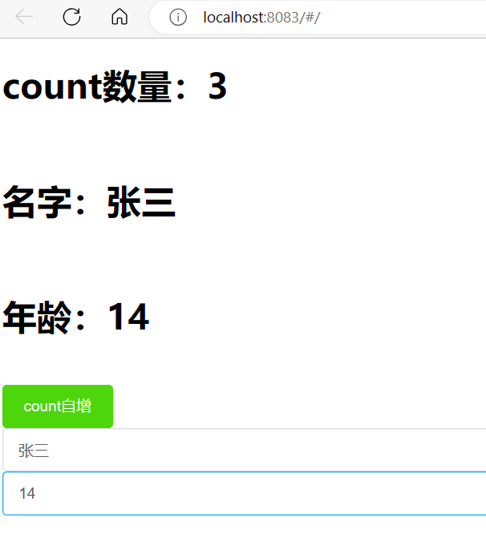


### 使用常量替代 Mutation 事件类型

使用常量替代 mutation 事件类型在各种 Flux 实现中是很常见的模式。这样可以使 linter 之类的工具发挥作用，同时把这些常量放在单独的文件中可以让你的代码合作者对整个 app 包含的 mutation 一目了然：

```js
// mutation-types.js
export const SOME_MUTATION = 'SOME_MUTATION'
```


```js
// store.js
import { createStore } from 'vuex'
import { SOME_MUTATION } from './mutation-types'

const store = createStore({
  state: { ... },
  mutations: {
    // 我们可以使用 ES2015 风格的计算属性命名功能
    // 来使用一个常量作为函数名
    [SOME_MUTATION] (state) {
      // 修改 state
    }
  }
})
```


mutation-types.js

```js
export const UPDATE_NAME = "updateName2";

export const UPDATE_AGE = "updateAge2";

export const ADD_COUNT = "increment2";
```


```js
import {createStore} from 'vuex'
import {ADD_COUNT, UPDATE_AGE, UPDATE_NAME} from '@/store/mutation-types'

// 创建一个新的 store 实例
const store = createStore({
    state()
    {
        return {
            count: 0,
            name: '',
            age: 18
        }
    },
    mutations: {
        /*increment(state)
        {
            state.count++
        },
        updateName(state, name)
        {
            state.name = name;
        },
        updateAge(state, age)
        {
            state.age = age;
        }*/
        increment(state)
        {
            state.count++
        },
        updateName(state, payload)
        {
            state.name = payload.name;
        },
        updateAge(state, payload)
        {
            state.age = payload.age;
        },
        [ADD_COUNT](state)
        {
            state.count++
        },
        [UPDATE_NAME](state, payload)
        {
            state.name = payload.name;
        },
        [UPDATE_AGE](state, payload)
        {
            state.age = payload.age;
        },
    },
    getters:
        {
            getCount2(state)
            {
                if (state.count > 10)
                {
                    console.log("大于10，返回10")
                    return 10;
                }
                return state.count;
            },
            getName2(state)
            {
                console.log("取name ：" + state.name)
                return state.name;
            },
            getAge2(state)
            {
                console.log("取age ：" + state.age)
                return state.age;
            },
            getCount3: (state) => (name) =>
            {
                console.log("当前名字：" + name)
                if (state.count > 10)
                {
                    console.log("大于10，返回10")
                    return 10;
                }
                return state.count;
            },
            getName3: (state) => (age) =>
            {
                console.log("当前年龄：" + age)
                console.log("取name ：" + state.name)
                return state.name;
            },
            getAge3: (state) => (count) =>
            {
                console.log("当前计数：" + count)
                console.log("取age ：" + state.age)
                return state.age;
            },
        }
})

export default store;
```


```vue
<template>
  <div>

    <h1>count数量：{{ this.$store.getters.getCount2 }}</h1>
    <br>

    <h1>名字：{{ this.$store.getters.getName2 }}</h1>
    <br>

    <h1>年龄：{{ this.$store.getters.getAge2 }}</h1>
    <br>

    <el-button type="success" size="large" @click="f1">count自增</el-button>
    <br>
    <el-input type="text" size="large" v-model="this.name2" @change="f2"></el-input>

    <br>
    <el-input type="number" size="large" autocomplete="年龄" v-model="this.age2" @change="f3"></el-input>

  </div>
</template>

<script>

import {mapGetters, mapState} from 'vuex'
import {ADD_COUNT, UPDATE_AGE, UPDATE_NAME} from '@/store/mutation-types'

export default {
  name: "App29",
  data()
  {
    return {
      name2: "",
      age2: 0,
    }
  },
  methods:
      {
        f1()
        {
          this.$store.commit({
            type: ADD_COUNT
          })
        },
        f2()
        {
          console.log(this.name2)
          this.$store.commit({
            type: UPDATE_NAME,
            name: this.name2
          })
        },
        f3()
        {
          console.log(this.age2)
          this.$store.commit({
            type: UPDATE_AGE,
            age: this.age2
          })
        }
      },
  computed: {
    add()
    {
      console.log("todo");
    },
    //...mapState(['count', 'name', 'age'])
    ...mapGetters(['getCount2', 'getName2', 'getAge2'])
  }
}
</script>

<style scoped>

</style>
```


## Action

### 概述

Action 类似于 mutation，不同在于：

- Action 提交的是 mutation，而不是直接变更状态。
- Action 可以包含任意异步操作。


```js
const store = createStore({
  state: {
    count: 0
  },
  mutations: {
    increment (state) {
      state.count++
    }
  },
  actions: {
    increment (context) {
      context.commit('increment')
    }
  }
})
```


Action 函数接受一个与 store 实例具有相同方法和属性的 context 对象，因此你可以调用 `context.commit` 提交一个 mutation，或者通过 `context.state` 和 `context.getters` 来获取 state 和 getters。


我们会经常用到 ES2015 的参数解构来简化代码（特别是我们需要调用 commit 很多次的时候）：

```js
actions: {
  increment ({ commit }) {
    commit('increment')
  }
}
```


### 分发 Action

Action 通过 `store.dispatch` 方法触发：

```js
store.dispatch('increment')
```


**mutation 必须同步执行**，Action 就不受约束，我们可以在 action 内部执行**异步**操作

```js
actions: {
  incrementAsync ({ commit }) {
    setTimeout(() => {
      commit('increment')
    }, 1000)
  }
}
```


actions-types.js

```js
export const INCREMENT_ASYNC = "incrementAsync"
```


```js
import {createStore} from 'vuex'
import {ADD_COUNT, UPDATE_AGE, UPDATE_NAME} from '@/store/mutation-types'
import {INCREMENT_ASYNC} from '@/store/actions-types'

// 创建一个新的 store 实例
const store = createStore({
    state()
    {
        return {
            count: 0,
            name: '',
            age: 18
        }
    },
    mutations: {
        /*increment(state)
        {
            state.count++
        },
        updateName(state, name)
        {
            state.name = name;
        },
        updateAge(state, age)
        {
            state.age = age;
        }*/
        increment(state)
        {
            state.count++
        },
        updateName(state, payload)
        {
            state.name = payload.name;
        },
        updateAge(state, payload)
        {
            state.age = payload.age;
        },
        [ADD_COUNT](state)
        {
            state.count++
        },
        [UPDATE_NAME](state, payload)
        {
            state.name = payload.name;
        },
        [UPDATE_AGE](state, payload)
        {
            state.age = payload.age;
        },
    },
    getters:
        {
            getCount2(state)
            {
                if (state.count > 10)
                {
                    console.log("大于10，返回10")
                    return 10;
                }
                return state.count;
            },
            getName2(state)
            {
                console.log("取name ：" + state.name)
                return state.name;
            },
            getAge2(state)
            {
                console.log("取age ：" + state.age)
                return state.age;
            },
            getCount3: (state) => (name) =>
            {
                console.log("当前名字：" + name)
                if (state.count > 10)
                {
                    console.log("大于10，返回10")
                    return 10;
                }
                return state.count;
            },
            getName3: (state) => (age) =>
            {
                console.log("当前年龄：" + age)
                console.log("取name ：" + state.name)
                return state.name;
            },
            getAge3: (state) => (count) =>
            {
                console.log("当前计数：" + count)
                console.log("取age ：" + state.age)
                return state.age;
            },
        },
    actions:
        {
            [INCREMENT_ASYNC]({commit})
            {
                console.log("开始异步增加count")
                setTimeout(() =>
                {
                    console.log("增加count")
                    commit('increment')
                }, 1000)
            }
        }
})

export default store;
```


```vue
<template>
  <div>

    <h1>count数量：{{ this.$store.getters.getCount2 }}</h1>
    <br>

    <h1>名字：{{ this.$store.getters.getName2 }}</h1>
    <br>

    <h1>年龄：{{ this.$store.getters.getAge2 }}</h1>
    <br>

    <el-button type="success" size="large" @click="f1">count自增</el-button>
    <br>
    <el-input type="text" size="large" v-model="this.name2" @change="f2"></el-input>

    <br>
    <el-input type="number" size="large" autocomplete="年龄" v-model="this.age2" @change="f3"></el-input>

  </div>
</template>

<script>

import {mapGetters, mapState} from 'vuex'
import {ADD_COUNT, UPDATE_AGE, UPDATE_NAME} from '@/store/mutation-types'
import {INCREMENT_ASYNC} from '@/store/actions-types'

export default {
  name: "App29",
  data()
  {
    return {
      name2: "",
      age2: 0,
    }
  },
  methods:
      {
        f1()
        {
          this.$store.dispatch(INCREMENT_ASYNC)
        },
        f2()
        {
          console.log(this.name2)
          this.$store.commit({
            type: UPDATE_NAME,
            name: this.name2
          })
        },
        f3()
        {
          console.log(this.age2)
          this.$store.commit({
            type: UPDATE_AGE,
            age: this.age2
          })
        }
      },
  computed: {
    add()
    {
      console.log("todo");
    },
    //...mapState(['count', 'name', 'age'])
    ...mapGetters(['getCount2', 'getName2', 'getAge2'])
  }
}
</script>

<style scoped>

</style>
```


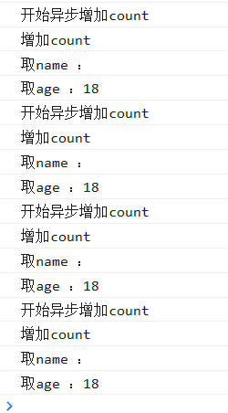


Actions 支持同样的载荷方式和对象方式进行分发：

```js
// 以载荷形式分发
store.dispatch('incrementAsync', {
  amount: 10
})

// 以对象形式分发
store.dispatch({
  type: 'incrementAsync',
  amount: 10
})
```


### 在组件中分发 Action

在组件中使用 `this.$store.dispatch('xxx')` 分发 action，或者使用 `mapActions` 辅助函数将组件的 methods 映射为 `store.dispatch` 调用（需要先在根节点注入 `store`）


```vue
<template>
  <div>

    <h1>count数量：{{ this.$store.getters.getCount2 }}</h1>
    <br>

    <h1>名字：{{ this.$store.getters.getName2 }}</h1>
    <br>

    <h1>年龄：{{ this.$store.getters.getAge2 }}</h1>
    <br>

    <el-button type="success" size="large" @click="incrementAsync">count自增</el-button>
    <br>
    <el-input type="text" size="large" v-model="this.name2" @change="f2"></el-input>

    <br>
    <el-input type="number" size="large" autocomplete="年龄" v-model="this.age2" @change="f3"></el-input>

  </div>
</template>

<script>

import {mapActions, mapGetters, mapState} from 'vuex'
import {ADD_COUNT, UPDATE_AGE, UPDATE_NAME} from '@/store/mutation-types'
import {INCREMENT_ASYNC} from '@/store/actions-types'

export default {
  name: "App29",
  data()
  {
    return {
      name2: "",
      age2: 0,
    }
  },
  methods:
      {
        f1()
        {
          this.$store.dispatch(INCREMENT_ASYNC)
        },
        f2()
        {
          console.log(this.name2)
          this.$store.commit({
            type: UPDATE_NAME,
            name: this.name2
          })
        },
        f3()
        {
          console.log(this.age2)
          this.$store.commit({
            type: UPDATE_AGE,
            age: this.age2
          })
        },
        ...mapActions([INCREMENT_ASYNC])
      },
  computed: {
    add()
    {
      console.log("todo");
    },
    //...mapState(['count', 'name', 'age'])
    ...mapGetters(['getCount2', 'getName2', 'getAge2'])
  }
}
</script>

<style scoped>

</style>
```


### 组合 Action

`store.dispatch` 可以处理被触发的 action 的处理函数返回的 Promise，并且 `store.dispatch` 仍旧返回 Promise：

```js
actions: {
  actionA ({ commit }) {
    return new Promise((resolve, reject) => {
      setTimeout(() => {
        commit('someMutation')
        resolve()
      }, 1000)
    })
  }
}
```


```js
store.dispatch('actionA').then(() => {
  // ...
})
```


也可以：

```js
actions: {
  // ...
  actionB ({ dispatch, commit }) {
    return dispatch('actionA').then(() => {
      commit('someOtherMutation')
    })
  }
}
```


```js
import {createStore} from 'vuex'
import {ADD_COUNT, UPDATE_AGE, UPDATE_NAME} from '@/store/mutation-types'
import {INCREMENT_ASYNC} from '@/store/actions-types'

// 创建一个新的 store 实例
const store = createStore({
    state()
    {
        return {
            count: 0,
            name: '',
            age: 18
        }
    },
    mutations: {
        /*increment(state)
        {
            state.count++
        },
        updateName(state, name)
        {
            state.name = name;
        },
        updateAge(state, age)
        {
            state.age = age;
        }*/
        increment(state)
        {
            state.count++
        },
        updateName(state, payload)
        {
            state.name = payload.name;
        },
        updateAge(state, payload)
        {
            state.age = payload.age;
        },
        [ADD_COUNT](state)
        {
            state.count++
        },
        [UPDATE_NAME](state, payload)
        {
            state.name = payload.name;
        },
        [UPDATE_AGE](state, payload)
        {
            state.age = payload.age;
        },
    },
    getters:
        {
            getCount2(state)
            {
                if (state.count > 10)
                {
                    console.log("大于10，返回10")
                    return 10;
                }
                return state.count;
            },
            getName2(state)
            {
                console.log("取name ：" + state.name)
                return state.name;
            },
            getAge2(state)
            {
                console.log("取age ：" + state.age)
                return state.age;
            },
            getCount3: (state) => (name) =>
            {
                console.log("当前名字：" + name)
                if (state.count > 10)
                {
                    console.log("大于10，返回10")
                    return 10;
                }
                return state.count;
            },
            getName3: (state) => (age) =>
            {
                console.log("当前年龄：" + age)
                console.log("取name ：" + state.name)
                return state.name;
            },
            getAge3: (state) => (count) =>
            {
                console.log("当前计数：" + count)
                console.log("取age ：" + state.age)
                return state.age;
            },
        },
    actions:
        {
            [INCREMENT_ASYNC]({commit})
            {
                console.log("开始异步增加count")
                setTimeout(() =>
                {
                    console.log("增加count")
                    commit('increment')
                }, 1000)
            },
            [INCREMENT_ASYNC + "2"]({commit})
            {
                return new Promise(((resolve, reject) =>
                {
                    setTimeout(() =>
                    {
                        //0.5的概率成功
                        if (Math.random() > 0.5)
                        {
                            commit('increment')
                            resolve()
                        }
                        else
                        {
                            reject("失败");
                        }
                    }, 1000)
                }))
            }
        }
})

export default store;
```


```vue
<template>
  <div>

    <h1>count数量：{{ this.$store.getters.getCount2 }}</h1>
    <br>

    <h1>名字：{{ this.$store.getters.getName2 }}</h1>
    <br>

    <h1>年龄：{{ this.$store.getters.getAge2 }}</h1>
    <br>

    <el-button type="success" size="large" @click="f1">count自增</el-button>
    <br>
    <el-input type="text" size="large" v-model="this.name2" @change="f2"></el-input>

    <br>
    <el-input type="number" size="large" autocomplete="年龄" v-model="this.age2" @change="f3"></el-input>

  </div>
</template>

<script>

import {mapActions, mapGetters, mapState} from 'vuex'
import {ADD_COUNT, UPDATE_AGE, UPDATE_NAME} from '@/store/mutation-types'
import {INCREMENT_ASYNC} from '@/store/actions-types'

export default {
  name: "App29",
  data()
  {
    return {
      name2: "",
      age2: 0,
    }
  },
  methods:
      {
        f1()
        {
          //this.$store.dispatch(INCREMENT_ASYNC)
          this.$store.dispatch(INCREMENT_ASYNC + "2").then(() =>
          {
            console.log("调用成功")
          }).catch((error) =>
          {
            //console.log(error)
            console.log("调用失败")
          })
        },
        f2()
        {
          console.log(this.name2)
          this.$store.commit({
            type: UPDATE_NAME,
            name: this.name2
          })
        },
        f3()
        {
          console.log(this.age2)
          this.$store.commit({
            type: UPDATE_AGE,
            age: this.age2
          })
        },
        ...mapActions([INCREMENT_ASYNC, INCREMENT_ASYNC + "2"])
      },
  computed: {
    add()
    {
      console.log("todo");
    },
    //...mapState(['count', 'name', 'age'])
    ...mapGetters(['getCount2', 'getName2', 'getAge2'])
  }
}
</script>

<style scoped>

</style>
```


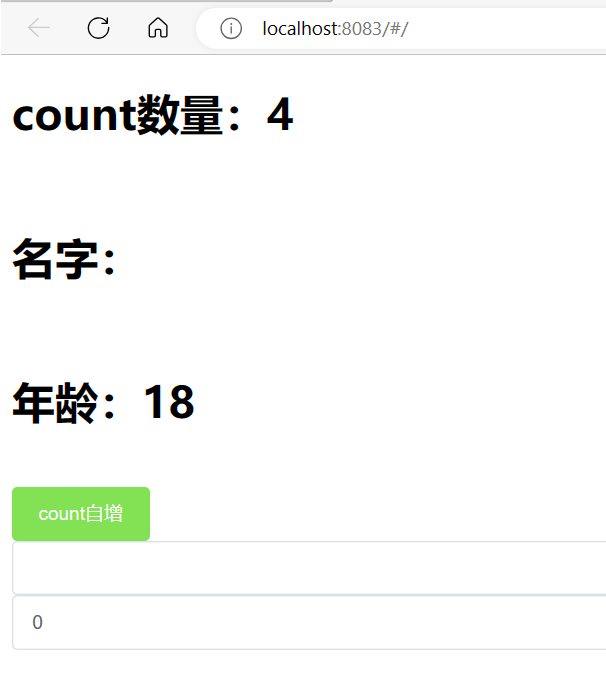


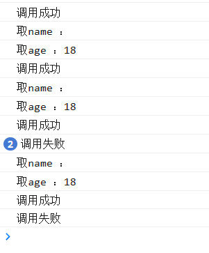


## Module

### 概述

由于使用单一状态树，应用的所有状态会集中到一个比较大的对象。当应用变得非常复杂时，store 对象就有可能变得相当臃肿。

为了解决以上问题，Vuex 允许我们将 store 分割成**模块（module）**。每个模块拥有自己的 state、mutation、action、getter、甚至是嵌套子模块——从上至下进行同样方式的分割：

```js
const moduleA = {
  state: () => ({ ... }),
  mutations: { ... },
  actions: { ... },
  getters: { ... }
}

const moduleB = {
  state: () => ({ ... }),
  mutations: { ... },
  actions: { ... }
}

const store = createStore({
  modules: {
    a: moduleA,
    b: moduleB
  }
})

store.state.a // -> moduleA 的状态
store.state.b // -> moduleB 的状态
```


### 模块的局部状态

对于模块内部的 mutation 和 getter，接收的第一个参数是**模块的局部状态对象**。

```js
const moduleA = {
  state: () => ({
    count: 0
  }),
  mutations: {
    increment (state) {
      // 这里的 `state` 对象是模块的局部状态
      state.count++
    }
  },
  getters: {
    doubleCount (state) {
      return state.count * 2
    }
  }
}
```


对于模块内部的 action，局部状态通过 `context.state` 暴露出来，根节点状态则为 `context.rootState`

```js
const moduleA = {
  // ...
  actions: {
    incrementIfOddOnRootSum ({ state, commit, rootState }) {
      if ((state.count + rootState.count) % 2 === 1) {
        commit('increment')
      }
    }
  }
}
```


对于模块内部的 getter，根节点状态会作为第三个参数暴露出来：

```js
const moduleA = {
  // ...
  getters: {
    sumWithRootCount (state, getters, rootState) {
      return state.count + rootState.count
    }
  }
}
```


### 命名空间

默认情况下，模块内部的 action 和 mutation 仍然是注册在**全局命名空间**的——这样使得多个模块能够对同一个 action 或 mutation 作出响应。Getter 同样也默认注册在全局命名空间

不要在不同的、无命名空间的模块中定义两个相同的 getter 从而导致错误。

如果希望你的模块具有更高的封装度和复用性，你可以通过添加 `namespaced: true` 的方式使其成为带命名空间的模块。当模块被注册后，它的所有 getter、action 及 mutation 都会自动根据模块注册的路径调整命名

```js
const store = createStore({
  modules: {
    account: {
      namespaced: true,

      // 模块内容（module assets）
      state: () => ({ ... }), // 模块内的状态已经是嵌套的了，使用 `namespaced` 属性不会对其产生影响
      getters: {
        isAdmin () { ... } // -> getters['account/isAdmin']
      },
      actions: {
        login () { ... } // -> dispatch('account/login')
      },
      mutations: {
        login () { ... } // -> commit('account/login')
      },

      // 嵌套模块
      modules: {
        // 继承父模块的命名空间
        myPage: {
          state: () => ({ ... }),
          getters: {
            profile () { ... } // -> getters['account/profile']
          }
        },

        // 进一步嵌套命名空间
        posts: {
          namespaced: true,

          state: () => ({ ... }),
          getters: {
            popular () { ... } // -> getters['account/posts/popular']
          }
        }
      }
    }
  }
})
```


如果你希望使用全局 state 和 getter，`rootState` 和 `rootGetters` 会作为第三和第四参数传入 getter，也会通过 `context` 对象的属性传入 action。

若需要在全局命名空间内分发 action 或提交 mutation，将 `{ root: true }` 作为第三参数传给 `dispatch` 或 `commit` 即可。


若需要在带命名空间的模块注册全局 action，你可添加 `root: true`，并将这个 action 的定义放在函数 `handler` 中

```js
{
  actions: {
    someOtherAction ({dispatch}) {
      dispatch('someAction')
    }
  },
  modules: {
    foo: {
      namespaced: true,

      actions: {
        someAction: {
          root: true,
          handler (namespacedContext, payload) { ... } // -> 'someAction'
        }
      }
    }
  }
}
```


当使用 `mapState`、`mapGetters`、`mapActions` 和 `mapMutations` 这些函数来绑定带命名空间的模块时，写起来可能比较繁琐：

```js
computed: {
  ...mapState({
    a: state => state.some.nested.module.a,
    b: state => state.some.nested.module.b
  }),
  ...mapGetters([
    'some/nested/module/someGetter', // -> this['some/nested/module/someGetter']
    'some/nested/module/someOtherGetter', // -> this['some/nested/module/someOtherGetter']
  ])
},
methods: {
  ...mapActions([
    'some/nested/module/foo', // -> this['some/nested/module/foo']()
    'some/nested/module/bar' // -> this['some/nested/module/bar']()
  ])
}
```


对于这种情况，你可以将模块的空间名称字符串作为第一个参数传递给上述函数，这样所有绑定都会自动将该模块作为上下文。于是上面的例子可以简化为：

```js
computed: {
  ...mapState('some/nested/module', {
    a: state => state.a,
    b: state => state.b
  }),
  ...mapGetters('some/nested/module', [
    'someGetter', // -> this.someGetter
    'someOtherGetter', // -> this.someOtherGetter
  ])
},
methods: {
  ...mapActions('some/nested/module', [
    'foo', // -> this.foo()
    'bar' // -> this.bar()
  ])
}
```


而且，你可以通过使用 `createNamespacedHelpers` 创建基于某个命名空间辅助函数。它返回一个对象，对象里有新的绑定在给定命名空间值上的组件绑定辅助函数：

```js
import { createNamespacedHelpers } from 'vuex'

const { mapState, mapActions } = createNamespacedHelpers('some/nested/module')

export default {
  computed: {
    // 在 `some/nested/module` 中查找
    ...mapState({
      a: state => state.a,
      b: state => state.b
    })
  },
  methods: {
    // 在 `some/nested/module` 中查找
    ...mapActions([
      'foo',
      'bar'
    ])
  }
}
```


### 模块动态注册

在 store 创建**之后**，你可以使用 `store.registerModule` 方法注册模块：

```js
import { createStore } from 'vuex'

const store = createStore({ /* 选项 */ })

// 注册模块 `myModule`
store.registerModule('myModule', {
  // ...
})

// 注册嵌套模块 `nested/myModule`
store.registerModule(['nested', 'myModule'], {
  // ...
})
```


之后就可以通过 `store.state.myModule` 和 `store.state.nested.myModule` 访问模块的状态。

也可以使用 `store.unregisterModule(moduleName)` 来动态卸载模块。不能使用此方法卸载静态模块（即创建 store 时声明的模块）


可以通过 `store.hasModule(moduleName)` 方法检查该模块是否已经被注册到 store


## 项目结构

1. 应用层级的状态应该集中到单个 store 对象中。
2. 提交 **mutation** 是更改状态的唯一方法，并且这个过程是同步的。
3. 异步逻辑都应该封装到 **action** 里面。


```sh
├── index.html
├── main.js
├── api
│   └── ... # 抽取出API请求
├── components
│   ├── App.vue
│   └── ...
└── store
    ├── index.js          # 我们组装模块并导出 store 的地方
    ├── actions.js        # 根级别的 action
    ├── mutations.js      # 根级别的 mutation
    └── modules
        ├── cart.js       # 购物车模块
        └── products.js   # 产品模块
```


## 组合式API

可以通过调用 `useStore` 函数，来在 `setup` 钩子函数中访问 store。这与在组件中使用选项式 API 访问 `this.$store` 是等效的

```js
import { useStore } from 'vuex'

export default {
  setup () {
    const store = useStore()
  }
}
```


为了访问 state 和 getter，需要创建 `computed` 引用以保留响应性，这与在选项式 API 中创建计算属性等效。

```js
import { computed } from 'vue'
import { useStore } from 'vuex'

export default {
  setup () {
    const store = useStore()

    return {
      // 在 computed 函数中访问 state
      count: computed(() => store.state.count),

      // 在 computed 函数中访问 getter
      double: computed(() => store.getters.double)
    }
  }
}
```


要使用 mutation 和 action 时，只需要在 `setup` 钩子函数中调用 `commit` 和 `dispatch` 函数

```js
import { useStore } from 'vuex'

export default {
  setup () {
    const store = useStore()

    return {
      // 使用 mutation
      increment: () => store.commit('increment'),

      // 使用 action
      asyncIncrement: () => store.dispatch('asyncIncrement')
    }
  }
}
```


## 严格模式

开启严格模式，仅需在创建 store 的时候传入 `strict: true`：

```js
const store = createStore({
  // ...
  strict: true
})
```


在严格模式下，无论何时发生了状态变更且不是由 mutation 函数引起的，将会抛出错误。这能保证所有的状态变更都能被调试工具跟踪到。

**不要在发布环境下启用严格模式**，有性能损失


## 双向绑定的计算属性

```js
<input v-model="message">
```

```js
computed: {
  message: {
    get () {
      return this.$store.state.obj.message
    },
    set (value) {
      this.$store.commit('updateMessage', value)
    }
  }
}
```


# Vue进阶

## 组件注册

一个 Vue 组件在使用前需要先被注册，这样 Vue 才能在渲染模板时找到其对应的实现。组件注册有两种方式：全局注册和局部注册。


### 全局注册

`app.component()` 方法，让组件在当前 Vue 应用中全局可用

```js
import MyComponent from './App.vue'

app.component('MyComponent', MyComponent)
```

```js
app
  .component('ComponentA', ComponentA)
  .component('ComponentB', ComponentB)
  .component('ComponentC', ComponentC)
```


全局注册的组件可以在此应用的任意组件的模板中使用


### 局部注册

全局注册虽然很方便，但有以下几个问题：

* 全局注册，但并没有被使用的组件无法在生产打包时被自动移除，如果你全局注册了一个组件，即使它并没有被实际使用，它仍然会出现在打包后的 JS 文件中
* 全局注册在大型项目中使项目的依赖关系变得不那么明确，在父组件中使用子组件时，不太容易定位子组件的实现


局部注册需要使用 `components` 选项

**局部注册的组件在后代组件中并不可用**

```vue
<script>
import ComponentA from './ComponentA.vue'

export default {
  components: {
    ComponentA
  }
}
</script>

<template>
  <ComponentA />
</template>
```


## 组件自定义事件

### 概述

自定义事件顾名思义就是自己打造的事件，包含事件名，事件回调等，定义好之后去给组件使用。

组件的自定义事件是一种组件间的通信方式，它适用于子组件向父组件传递数据或行为。


### 原理图

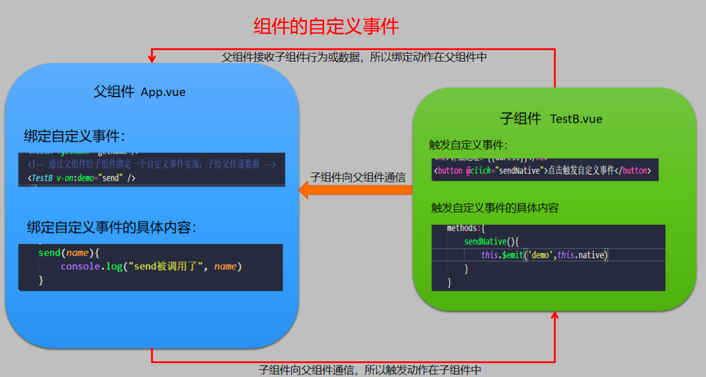


### 触发与监听事件

在组件的模板表达式中，可以直接使用 `$emit` 方法触发自定义事件

```js
<!-- MyComponent -->
<button @click="$emit('someEvent')">click me</button>
```


`$emit()` 方法在组件实例上也同样以 `this.$emit()` 的形式可用

```js
export default {
  methods: {
    submit() {
      this.$emit('someEvent')
    }
  }
}
```


子组件C1.vue

```vue
<template>

  <div class="c1">
    <p>子组件内容</p>
    <el-button type="success" @click="send">点击触发自定义事件demo</el-button>
    <br>
    <br>
    <el-button type="success" @click="$emit('demo2')">点击触发自定义事件demo2</el-button>
  </div>

</template>

<script>
export default {
  name: "C1",
  methods:
      {
        send()
        {
          this.$emit('demo')
        }
      }
}
</script>

<style scoped>
.c1 {
  width: 200px;
  height: 200px;
  background: darksalmon;
}
</style>
```


父组件：

```vue
<template>
  <div>
    <!--没有注册demo2-->
    <c1 @demo="f1"></c1>
    <br>
    <br>
    <c1 @demo="f2" @demo2="f3"></c1>
  </div>
</template>

<script>
import {ElMessage} from 'element-plus'
import c1 from '@/components/C1'

export default {
  name: "App48",
  components: {
    c1: c1,
  },
  methods:
      {
        f1()
        {
          console.log("f1")
          ElMessage.success({
            message: "触发自定义demo事件 f1",
            center: true
          })
        },
        f2()
        {
          console.log("f2")
          ElMessage.success({
            message: "触发自定义demo事件 f2",
            center: true
          })
        },
        f3()
        {
          console.log("f3")
          ElMessage.success({
            message: "触发自定义demo2事件 f3",
            center: true
          })
        }
      }
}
</script>

<style scoped>

</style>
```


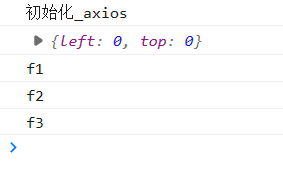


### 事件参数

有时候我们会需要在触发事件时附带一个特定的值，我们可以给 `$emit` 提供一个额外的参数

```vue
<button @click="$emit('increaseBy', 1)">
  Increase by 1
</button>
```


然后我们在父组件中监听事件

```vue
<MyButton @increase-by="increaseCount" />
```

```js
methods: {
  increaseCount(n) {
    this.count += n
  }
}
```


所有传入 `$emit()` 的额外参数都会被直接传向监听器。举例来说，`$emit('foo', 1, 2, 3)` 触发后，监听器函数将会收到这三个参数值


子组件C2.vue

```vue
<template>

  <div class="c2">
    <p>子组件内容</p>
    <el-input v-model="name"></el-input>
    <br>
    <el-input v-model="address"></el-input>
    <br>
    <el-button type="success" @click="send">点击触发自定义事件commit</el-button>
  </div>

</template>

<script>
export default {
  name: "C2",
  data()
  {
    return {
      name: '',
      address: ''
    }
  },
  methods:
      {
        send()
        {
          console.log("子组件向父组件传值：", this.name, this.address)
          this.$emit('commit', this.name, this.address)
        }
      }
}
</script>

<style scoped>
.c2 {
  width: 400px;
  height: 200px;
  background: dodgerblue;
}
</style>
```


```vue
<template>
  <div>
    <c2 @commit="f1"></c2>
    <br>
    <c2 @commit="f2"></c2>
    <br>
    <br>
    <h2>第一个子组件的值：{{data1}}</h2>
    <h2>第二个子组件的值：{{data2}}</h2>
  </div>
</template>

<script>
import {ElMessage} from 'element-plus'
import c2 from '@/components/C2'

export default {
  name: "App49",
  components: {
    c2
  },
  data()
  {
    return {
      data1: {
        name: '',
        address: ''
      },
      data2: {
        name: '',
        address: ''
      }
    }
  },
  methods:
      {
        f1(name, address)
        {
          console.log("f1", name, address)
          ElMessage.success({
            message: "触发自定义commit事件f1，值：" + name + " , " + address,
            center: true
          })
          this.data1 = {
            name: name,
            address: address
          }
        },
        f2(name, address)
        {
          console.log("f2", name, address)
          ElMessage.success({
            message: "触发自定义commit事件f2，值：" + name + " , " + address,
            center: true
          })
          this.data2 = {
            name: name,
            address: address
          }
        },
      }
}
</script>

<style scoped>

</style>
```


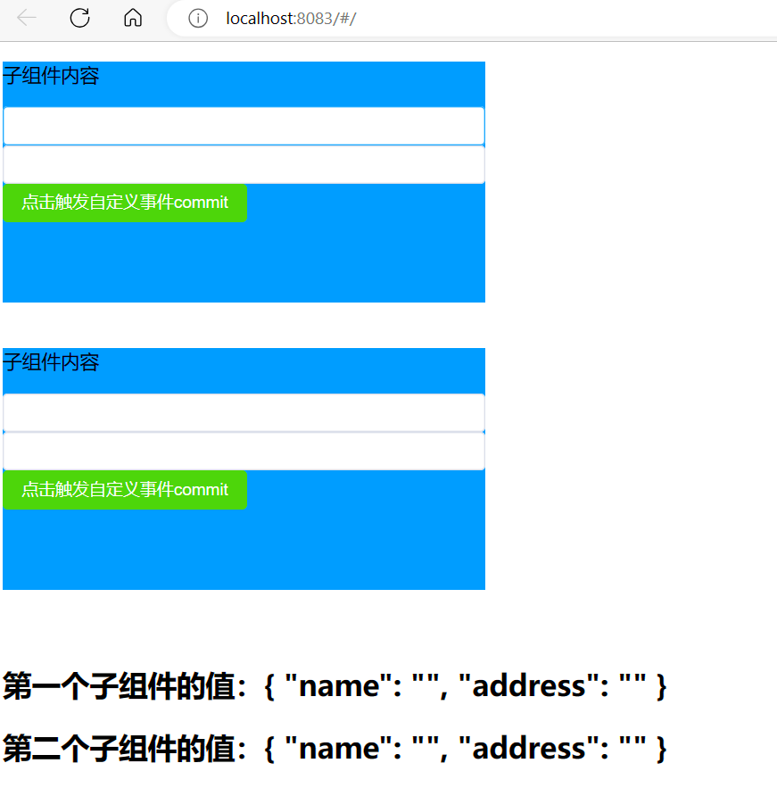


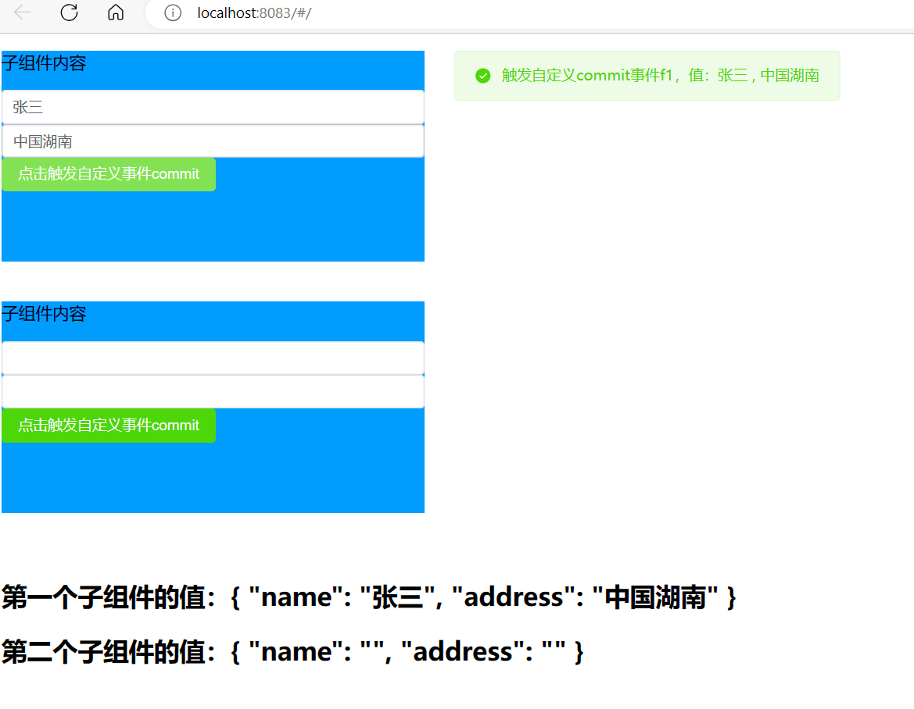


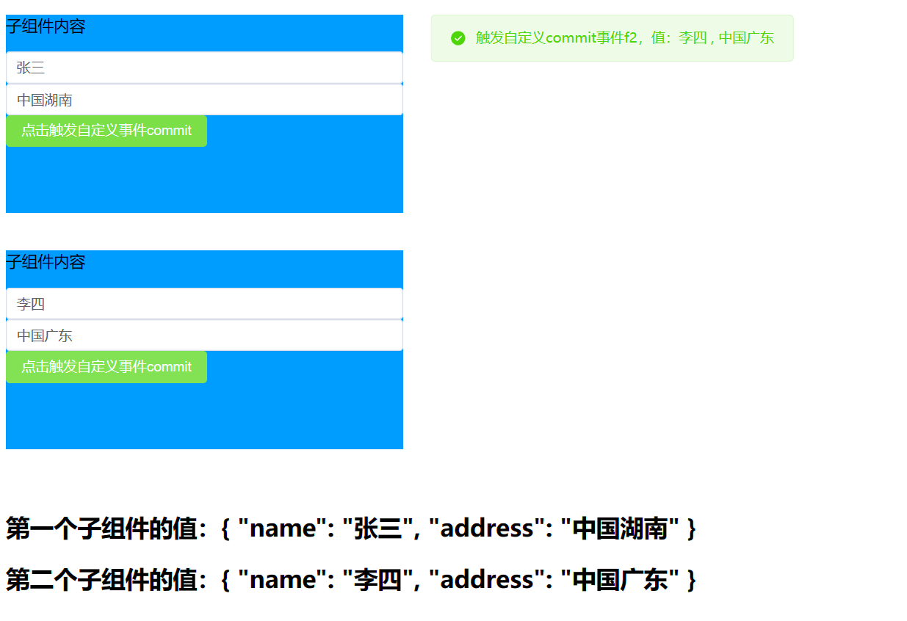


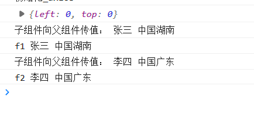


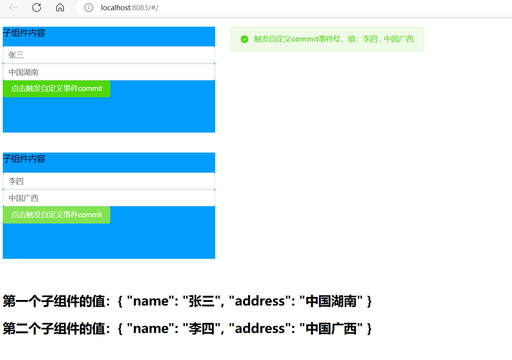


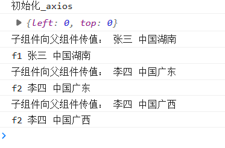


### 声明触发的事件

组件可以显式地通过 [`emits`](https://cn.vuejs.org/api/options-state.html#emits) 选项来声明它要触发的事件：

```js
export default {
  emits: ['inFocus', 'submit']
}
```


## 自定义指令

### 概述

除了 Vue 内置的一系列指令 (比如 `v-model` 或 `v-show`) 之外，Vue 还允许你注册自定义的指令 (Custom Directives)。

自定义指令分为全局指令和局部指令，当全局指令和局部指令同名时以局部指令为准。


### 全局自定义指令

通过Vue.directive(id,definition)方法可以注册一个全局自定义指令，该方法可以接收两个参数：指令ID和定义对象。指令ID是指令的唯一标识，定义对象是定义的指令的钩子函数


main.js

```js
import {createApp} from 'vue'

import ElementPlus from 'element-plus'
import 'element-plus/dist/index.css'

import App from './App50.vue'
import Router2 from '@/router/Router11'
import Store from '@/store/index'

const app = createApp(App)

app.use(ElementPlus)
app.use(Router2)
app.use(Store)
app.directive('focus', {
    //当被绑定的元素插入DOM中时执行
    mounted: function (el)
    {
        //使元素自动获得焦点
        console.log(el, "获取焦点")
        el.focus();
    }
})
app.mount('#app')

```


使用：

```vue
<template>

  <input type="text" value="200"/>
  <br>
  <input type="text" value="100" v-focus/>

</template>

<script>
export default {
  name: "App50"
}
</script>

<style scoped>

</style>
```


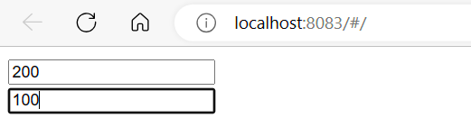


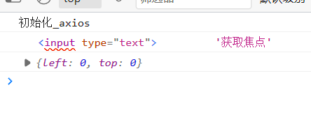


### 局部自定义指令

通过Vue实例中的directive选项可以注册一个局部自定义指令。

自动添加背景颜色功能：

```vue
<template>
  <div>
    <h2 v-background="'#cccccc'">hello</h2>
    <h2 v-background="'#ffaa00'">hello</h2>
    <h2 v-background="'#ffaacc'">hello</h2>
    <h2 v-background="'red'">hello</h2>
    <h2 v-background="'skyblue'">hello</h2>
    <h2 v-background="'#00ffaa'">hello</h2>
  </div>
</template>

<script>
export default {
  name: "App51",
  directives:
      {
        background: {
          beforeMount: function (el, binding, vnode, prevVnode)
          {
            console.log(el, binding.value)
            el.style.background = binding.value;
          }
        }
      }
}
</script>

<style scoped>

</style>
```


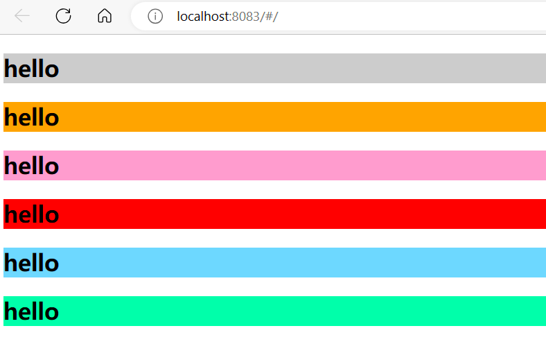


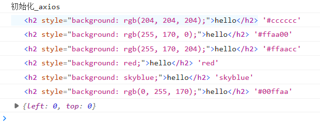


### 指令钩子函数

一个指令的定义对象可以提供几种钩子函数 (都是可选的)：

```js
// 在绑定元素的 attribute 前
  // 或事件监听器应用前调用
  created(el, binding, vnode, prevVnode) {},
  // 在元素被插入到 DOM 前调用
  beforeMount(el, binding, vnode, prevVnode) {},
  // 在绑定元素的父组件
  // 及他自己的所有子节点都挂载完成后调用
  mounted(el, binding, vnode, prevVnode) {},
  // 绑定元素的父组件更新前调用
  beforeUpdate(el, binding, vnode, prevVnode) {},
  // 在绑定元素的父组件
  // 及他自己的所有子节点都更新后调用
  updated(el, binding, vnode, prevVnode) {},
  // 绑定元素的父组件卸载前调用
  beforeUnmount(el, binding, vnode, prevVnode) {},
  // 绑定元素的父组件卸载后调用
  unmounted(el, binding, vnode, prevVnode) {}
```


指令的钩子会传递以下几种参数：

- `el`：指令绑定到的元素。这可以用于直接操作 DOM。
- `binding`：一个对象，包含以下属性。
  - `value`：传递给指令的值。例如在 `v-my-directive="1 + 1"` 中，值是 `2`。
  - `oldValue`：之前的值，仅在 `beforeUpdate` 和 `updated` 中可用。无论值是否更改，它都可用。
  - `arg`：传递给指令的参数 (如果有的话)。例如在 `v-my-directive:foo` 中，参数是 `"foo"`。
  - `modifiers`：一个包含修饰符的对象 (如果有的话)。例如在 `v-my-directive.foo.bar` 中，修饰符对象是 `{ foo: true, bar: true }`。
  - `instance`：使用该指令的组件实例。
  - `dir`：指令的定义对象。
- `vnode`：代表绑定元素的底层 VNode。
- `prevNode`：之前的渲染中代表指令所绑定元素的 VNode。仅在 `beforeUpdate` 和 `updated` 钩子中可用。


### 简化形式

仅仅需要在 `mounted` 和 `updated` 上实现相同的行为，除此之外并不需要其他钩子

```html
<div v-color="color"></div>
```

```js
app.directive('color', (el, binding) => {
  // 这会在 `mounted` 和 `updated` 时都调用
  el.style.color = binding.value
})
```


### 对象字面量

可以向它传递一个 JavaScript 对象字面量

```html
<div v-demo="{ color: 'white', text: 'hello!' }"></div>
```

```js
app.directive('demo', (el, binding) => {
  console.log(binding.value.color) // => "white"
  console.log(binding.value.text) // => "hello!"
})
```


## 插件

### 概述

插件 (Plugins) 是一种能为 Vue 添加全局功能的工具代码。

一个插件可以是一个拥有 `install()` 方法的对象，也可以直接是一个安装函数本身。


插件没有严格定义的使用范围，但是插件发挥作用的常见场景主要包括以下几种：

* 通过 app.component() 和 app.directive() 注册一到多个全局组件或自定义指令
* 通过 app.provide() 使一个资源可被注入进整个应用
* 向 app.config.globalProperties 中添加一些全局实例属性或方法
* 功能库


### 示例

src/plugins/i18n.js：

```js
export default {
    install: (app, options) =>
    {
        //注入一个全局可用的 $translate() 方法
        app.config.globalProperties.$translate = (key) =>
        {
            //获取 `options` 对象的深层属性
            //使用 `key` 作为索引
            return key.split('.').reduce((o, i) =>
            {
                if (o)
                {
                    console.log(o[i])
                    return o[i]
                }
            }, options)
        }
    }
}
```


main.js

```js
import {createApp} from 'vue'

import ElementPlus from 'element-plus'
import 'element-plus/dist/index.css'

import App from './App52.vue'
import Router2 from '@/router/Router11'
import Store from '@/store/index'
import i18n from '@/plugins/i18n'

const app = createApp(App)

app.use(ElementPlus)
app.use(Router2)
app.use(Store)
app.use(i18n, {
    a:
        {
            a1: "hello1",
            a2: "hello2",
            a3: "hello3",
        },
    b:
        {
            b1: "world1",
            b2: "world2",
            b3: "world3",
        }
})
app.mount('#app')
```


```vue
<template>
  <h2>{{ $translate('a.a1') }}</h2>
  <h2>{{ $translate('a.a2') }}</h2>
  <h2>{{ $translate('a.a3') }}</h2>
  <h2>{{ $translate('b.b1') }}</h2>
  <h2>{{ $translate('b.b2') }}</h2>
  <h2>{{ $translate('b.b3') }}</h2>

</template>

<script>
export default {
  name: "App52"
}
</script>

<style scoped>

</style>
```


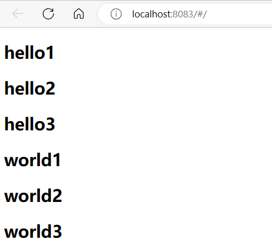


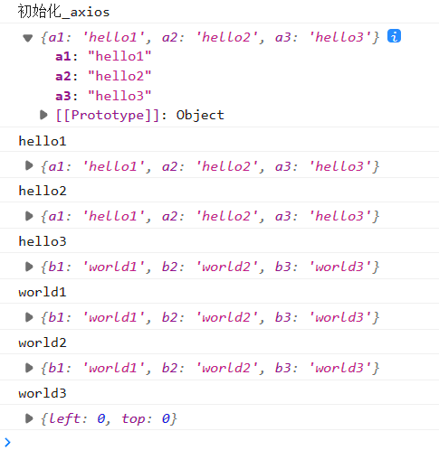


# 组合式 API

## 概述

Vue 的组件可以按两种不同的风格书写：选项式 API 和组合式 API。

组合式 API (Composition API) 是一系列 API 的集合，使我们可以使用函数而不是声明选项的方式书写 Vue 组件。

涵盖了以下方面的 API：

- [响应式 API](https://cn.vuejs.org/api/reactivity-core.html)：例如 `ref()` 和 `reactive()`，使我们可以直接创建响应式状态、计算属性和侦听器。
- [生命周期钩子](https://cn.vuejs.org/api/composition-api-lifecycle.html)：例如 `onMounted()` 和 `onUnmounted()`，使我们可以在组件各个生命周期阶段添加逻辑。
- [依赖注入](https://cn.vuejs.org/api/composition-api-dependency-injection.html)：例如 `provide()` 和 `inject()`，使我们可以在使用响应式 API 时，利用 Vue 的依赖注入系统。


想要使用组合式API，需要加上`<script setup>`


选项式API：

```vue
<script>
export default {
  // data() 返回的属性将会成为响应式的状态
  // 并且暴露在 `this` 上
  data() {
    return {
      count: 0
    }
  },

  // methods 是一些用来更改状态与触发更新的函数
  // 它们可以在模板中作为事件处理器绑定
  methods: {
    increment() {
      this.count++
    }
  },

  // 生命周期钩子会在组件生命周期的各个不同阶段被调用
  // 例如这个函数就会在组件挂载完成后被调用
  mounted() {
    console.log(`The initial count is ${this.count}.`)
  }
}
</script>

<template>
  <button @click="increment">Count is: {{ count }}</button>
</template>
```


组合式 API：

```vue
<script setup>
import { ref, onMounted } from 'vue'

// 响应式状态
const count = ref(0)

// 用来修改状态、触发更新的函数
function increment() {
  count.value++
}

// 生命周期钩子
onMounted(() => {
  console.log(`The initial count is ${count.value}.`)
})
</script>

<template>
  <button @click="increment">Count is: {{ count }}</button>
</template>
```


## 为什么要有组合式 API？

* 更好的逻辑复用：而组合式 API 解决了 mixins 的所有缺陷
* 更灵活的代码组织：选项式 API 在单个组件的逻辑复杂到一定程度时，会面临一些无法忽视的限制，这些限制主要体现在需要处理多个逻辑关注点的组件中，使用组合式 API可以很轻松地将这一组代码移动到一个外部文件中，不再需要为了抽象而重新组织代码，大大降低了重构成本，这在长期维护的大型项目中非常关键
* 更好的类型推导：越来越多的开发者开始使用 TypeScript 书写更健壮可靠的代码，选项式 API 是在 2013 年被设计出来的，那时并没有把类型推导考虑进去，相比之下，组合式 API 主要利用基本的变量和函数，它们本身就是类型友好的。用组合式 API 重写的代码可以享受到完整的类型推导，不需要书写太多类型标注
* 更小的生产包体积：搭配 `<script setup>` 使用组合式 API 比等价情况下的选项式 API 更高效，对代码压缩也更友好。这是由于 `<script setup>` 形式书写的组件模板被编译为了一个内联函数，和 `<script setup>` 中的代码位于同一作用域。不像选项式 API 需要依赖 `this` 上下文对象访问属性，被编译的模板可以直接访问 `<script setup>` 中定义的变量，无需从实例中代理。这对代码压缩更友好，因为本地变量的名字可以被压缩，但对象的属性名则不能


## 响应式 API

### ref()

接受一个内部值，返回一个响应式的、可更改的 ref 对象，此对象只有一个指向其内部值的属性 .value

ref 对象是可更改的，也就是说你可以为 .value 赋予新的值。它也是响应式的，即所有对 .value 的操作都将被追踪


```vue
<template>
  <div>
    <h1>a:{{ a }}</h1>
    <h1>b:{{ b }}</h1>
  </div>
</template>

<script setup>

import {ref} from 'vue'

const a = ref(120);
console.log(a.value)
const b = ref("hello");
console.log(b)
console.log(b.value)

</script>

<style scoped>

</style>
```


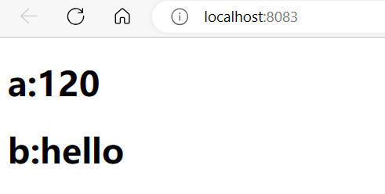


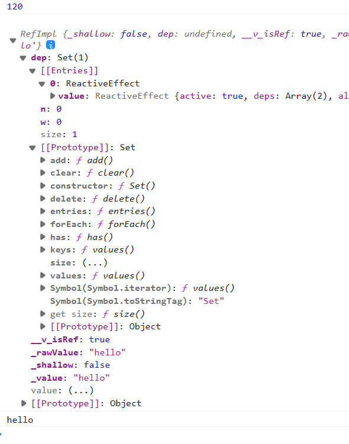


### reactive()

返回一个对象的响应式代理。

如果将一个对象赋值给 ref，那么这个对象将通过 reactive() 转为具有深层次响应式的对象。这也意味着如果对象中包含了嵌套的 ref，它们将被深层地解包

当访问到某个响应式数组或 Map 这样的原生集合类型中的 ref 元素时，不会执行 ref 的解包

将一个 ref 赋值给一个 reactive 属性时，该 ref 会被自动解包


```vue
<template>

  <div>
    <h1>test1:{{ test1 }}</h1>
    <h1>test1.a:{{ test1.a }}</h1>
    <h1>test1.b:{{ test1.b }}</h1>

    <h1>test2:{{ test2 }}</h1>
    <h1>test2.a:{{ test2.a }}</h1>
    <h1>test2.b:{{ test2.b }}</h1>
  </div>

</template>

<script setup>

import {reactive, ref} from 'vue'

const test1 = ref({a: 1, b: 2})
console.log(test1.value)
test1.value.a++;
test1.value.b++;

const test2 = reactive({a: 5, b: 6})
console.log(test2)
test2.a++
test2.b++

</script>

<style scoped>

</style>
```


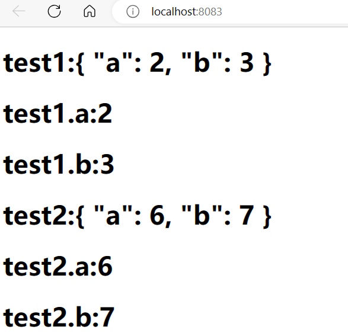


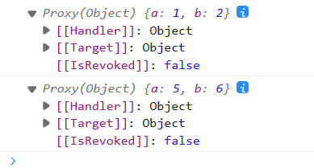


ref 的解包：

```vue
<template>

  <div>
    <h1>{{ count }}</h1>
    <h1>{{ obj.count }}</h1>
  </div>

</template>

<script setup>

import {reactive, ref} from 'vue'

const count = ref(1)
const obj = reactive({count})

// ref 会被解包
console.log(obj.count === count.value) // true

// 会更新 `obj.count`
count.value++
console.log(count.value) // 2
console.log(obj.count) // 2

// 也会更新 `count` ref
obj.count++
console.log(obj.count) // 3
console.log(count.value) // 3

</script>

<style scoped>

</style>
```


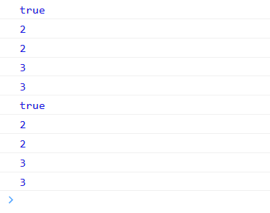


```vue
<template>

  <div>
    <h1>{{ books[1].value }}</h1>
    <h1>{{ map.get('count').value }}</h1>
    <h1>{{ obj.count }}</h1>
    <h1>{{ count }}</h1>
  </div>

</template>

<script setup>

import {reactive, ref} from 'vue'

//当访问到某个响应式数组或 Map 这样的原生集合类型中的 ref 元素时，不会执行 ref 的解包
const books = reactive([ref('1'), ref('2'), ref('3')])
// 这里需要 .value
console.log(books[0].value)

const map = reactive(new Map([['count', ref(100)]]))
// 这里需要 .value
console.log(map.get('count').value)


//将一个 ref 赋值给一个 reactive 属性时，该 ref 会被自动解包
const count = ref(1000)
const obj = reactive({})

obj.count = count

console.log(obj.count) // 1000
console.log(obj.count === count.value) // true
console.log(count)
console.log(obj.count)

</script>

<style scoped>

</style>

```


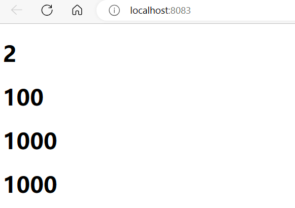


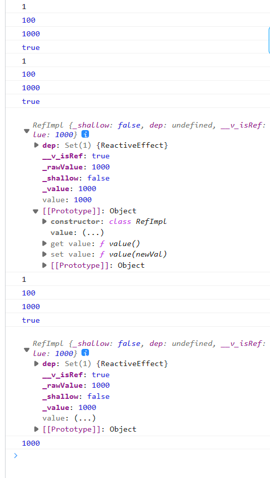


### computed()

接受一个 getter 函数，返回一个只读的响应式 ref 对象。该 ref 通过 .value 暴露 getter 函数的返回值。它也可以接受一个带有 get 和 set 函数的对象来创建一个可写的 ref 对象。

创建一个只读的计算属性 ref：

```js
const count = ref(1)
const plusOne = computed(() => count.value + 1)

console.log(plusOne.value) // 2

plusOne.value++ // 错误
```


创建一个可写的计算属性 ref：

```js
const count = ref(1)
const plusOne = computed({
  get: () => count.value + 1,
  set: (val) => {
    count.value = val - 1
  }
})

plusOne.value = 1
console.log(count.value) // 0
```


```vue
<template>
  <div>
    <h2>{{ plus }}</h2>
    <h2>{{ plus2 }}</h2>
  </div>
</template>

<script setup>

import {computed, ref} from 'vue'

const count1 = ref(100)
const count2 = ref(300)
console.log(count1.value)
console.log(count2.value)
const plus = computed(() =>
{
  return count1.value + count2.value;
})

console.log(plus.value)

try
{
  plus.value++;
}
catch (e)
{
  console.log(e)
}

const count3 = ref(200)
const count4 = ref(600)
const plus2 = computed({
  get: () =>
  {
    return count3.value + count4.value;
  },
  set: (v) =>
  {
    count3.value = v;
    count4.value = v;
  }
})
console.log(plus2.value)
plus2.value++
console.log(plus2.value)


</script>

<style scoped>

</style>
```


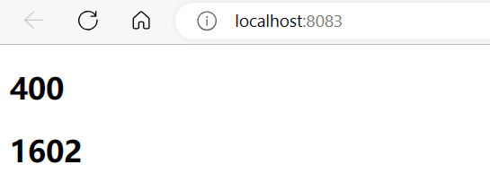


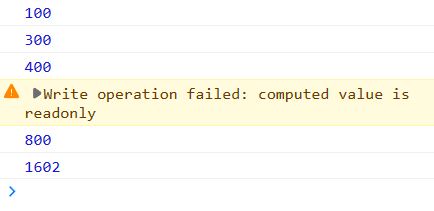


### readonly()

接受一个对象 (不论是响应式还是普通的) 或是一个 ref，返回一个原值的只读代理

只读代理是深层的：对任何嵌套属性的访问都将是只读的。它的 ref 解包行为与 reactive() 相同，但解包得到的值是只读的。


```vue
<template>
  <div>
    <h2>count: {{ readonly1.count }}</h2>
    <h2>a.a1: {{ readonly1.a.a1 }}</h2>
    <h2>a.a2: {{ readonly1.a.a2 }}</h2>

  </div>
</template>

<script setup>
import {readonly} from 'vue'

const readonly1 = readonly({count: 1, a: {a1: 1000, a2: 30243}})

console.log(readonly1.count)
console.log(readonly1.a.a1)
console.log(readonly1.a.a2)
try
{
  readonly1.count++;
}
catch (e)
{
  console.log(e)
}
try
{
  readonly1.a.a1++;
}
catch (e)
{
  console.log(e)
}
try
{
  readonly1.a.a2++;
}
catch (e)
{
  console.log(e)
}

</script>

<style scoped>

</style>
```


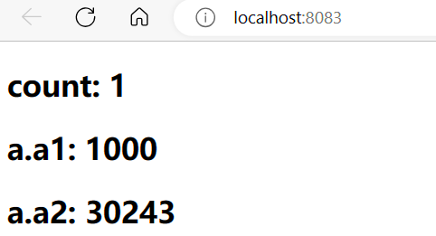


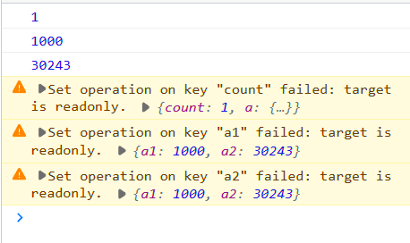


### watchEffect()

立即运行一个函数，同时响应式地追踪其依赖，并在依赖更改时重新执行。

第一个参数就是要运行的函数

第二个参数是一个可选的选项，可以用来调整刷新时机或调试依赖

默认情况下，侦听器将在组件渲染之前执行。设置 flush: 'post' 将会使侦听器延迟到组件渲染之后再执行

在某些特殊情况下 (例如要使缓存失效)，可能有必要在响应式依赖发生改变时立即触发侦听器。这可以通过设置 flush: 'sync' 来实现


```vue
<template>

  <h1>{{ count }}</h1>
  <br><br>
  <button type="button" @click="plusOne">点击count+1</button>

</template>

<script setup>

import {ref, watchEffect} from 'vue'

const count = ref(100)

function plusOne()
{
  count.value++;
}

watchEffect(() =>
{
  console.log("count变化")
  console.log(count.value)
})

</script>

<style scoped>

</style>
```


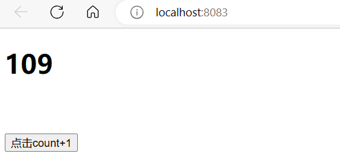


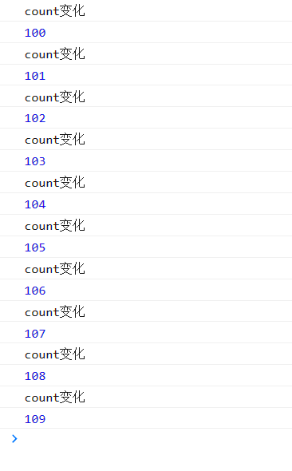


停止侦听器：

```vue
<template>

  <h1>{{ count }}</h1>
  <br><br>
  <button type="button" @click="plusOne">点击count+1</button>
  <br>
  <button type="button" @click="stop">点击取消监听</button>

</template>

<script setup>

import {ref, watchEffect} from 'vue'

const count = ref(100)

function plusOne()
{
  count.value++;
}

const stop = watchEffect(() =>
{
  console.log("count变化")
  console.log(count.value)
})


</script>

<style scoped>

</style>
```


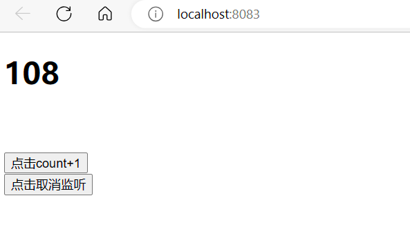


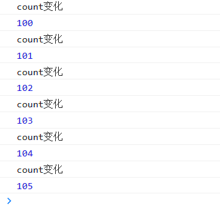


### watchPostEffect()

watchEffect() 使用 flush: 'post' 选项时的别名


### watchSyncEffect()

watchEffect() 使用 flush: 'sync' 选项时的别名


### watch()

侦听一个或多个响应式数据源，并在数据源变化时调用所给的回调函数

watch() 默认是懒侦听的，即仅在侦听源发生变化时才执行回调函数

第一个参数是侦听器的**源**。这个来源可以是以下几种：

- 一个函数，返回一个值
- 一个 ref
- 一个响应式对象
- 由以上类型的值组成的数组


第二个参数是在发生变化时要调用的回调函数。这个回调函数接受三个参数：新值、旧值，以及一个用于注册副作用清理的回调函数

第三个可选的参数是一个对象，支持以下这些选项：

- **`immediate`**：在侦听器创建时立即触发回调。第一次调用时旧值是 `undefined`。
- **`deep`**：如果源是对象，强制深度遍历，以便在深层级变更时触发回调。
- **`flush`**：调整回调函数的刷新时机。
- **`onTrack / onTrigger`**：调试侦听器的依赖。


与 watchEffect() 相比，watch() 使我们可以：

- 懒执行副作用；
- 更加明确是应该由哪个状态触发侦听器重新执行；
- 可以访问所侦听状态的前一个值和当前值。


```vue
<template>

  <h1>{{ count }}</h1>
  <br><br>
  <button type="button" @click="plusOne">点击count+1</button>
  <br>
  <button type="button" @click="stop">点击取消监听</button>

</template>

<script setup>

import {ref, watch} from 'vue'

const count = ref(100)

function plusOne()
{
  count.value++;
}

const stop = watch(count, (newValue, oldValue) =>
{
  console.log("监听到count变化", newValue, oldValue)
})


</script>

<style scoped>

</style>
```


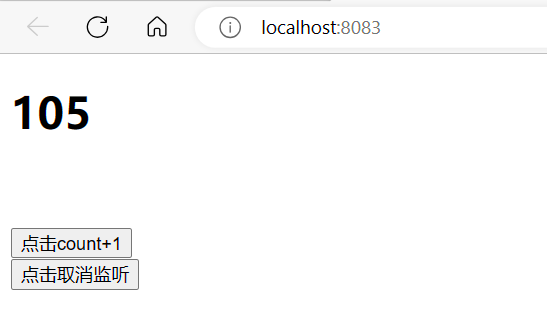


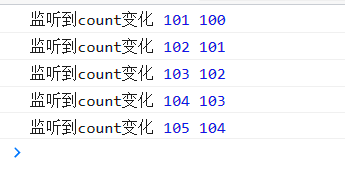


## 工具函数

* isRef()：检查某个值是否为 ref
* unref()：如果参数是 ref，则返回内部值，否则返回参数本身
* toRef()：可以将值、refs 或 getters 规范化为 refs，也可以基于响应式对象上的一个属性，创建一个对应的 ref。这样创建的 ref 与其源属性保持同步：改变源属性的值将更新 ref 的值，反之亦然
* toValue()：将值、refs 或 getters 规范化为值。这与 unref() 类似，不同的是此函数也会规范化 getter 函数。如果参数是一个 getter，它将会被调用并且返回它的返回值
* toRefs()：将一个响应式对象转换为一个普通对象，这个普通对象的每个属性都是指向源对象相应属性的 ref。每个单独的 ref 都是使用 toRef() 创建的
* isProxy()：检查一个对象是否是由 reactive()、readonly()、shallowReactive() 或 shallowReadonly() 创建的代理
* isReactive()：检查一个对象是否是由 reactive() 或 shallowReactive() 创建的代理
* isReadonly()：检查传入的值是否为只读对象


## 生命周期钩子

可以参考 <a href="#生命周期">生命周期</a>


### onMounted()

注册一个回调函数，在组件挂载完成后执行


### onUpdated()

注册一个回调函数，在组件因为响应式状态变更而更新其 DOM 树之后调用


### onUnmounted()

注册一个回调函数，在组件实例被卸载之后调用


### onBeforeMount()

注册一个钩子，在组件被挂载之前被调用


### onBeforeUpdate()

注册一个钩子，在组件即将因为响应式状态变更而更新其 DOM 树之前调用


### onBeforeUnmount()

注册一个钩子，在组件实例被卸载之前调用。


### onErrorCaptured()

注册一个钩子，在捕获了后代组件传递的错误时调用


### onActivated()

注册一个回调函数，若组件实例是 \<KeepAlive> 缓存树的一部分，当组件被插入到 DOM 中时调用。


### onDeactivated()

注册一个回调函数，若组件实例是 \<KeepAlive> 缓存树的一部分，当组件从 DOM 中被移除时调用。


### 示例

```vue
<template>
  <div>
    <h1>{{ count }}</h1>
    <br><br>
    <button type="button" @click="count++">点击count+1</button>
  </div>
</template>

<script setup>

import {
  onActivated, onBeforeMount, onBeforeUnmount, onBeforeUpdate,
  onDeactivated, onErrorCaptured, onMounted, onUnmounted,
  onUpdated, ref
} from 'vue'

const count = ref(100)

onMounted(() =>
{
  console.log("onMounted")
})

onUpdated(() =>
{
  console.log("onUpdated")
})

onUnmounted(() =>
{
  console.log("onUnmounted")
})

onBeforeMount(() =>
{
  console.log("onBeforeMount")
})

onBeforeUpdate(() =>
{
  console.log("onBeforeUpdate")
})

onBeforeUnmount(() =>
{
  console.log("onBeforeUnmount")
})

onErrorCaptured(() =>
{
  console.log("onErrorCaptured")
})

onActivated(() =>
{
  console.log("onActivated")
})

onDeactivated(() =>
{
  console.log("onDeactivated")
})


</script>

<style scoped>

</style>
```


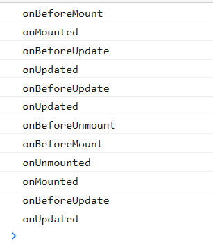


# TypeScript

## 概述

TypeScript是微软开发的一个开源的编程语言，通过在JavaScript的基础上添加静态类型定义构建而成。TypeScript通过TypeScript编译器或Babel转译为JavaScript代码，可运行在任何浏览器，任何操作系统。

TypeScript 起源于使用JavaScript开发的大型项目 。由于JavaScript语言本身的局限性，难以胜任大型项目的开发和维护。因此微软开发了TypeScript ，使得其能够胜任大型项目的开发。

TypeScript可以在任何浏览器运行、任何计算机和任何操作系统上运行，并且是开源的


TypeScript与js相比的优势：

* TypeScript工具使重构更变的容易、快捷。
* TypeScript 引入了 JavaScript 中没有的“类”概念。
* TypeScript 中引入了模块的概念，可以把声明、数据、函数和类封装在模块中
* 类型安全功能能在编码期间检测错误，这为开发人员创建了一个更高效的编码和调试过程。


## 官网

网站首页：https://www.tslang.cn/index.html

文档地址：https://www.tslang.cn/docs/home.html


## 安装

npm全局安装：

```sh
npm install -g typescript
```


也可以指定版本：

```sh
npm install -g typescript@4.1.5
```


```sh
PS C:\Users\mao\Desktop> npm install -g typescript@4.1.5
C:\Users\mao\AppData\Roaming\npm\tsc -> C:\Users\mao\AppData\Roaming\npm\node_modules\typescript\bin\tsc
C:\Users\mao\AppData\Roaming\npm\tsserver -> C:\Users\mao\AppData\Roaming\npm\node_modules\typescript\bin\tsserver
+ typescript@4.1.5
updated 1 package in 10.618s
PS C:\Users\mao\Desktop> tsc -v
Version 4.1.5
PS C:\Users\mao\Desktop>
```


```sh
PS C:\Users\mao\Desktop> tsc --help
Version 4.1.5
Syntax:   tsc [options] [file...]

Examples: tsc hello.ts
          tsc --outFile file.js file.ts
          tsc @args.txt
          tsc --build tsconfig.json

Options:
 -h, --help                                         Print this message.
 -w, --watch                                        Watch input files.
 --pretty                                           Stylize errors and messages using color and context (experimental).
 --all                                              Show all compiler options.
 -v, --version                                      Print the compiler's version.
 --init                                             Initializes a TypeScript project and creates a tsconfig.json file.
 -p FILE OR DIRECTORY, --project FILE OR DIRECTORY  Compile the project given the path to its configuration file, or to a folder with a 'tsconfig.json'.
 -b, --build                                        Build one or more projects and their dependencies, if out of date
 -t VERSION, --target VERSION                       Specify ECMAScript target version: 'ES3' (default), 'ES5', 'ES2015', 'ES2016', 'ES2017', 'ES2018', 'ES2019', 'ES2020', or 'ESNEXT'.
 -m KIND, --module KIND                             Specify module code generation: 'none', 'commonjs', 'amd', 'system', 'umd', 'es2015', 'es2020', or 'ESNext'.
 --lib                                              Specify library files to be included in the compilation.
                                                      'es5' 'es6' 'es2015' 'es7' 'es2016' 'es2017' 'es2018' 'es2019' 'es2020' 'esnext' 'dom' 'dom.iterable' 'webworker' 'webworker.importscripts' 'webworker.iterable' 'scripthost' 'es2015.core' 'es2015.collection' 'es2015.generator' 'es2015.iterable' 'es2015.promise' 'es2015.proxy' 'es2015.reflect' 'es2015.symbol' 'es2015.symbol.wellknown' 'es2016.array.include' 'es2017.object' 'es2017.sharedmemory' 'es2017.string' 'es2017.intl' 'es2017.typedarrays' 'es2018.asyncgenerator' 'es2018.asynciterable' 'es2018.intl' 'es2018.promise' 'es2018.regexp' 'es2019.array' 'es2019.object' 'es2019.string' 'es2019.symbol' 'es2020.bigint' 'es2020.promise' 'es2020.sharedmemory' 'es2020.string' 'es2020.symbol.wellknown' 'es2020.intl' 'esnext.array' 'esnext.symbol' 'esnext.asynciterable' 'esnext.intl' 'esnext.bigint' 'esnext.string' 'esnext.promise' 'esnext.weakref'
 --allowJs                                          Allow javascript files to be compiled.
 --jsx KIND                                         Specify JSX code generation: 'preserve', 'react-native', or 'react'.
 -d, --declaration                                  Generates corresponding '.d.ts' file.
 --declarationMap                                   Generates a sourcemap for each corresponding '.d.ts' file.
 --sourceMap                                        Generates corresponding '.map' file.
 --outFile FILE                                     Concatenate and emit output to single file.
 --outDir DIRECTORY                                 Redirect output structure to the directory.
 --removeComments                                   Do not emit comments to output.
 --noEmit                                           Do not emit outputs.
 --strict                                           Enable all strict type-checking options.
 --noImplicitAny                                    Raise error on expressions and declarations with an implied 'any' type.
 --strictNullChecks                                 Enable strict null checks.
 --strictFunctionTypes                              Enable strict checking of function types.
 --strictBindCallApply                              Enable strict 'bind', 'call', and 'apply' methods on functions.
 --strictPropertyInitialization                     Enable strict checking of property initialization in classes.
 --noImplicitThis                                   Raise error on 'this' expressions with an implied 'any' type.
 --alwaysStrict                                     Parse in strict mode and emit "use strict" for each source file.
 --noUnusedLocals                                   Report errors on unused locals.
 --noUnusedParameters                               Report errors on unused parameters.
 --noImplicitReturns                                Report error when not all code paths in function return a value.
 --noFallthroughCasesInSwitch                       Report errors for fallthrough cases in switch statement.
 --types                                            Type declaration files to be included in compilation.
 --esModuleInterop                                  Enables emit interoperability between CommonJS and ES Modules via creation of namespace objects for all imports. Implies 'allowSyntheticDefaultImports'.
 @<file>                                            Insert command line options and files from a file.
PS C:\Users\mao\Desktop>
```


## 动态类型的问题

js 属于动态类型语言


如下一个函数：

```js
function test(obj) {    
}
```


传递过去的参数可能是一个字符串：

```js
test('hello, world')
```

也可能是一个对象：

```js
test({a:1,b:2})
```

也有可能是个函数：

```sh
test(()=>{})
```


obj 类型不确定，就给后期使用者带来了麻烦，一旦参数传不对，代码可能出现问题


动态类型是在代码运行时才知道是什么

静态类型是在代码运行前，就对它的行为做出预测


## 在Vue中使用ts

全新项目：使用vue cli脚手架工具创建vue项目时，勾选 ts

已有项目：添加vue官方配置的ts适配插件，使用@vue/cli 安装 ts插件

```sh
vue add @vue/typescript
```


或者手动安装：

```sh
npm install ts-loader typescript tslint tslint-loader tslint-config-standard --save-dev
```

```sh
npm install vue-class-component vue-property-decorator --save
```


* vue-class-component：扩展vue支持typescript，将原有的vue语法通过声明的方式来支持ts
* vue-property-decorator：基于vue-class-component扩展更多装饰器
* ts-loader：让webpack能够识别ts文件
* tslint-loader：tslint用来约束文件编码
* tslint-config-standard： tslint 配置 standard风格的约束


在vue中使用要加上`lang="ts"`

```vue
<template>

</template>

<script lang="ts">
export default {
  name: "View1",
}
</script>

<style scoped>

</style>
```


## 入门

输出helloworld，并打印显示helloworld

```vue
<template>
  <div>
    <h1>{{ str }}</h1>
  </div>
</template>

<script setup lang="ts">

const str: string = 'hello world';

function hello(str: string)
{
  console.log(str);
}

hello(str);


</script>

<style scoped>

</style>
```


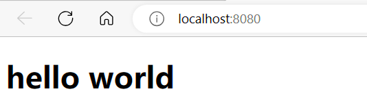


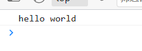


用 interface 定义用户类型：

```vue
<template>
  <div>
    <h1>{{ user }}</h1>
  </div>
</template>

<script setup lang="ts">
interface User
{
  id: number
  name: string,
  age: number,
}

function printUser(user: User): void
{
  console.log("user.id=" + user.id)
  console.log("user.name=" + user.name)
  console.log("user.age=" + user.age)
}

const user: User = {
  id: 10001,
  name: '张三',
  age: 19
}

printUser(user);

</script>

<style scoped>

</style>

```


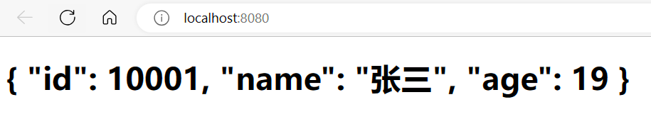


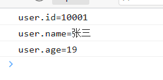


## 类型


|    类型     |                  例                   |             备注             |
| :---------: | :-----------------------------------: | :--------------------------: |
| 字符串类型  |                string                 |                              |
|  数字类型   |                number                 |                              |
|  布尔类型   |                boolean                |                              |
|  数组类型   | number[],string[], boolean[] 依此类推 |                              |
|  任意类型   |                  any                  | 相当于又回到了没有类型的时代 |
|  复杂类型   |           type 与 interface           |                              |
|  函数类型   |              () => void               | 对函数的参数和返回值进行说明 |
| 字面量类型  |             "a"\|"b"\|"c"             |     限制变量或参数的取值     |
| nullish类型 |           null 与 undefined           |                              |
|    泛型     |      `<T>`，`<T extends 父类型>`      |                              |


## 类型标注位置

### 标注变量

```typescript
let message: string = 'hello,world'
```


一般可以省略，因为可以根据后面的字面量推断出前面变量类型

```typescript
let message = 'hello,world'
```


### 标注参数

```typescript
function test(name: string) {
    
}
```


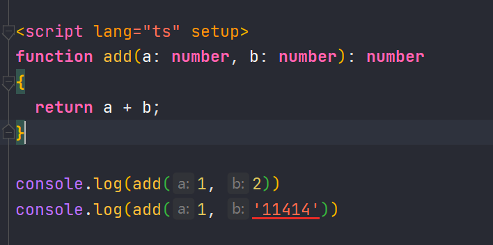


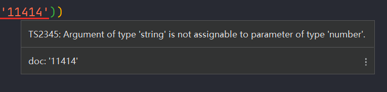


### 标注返回值

```vue
<template>

</template>

<script lang="ts" setup>
function add(a: number, b: number): number
{
  return a + b;
}

console.log(add(1, 2))

</script>

<style scoped>

</style>
```


## 复杂类型

### type

```vue
<template>

</template>

<script lang="ts" setup>

type Student = {
  id: number,
  name: string,
  sex: string,
  age: number
}
const student1: Student = {id: 10001, name: "张三", sex: "男", age: 19};
//报错，缺少age
const student2: Student = {id: 10001, name: "张三", sex: "男"};
//报错，多了address
const student3: Student = {id: 10001, name: "张三", sex: "男", age: 19, address: "中国"};


console.log(student1);
console.log(student2);
console.log(student3);

</script>

<style scoped>

</style>
```


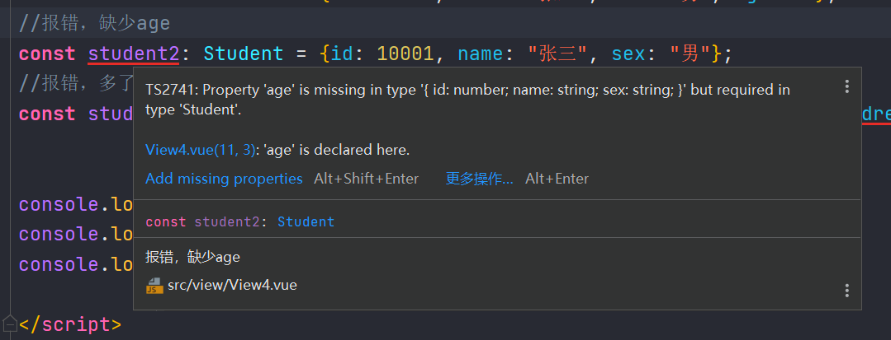


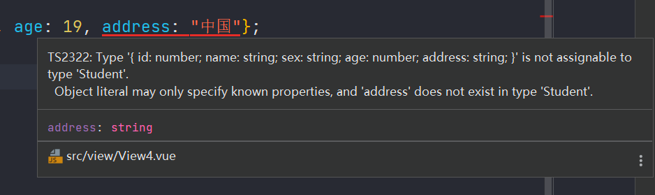


### interface

和type区别在于，少了一个等号

```vue
<template>

</template>

<script lang="ts" setup>

interface Student
{
  id: number,
  name: string,
  sex: string,
  age: number
}

const student1: Student = {id: 10001, name: "张三", sex: "男", age: 19};
//报错，缺少age
const student2: Student = {id: 10001, name: "张三", sex: "男"};
//报错，多了address
const student3: Student = {id: 10001, name: "张三", sex: "男", age: 19, address: "中国"};


console.log(student1);
console.log(student2);
console.log(student3);

</script>

<style scoped>

</style>
```


### 可选属性

如果需要某个属性可选，可以用下面的语法

```vue
<template>

</template>

<script lang="ts" setup>

interface Student
{
  id: number,
  name: string,
  sex: string,
  age?: number
}

const student1: Student = {id: 10001, name: "张三", sex: "男", age: 19};
//并不会报错，缺少age，但是会出现undefined
const student2: Student = {id: 10001, name: "张三", sex: "男"};
console.log(student1);
console.log(student2);
console.log(student2.age)

</script>

<style scoped>

</style>

```


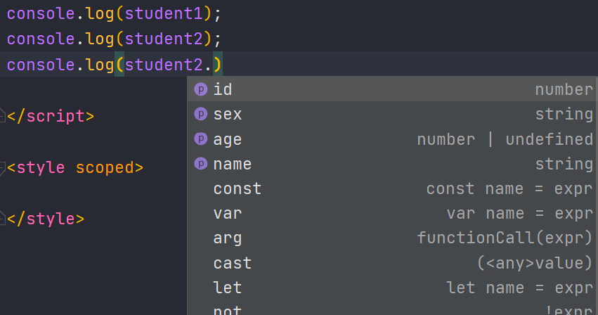


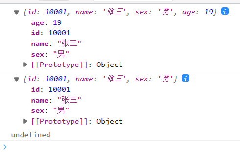


### 鸭子类型

```vue
<template>

</template>

<script lang="ts" setup>

interface Student
{
  id: number,
  name: string,
  sex: string,
  age: number
}

const student1: Student = {id: 10001, name: "张三", sex: "男", age: 19};

//报错，多了address
//const student3: Student = {id: 10001, name: "张三", sex: "男", age: 19, address: "中国"};

const student3 = {id: 10001, name: "张三", sex: "男", age: 19, address: "中国"};
//鸭子类型，student3并没有声明类型为Student，但它与 Student 类型有一样的属性，也可以被当作是 Student 类型

console.log(student1);
console.log(student3);

</script>

<style scoped>

</style>
```

student3并没有声明类型为Student，但它与 Student 类型有一样的属性，也可以被当作是 Student 类型


## 方法类型

interface中包含方法（函数）


```vue
<template>
  <div>
    <h2>{{ user }}</h2>
  </div>
</template>

<script lang="ts" setup>

import {onBeforeMount, onMounted} from "vue";

interface User
{
  id: number,
  name: string,
  age: number,

  getName(): string

  getAgeString(): string

  setName(name: string): void
}

const user: User = {
  id: 10002,
  name: "张三",
  age: 12,
  getName(): string
  {
    return this.name
  },
  getAgeString(): string
  {
    if (this.age < 0 || this.age > 120)
    {
      return "年龄输入错误"
    }
    if (this.age < 18)
    {
      return "未成年";
    }
    if (this.age < 30)
    {
      return "青年"
    }
    if (this.age < 60)
    {
      return "中年"
    }
    return "老年"
  },
  setName(name: string)
  {
    this.name = name;
  }
}

onBeforeMount(()=>
{
  console.log(user.getName())
  console.log(user.getAgeString())
  user.setName("李四")
  console.log(user.getName())
})

</script>

<style scoped>

</style>
```


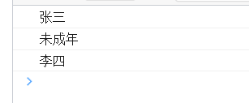


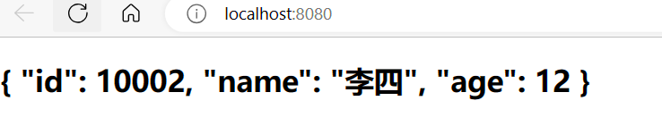


## 字面量类型

```vue
<template>
  <div>

  </div>
</template>

<script lang="ts" setup>

/**
 * 打印字符串到控制台
 * @param str 字符串
 * @param alignment 对齐方式，只能取值left、right和center
 */
function print(str: string, alignment: "left" | "right" | "center")
{
  console.log(str, alignment)
}

print("hello", "left")
print("hello", "right")
print("hello", "center")
//以下报错：Argument of type '"131412351"' is not assignable to parameter of type '"left" | "right" | "center"'
print("hello","131412351")


</script>

<style scoped>

</style>
```


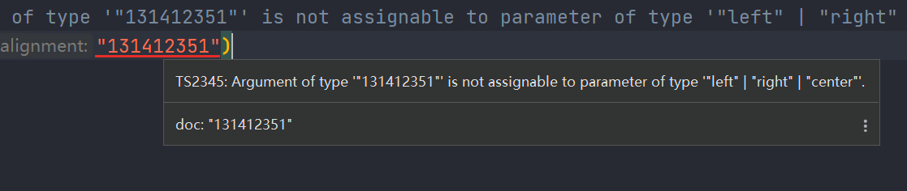


## nullish 类型

在冒号前面加一个问号，表示字段可以为空

```vue
<template>

</template>

<script lang="ts" setup>

interface StudentV1
{
  id: number,
  name: string,
  sex: string,
  age: number
}

interface StudentV2
{
  id: number,
  name: string,
  sex?: string,
  age?: number
}

//Property 'age' is missing in type '{ id: number; name: string; sex: string; }' but required in type 'StudentV1'.
const studentV1: StudentV1 = {id: 10001, name: "张三", sex: "男"};
//Type 'undefined' is not assignable to type 'number'.
const student2V1: StudentV1 = {id: 10001, name: "张三", sex: "男", age: undefined};
//并不会报错
const studentV2: StudentV2 = {id: 10001, name: "张三"};
const student2V2: StudentV2 = {id: 10001, name: "张三",sex:undefined};

console.log(studentV1)
console.log(studentV2)
console.log(student2V1)
console.log(student2V2)

</script>

<style scoped>

</style>
```


```vue
<template>

</template>

<script lang="ts" setup>

function toUpperCase(str?: string | null): string
{
  return str?.toUpperCase() || "无效字符串"
}

function toUpperCase2(str: string): string
{
  return str.toUpperCase()
}

console.log(toUpperCase("hello"))
console.log(toUpperCase(null))
console.log(toUpperCase())

console.log(toUpperCase2("hello2"))
//Argument of type 'null' is not assignable to parameter of type 'string'.
console.log(toUpperCase2(null))
//Expected 1 arguments, but got 0.
console.log(toUpperCase2())

</script>

<style scoped>

</style>
```


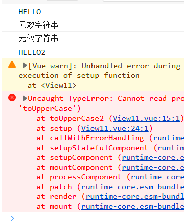


## 泛型

下面的几个类型声明显然有一定的相似性

```typescript
interface RefString {
  value: string
}

interface RefNumber {
  value: number
}

interface RefBoolean {
  value: boolean
}

const r1: RefString = { value: 'hello' }
const r2: RefNumber = { value: 123 }
const r3: RefBoolean = { value: true }
```


可以改进为：

```vue
<template>

</template>

<script lang="ts" setup>

interface Ref<T>
{
  value: T,

  /**
   * 得到value值
   */
  getValue(): T
}

const r1: Ref<string> = {
  value: 'hello', getValue()
  {
    return this.value
  }
}
const r2: Ref<number> = {
  value: 123, getValue()
  {
    return this.value
  }
}
const r3: Ref<boolean> = {
  value: true, getValue()
  {
    return this.value
  }
}

console.log(r1.getValue())
console.log(r2.getValue())
console.log(r3.getValue())

</script>

<style scoped>

</style>
```


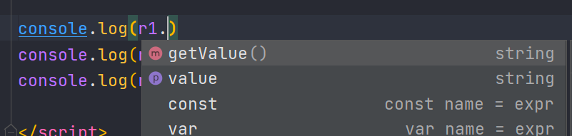


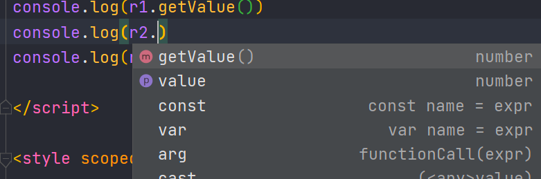


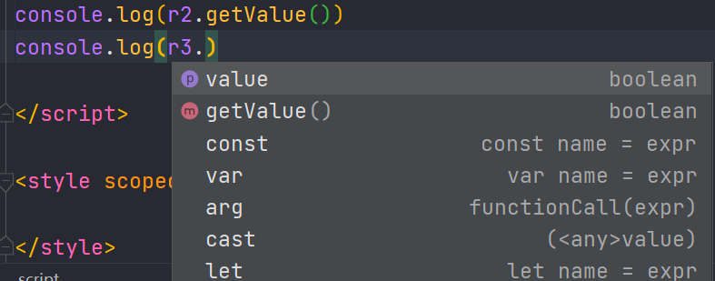


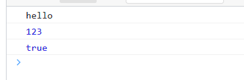


函数定义也支持泛型：

```vue
<template>

</template>

<script lang="ts" setup>

function ref<T>(arg: T): T
{
  return arg;
}

console.log(ref("hello"))
console.log(ref(12345))
console.log(ref(true))
console.log(ref(null))
console.log(ref(undefined))

console.log(typeof ref("hello"))
console.log(typeof ref(12345))
console.log(typeof ref(true))
console.log(typeof ref(null))
console.log(typeof ref(undefined))

</script>

<style scoped>

</style>
```


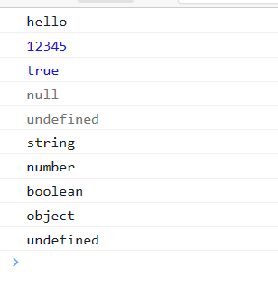


## 类

### 基本语法

```vue
<template>
  <div>
    <h2>{{stu1}}</h2>
    <h2>{{stu2}}</h2>
    <h2>{{stu3}}</h2>
    <h2>{{stu4}}</h2>


  </div>
</template>

<script setup lang="ts">

/**
 * 学生类
 */
class Student
{
  /**
   * id
   */
  id: number;
  /**
   * 姓名
   */
  name: string;
  /**
   * 性别
   */
  sex: string;


  /**
   * 无参构造方法
   */
  constructor();
  /**
   *
   * @param id 学生学号
   */
  constructor(id: number);
  /**
   *
   * @param id 学生学号
   * @param name 姓名
   */
  constructor(id: number, name: string);
  /**
   *
   * @param id 学生学号
   * @param name 姓名
   * @param sex 性别
   */
  constructor(id: number, name: string, sex: string);
  /**
   *
   * @param id 学生学号
   * @param name 姓名
   * @param sex 性别
   */
  constructor(id?: number, name?: string, sex?: string)
  {
    console.log("构造方法被调用了")
    this.id = id ? id : 10001
    this.name = name ? name : "张三"
    this.sex = sex ? sex : "男"
  }
}

const stu1: Student = new Student()
console.log(stu1)

const stu2: Student = new Student(102222)
console.log(stu2)

const stu3: Student = new Student(102223, "李四")
console.log(stu3)

const stu4: Student = new Student(102224, "王五", '女')
console.log(stu4)

console.log(stu4.name)

</script>

<style scoped>

</style>

```


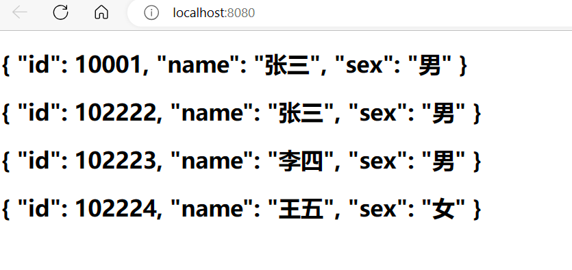


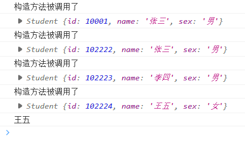


js 中的 class，并不等价于 java 中的 class，它还是基于原型实现的


### 访问修饰符

有三类：

* public
* protected
* private


默认为 public，可以自由的访问程序里定义的成员

当成员被标记成 private时，它就不能在声明它的类的外部访问

protected修饰符与 private修饰符的行为很相似，但有一点不同， protected成员在派生类中仍然可以访问


可以参考java


```vue
<template>
  <div>
    <h2>{{ stu4 }}</h2>
  </div>
</template>

<script setup lang="ts">

/**
 * 学生类
 */
class Student
{
  /**
   * id
   */
  private id: number;
  /**
   * 姓名
   */
  protected name: string;
  /**
   * 性别
   */
  public sex: string;


  /**
   * 无参构造方法
   */
  constructor();
  /**
   *
   * @param id 学生学号
   */
  constructor(id: number);
  /**
   *
   * @param id 学生学号
   * @param name 姓名
   */
  constructor(id: number, name: string);
  /**
   *
   * @param id 学生学号
   * @param name 姓名
   * @param sex 性别
   */
  constructor(id: number, name: string, sex: string);
  /**
   *
   * @param id 学生学号
   * @param name 姓名
   * @param sex 性别
   */
  constructor(id?: number, name?: string, sex?: string)
  {
    console.log("构造方法被调用了")
    this.id = id ? id : 10001
    this.name = name ? name : "张三"
    this.sex = sex ? sex : "男"
  }
}

const stu4: Student = new Student(102224, "王五", '女')

console.log(stu4)

//Property 'id' is private and only accessible within class 'Student'.
console.log(stu4.id)
//Property 'name' is protected and only accessible within class 'Student' and its subclasses.
console.log(stu4.name)
console.log(stu4.sex)

</script>

<style scoped>

</style>
```


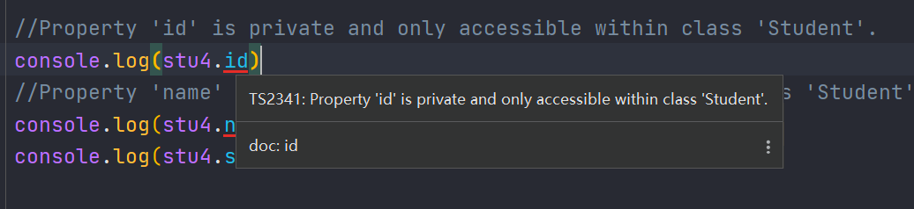


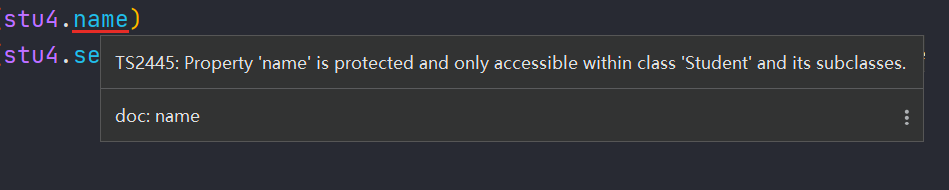


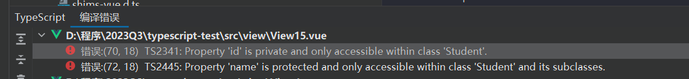


### 只读属性

readonly 是 typescript 特有的，表示该属性只读

```vue
<template>

</template>

<script lang="ts" setup>

class User
{
  /**
   * 用户编号，只读
   */
  readonly id: number;
  /**
   * 用户名称
   */
  name: string | undefined;

  constructor()
  {
    this.id = 10001;
  }
}

const user: User = new User();
//Cannot assign to 'id' because it is a read-only property.
user.id = 10002;
user.name = "张三";

console.log(user.id)
console.log(user.name)

</script>

<style scoped>

</style>
```


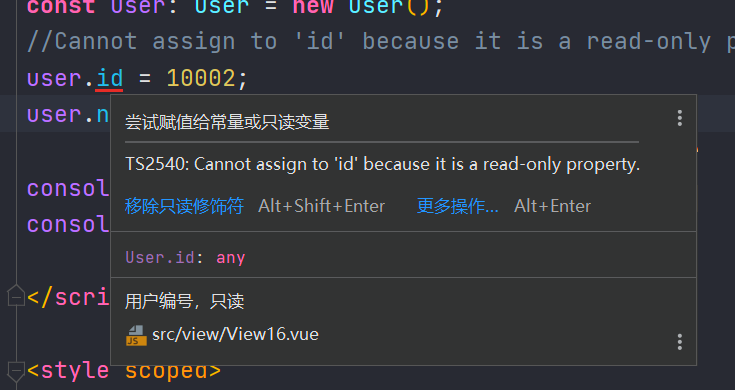


### 方法

```vue
<template>

</template>

<script lang="ts" setup>

class User
{
  /**
   * 用户编号，只读
   */
  readonly id: number;
  /**
   * 用户名称
   */
  name: string | undefined;

  constructor()
  {
    this.id = 10001;
  }

  /**
   * 转字符串
   */
  toString()
  {
    return "用户编号：" + this.id + ",用户名称：" + this.name
  }

  /**
   * 转json
   */
  toJson()
  {
    return JSON.stringify(this);
  }

}

const user: User = new User();
user.name = "张三";

console.log(user.id)
console.log(user.name)

console.log(user.toString())
console.log(user.toJson())

</script>

<style scoped>

</style>
```


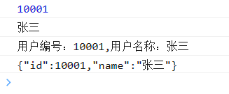


### get和set

```vue
<template>

</template>

<script setup lang="ts">

class Student
{
  private _id: number;
  private _name: string;

  get name(): string
  {
    console.log("调用name 的get方法")
    return this._name;
  }

  set name(value: string)
  {
    console.log("调用name 的set方法")
    this._name = value;
  }

  get id(): number
  {
    console.log("调用id 的get方法")

    return this._id;
  }

  set id(value: number)
  {
    console.log("调用id 的set方法")
    this._id = value;
  }

  constructor()
  {
    this._id = 10001
    this._name = "";
  }
}

const student: Student = new Student();

//Property '_id' is private and only accessible within class 'Student'.
//console.log(student._id)
//Property '_name' is private and only accessible within class 'Student'.
//console.log(student._name)

student.id = 99999;
student.name = "李四"

console.log(student.id)
console.log(student.name)

</script>

<style scoped>

</style>
```


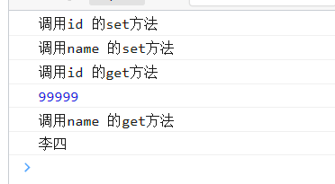


### 类与接口

```vue
<template>
  <div>
    <h2>
      {{userService.getLoginUser()}}
    </h2>
  </div>
</template>

<script setup lang="ts">

/**
 * 实体类
 */
interface User
{
  id: number;
  name: string;
}

/**
 * 接口
 */
interface UserService
{
  /**
   * 登录
   */
  login(user: User): void

  /**
   * 得到当前登录人的信息
   */
  getLoginUser(): User
}

/**
 * 实现类
 */
class UserServiceImpl implements UserService
{
  getLoginUser(): User
  {
    return {id: 100001, name: '张三'};
  }

  login(user: User): void
  {
    console.log(user)
  }
}

const userService: UserService = new UserServiceImpl();

const loginUser = userService.getLoginUser();
console.log(loginUser)
userService.login(loginUser);

console.log()

</script>

<style scoped>

</style>

```


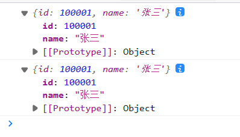

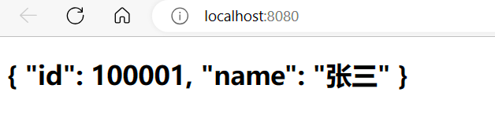


### 继承与接口

```vue
<template>
  <div>
  </div>
</template>

<script setup lang="ts">

interface Flyable
{
  fly(): void
}

class Animal
{
  name: string;

  constructor(name: string)
  {
    this.name = name
  }
}

class Bird extends Animal implements Flyable
{
  fly()
  {
    console.log(`${this.name}在飞翔`)
  }
}

const b: Flyable & Animal = new Bird("小黄鸟")
b.fly()

</script>

<style scoped>

</style>
```


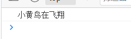


### 方法重写

```vue
<template>
  <div>
  </div>
</template>

<script setup lang="ts">

class C1
{
  study()
  {
    console.log("C1 study")
  }
}

class C2 extends C1
{
  study()
  {
    super.study();
    console.log("C2 study")
  }
}

let c: C1 = new C2()
c.study();

c = new C1()
c.study();


</script>

<style scoped>

</style>
```


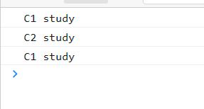


# Vite

## 概述

vite是下一代前端开发与构建工具。Vite意在提供开箱即用的配置，同时它的插件API和JavaScript API 带来了高度的可扩展性，并有完整的类型支持。


## 特点

* 极速的服务启动：使用原生 ESM 文件，无需打包
* 轻量快速的热重载：无论应用程序大小如何，都始终极快的模块热重载（HMR）
* 丰富的功能：对 TypeScript、JSX、CSS 等支持开箱即用
* 优化的构建：可选 “多页应用” 或 “库” 模式的预配置 Rollup 构建
* 通用的插件：在开发和构建之间共享 Rollup-superset 插件接口
* 完全类型化的API：灵活的 API 和完整 TypeScript 类型


## 官网和文档

* 官网：https://vitejs.cn/
* Vite3文档：https://cn.vitejs.dev/guide/
* Vite2文档：https://vitejs.cn/guide/


## Vite和Webpack区别

Vite 优势：

* **vite 开发服务器启动速度比 webpack 快**。webpack 会先打包，然后启动开发服务器，请求服务器时直接给予打包结果，vite 在启动开发服务器时不需要打包，也就意味着不需要分析模块的依赖、不需要编译，因此启动速度非常快
* **vite 热更新比 webpack 快**。当改动了一个模块后，vite仅需让浏览器重新请求该模块即可
* **vite 使用esbuild(Go 编写) 预构建依赖**，比 webpack 的 nodejs，快


Vite 劣势：

* 生态不及webpack，加载器、插件不够丰富
* 打包到生产环境时，vite使用传统的 rollup进行打包
* 项目的开发浏览器要支持 ES Module，而且不能识别 CommonJS 语法


## 创建项目

vite3：

```sh
npm init vite
```


vite2：

```sh
npm init vite@2
```


* Vite2 需要 Node.js 版本 >= 12.0.0

* Vite3 需要 Node.js 版本 14.18+，16+


输入项目名称：

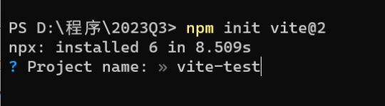


选择vue：

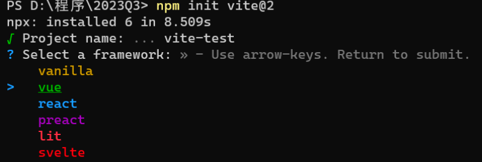


选择语言，js或者ts

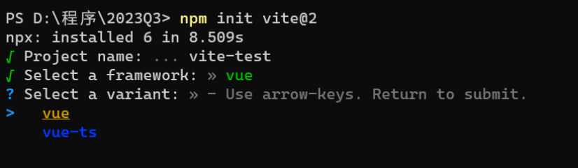


创建完成：

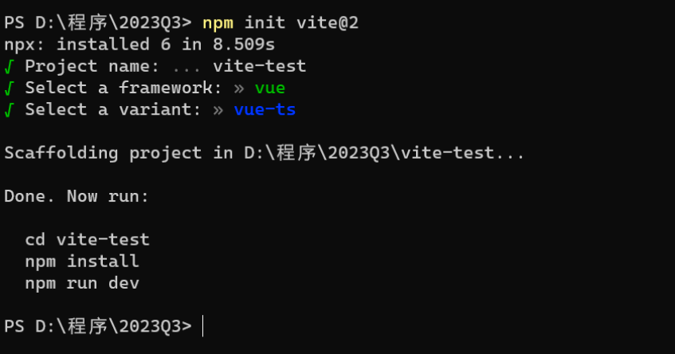


安装：

```sh
PS D:\程序\2023Q3> npm init vite@2
npx: installed 6 in 8.509s
√ Project name: ... vite-test
√ Select a framework: » vue
√ Select a variant: » vue-ts

Scaffolding project in D:\程序\2023Q3\vite-test...

Done. Now run:

  cd vite-test
  npm install
  npm run dev

PS D:\程序\2023Q3> cd .\vite-test\
PS D:\程序\2023Q3\vite-test> ls


    目录: D:\程序\2023Q3\vite-test


Mode                 LastWriteTime         Length Name
----                 -------------         ------ ----
d-----         2023/6/30     20:46                .vscode
d-----         2023/6/30     20:46                public
d-----         2023/6/30     20:46                src
-a----        1985/10/26     16:15            253 .gitignore
-a----        1985/10/26     16:15            337 index.html
-a----         2023/6/30     20:46            368 package.json
-a----        1985/10/26     16:15           1377 README.md
-a----        1985/10/26     16:15            491 tsconfig.json
-a----        1985/10/26     16:15            142 tsconfig.node.json
-a----        1985/10/26     16:15            156 vite.config.ts


PS D:\程序\2023Q3\vite-test> npm install

> esbuild@0.14.54 postinstall D:\程序\2023Q3\vite-test\node_modules\esbuild
> node install.js

npm notice created a lockfile as package-lock.json. You should commit this file.
npm WARN optional SKIPPING OPTIONAL DEPENDENCY: fsevents@~2.3.2 (node_modules\vite\node_modules\fsevents):
npm WARN notsup SKIPPING OPTIONAL DEPENDENCY: Unsupported platform for fsevents@2.3.2: wanted {"os":"darwin","arch":"any"} (current: {"os":"win32","arch":"x64"})
npm WARN optional SKIPPING OPTIONAL DEPENDENCY: esbuild-android-arm64@0.14.54 (node_modules\esbuild\node_modules\esbuild-android-arm64):
npm WARN notsup SKIPPING OPTIONAL DEPENDENCY: Unsupported platform for esbuild-android-arm64@0.14.54: wanted {"os":"android","arch":"arm64"} (current: {"os":"win32","arch":"x64"})
npm WARN optional SKIPPING OPTIONAL DEPENDENCY: esbuild-darwin-64@0.14.54 (node_modules\esbuild\node_modules\esbuild-darwin-64):
npm WARN notsup SKIPPING OPTIONAL DEPENDENCY: Unsupported platform for esbuild-darwin-64@0.14.54: wanted {"os":"darwin","arch":"x64"} (current: {"os":"win32","arch":"x64"})
npm WARN optional SKIPPING OPTIONAL DEPENDENCY: esbuild-freebsd-64@0.14.54 (node_modules\esbuild\node_modules\esbuild-freebsd-64):
npm WARN notsup SKIPPING OPTIONAL DEPENDENCY: Unsupported platform for esbuild-freebsd-64@0.14.54: wanted {"os":"freebsd","arch":"x64"} (current: {"os":"win32","arch":"x64"})
npm WARN optional SKIPPING OPTIONAL DEPENDENCY: esbuild-darwin-arm64@0.14.54 (node_modules\esbuild\node_modules\esbuild-darwin-arm64):
npm WARN notsup SKIPPING OPTIONAL DEPENDENCY: Unsupported platform for esbuild-darwin-arm64@0.14.54: wanted {"os":"darwin","arch":"arm64"} (current: {"os":"win32","arch":"x64"})
npm WARN optional SKIPPING OPTIONAL DEPENDENCY: esbuild-linux-32@0.14.54 (node_modules\esbuild\node_modules\esbuild-linux-32):
npm WARN notsup SKIPPING OPTIONAL DEPENDENCY: Unsupported platform for esbuild-linux-32@0.14.54: wanted {"os":"linux","arch":"ia32"} (current: {"os":"win32","arch":"x64"})
npm WARN optional SKIPPING OPTIONAL DEPENDENCY: esbuild-linux-arm@0.14.54 (node_modules\esbuild\node_modules\esbuild-linux-arm):
npm WARN notsup SKIPPING OPTIONAL DEPENDENCY: Unsupported platform for esbuild-linux-arm@0.14.54: wanted {"os":"linux","arch":"arm"} (current: {"os":"win32","arch":"x64"})
npm WARN optional SKIPPING OPTIONAL DEPENDENCY: esbuild-freebsd-arm64@0.14.54 (node_modules\esbuild\node_modules\esbuild-freebsd-arm64):
npm WARN notsup SKIPPING OPTIONAL DEPENDENCY: Unsupported platform for esbuild-freebsd-arm64@0.14.54: wanted {"os":"freebsd","arch":"arm64"} (current: {"os":"win32","arch":"x64"})
npm WARN optional SKIPPING OPTIONAL DEPENDENCY: esbuild-linux-64@0.14.54 (node_modules\esbuild\node_modules\esbuild-linux-64):
npm WARN notsup SKIPPING OPTIONAL DEPENDENCY: Unsupported platform for esbuild-linux-64@0.14.54: wanted {"os":"linux","arch":"x64"} (current: {"os":"win32","arch":"x64"})
npm WARN optional SKIPPING OPTIONAL DEPENDENCY: esbuild-android-64@0.14.54 (node_modules\esbuild\node_modules\esbuild-android-64):
npm WARN notsup SKIPPING OPTIONAL DEPENDENCY: Unsupported platform for esbuild-android-64@0.14.54: wanted {"os":"android","arch":"x64"} (current: {"os":"win32","arch":"x64"})
npm WARN optional SKIPPING OPTIONAL DEPENDENCY: @esbuild/linux-loong64@0.14.54 (node_modules\esbuild\node_modules\@esbuild\linux-loong64):
npm WARN notsup SKIPPING OPTIONAL DEPENDENCY: Unsupported platform for @esbuild/linux-loong64@0.14.54: wanted {"os":"linux","arch":"loong64"} (current: {"os":"win32","arch":"x64"})
npm WARN optional SKIPPING OPTIONAL DEPENDENCY: esbuild-linux-mips64le@0.14.54 (node_modules\esbuild\node_modules\esbuild-linux-mips64le):
npm WARN notsup SKIPPING OPTIONAL DEPENDENCY: Unsupported platform for esbuild-linux-mips64le@0.14.54: wanted {"os":"linux","arch":"mips64el"} (current: {"os":"win32","arch":"x64"})
npm WARN optional SKIPPING OPTIONAL DEPENDENCY: esbuild-linux-arm64@0.14.54 (node_modules\esbuild\node_modules\esbuild-linux-arm64):
npm WARN notsup SKIPPING OPTIONAL DEPENDENCY: Unsupported platform for esbuild-linux-arm64@0.14.54: wanted {"os":"linux","arch":"arm64"} (current: {"os":"win32","arch":"x64"})
npm WARN optional SKIPPING OPTIONAL DEPENDENCY: esbuild-linux-ppc64le@0.14.54 (node_modules\esbuild\node_modules\esbuild-linux-ppc64le):
npm WARN notsup SKIPPING OPTIONAL DEPENDENCY: Unsupported platform for esbuild-linux-ppc64le@0.14.54: wanted {"os":"linux","arch":"ppc64"} (current: {"os":"win32","arch":"x64"})
npm WARN optional SKIPPING OPTIONAL DEPENDENCY: esbuild-linux-riscv64@0.14.54 (node_modules\esbuild\node_modules\esbuild-linux-riscv64):
npm WARN notsup SKIPPING OPTIONAL DEPENDENCY: Unsupported platform for esbuild-linux-riscv64@0.14.54: wanted {"os":"linux","arch":"riscv64"} (current: {"os":"win32","arch":"x64"})
npm WARN optional SKIPPING OPTIONAL DEPENDENCY: esbuild-linux-s390x@0.14.54 (node_modules\esbuild\node_modules\esbuild-linux-s390x):
npm WARN notsup SKIPPING OPTIONAL DEPENDENCY: Unsupported platform for esbuild-linux-s390x@0.14.54: wanted {"os":"linux","arch":"s390x"} (current: {"os":"win32","arch":"x64"})
npm WARN optional SKIPPING OPTIONAL DEPENDENCY: esbuild-netbsd-64@0.14.54 (node_modules\esbuild\node_modules\esbuild-netbsd-64):
npm WARN notsup SKIPPING OPTIONAL DEPENDENCY: Unsupported platform for esbuild-netbsd-64@0.14.54: wanted {"os":"netbsd","arch":"x64"} (current: {"os":"win32","arch":"x64"})
npm WARN optional SKIPPING OPTIONAL DEPENDENCY: esbuild-openbsd-64@0.14.54 (node_modules\esbuild\node_modules\esbuild-openbsd-64):
npm WARN notsup SKIPPING OPTIONAL DEPENDENCY: Unsupported platform for esbuild-openbsd-64@0.14.54: wanted {"os":"openbsd","arch":"x64"} (current: {"os":"win32","arch":"x64"})
npm WARN optional SKIPPING OPTIONAL DEPENDENCY: esbuild-sunos-64@0.14.54 (node_modules\esbuild\node_modules\esbuild-sunos-64):
npm WARN notsup SKIPPING OPTIONAL DEPENDENCY: Unsupported platform for esbuild-sunos-64@0.14.54: wanted {"os":"sunos","arch":"x64"} (current: {"os":"win32","arch":"x64"})
npm WARN optional SKIPPING OPTIONAL DEPENDENCY: esbuild-windows-32@0.14.54 (node_modules\esbuild\node_modules\esbuild-windows-32):
npm WARN notsup SKIPPING OPTIONAL DEPENDENCY: Unsupported platform for esbuild-windows-32@0.14.54: wanted {"os":"win32","arch":"ia32"} (current: {"os":"win32","arch":"x64"})
npm WARN optional SKIPPING OPTIONAL DEPENDENCY: esbuild-windows-arm64@0.14.54 (node_modules\esbuild\node_modules\esbuild-windows-arm64):
npm WARN notsup SKIPPING OPTIONAL DEPENDENCY: Unsupported platform for esbuild-windows-arm64@0.14.54: wanted {"os":"win32","arch":"arm64"} (current: {"os":"win32","arch":"x64"})

added 37 packages from 52 contributors and audited 58 packages in 49.573s

3 packages are looking for funding
  run `npm fund` for details

found 0 vulnerabilities

PS D:\程序\2023Q3\vite-test>
```


运行：

```sh
PS D:\程序\2023Q3\vite-test> npm run dev

> vite-test@0.0.0 dev D:\程序\2023Q3\vite-test
> vite

Port 3000 is in use, trying another one...

  vite v2.9.16 dev server running at:

  > Local: http://localhost:3001/
  > Network: use `--host` to expose

  ready in 173ms.


```


最后项目结构如下：

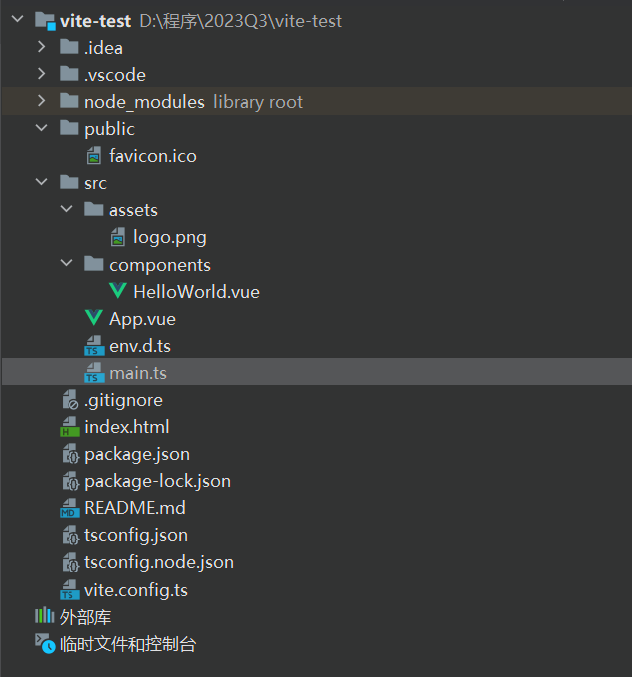


## 命令行界面

在安装了 Vite 的项目中，可以在 npm scripts 中使用 vite 可执行文件

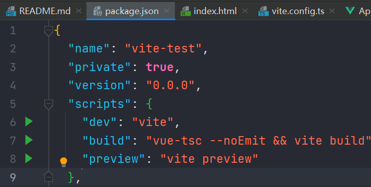


可以指定额外的命令行选项，如 `--port` 或 `--https`。运行 `npx vite --help` 获得完整的命令行选项列表。


```sh
PS D:\程序\2023Q3\vite-test> npx vite --help
vite/2.9.16

Usage:
  $ vite [root]

Commands:
  [root]           start dev server
  build [root]     build for production
  optimize [root]  pre-bundle dependencies
  preview [root]   locally preview production build

For more info, run any command with the `--help` flag:
  $ vite --help
  $ vite build --help
  $ vite optimize --help
  $ vite preview --help

Options:
  --host [host]           [string] specify hostname
  --port <port>           [number] specify port
  --https                 [boolean] use TLS + HTTP/2
  --open [path]           [boolean | string] open browser on startup
  --cors                  [boolean] enable CORS
  --strictPort            [boolean] exit if specified port is already in use
  --force                 [boolean] force the optimizer to ignore the cache and re-bundle
  -c, --config <file>     [string] use specified config file
  --base <path>           [string] public base path (default: /)
  -l, --logLevel <level>  [string] info | warn | error | silent
  --clearScreen           [boolean] allow/disable clear screen when logging
  -d, --debug [feat]      [string | boolean] show debug logs
  -f, --filter <filter>   [string] filter debug logs
  -m, --mode <mode>       [string] set env mode
  -h, --help              Display this message
  -v, --version           Display version number
PS D:\程序\2023Q3\vite-test>
```


## 修改端口

打开项目根目录下 vite.config.ts

```typescript
import {defineConfig} from 'vite'
import vue from '@vitejs/plugin-vue'

// https://vitejs.dev/config/
export default defineConfig({
    plugins: [vue()],
    server:
        {
            port: 8878
        }
})
```


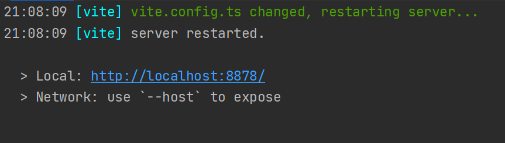


## 配置代理

为了避免前后端服务器联调时， fetch、xhr 请求产生跨域问题，需要配置代理，同样是修改项目根目录下 vite.config.ts

```typescript
import {defineConfig} from 'vite'
import vue from '@vitejs/plugin-vue'

// https://vitejs.dev/config/
export default defineConfig({
    plugins: [vue()],
    server:
        {
            port: 8878,
            proxy:
                {
                    '/api': {
                        target: 'http://localhost:9090',
                        changeOrigin: true
                    }
                }
        },
})

```


```vue
<template>

</template>

<script lang="ts" setup>

import axios from "axios";

axios.get('/api/test').then((res) =>
{
  console.log(res.data);
}).catch((error) =>
{
  console.log(error);
});

</script>

<style scoped>

</style>
```


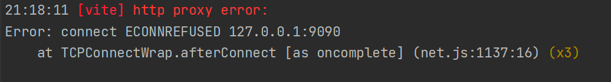


# VueUse

## 概述

VueUse不是Vue.use，它是为Vue 2和3服务的一套Vue Composition API的常用工具集，是目前世界上Star最高的同类型库之一。它的初衷就是将一切原本并不支持响应式的JS API变得支持响应式，省去程序员自己写相关代码。

VueUse是一款基于组合式API的函数集合。


## 特点

* 功能丰富
* 无缝迁移
* 强类型，用TypeScript编写，带有完整的TS文档
* 灵活，用refs作为参数，完全可定制
* 不需要打包工具，可通过CDN引入，无需任何打包工具
* 服务端渲染(SSR) 友好，完全可用于服务器端渲染(rendering/generation)
* 可交互样例
* 支持插件


## 官网和文档

官网：https://www.vueusejs.com/

文档：https://www.vueusejs.com/guide/


## 安装

```sh
npm i @vueuse/core
```


也可以使用cdn

```html
<script src="https://unpkg.com/@vueuse/shared"></script>
<script src="https://unpkg.com/@vueuse/core"></script>
```


暴露一个全局变量 window.VueUse


## 使用方法

在@vueuse/core中导入你需要的函数


```vue
<template>
  <h1>鼠标位置：{{ x }},{{ y }}</h1>
</template>

<script lang="ts" setup>
import {useMouse} from "@vueuse/core";

const {x, y} = useMouse();

</script>

<style scoped>

</style>
```


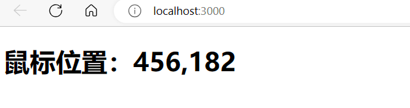


## 使用准则

* 从 `"vue-demi"` 导入所有的vue接口
* 尽可能使用 `ref` 代替 `reactive`
* 尽可能用对象作为参数，以便将来扩展更灵活
* 包装大量数据时，使用 `shallowRef` 而不是 `ref`
* 在使用多窗口、测试模拟和 SSR 时，使用 `configurableWindow` （等）以更灵活的使用 `window` 等全局变量
* 当涉及到尚未被浏览器广泛实现的Web APIs时，会输出 `isSupported` 标志
* 当在内部使用' watch '或' watchEffect '时，也尽可能使' immediate '和' flush '作为可配置项
* 避免使用控制台输出
* 使用 tryOnUnmounted 优雅地清除副作用
* 当函数异步时，返回一个 PromiseLike


## State

### createSharedComposable

让一个钩子函数可用于多个Vue实例中

```vue
import { createSharedComposable, useMouse } from '@vueuse/core'

const useSharedMouse = createSharedComposable(useMouse)

// CompA.vue
const { x, y } = useSharedMouse()

// CompB.vue - will reuse the previous state and no new event listeners will be registered
const { x, y } = useSharedMouse()
```


### useDebouncedRefHistory

useRefHistory 的简写，带有防抖过滤器。

当计数器的值开始改变时，该函数会在500ms后对计数器保存快照。


```vue
<template>

  <h1>{{ count }}</h1>
  <button @click="count++">+1</button>
  <br>
  <button @click="count--">-1</button>
  <br>
  <button @click="undo">undo</button>
  <br>
  <button @click="redo">redo</button>

</template>

<script setup lang="ts">

import {ref} from "vue";
import {useDebouncedRefHistory} from "@vueuse/core";

const count = ref(100);
const {history, undo, redo} = useDebouncedRefHistory(count, {deep: true, debounce: 500});

</script>

<style scoped>

</style>
```


### useLastChanged

记录最后一次更改的时间戳


```vue
<template>

  <h1>{{ count }}</h1>
  <button @click="count++">+1</button>
  <br>
  <button @click="count--">-1</button>
  <br>
  <h1>最后一次更改时间：{{ new Date(lastChanged).toLocaleString() }}</h1>


</template>

<script setup lang="ts">

import {ref} from "vue";
import {useLastChanged} from "@vueuse/core";

const count = ref(100);

const lastChanged = useLastChanged(count)


</script>

<style scoped>

</style>
```


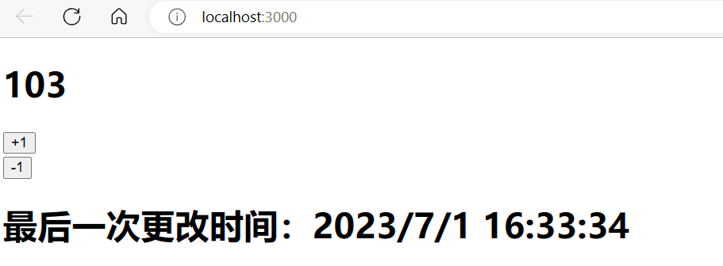


### useStorage

响应式 LocalStorage/SessionStorage

```vue
<template>

  <h1>{{ count }}</h1>
  <button @click="count++">+1</button>
  <br>
  <button @click="count--">-1</button>


</template>

<script setup lang="ts">

import {onMounted, ref} from "vue";
import {useLastChanged, useStorage} from "@vueuse/core";

const count = ref(100);

const storage = useStorage("count", count);
//const storage = useStorage("count", count, sessionStorage);
onMounted(() =>
{
  setInterval(() =>
  {
    console.log(localStorage.getItem('count'));
  }, 1000)
})

</script>

<style scoped>

</style>
```


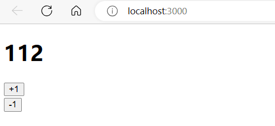


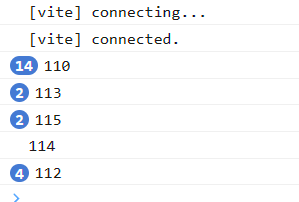


## Elements

### useDraggable

使元素可拖拽

```vue
<template>
  <div>
    <div ref="el" :style="style" style="position: fixed">
      Drag me! I am at {{ x }}, {{ y }}
    </div>
  </div>
</template>

<script lang="ts" setup>

import {ref} from "vue";
import {useDraggable} from "@vueuse/core";

const el = ref<HTMLElement | null>(null)
const {x, y, style} = useDraggable(el, {
  initialValue: {x: 40, y: 40},
})


</script>

<style scoped>

div {
  background: #42b983;
}
</style>
```


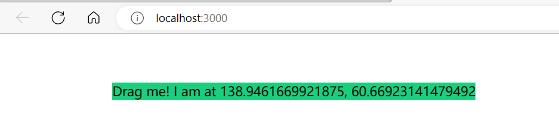


### useDropZone

创建一个可以放置文件的区域。

```vue
<template>
  <div ref="dropZoneRef">
    文件放置位置
  </div>
</template>

<script setup lang="ts">
import {ref} from "vue";
import {useDropZone} from "@vueuse/core";

const dropZoneRef = ref<HTMLDivElement>()

function onDrop(files: File[] | null)
{
  if (files != null)
  {
    for (let file of files)
    {
      console.log(file);
    }
  }
}

const {isOverDropZone} = useDropZone(dropZoneRef, onDrop)

</script>

<style scoped>
div {
  background: dodgerblue;
  width: 600px;
  height: 600px;
  text-align: center;
}
</style>
```


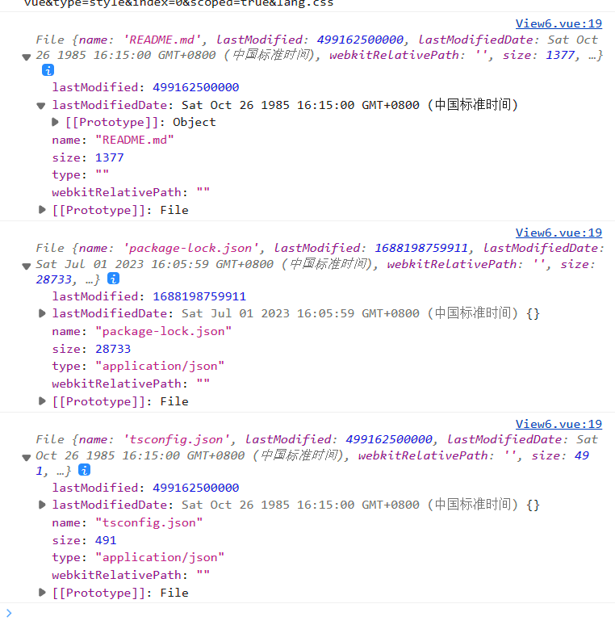


### useElementSize


# useRequest


# pinia


# Antdv


# 测试

