<h1 style="color:skyblue;text-align:center">Vue学习笔记</h1>


# 环境准备

## 安装脚手架

前提需要nodejs，vue/cli requires Node ^12.0.0 || >= 14.0.0


命令如下：

```sh
npm install -g @vue/cli
```

* -g 参数表示全局安装，这样在任意目录都可以使用 vue 脚本创建项目


```sh
PS C:\Users\mao> npm install -g @vue/cli
npm WARN deprecated apollo-server-express@3.12.0: The `apollo-server-express` package is part of Apollo Server v2 and v3, which are now deprecated (end-of-life October 22nd 2023). This package's functionality is now found in the `@apollo/server` package. See https://www.apollographql.com/docs/apollo-server/previous-versions/ for more details.
npm WARN deprecated subscriptions-transport-ws@0.11.0: The `subscriptions-transport-ws` package is no longer maintained. We recommend you use `graphql-ws` instead. For help migrating Apollo software to `graphql-ws`, see https://www.apollographql.com/docs/apollo-server/data/subscriptions/#switching-from-subscriptions-transport-ws    For general help using `graphql-ws`, see https://github.com/enisdenjo/graphql-ws/blob/master/README.md
npm WARN deprecated apollo-server-types@3.8.0: The `apollo-server-types` package is part of Apollo Server v2 and v3, which are now deprecated (end-of-life October 22nd 2023). This package's functionality is now found in the `@apollo/server` package. See https://www.apollographql.com/docs/apollo-server/previous-versions/ for more details.
npm WARN deprecated apollo-server-core@3.12.0: The `apollo-server-core` package is part of Apollo Server v2 and v3, which are now deprecated (end-of-life October 22nd 2023). This package's functionality is now found in the `@apollo/server` package. See https://www.apollographql.com/docs/apollo-server/previous-versions/ for more details.
npm WARN deprecated apollo-server-env@4.2.1: The `apollo-server-env` package is part of Apollo Server v2 and v3, which are now deprecated (end-of-life October 22nd 2023). This package's functionality is now found in the `@apollo/utils.fetcher` package. See https://www.apollographql.com/docs/apollo-server/previous-versions/ for more details.
npm WARN deprecated apollo-reporting-protobuf@3.4.0: The `apollo-reporting-protobuf` package is part of Apollo Server v2 and v3, which are now deprecated (end-of-life October 22nd 2023). This package's functionality is now found in the `@apollo/usage-reporting-protobuf` package. See https://www.apollographql.com/docs/apollo-server/previous-versions/ for more details.
npm WARN deprecated apollo-server-errors@3.3.1: The `apollo-server-errors` package is part of Apollo Server v2 and v3, which are now deprecated (end-of-life October 22nd 2023). This package's functionality is now found in the `@apollo/server` package. See https://www.apollographql.com/docs/apollo-server/previous-versions/ for more details.
npm WARN deprecated apollo-datasource@3.3.2: The `apollo-datasource` package is part of Apollo Server v2 and v3, which are now deprecated (end-of-life October 22nd 2023). See https://www.apollographql.com/docs/apollo-server/previous-versions/ for more details.
npm WARN deprecated apollo-server-plugin-base@3.7.2: The `apollo-server-plugin-base` package is part of Apollo Server v2 and v3, which are now deprecated (end-of-life October 22nd 2023). This package's functionality is now found in the `@apollo/server` package. See https://www.apollographql.com/docs/apollo-server/previous-versions/ for more details.
npm WARN deprecated source-map-resolve@0.5.3: See https://github.com/lydell/source-map-resolve#deprecated
npm WARN deprecated resolve-url@0.2.1: https://github.com/lydell/resolve-url#deprecated
npm WARN deprecated urix@0.1.0: Please see https://github.com/lydell/urix#deprecated
npm WARN deprecated source-map-url@0.4.1: See https://github.com/lydell/source-map-url#deprecated
C:\Users\mao\AppData\Roaming\npm\vue -> C:\Users\mao\AppData\Roaming\npm\node_modules\@vue\cli\bin\vue.js

> @apollo/protobufjs@1.2.7 postinstall C:\Users\mao\AppData\Roaming\npm\node_modules\@vue\cli\node_modules\@apollo\protobufjs
> node scripts/postinstall


> @apollo/protobufjs@1.2.6 postinstall C:\Users\mao\AppData\Roaming\npm\node_modules\@vue\cli\node_modules\apollo-reporting-protobuf\node_modules\@apollo\protobufjs
> node scripts/postinstall

npm WARN node-fetch@2.6.11 requires a peer of encoding@^0.1.0 but none is installed. You must install peer dependencies yourself.
npm WARN ws@7.5.9 requires a peer of bufferutil@^4.0.1 but none is installed. You must install peer dependencies yourself.
npm WARN ws@7.5.9 requires a peer of utf-8-validate@^5.0.2 but none is installed. You must install peer dependencies yourself.

+ @vue/cli@5.0.8
added 853 packages from 491 contributors in 535.031s
PS C:\Users\mao>
```


## 创建项目

可以使用命令`vue ui`来手动创建项目，也可以使用idea创建项目


### vue ui

使用图形向导来创建 vue 项目


```sh
PS C:\Users\mao> vue ui
🚀  Starting GUI...
🌠  Ready on http://localhost:8000
```


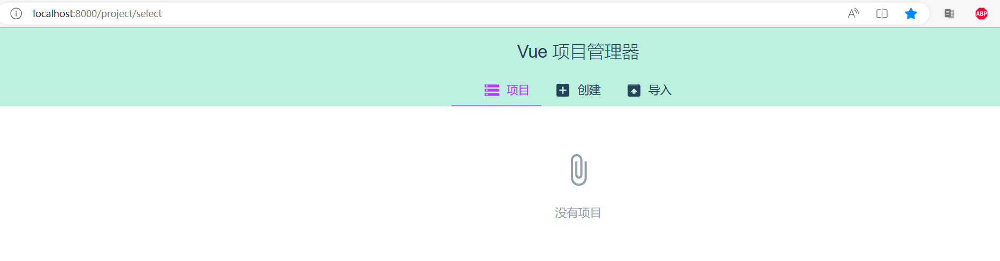


点击新建项目

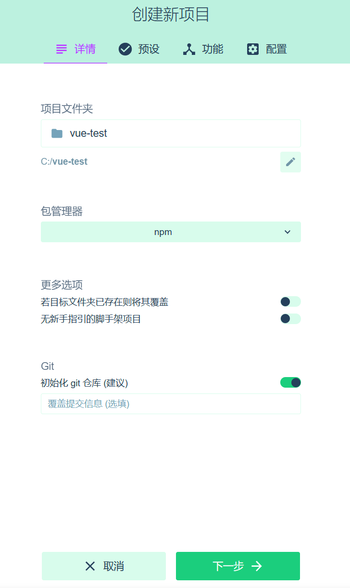


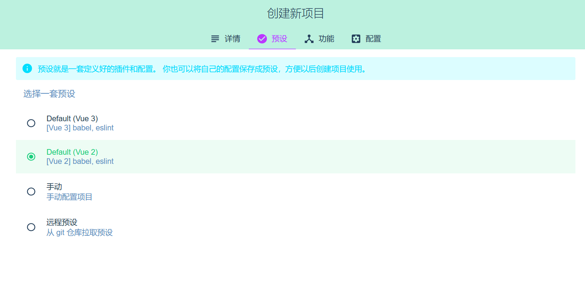


等待创建成功


### idea创建项目

打开idea，点击新建项目，选择js，再选择vue.js

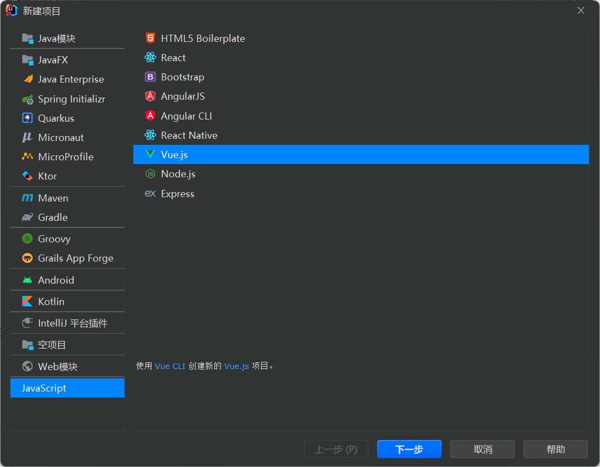


输入项目名称

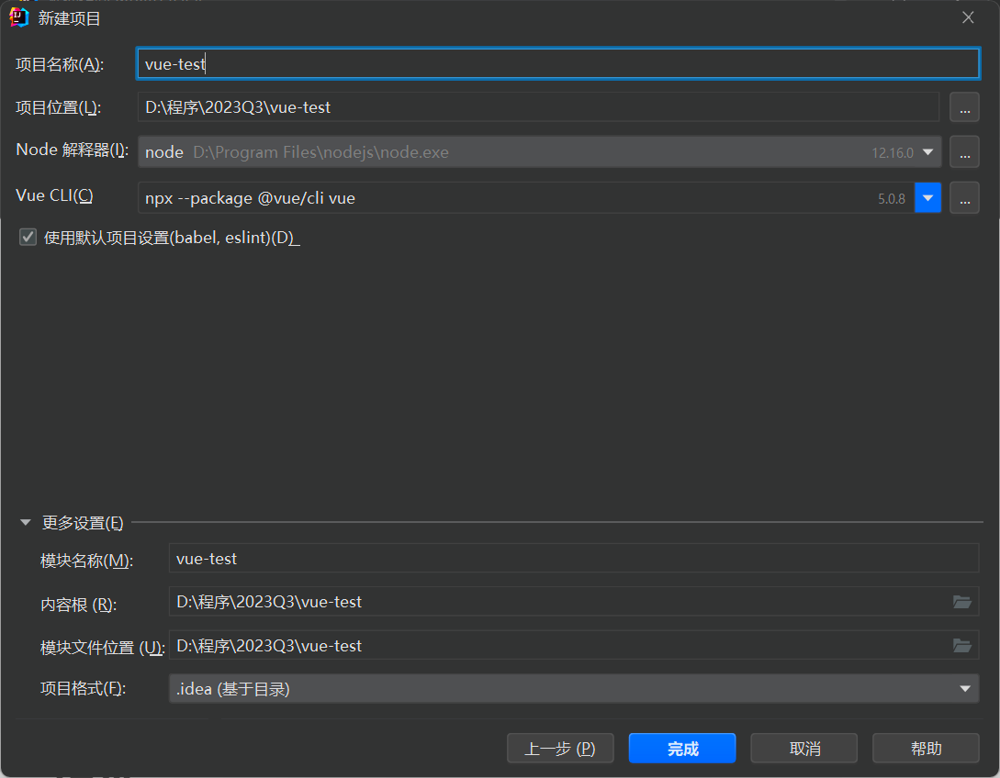


等待创建

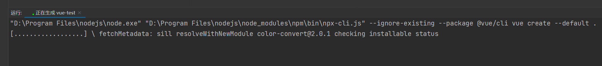


项目结构如下：

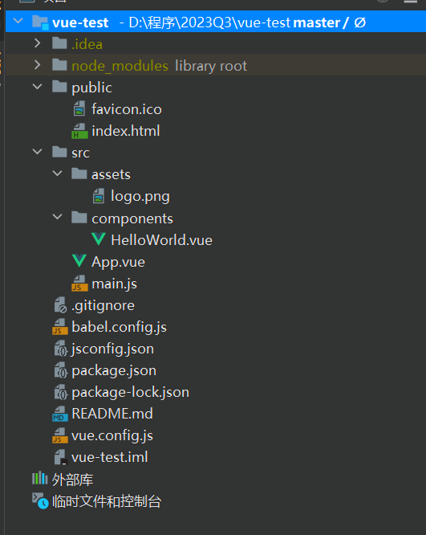


## 运行项目

点击package.json文件中serve前的运行按钮

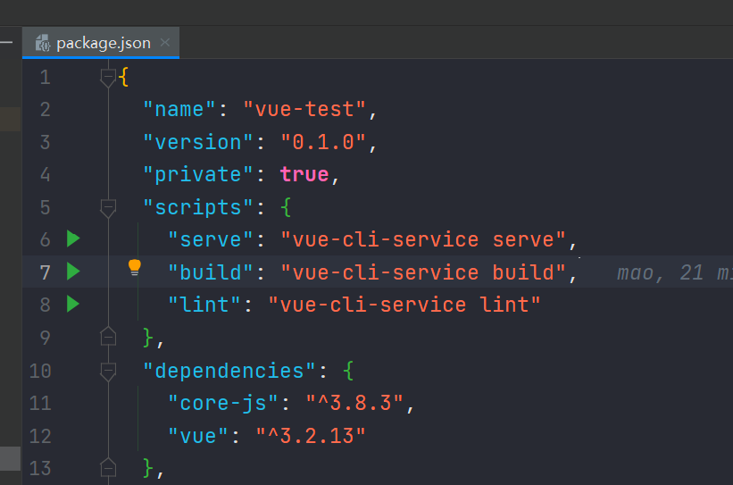


或者直接点击运行按钮

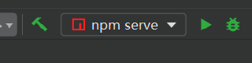


或者直接输入命令：

```sh
npm run serve
```


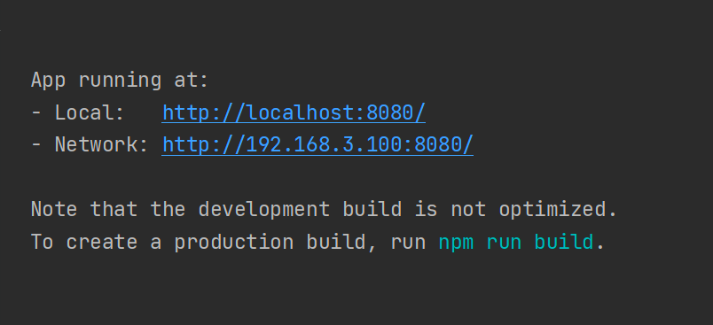


## 修改端口

文档地址：https://webpack.js.org/configuration/dev-server/#devserverport


打开 vue.config.js 添加

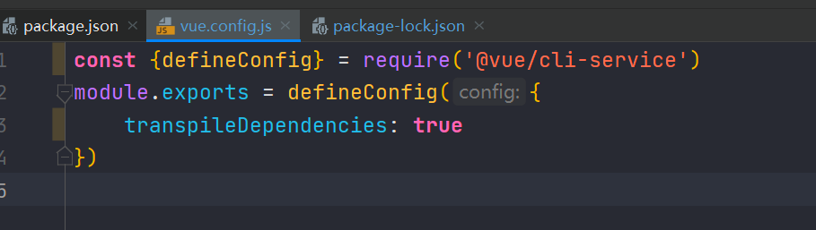


更改成：

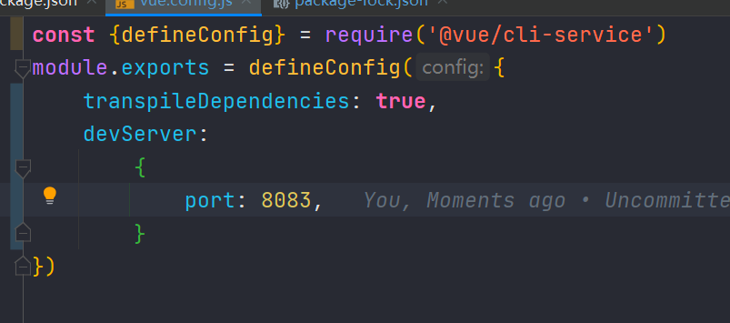


```js
const {defineConfig} = require('@vue/cli-service')
module.exports = defineConfig({
    transpileDependencies: true,
    devServer:
        {
            port: 8083,
        }
})

```


## 添加代理

为了避免前后端服务器联调时， fetch、xhr 请求产生跨域问题，需要配置代理


打开 vue.config.js 添加

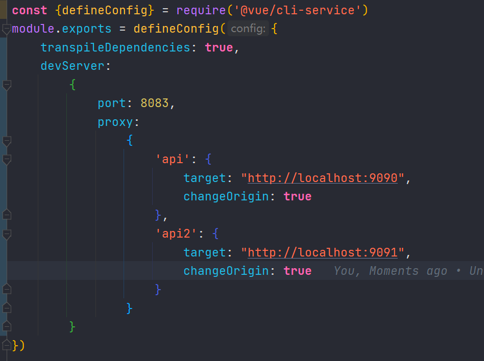


```js
const {defineConfig} = require('@vue/cli-service')
module.exports = defineConfig({
    transpileDependencies: true,
    devServer:
        {
            port: 8083,
            proxy:
                {
                    'api': {
                        target: "http://localhost:9090",
                        changeOrigin: true
                    },
                    'api2': {
                        target: "http://localhost:9091",
                        changeOrigin: true
                    }
                }
        }
})
```


## Vue 项目结构

```
├─assets
├─components
├─router
├─store
└─views
```


* assets - 静态资源
* components - 可重用组件
* router - 路由
* store - 数据共享
* views - 视图组件


以后还会添加

* api - 跟后台交互，发送 fetch、xhr 请求，接收响应
* plugins - 插件


# Vue 组件

## 说明

Vue 的组件文件以 .vue 结尾，每个组件由三部分组成

```vue
<template></template>

<script></script>

<style></style>
```


* template 模板部分，由它生成 html 代码
* script 代码部分，控制模板的数据来源和行为
* style 样式部分


入口组件是 App.vue，内容如下：

```vue
<template>
  
  <HelloWorld msg="Welcome to Your Vue.js App"/>
</template>

<script>
import HelloWorld from './components/HelloWorld.vue'

export default {
  name: 'App',
  components: {
    HelloWorld
  }
}
</script>

<style>
#app {
  font-family: Avenir, Helvetica, Arial, sans-serif;
  -webkit-font-smoothing: antialiased;
  -moz-osx-font-smoothing: grayscale;
  text-align: center;
  color: #2c3e50;
  margin-top: 60px;
}
</style>
```


## 入门程序

编写hello world

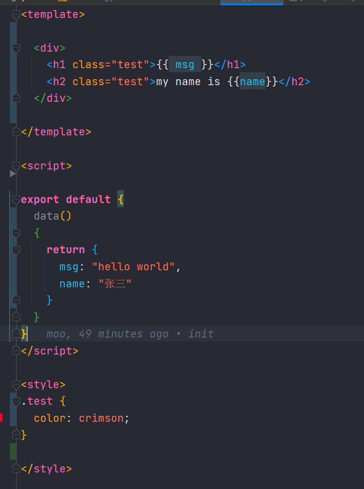


```vue
<template>

  <div>
    <h1 class="test">{{ msg }}</h1>
    <h2 class="test">my name is {{name}}</h2>
  </div>

</template>

<script>

export default {
  data()
  {
    return {
      msg: "hello world",
      name: "张三"
    }
  }
}
</script>

<style>
.test {
  color: crimson;
}

</style>
```


运行结果如下：

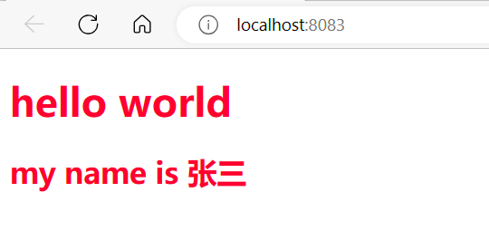


解释

* export default 导出组件对象，供 main.js 导入使用
* 这个对象有一个 data 方法，返回一个**对象**，给 template 提供数据
* `{{}}` 在 Vue 里称之为插值表达式，用来**绑定** data 方法返回的**对象**属性，**绑定**的含义是数据发生变化时，页面显示会同步变化


**注意：template 内只能有一个根元素**


## 文本插值

新建一个vue文件，名字为App2.vue：

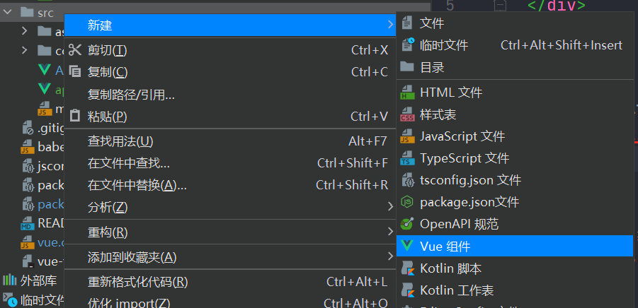


```vue
<template>
  <div>
    <h1>{{ name }} </h1>
    <h1>是否成年：{{ age >= 18 ? '成年' : '未成年' }}</h1>
    <h1>5年后年龄：{{ age + 5 }}</h1>
  </div>

</template>

<script>
export default {
  name: "App2",
  data()
  {
    return {
      name: "李四",
      age: 19
    }
  }
}
</script>

<style scoped>

</style>
```


更改main.js

```js
import { createApp } from 'vue'
import App from './App2.vue'

createApp(App).mount('#app')
```


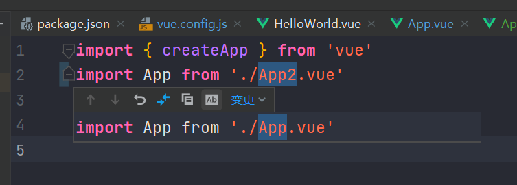


在vue.config.js中添加`lintOnSave:false,`

```js
const {defineConfig} = require('@vue/cli-service')
module.exports = defineConfig({
    transpileDependencies: true,
    lintOnSave:false,
    devServer:
        {
            port: 8083,
            proxy:
                {
                    'api': {
                        target: "http://localhost:9090",
                        changeOrigin: true
                    },
                    'api2': {
                        target: "http://localhost:9091",
                        changeOrigin: true
                    }
                }
        }
})
```


运行

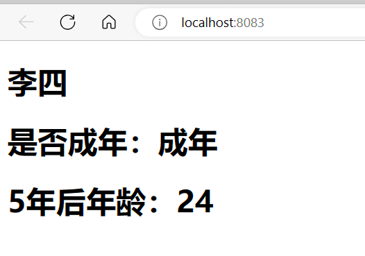


注意：

* `{{}}` 里只能绑定一个属性，绑定多个属性需要用多个 `{{}}` 分别绑定
* 插值内可以进行简单的表达式计算


## 属性绑定

v-bind指令

简写方式：可以省略 v-bind 只保留冒号


```vue
<template>
  <div>
    <input type="text" v-bind:value="name">
    <br>
    <input type="text" :value="address">
    <br>
    <input type="number" :value="age">

  </div>
</template>

<script>
export default {
  name: "App3",
  data()
  {
    return {
      name: "张三",
      age: 17,
      address: "中国湖南"
    }
  }
}
</script>

<style scoped>

</style>
```


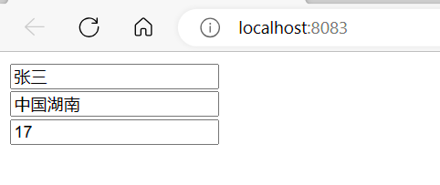


## 事件绑定

```vue
<template>
  <div>
    <input type="number" :value="number1" v-on:click="m1">
    <br>
    <input type="number" :value="number2" @click="m2">
    <br>
    <input type="text" :value="name" @change="m3()">
  </div>
</template>

<script>
export default {
  name: "App4",
  data()
  {
    return {
      number1: 100,
      number2: 300,
      name: "张三",
    }
  },
  methods:
      {
        m1()
        {
          console.log("点击执行m1")
          this.number1++;
        },
        m2()
        {
          console.log("点击执行m2")
          this.number2++;
        },
        m3()
        {
          console.log("更改事件执行m3")
          console.log(this.name)
        }
      }
}
</script>

<style scoped>

</style>
```


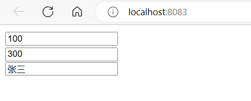


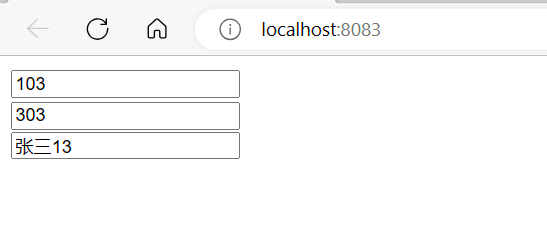

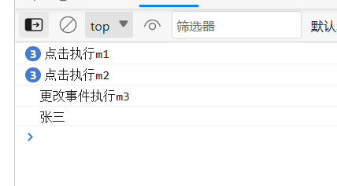


* 简写方式：可以把 v-on: 替换为 @
* 在 methods 方法中的 this 代表的是 data 函数返回的数据对象


## 双向绑定

当改变html代码时，js代码中的数据并没有变化

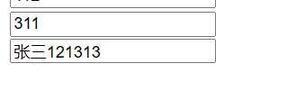

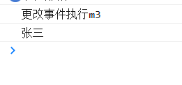


解决方式是使用v-model 实现双向绑定

* 用 v-model 实现双向绑定，即
  * javascript 数据可以同步到表单标签
  * 反过来用户在表单标签输入的新值也会同步到 javascript 这边
* 双向绑定只适用于表单这种带【输入】功能的标签，其它标签的数据绑定，单向就足够了
* 复选框这种标签，双向绑定的 javascript 数据类型一般用数组


```vue
<template>
  <div>
    <input type="text" v-model="name" @change="m1">
    <br>
    <input type="number" v-model="age" @change="m2">
  </div>
</template>

<script>
export default {
  name: "App5",
  data()
  {
    return {
      name: "张三",
      age: 19,
    }
  },
  methods:
      {
        m1()
        {
          console.log("m1")
          console.log(this.name)
        },
        m2()
        {
          console.log("m2")
          console.log(this.age)
        }
      },
  mounted()
  {
    window.setInterval(() =>
    {
      this.age++;
    }, 5000)
  }
}
</script>

<style scoped>

</style>
```


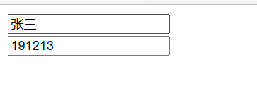

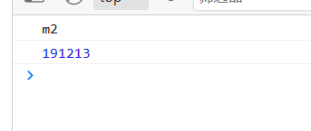


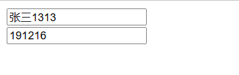


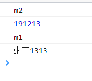


## 计算属性

直接使用方法计算：

```vue
<template>
  <div>
    <h3>{{ fullName() }}</h3>
    <h3>{{ fullName() }}</h3>
    <h3>{{ fullName() }}</h3>
    <h3>{{ fullName() }}</h3>
  </div>
</template>

<script>
export default {
  name: "App6",
  data()
  {
    return {
      firstName: '三',
      lastName: '张'
    }
  },
  methods:
      {
        fullName()
        {
          //模拟延时
          for (let i = 0; i < 100000; i++)
          {
            for (let j = 0; j < 30000; j++)
            {

            }
          }
          console.log('进入了 fullName方法')
          console.log(new Date().getTime())
          return this.lastName + this.firstName;
        }
      }
}
</script>

<style scoped>

</style>
```


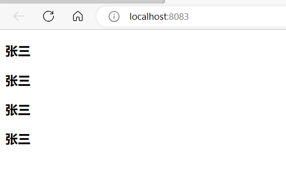


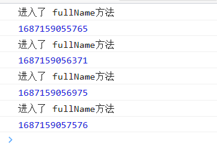


4个标签，一共计算了4次，调用了4次方法


使用computed：

```vue
<template>
  <div>
    <h3>{{ fullName }}</h3>
    <h3>{{ fullName }}</h3>
    <h3>{{ fullName }}</h3>
    <h3>{{ fullName }}</h3>
  </div>
</template>

<script>
export default {
  name: "App6",
  data()
  {
    return {
      firstName: '三',
      lastName: '张'
    }
  },
  methods:
      {
        /*fullName()
        {
          //模拟延时
          for (let i = 0; i < 100000; i++)
          {
            for (let j = 0; j < 30000; j++)
            {

            }
          }
          console.log('进入了 fullName方法')
          console.log(new Date().getTime())
          return this.lastName + this.firstName;
        }*/
      },
  computed:
      {
        fullName()
        {
          //模拟延时
          for (let i = 0; i < 100000; i++)
          {
            for (let j = 0; j < 30000; j++)
            {

            }
          }
          console.log('进入了 fullName方法')
          console.log(new Date().getTime())
          return this.lastName + this.firstName;
        }
      }
}
</script>

<style scoped>

</style>
```


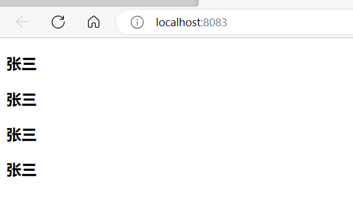


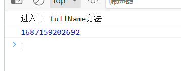


4个标签，一共只计算了1次，调用了1次方法，大大缩短了页面加载时间，避免了重复计算


* 普通方法调用必须加 ()，没有缓存功能
* 计算属性使用时就把它当属性来用，不加 ()，有缓存功能：
  * 一次计算后，会将结果缓存，下次再计算时，只要数据没有变化，不会重新计算，直接返回缓存结果


## 条件渲染

条件渲染有两个标签：

* v-if
* v-show


### v-if

```vue
<template>
  <div>
    <p>
      是否成年：
      <strong v-if="age>=18">是</strong>
      <strong v-else>不是</strong>
    </p>
    <p>
      是否为中国人：
      <strong v-if="address==='中国'">是</strong>
      <strong v-else>不是</strong>
    </p>
  </div>
</template>

<script>
export default {
  name: "App8",
  data()
  {
    return {
      age: 17,
      address: "中国"
    }
  }
}
</script>

<style scoped>

</style>
```


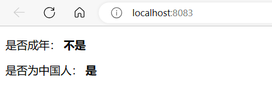


更改数据：

```vue
<template>
  <div>
    <p>
      是否成年：
      <strong v-if="age>=18">是</strong>
      <strong v-else>不是</strong>
    </p>
    <p>
      是否为中国人：
      <strong v-if="address==='中国'">是</strong>
      <strong v-else>不是</strong>
    </p>
  </div>
</template>

<script>
export default {
  name: "App8",
  data()
  {
    return {
      age: 19,
      address: "美国"
    }
  }
}
</script>

<style scoped>

</style>
```


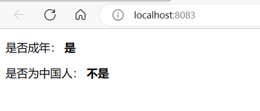


### v-show

```vue
<template>
  <div>
    <p>
      是否成年：
      <strong v-show="age>=18">是</strong>
      <strong v-show="age<18">不是</strong>
    </p>
    <p>
      是否为中国人：
      <strong v-show="address==='中国'">是</strong>
      <strong v-show="address!=='中国'">不是</strong>
    </p>
  </div>
</template>

<script>
export default {
  name: "App9",
  data()
  {
    return {
      age: 17,
      address: "中国"
    }
  }
}
</script>

<style scoped>

</style>
```


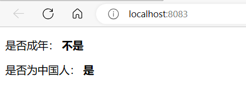


### 区别

1. v-if后面能加v-else或者v-else-if，v-show不能

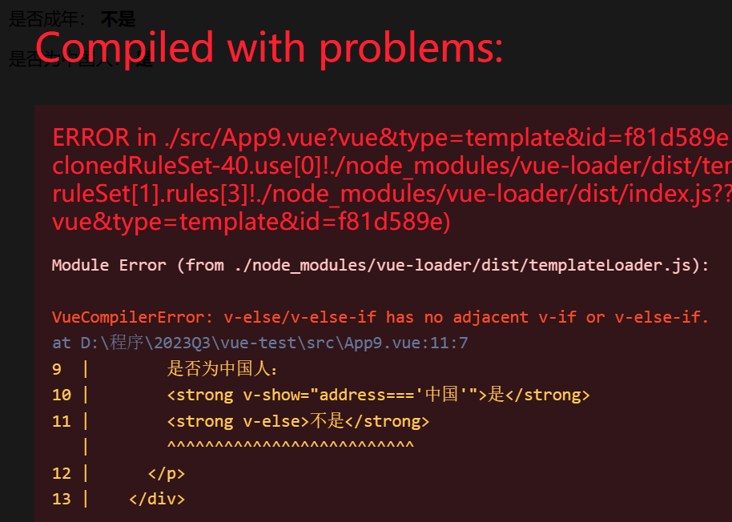


2. v-if本质上是选择性地添加或生成dom数上的标签，v-show无论条件是否成立，都会在dom数上添加标签，但是可能会有display: none


v-if渲染后的页面代码：

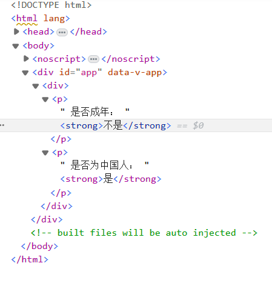


v-show渲染后的页面代码：

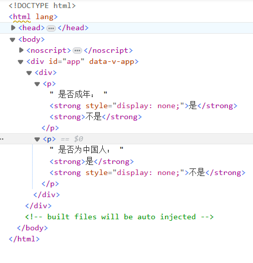


## 列表渲染

```vue
<template>
  <div>
    <table>
      <tr>
        <td>id</td>
        <td>姓名</td>
        <td>性别</td>
        <td>年龄</td>
      </tr>
      <tr v-for="student of studentList" :key="student.id">
        <td>{{ student.id }}</td>
        <td>{{ student.name }}</td>
        <td>{{ student.sex }}</td>
        <td>{{ student.age }}</td>
      </tr>
    </table>
  </div>


</template>

<script>
export default {
  name: "App10",
  data()
  {
    return {
      studentList: (function ()
      {
        const data = []
        for (let i = 0; i < 20; i++)
        {
          data.push({
            id: 1000 + i,
            name: "姓名" + (i + 1),
            age: Math.round(Math.random() * 10 + 10),
            sex: Math.random() > 0.5 ? "男" : "女"
          })
        }
        return data;
      }())
    }
  }
}
</script>

<style scoped>

</style>
```


打印序号：

```vue
<template>
  <div>
    <table>
      <tr>
        <td>序号</td>
        <td>id</td>
        <td>姓名</td>
        <td>性别</td>
        <td>年龄</td>
      </tr>
      <tr v-for="(student,index) of studentList" :key="student.id">
        <td>{{ index + 1 }}</td>
        <td>{{ student.id }}</td>
        <td>{{ student.name }}</td>
        <td>{{ student.sex }}</td>
        <td>{{ student.age }}</td>
      </tr>
    </table>
  </div>


</template>

<script>
export default {
  name: "App11",
  data()
  {
    return {
      studentList: (function ()
      {
        const data = []
        for (let i = 0; i < 20; i++)
        {
          data.push({
            id: 1000 + i,
            name: "姓名" + (i + 1),
            age: Math.round(Math.random() * 10 + 10),
            sex: Math.random() > 0.5 ? "男" : "女"
          })
        }
        return data;
      }())
    }
  }
}
</script>

<style scoped>

</style>
```


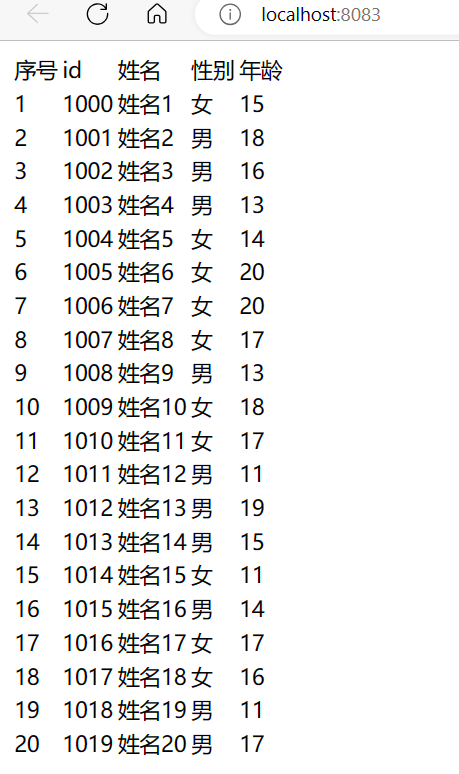


* v-if 和 v-for 不能用于同一个标签
* v-for 需要配合特殊的标签属性 key 一起使用，并且 key 属性要绑定到一个能起到唯一标识作用的数据上


## v-text

显示文本

```vue
<template>
  <div>
    <p v-text="text1"></p>
    <p v-text="text2"></p>
  </div>
</template>

<script>
export default {
  name: "App12",
  data()
  {
    return {
      text1: "hello",
      text2: "<h1>你好</h1>",

    }
  }
}

</script>

<style scoped>

</style>
```


* v-text标签只显示文本，不解析和渲染标签
* 使用v-text后，不能添加值，比如\<p v-text="text1">123\</p>


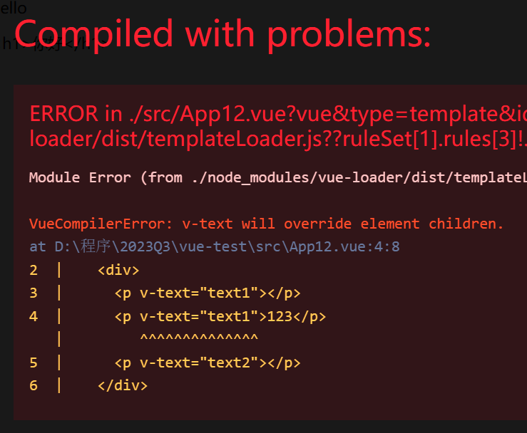


## v-html

```vue
<template>
  <div>
    <p v-html="text1"></p>
    <p v-html="text2"></p>
  </div>
</template>

<script>
export default {
  name: "App13",
  data()
  {
    return {
      text1: "hello",
      text2: "<h1>你好</h1>",
    }
  }
}

</script>

<style scoped>

</style>
```


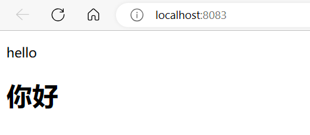


* 渲染html标签，有XSS攻击风险


## 重用组件

Vue重用组件是指可以被多个Vue实例重复使用的组件。这些组件可以包含自定义的状态和事件处理程序，并且可以在整个应用程序中共享。重用组件可以减少代码冗余，提高开发效率，并使代码更加模块化和可维护。

在Vue中，可以使用\<component>标签来定义重用组件


在Components下添加MyButton.vue


MyButton.vue内容：

```vue
<template>
  <div class="button" :class="[type,size]">
    -
    <slot></slot>
    -
  </div>
</template>

<script>
export default {
  name: "MyButton",
  props: ["type", "size"]
}
</script>

<style scoped>
.button {
  display: inline-block;
  text-align: center;
  border-radius: 30px;
  margin: 5px;
  font: bold 12px/25px Arial, sans-serif;
  padding: 0 2px;
  text-shadow: 1px 1px 1px rgba(255, 255, 255, .22);
  box-shadow: 1px 1px 1px rgba(0, 0, 0, .29), inset 1px 1px 1px rgba(255, 255, 255, .44);
  transition: all 0.15s ease;
}

.button:hover {
  box-shadow: 1px 1px 1px rgba(0, 0, 0, .29), inset 1px 1px 2px rgba(0, 0, 0, .5);
}

.button:active {
  box-shadow: inset 1px 1px 2px rgba(0, 0, 0, .8);
}

.primary {
  background-color: #1d6ef9;
  color: #b5e3f1;
}

.danger {
  background-color: rgb(196, 50, 50);
  color: white;
}

.success {
  background-color: #a5cd4e;;
  color: #3e5706;
}

.small {
  height: 25px;
  font-size: 14px;
  line-height: 25px;
}

.middle {
  height: 30px;
  font-size: 18px;
  line-height: 30px;
}

.large {
  height: 35px;
  font-size: 22px;
  line-height: 35px;
}
</style>

```


* props : 自定义组件属性
* slot : 插槽，用户


使用MyButton.vue：

```vue
<template>
  <div>
    <h1>组件测试</h1>
    <br>
    <my-button type="primary" size="small">12345</my-button>
    <my-button type="primary" size="middle">12345</my-button>
    <my-button type="primary" size="large">12345</my-button>
    <br>
    <my-button type="danger" size="small">12345</my-button>
    <my-button type="danger" size="middle">12345</my-button>
    <my-button type="danger" size="large">12345</my-button>
    <br>
    <my-button type="success" size="small">12345</my-button>
    <my-button type="success" size="middle">12345</my-button>
    <my-button type="success" size="large">12345</my-button>
    <br>

  </div>

</template>

<script>
import MyButton from '@/components/MyButton'

export default {
  name: "App14",
  components: {MyButton},
  data()
  {
    return {}
  }
}
</script>

<style scoped>

</style>
```


MyLink.vue

```vue
<template>
  <a :class="[size]" :href="link">
    <slot></slot>
  </a>
</template>

<script>
export default {
  name: "MyLink",
  props: ['size', 'link']
}
</script>

<style scoped>
a {
  color: tomato;
  text-decoration: none;
  display: flex;
  justify-content: center;
  align-items: center;
  text-align: center;
  padding: 0;
  list-style-type: none;
  font-family: sans-serif;
  text-transform: capitalize;
  position: relative;
  margin: 0.8em;
}

/* 添加了左右两个圆点 */
a::before, a::after {
  content: '';
  position: absolute;
  width: 0.6em;
  height: 0.6em;
  background-color: gainsboro;
  top: calc(50% - 0.3em);
  border-radius: 50%;
  transition: 0.5s cubic-bezier(0.5, -0.5, 0.25, 1.5);
}

a::before {
  left: 0;
  z-index: -1;
}

a::after {
  right: 0;
  z-index: -2;
}

/* 添加悬浮效果 */
a:hover {
  color: deeppink;
}

/* 给前后伪元素添加悬浮效果，注意先后顺序，先是hover后是伪元素 */
a:hover::before, a:hover::after {
  width: 100%;
  height: 100%;
  border-radius: 0;
  background-color: dodgerblue;
}

a:hover::before {
  top: 0;
  left: -0.2em;
}

a:hover::after {
  right: -0.2em;
  filter: brightness(0.8);
}

.small {
  font-size: 22px;
  width: 10em;
  height: 2em;
  line-height: 2em;
}

.middle {
  font-size: 25px;
  width: 10em;
  height: 2em;
  line-height: 2em;
}

.large {
  font-size: 28px;
  width: 10em;
  height: 2em;
  line-height: 2em;
}

</style>
```


使用MyLink.vue

```vue
<template>
  <my-link link="https://www.bilibili.com/" size="small">b站官网</my-link>
  <my-link link="https://www.bilibili.com/" size="middle">b站官网</my-link>
  <my-link link="https://www.bilibili.com/" size="large">b站官网</my-link>
</template>

<script>
import MyLink from '@/components/MyLink'
export default {
  name: "App15",
  components: {MyLink}
}
</script>

<style scoped>

</style>
```


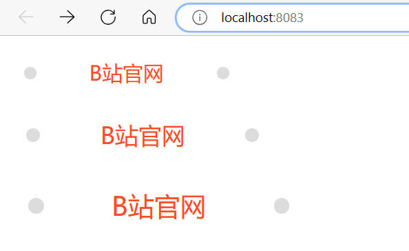


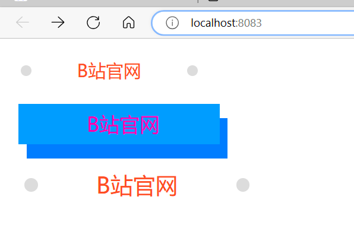


# axios

## 概述

axios 它的底层是用了 XMLHttpRequest（xhr）方式发送请求和接收响应，xhr 相对于之前讲过的 fetch api 来说，功能更强大，但由于是比较老的 api，不支持 Promise，axios 对 xhr 进行了封装，使之支持 Promise，并提供了对请求、响应的统一拦截功能


## 安装

命令：

```sh
npm install axios -S
```


```sh
PS D:\程序\2023Q3\vue-test> npm install axios -S
npm WARN optional SKIPPING OPTIONAL DEPENDENCY: fsevents@2.3.2 (node_modules\fsevents):
npm WARN notsup SKIPPING OPTIONAL DEPENDENCY: Unsupported platform for fsevents@2.3.2: wanted {"os":"darwin","arch":"any"} (current: {"os":"win32","arch":"x64"})

+ axios@1.4.0
added 6 packages from 18 contributors, removed 7 packages and audited 980 packages in 8.948s

90 packages are looking for funding
  run `npm fund` for details

found 0 vulnerabilities

PS D:\程序\2023Q3\vue-test>
```


如果在dependencies下出现axios依赖，证明安装成功

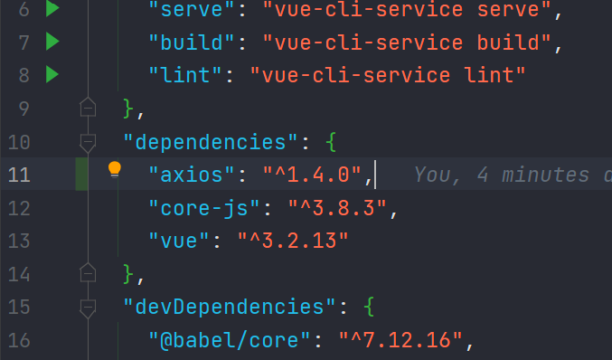


## 导入

命令：

```sh
import axios from 'axios'
```


axios 默认导出一个对象，这里的 import 导入的就是它默认导出的对象


## 方法

|                请求                |  备注   |
| :--------------------------------: | :-----: |
|      axios.get(url[, config])      | get方法 |
|    axios.delete(url[, config])     |         |
|     axios.head(url[, config])      |         |
|    axios.options(url[, config])    |         |
| axios.post(url[, data[, config]])  |         |
|  axios.put(url[, data[, config]])  |         |
| axios.patch(url[, data[, config]]) |         |


* config - 选项对象、例如查询参数、请求头...
* data - 请求体数据、最常见的是 json 格式数据
* get、head 请求无法携带请求体，这应当是浏览器的限制所致（xhr、fetch api 均有限制）
* options、delete 请求可以通过 config 中的 data 携带请求体


## 配置

|      名称       |                            含义                            |
| :-------------: | :--------------------------------------------------------: |
|     baseURL     |                    将自动加在 url 前面                     |
|     headers     |                   请求头，类型为简单对象                   |
|     params      |  跟在 URL 后的请求参数，类型为简单对象或 URLSearchParams   |
|      data       | 请求体，类型有简单对象、FormData、URLSearchParams、File 等 |
| withCredentials |         跨域时是否携带 Cookie 等凭证，默认为 false         |
|  responseType   |                   响应类型，默认为 json                    |


```js
const _axios = axios.create({
    baseURL: 'http://localhost:8080',
    withCredentials: true
});
```

* 生产环境希望 xhr 请求不走代理，可以用 baseURL 统一修改
* 希望跨域请求携带 cookie，需要配置 withCredentials: true，服务器也要配置 allowCredentials = true，否则浏览器获取跨域返回的 cookie 时会报错


## 示例

```vue
<template>

</template>

<script>
import axios from 'axios'

export default {
  name: "App16",
  data()
  {
    return {
      resp: null
    }
  },
  methods:
      {
        testGet()
        {
          axios.get("/api/testGet").then((resp) =>
          {
            console.log(resp);
            this.resp = resp;
          }).catch((error) =>
          {
            console.log(error);
          })
        },
        testPost()
        {
          axios.post("/api/testPost").then((resp) =>
          {
            console.log(resp);
            this.resp = resp;
          }).catch((error) =>
          {
            console.log(error);
          })
        },
        test()
        {
          //axios发起ajax请求
          axios({
            //请求的方式：
            method: "post",
            //请求的url:
            url: "/api/testPost",
            //url参数：
            params:
                {
                  a: 1,
                  b: 2,
                  c: 3
                },
            //头信息：
            headers:
                {
                  token: "123456"
                },
            //请求体参数：
            data:
                {
                  a1: 11,
                  b2: 22,
                  c3: 33
                },
          }).then(response =>
          {
            console.log(response);
            this.resp = response;
          }).catch(error =>
          {
            console.log(error);
          })
        }
      },
  mounted()
  {
    this.testGet();
    this.testPost();
    this.test();
  }

}
</script>

<style scoped>

</style>
```


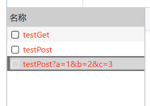


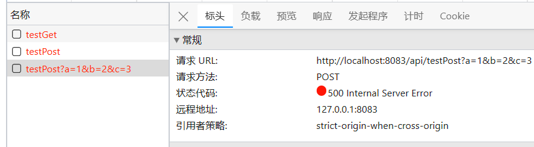


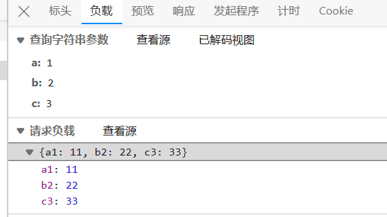


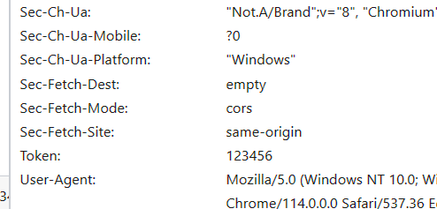


## 创建实例

```js
const _axios = axios.create(config);
```

* axios 对象可以直接使用，但使用的是默认的设置
* 用 axios.create 创建的对象，可以覆盖默认设置


## 拦截器

```vue
<script>
import axios from 'axios'

const _axios = axios.create({
  baseURL: 'http://localhost:8083',
  withCredentials: true
});
_axios.interceptors.request.use(
    function (config)
    {
      //在这里添加统一的 headers
      config.headers.auth = "12345678901234567890"
      return config;
    }
)
_axios.interceptors.response.use(
    function (response)
    {
      //2xx 范围内走这里
      console.log("请求成功")
      console.log(response)
      return response;
    },
    function (error)
    {
      //超出 2xx, 比如 4xx, 5xx 走这里
      console.log("请求错误")
      console.log(error)
      return error;
    }
);

console.log("初始化_axios")

export default _axios;
</script>


```


使用：

```vue
<template>
  <div>

  </div>
</template>

<script>
import _axios from "@/components/MyAxios"

export default {
  name: "App17",
  methods:
      {
        test()
        {
          _axios.get("/testGet", (resp) =>
          {
            console.log(resp)
          })
        },
        test2()
        {
          //axios发起ajax请求
          _axios({
            //请求的方式：
            method: "post",
            //请求的url:
            url: "test2",
            //url参数：
            params:
                {

                },
            //头信息：
            headers:
                {
                  auth2: "1312324",
                  token: "12131313131"
                },
            //请求体参数：
            data:
                {a:1},
          }).then(response =>
          {
            console.log(response);

          })
        }
      },
  mounted()
  {
    this.test();
    this.test2();
  }
}
</script>

<style scoped>

</style>

```


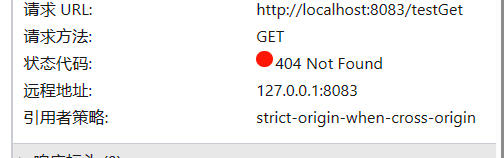


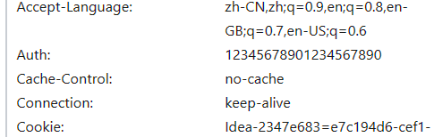


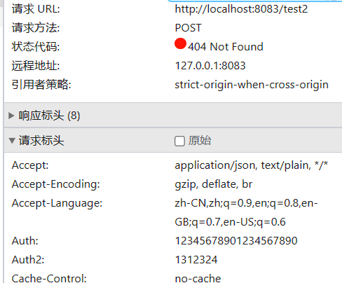


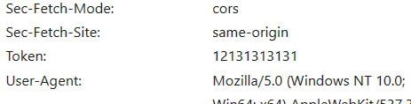


# ElementUI

## 概述

Element，一套为开发者、设计师和产品经理准备的基于 Vue 2.0 的桌面端组件库


官网：https://element.eleme.cn/#/zh-CN


## 安装

