<h1 style="color:skyblue;text-align:center">Vue学习笔记</h1>


# 环境准备

## 安装脚手架

前提需要nodejs，vue/cli requires Node ^12.0.0 || >= 14.0.0


命令如下：

```sh
npm install -g @vue/cli
```

* -g 参数表示全局安装，这样在任意目录都可以使用 vue 脚本创建项目


```sh
PS C:\Users\mao> npm install -g @vue/cli
npm WARN deprecated apollo-server-express@3.12.0: The `apollo-server-express` package is part of Apollo Server v2 and v3, which are now deprecated (end-of-life October 22nd 2023). This package's functionality is now found in the `@apollo/server` package. See https://www.apollographql.com/docs/apollo-server/previous-versions/ for more details.
npm WARN deprecated subscriptions-transport-ws@0.11.0: The `subscriptions-transport-ws` package is no longer maintained. We recommend you use `graphql-ws` instead. For help migrating Apollo software to `graphql-ws`, see https://www.apollographql.com/docs/apollo-server/data/subscriptions/#switching-from-subscriptions-transport-ws    For general help using `graphql-ws`, see https://github.com/enisdenjo/graphql-ws/blob/master/README.md
npm WARN deprecated apollo-server-types@3.8.0: The `apollo-server-types` package is part of Apollo Server v2 and v3, which are now deprecated (end-of-life October 22nd 2023). This package's functionality is now found in the `@apollo/server` package. See https://www.apollographql.com/docs/apollo-server/previous-versions/ for more details.
npm WARN deprecated apollo-server-core@3.12.0: The `apollo-server-core` package is part of Apollo Server v2 and v3, which are now deprecated (end-of-life October 22nd 2023). This package's functionality is now found in the `@apollo/server` package. See https://www.apollographql.com/docs/apollo-server/previous-versions/ for more details.
npm WARN deprecated apollo-server-env@4.2.1: The `apollo-server-env` package is part of Apollo Server v2 and v3, which are now deprecated (end-of-life October 22nd 2023). This package's functionality is now found in the `@apollo/utils.fetcher` package. See https://www.apollographql.com/docs/apollo-server/previous-versions/ for more details.
npm WARN deprecated apollo-reporting-protobuf@3.4.0: The `apollo-reporting-protobuf` package is part of Apollo Server v2 and v3, which are now deprecated (end-of-life October 22nd 2023). This package's functionality is now found in the `@apollo/usage-reporting-protobuf` package. See https://www.apollographql.com/docs/apollo-server/previous-versions/ for more details.
npm WARN deprecated apollo-server-errors@3.3.1: The `apollo-server-errors` package is part of Apollo Server v2 and v3, which are now deprecated (end-of-life October 22nd 2023). This package's functionality is now found in the `@apollo/server` package. See https://www.apollographql.com/docs/apollo-server/previous-versions/ for more details.
npm WARN deprecated apollo-datasource@3.3.2: The `apollo-datasource` package is part of Apollo Server v2 and v3, which are now deprecated (end-of-life October 22nd 2023). See https://www.apollographql.com/docs/apollo-server/previous-versions/ for more details.
npm WARN deprecated apollo-server-plugin-base@3.7.2: The `apollo-server-plugin-base` package is part of Apollo Server v2 and v3, which are now deprecated (end-of-life October 22nd 2023). This package's functionality is now found in the `@apollo/server` package. See https://www.apollographql.com/docs/apollo-server/previous-versions/ for more details.
npm WARN deprecated source-map-resolve@0.5.3: See https://github.com/lydell/source-map-resolve#deprecated
npm WARN deprecated resolve-url@0.2.1: https://github.com/lydell/resolve-url#deprecated
npm WARN deprecated urix@0.1.0: Please see https://github.com/lydell/urix#deprecated
npm WARN deprecated source-map-url@0.4.1: See https://github.com/lydell/source-map-url#deprecated
C:\Users\mao\AppData\Roaming\npm\vue -> C:\Users\mao\AppData\Roaming\npm\node_modules\@vue\cli\bin\vue.js

> @apollo/protobufjs@1.2.7 postinstall C:\Users\mao\AppData\Roaming\npm\node_modules\@vue\cli\node_modules\@apollo\protobufjs
> node scripts/postinstall


> @apollo/protobufjs@1.2.6 postinstall C:\Users\mao\AppData\Roaming\npm\node_modules\@vue\cli\node_modules\apollo-reporting-protobuf\node_modules\@apollo\protobufjs
> node scripts/postinstall

npm WARN node-fetch@2.6.11 requires a peer of encoding@^0.1.0 but none is installed. You must install peer dependencies yourself.
npm WARN ws@7.5.9 requires a peer of bufferutil@^4.0.1 but none is installed. You must install peer dependencies yourself.
npm WARN ws@7.5.9 requires a peer of utf-8-validate@^5.0.2 but none is installed. You must install peer dependencies yourself.

+ @vue/cli@5.0.8
added 853 packages from 491 contributors in 535.031s
PS C:\Users\mao>
```


## 创建项目

可以使用命令`vue ui`来手动创建项目，也可以使用idea创建项目


### vue ui

使用图形向导来创建 vue 项目


```sh
PS C:\Users\mao> vue ui
🚀  Starting GUI...
🌠  Ready on http://localhost:8000
```


点击新建项目


等待创建成功


### idea创建项目

打开idea，点击新建项目，选择js，再选择vue.js


输入项目名称


等待创建


项目结构如下：


## 运行项目

点击package.json文件中serve前的运行按钮


或者直接点击运行按钮


或者直接输入命令：

```sh
npm run serve
```


## 修改端口

文档地址：https://webpack.js.org/configuration/dev-server/#devserverport


打开 vue.config.js 添加


更改成：


```js
const {defineConfig} = require('@vue/cli-service')
module.exports = defineConfig({
    transpileDependencies: true,
    devServer:
        {
            port: 8083,
        }
})

```


## 添加代理

为了避免前后端服务器联调时， fetch、xhr 请求产生跨域问题，需要配置代理


打开 vue.config.js 添加


```js
const {defineConfig} = require('@vue/cli-service')
module.exports = defineConfig({
    transpileDependencies: true,
    devServer:
        {
            port: 8083,
            proxy:
                {
                    'api': {
                        target: "http://localhost:9090",
                        changeOrigin: true
                    },
                    'api2': {
                        target: "http://localhost:9091",
                        changeOrigin: true
                    }
                }
        }
})
```


## Vue 项目结构

```
├─assets
├─components
├─router
├─store
└─views
```


* assets - 静态资源
* components - 可重用组件
* router - 路由
* store - 数据共享
* views - 视图组件


以后还会添加

* api - 跟后台交互，发送 fetch、xhr 请求，接收响应
* plugins - 插件


# Vue 组件

## 说明

Vue 的组件文件以 .vue 结尾，每个组件由三部分组成

```vue
<template></template>

<script></script>

<style></style>
```


* template 模板部分，由它生成 html 代码
* script 代码部分，控制模板的数据来源和行为
* style 样式部分


入口组件是 App.vue，内容如下：

```vue
<template>
  
  <HelloWorld msg="Welcome to Your Vue.js App"/>
</template>

<script>
import HelloWorld from './components/HelloWorld.vue'

export default {
  name: 'App',
  components: {
    HelloWorld
  }
}
</script>

<style>
#app {
  font-family: Avenir, Helvetica, Arial, sans-serif;
  -webkit-font-smoothing: antialiased;
  -moz-osx-font-smoothing: grayscale;
  text-align: center;
  color: #2c3e50;
  margin-top: 60px;
}
</style>
```


## 入门程序

编写hello world


```vue
<template>

  <div>
    <h1 class="test">{{ msg }}</h1>
    <h2 class="test">my name is {{name}}</h2>
  </div>

</template>

<script>

export default {
  data()
  {
    return {
      msg: "hello world",
      name: "张三"
    }
  }
}
</script>

<style>
.test {
  color: crimson;
}

</style>
```


运行结果如下：


解释

* export default 导出组件对象，供 main.js 导入使用
* 这个对象有一个 data 方法，返回一个**对象**，给 template 提供数据
* `{{}}` 在 Vue 里称之为插值表达式，用来**绑定** data 方法返回的**对象**属性，**绑定**的含义是数据发生变化时，页面显示会同步变化


**注意：template 内只能有一个根元素**


## 文本插值

新建一个vue文件，名字为App2.vue：


```vue
<template>
  <div>
    <h1>{{ name }} </h1>
    <h1>是否成年：{{ age >= 18 ? '成年' : '未成年' }}</h1>
    <h1>5年后年龄：{{ age + 5 }}</h1>
  </div>

</template>

<script>
export default {
  name: "App2",
  data()
  {
    return {
      name: "李四",
      age: 19
    }
  }
}
</script>

<style scoped>

</style>
```


更改main.js

```js
import { createApp } from 'vue'
import App from './App2.vue'

createApp(App).mount('#app')
```


在vue.config.js中添加`lintOnSave:false,`

```js
const {defineConfig} = require('@vue/cli-service')
module.exports = defineConfig({
    transpileDependencies: true,
    lintOnSave:false,
    devServer:
        {
            port: 8083,
            proxy:
                {
                    'api': {
                        target: "http://localhost:9090",
                        changeOrigin: true
                    },
                    'api2': {
                        target: "http://localhost:9091",
                        changeOrigin: true
                    }
                }
        }
})
```


运行


注意：

* `{{}}` 里只能绑定一个属性，绑定多个属性需要用多个 `{{}}` 分别绑定
* 插值内可以进行简单的表达式计算


## 属性绑定

v-bind指令

简写方式：可以省略 v-bind 只保留冒号


```vue
<template>
  <div>
    <input type="text" v-bind:value="name">
    <br>
    <input type="text" :value="address">
    <br>
    <input type="number" :value="age">

  </div>
</template>

<script>
export default {
  name: "App3",
  data()
  {
    return {
      name: "张三",
      age: 17,
      address: "中国湖南"
    }
  }
}
</script>

<style scoped>

</style>
```


## 事件绑定

```vue
<template>
  <div>
    <input type="number" :value="number1" v-on:click="m1">
    <br>
    <input type="number" :value="number2" @click="m2">
    <br>
    <input type="text" :value="name" @change="m3()">
  </div>
</template>

<script>
export default {
  name: "App4",
  data()
  {
    return {
      number1: 100,
      number2: 300,
      name: "张三",
    }
  },
  methods:
      {
        m1()
        {
          console.log("点击执行m1")
          this.number1++;
        },
        m2()
        {
          console.log("点击执行m2")
          this.number2++;
        },
        m3()
        {
          console.log("更改事件执行m3")
          console.log(this.name)
        }
      }
}
</script>

<style scoped>

</style>
```


* 简写方式：可以把 v-on: 替换为 @
* 在 methods 方法中的 this 代表的是 data 函数返回的数据对象


## 双向绑定

当改变html代码时，js代码中的数据并没有变化


解决方式是使用v-model 实现双向绑定

* 用 v-model 实现双向绑定，即
  * javascript 数据可以同步到表单标签
  * 反过来用户在表单标签输入的新值也会同步到 javascript 这边
* 双向绑定只适用于表单这种带【输入】功能的标签，其它标签的数据绑定，单向就足够了
* 复选框这种标签，双向绑定的 javascript 数据类型一般用数组


```vue
<template>
  <div>
    <input type="text" v-model="name" @change="m1">
    <br>
    <input type="number" v-model="age" @change="m2">
  </div>
</template>

<script>
export default {
  name: "App5",
  data()
  {
    return {
      name: "张三",
      age: 19,
    }
  },
  methods:
      {
        m1()
        {
          console.log("m1")
          console.log(this.name)
        },
        m2()
        {
          console.log("m2")
          console.log(this.age)
        }
      },
  mounted()
  {
    window.setInterval(() =>
    {
      this.age++;
    }, 5000)
  }
}
</script>

<style scoped>

</style>
```


## 计算属性

直接使用方法计算：

```vue
<template>
  <div>
    <h3>{{ fullName() }}</h3>
    <h3>{{ fullName() }}</h3>
    <h3>{{ fullName() }}</h3>
    <h3>{{ fullName() }}</h3>
  </div>
</template>

<script>
export default {
  name: "App6",
  data()
  {
    return {
      firstName: '三',
      lastName: '张'
    }
  },
  methods:
      {
        fullName()
        {
          //模拟延时
          for (let i = 0; i < 100000; i++)
          {
            for (let j = 0; j < 30000; j++)
            {

            }
          }
          console.log('进入了 fullName方法')
          console.log(new Date().getTime())
          return this.lastName + this.firstName;
        }
      }
}
</script>

<style scoped>

</style>
```


4个标签，一共计算了4次，调用了4次方法


使用computed：

```vue
<template>
  <div>
    <h3>{{ fullName }}</h3>
    <h3>{{ fullName }}</h3>
    <h3>{{ fullName }}</h3>
    <h3>{{ fullName }}</h3>
  </div>
</template>

<script>
export default {
  name: "App6",
  data()
  {
    return {
      firstName: '三',
      lastName: '张'
    }
  },
  methods:
      {
        /*fullName()
        {
          //模拟延时
          for (let i = 0; i < 100000; i++)
          {
            for (let j = 0; j < 30000; j++)
            {

            }
          }
          console.log('进入了 fullName方法')
          console.log(new Date().getTime())
          return this.lastName + this.firstName;
        }*/
      },
  computed:
      {
        fullName()
        {
          //模拟延时
          for (let i = 0; i < 100000; i++)
          {
            for (let j = 0; j < 30000; j++)
            {

            }
          }
          console.log('进入了 fullName方法')
          console.log(new Date().getTime())
          return this.lastName + this.firstName;
        }
      }
}
</script>

<style scoped>

</style>
```


4个标签，一共只计算了1次，调用了1次方法，大大缩短了页面加载时间，避免了重复计算


* 普通方法调用必须加 ()，没有缓存功能
* 计算属性使用时就把它当属性来用，不加 ()，有缓存功能：
  * 一次计算后，会将结果缓存，下次再计算时，只要数据没有变化，不会重新计算，直接返回缓存结果


## 条件渲染

条件渲染有两个标签：

* v-if
* v-show


### v-if

```vue
<template>
  <div>
    <p>
      是否成年：
      <strong v-if="age>=18">是</strong>
      <strong v-else>不是</strong>
    </p>
    <p>
      是否为中国人：
      <strong v-if="address==='中国'">是</strong>
      <strong v-else>不是</strong>
    </p>
  </div>
</template>

<script>
export default {
  name: "App8",
  data()
  {
    return {
      age: 17,
      address: "中国"
    }
  }
}
</script>

<style scoped>

</style>
```


更改数据：

```vue
<template>
  <div>
    <p>
      是否成年：
      <strong v-if="age>=18">是</strong>
      <strong v-else>不是</strong>
    </p>
    <p>
      是否为中国人：
      <strong v-if="address==='中国'">是</strong>
      <strong v-else>不是</strong>
    </p>
  </div>
</template>

<script>
export default {
  name: "App8",
  data()
  {
    return {
      age: 19,
      address: "美国"
    }
  }
}
</script>

<style scoped>

</style>
```


### v-show

```vue
<template>
  <div>
    <p>
      是否成年：
      <strong v-show="age>=18">是</strong>
      <strong v-show="age<18">不是</strong>
    </p>
    <p>
      是否为中国人：
      <strong v-show="address==='中国'">是</strong>
      <strong v-show="address!=='中国'">不是</strong>
    </p>
  </div>
</template>

<script>
export default {
  name: "App9",
  data()
  {
    return {
      age: 17,
      address: "中国"
    }
  }
}
</script>

<style scoped>

</style>
```


### 区别

1. v-if后面能加v-else或者v-else-if，v-show不能


2. v-if本质上是选择性地添加或生成dom数上的标签，v-show无论条件是否成立，都会在dom数上添加标签，但是可能会有display: none


v-if渲染后的页面代码：


v-show渲染后的页面代码：


## 列表渲染

```vue
<template>
  <div>
    <table>
      <tr>
        <td>id</td>
        <td>姓名</td>
        <td>性别</td>
        <td>年龄</td>
      </tr>
      <tr v-for="student of studentList" :key="student.id">
        <td>{{ student.id }}</td>
        <td>{{ student.name }}</td>
        <td>{{ student.sex }}</td>
        <td>{{ student.age }}</td>
      </tr>
    </table>
  </div>


</template>

<script>
export default {
  name: "App10",
  data()
  {
    return {
      studentList: (function ()
      {
        const data = []
        for (let i = 0; i < 20; i++)
        {
          data.push({
            id: 1000 + i,
            name: "姓名" + (i + 1),
            age: Math.round(Math.random() * 10 + 10),
            sex: Math.random() > 0.5 ? "男" : "女"
          })
        }
        return data;
      }())
    }
  }
}
</script>

<style scoped>

</style>
```


打印序号：

```vue
<template>
  <div>
    <table>
      <tr>
        <td>序号</td>
        <td>id</td>
        <td>姓名</td>
        <td>性别</td>
        <td>年龄</td>
      </tr>
      <tr v-for="(student,index) of studentList" :key="student.id">
        <td>{{ index + 1 }}</td>
        <td>{{ student.id }}</td>
        <td>{{ student.name }}</td>
        <td>{{ student.sex }}</td>
        <td>{{ student.age }}</td>
      </tr>
    </table>
  </div>


</template>

<script>
export default {
  name: "App11",
  data()
  {
    return {
      studentList: (function ()
      {
        const data = []
        for (let i = 0; i < 20; i++)
        {
          data.push({
            id: 1000 + i,
            name: "姓名" + (i + 1),
            age: Math.round(Math.random() * 10 + 10),
            sex: Math.random() > 0.5 ? "男" : "女"
          })
        }
        return data;
      }())
    }
  }
}
</script>

<style scoped>

</style>
```


* v-if 和 v-for 不能用于同一个标签
* v-for 需要配合特殊的标签属性 key 一起使用，并且 key 属性要绑定到一个能起到唯一标识作用的数据上


## v-text

显示文本

```vue
<template>
  <div>
    <p v-text="text1"></p>
    <p v-text="text2"></p>
  </div>
</template>

<script>
export default {
  name: "App12",
  data()
  {
    return {
      text1: "hello",
      text2: "<h1>你好</h1>",

    }
  }
}

</script>

<style scoped>

</style>
```


* v-text标签只显示文本，不解析和渲染标签
* 使用v-text后，不能添加值，比如\<p v-text="text1">123\</p>


## v-html

```vue
<template>
  <div>
    <p v-html="text1"></p>
    <p v-html="text2"></p>
  </div>
</template>

<script>
export default {
  name: "App13",
  data()
  {
    return {
      text1: "hello",
      text2: "<h1>你好</h1>",
    }
  }
}

</script>

<style scoped>

</style>
```


* 渲染html标签，有XSS攻击风险


## 重用组件

Vue重用组件是指可以被多个Vue实例重复使用的组件。这些组件可以包含自定义的状态和事件处理程序，并且可以在整个应用程序中共享。重用组件可以减少代码冗余，提高开发效率，并使代码更加模块化和可维护。

在Vue中，可以使用\<component>标签来定义重用组件


在Components下添加MyButton.vue


MyButton.vue内容：

```vue
<template>
  <div class="button" :class="[type,size]">
    -
    <slot></slot>
    -
  </div>
</template>

<script>
export default {
  name: "MyButton",
  props: ["type", "size"]
}
</script>

<style scoped>
.button {
  display: inline-block;
  text-align: center;
  border-radius: 30px;
  margin: 5px;
  font: bold 12px/25px Arial, sans-serif;
  padding: 0 2px;
  text-shadow: 1px 1px 1px rgba(255, 255, 255, .22);
  box-shadow: 1px 1px 1px rgba(0, 0, 0, .29), inset 1px 1px 1px rgba(255, 255, 255, .44);
  transition: all 0.15s ease;
}

.button:hover {
  box-shadow: 1px 1px 1px rgba(0, 0, 0, .29), inset 1px 1px 2px rgba(0, 0, 0, .5);
}

.button:active {
  box-shadow: inset 1px 1px 2px rgba(0, 0, 0, .8);
}

.primary {
  background-color: #1d6ef9;
  color: #b5e3f1;
}

.danger {
  background-color: rgb(196, 50, 50);
  color: white;
}

.success {
  background-color: #a5cd4e;;
  color: #3e5706;
}

.small {
  height: 25px;
  font-size: 14px;
  line-height: 25px;
}

.middle {
  height: 30px;
  font-size: 18px;
  line-height: 30px;
}

.large {
  height: 35px;
  font-size: 22px;
  line-height: 35px;
}
</style>

```


* props : 自定义组件属性
* slot : 插槽，用户


使用MyButton.vue：

```vue
<template>
  <div>
    <h1>组件测试</h1>
    <br>
    <my-button type="primary" size="small">12345</my-button>
    <my-button type="primary" size="middle">12345</my-button>
    <my-button type="primary" size="large">12345</my-button>
    <br>
    <my-button type="danger" size="small">12345</my-button>
    <my-button type="danger" size="middle">12345</my-button>
    <my-button type="danger" size="large">12345</my-button>
    <br>
    <my-button type="success" size="small">12345</my-button>
    <my-button type="success" size="middle">12345</my-button>
    <my-button type="success" size="large">12345</my-button>
    <br>

  </div>

</template>

<script>
import MyButton from '@/components/MyButton'

export default {
  name: "App14",
  components: {MyButton},
  data()
  {
    return {}
  }
}
</script>

<style scoped>

</style>
```


MyLink.vue

```vue
<template>
  <a :class="[size]" :href="link">
    <slot></slot>
  </a>
</template>

<script>
export default {
  name: "MyLink",
  props: ['size', 'link']
}
</script>

<style scoped>
a {
  color: tomato;
  text-decoration: none;
  display: flex;
  justify-content: center;
  align-items: center;
  text-align: center;
  padding: 0;
  list-style-type: none;
  font-family: sans-serif;
  text-transform: capitalize;
  position: relative;
  margin: 0.8em;
}

/* 添加了左右两个圆点 */
a::before, a::after {
  content: '';
  position: absolute;
  width: 0.6em;
  height: 0.6em;
  background-color: gainsboro;
  top: calc(50% - 0.3em);
  border-radius: 50%;
  transition: 0.5s cubic-bezier(0.5, -0.5, 0.25, 1.5);
}

a::before {
  left: 0;
  z-index: -1;
}

a::after {
  right: 0;
  z-index: -2;
}

/* 添加悬浮效果 */
a:hover {
  color: deeppink;
}

/* 给前后伪元素添加悬浮效果，注意先后顺序，先是hover后是伪元素 */
a:hover::before, a:hover::after {
  width: 100%;
  height: 100%;
  border-radius: 0;
  background-color: dodgerblue;
}

a:hover::before {
  top: 0;
  left: -0.2em;
}

a:hover::after {
  right: -0.2em;
  filter: brightness(0.8);
}

.small {
  font-size: 22px;
  width: 10em;
  height: 2em;
  line-height: 2em;
}

.middle {
  font-size: 25px;
  width: 10em;
  height: 2em;
  line-height: 2em;
}

.large {
  font-size: 28px;
  width: 10em;
  height: 2em;
  line-height: 2em;
}

</style>
```


使用MyLink.vue

```vue
<template>
  <my-link link="https://www.bilibili.com/" size="small">b站官网</my-link>
  <my-link link="https://www.bilibili.com/" size="middle">b站官网</my-link>
  <my-link link="https://www.bilibili.com/" size="large">b站官网</my-link>
</template>

<script>
import MyLink from '@/components/MyLink'
export default {
  name: "App15",
  components: {MyLink}
}
</script>

<style scoped>

</style>
```


# axios

## 概述

axios 它的底层是用了 XMLHttpRequest（xhr）方式发送请求和接收响应，xhr 相对于之前讲过的 fetch api 来说，功能更强大，但由于是比较老的 api，不支持 Promise，axios 对 xhr 进行了封装，使之支持 Promise，并提供了对请求、响应的统一拦截功能


## 安装

命令：

```sh
npm install axios -S
```


```sh
PS D:\程序\2023Q3\vue-test> npm install axios -S
npm WARN optional SKIPPING OPTIONAL DEPENDENCY: fsevents@2.3.2 (node_modules\fsevents):
npm WARN notsup SKIPPING OPTIONAL DEPENDENCY: Unsupported platform for fsevents@2.3.2: wanted {"os":"darwin","arch":"any"} (current: {"os":"win32","arch":"x64"})

+ axios@1.4.0
added 6 packages from 18 contributors, removed 7 packages and audited 980 packages in 8.948s

90 packages are looking for funding
  run `npm fund` for details

found 0 vulnerabilities

PS D:\程序\2023Q3\vue-test>
```


如果在dependencies下出现axios依赖，证明安装成功


## 导入

命令：

```sh
import axios from 'axios'
```


axios 默认导出一个对象，这里的 import 导入的就是它默认导出的对象


## 方法

|                请求                |  备注   |
| :--------------------------------: | :-----: |
|      axios.get(url[, config])      | get方法 |
|    axios.delete(url[, config])     |         |
|     axios.head(url[, config])      |         |
|    axios.options(url[, config])    |         |
| axios.post(url[, data[, config]])  |         |
|  axios.put(url[, data[, config]])  |         |
| axios.patch(url[, data[, config]]) |         |


* config - 选项对象、例如查询参数、请求头...
* data - 请求体数据、最常见的是 json 格式数据
* get、head 请求无法携带请求体，这应当是浏览器的限制所致（xhr、fetch api 均有限制）
* options、delete 请求可以通过 config 中的 data 携带请求体


## 配置

|      名称       |                            含义                            |
| :-------------: | :--------------------------------------------------------: |
|     baseURL     |                    将自动加在 url 前面                     |
|     headers     |                   请求头，类型为简单对象                   |
|     params      |  跟在 URL 后的请求参数，类型为简单对象或 URLSearchParams   |
|      data       | 请求体，类型有简单对象、FormData、URLSearchParams、File 等 |
| withCredentials |         跨域时是否携带 Cookie 等凭证，默认为 false         |
|  responseType   |                   响应类型，默认为 json                    |


```js
const _axios = axios.create({
    baseURL: 'http://localhost:8080',
    withCredentials: true
});
```

* 生产环境希望 xhr 请求不走代理，可以用 baseURL 统一修改
* 希望跨域请求携带 cookie，需要配置 withCredentials: true，服务器也要配置 allowCredentials = true，否则浏览器获取跨域返回的 cookie 时会报错


## 示例

```vue
<template>

</template>

<script>
import axios from 'axios'

export default {
  name: "App16",
  data()
  {
    return {
      resp: null
    }
  },
  methods:
      {
        testGet()
        {
          axios.get("/api/testGet").then((resp) =>
          {
            console.log(resp);
            this.resp = resp;
          }).catch((error) =>
          {
            console.log(error);
          })
        },
        testPost()
        {
          axios.post("/api/testPost").then((resp) =>
          {
            console.log(resp);
            this.resp = resp;
          }).catch((error) =>
          {
            console.log(error);
          })
        },
        test()
        {
          //axios发起ajax请求
          axios({
            //请求的方式：
            method: "post",
            //请求的url:
            url: "/api/testPost",
            //url参数：
            params:
                {
                  a: 1,
                  b: 2,
                  c: 3
                },
            //头信息：
            headers:
                {
                  token: "123456"
                },
            //请求体参数：
            data:
                {
                  a1: 11,
                  b2: 22,
                  c3: 33
                },
          }).then(response =>
          {
            console.log(response);
            this.resp = response;
          }).catch(error =>
          {
            console.log(error);
          })
        }
      },
  mounted()
  {
    this.testGet();
    this.testPost();
    this.test();
  }

}
</script>

<style scoped>

</style>
```


## 创建实例

```js
const _axios = axios.create(config);
```

* axios 对象可以直接使用，但使用的是默认的设置
* 用 axios.create 创建的对象，可以覆盖默认设置


## 拦截器

```vue
<script>
import axios from 'axios'

const _axios = axios.create({
  baseURL: 'http://localhost:8083',
  withCredentials: true
});
_axios.interceptors.request.use(
    function (config)
    {
      //在这里添加统一的 headers
      config.headers.auth = "12345678901234567890"
      return config;
    }
)
_axios.interceptors.response.use(
    function (response)
    {
      //2xx 范围内走这里
      console.log("请求成功")
      console.log(response)
      return response;
    },
    function (error)
    {
      //超出 2xx, 比如 4xx, 5xx 走这里
      console.log("请求错误")
      console.log(error)
      return error;
    }
);

console.log("初始化_axios")

export default _axios;
</script>


```


使用：

```vue
<template>
  <div>

  </div>
</template>

<script>
import _axios from "@/components/MyAxios"

export default {
  name: "App17",
  methods:
      {
        test()
        {
          _axios.get("/testGet", (resp) =>
          {
            console.log(resp)
          })
        },
        test2()
        {
          //axios发起ajax请求
          _axios({
            //请求的方式：
            method: "post",
            //请求的url:
            url: "test2",
            //url参数：
            params:
                {

                },
            //头信息：
            headers:
                {
                  auth2: "1312324",
                  token: "12131313131"
                },
            //请求体参数：
            data:
                {a:1},
          }).then(response =>
          {
            console.log(response);

          })
        }
      },
  mounted()
  {
    this.test();
    this.test2();
  }
}
</script>

<style scoped>

</style>

```


# ElementUI

## 概述

Element，一套为开发者、设计师和产品经理准备的基于 Vue 2.0 的桌面端组件库

本人已经学习过，不花过多时间再次学习


官网：https://element.eleme.cn/#/zh-CN


**一致性 Consistency**

- **与现实生活一致：**与现实生活的流程、逻辑保持一致，遵循用户习惯的语言和概念；
- **在界面中一致：**所有的元素和结构需保持一致，比如：设计样式、图标和文本、元素的位置等。


**反馈 Feedback**

- **控制反馈：**通过界面样式和交互动效让用户可以清晰的感知自己的操作；
- **页面反馈：**操作后，通过页面元素的变化清晰地展现当前状态。


**效率 Efficiency**

- **简化流程：**设计简洁直观的操作流程；
- **清晰明确：**语言表达清晰且表意明确，让用户快速理解进而作出决策；
- **帮助用户识别：**界面简单直白，让用户快速识别而非回忆，减少用户记忆负担。


**可控 Controllability**

- **用户决策：**根据场景可给予用户操作建议或安全提示，但不能代替用户进行决策；
- **结果可控：**用户可以自由的进行操作，包括撤销、回退和终止当前操作等。


## vue2安装elementUI

命令：

```sh
npm i element-ui -S
```


```sh
PS D:\程序\2023Q3\vue-test> npm i element-ui -S
npm WARN deprecated core-js@2.6.12: core-js@<3.23.3 is no longer maintained and not recommended for usage due to the number of issues. Because of the V8 engine whims, feature detectio
n in old core-js versions could cause a slowdown up to 100x even if nothing is polyfilled. Some versions have web compatibility issues. Please, upgrade your dependencies to the actual
 version of core-js.

> core-js@2.6.12 postinstall D:\程序\2023Q3\vue-test\node_modules\babel-runtime\node_modules\core-js
> node -e "try{require('./postinstall')}catch(e){}"

Thank you for using core-js ( https://github.com/zloirock/core-js ) for polyfilling JavaScript standard library!

The project needs your help! Please consider supporting of core-js on Open Collective or Patreon: 
> https://opencollective.com/core-js 
> https://www.patreon.com/zloirock 

Also, the author of core-js ( https://github.com/zloirock ) is looking for a good job -)

npm WARN element-ui@2.15.13 requires a peer of vue@^2.5.17 but none is installed. You must install peer dependencies yourself.
npm WARN optional SKIPPING OPTIONAL DEPENDENCY: fsevents@2.3.2 (node_modules\fsevents):
npm WARN notsup SKIPPING OPTIONAL DEPENDENCY: Unsupported platform for fsevents@2.3.2: wanted {"os":"darwin","arch":"any"} (current: {"os":"win32","arch":"x64"})

+ element-ui@2.15.13
added 9 packages from 8 contributors and audited 989 packages in 19.129s

90 packages are looking for funding
  run `npm fund` for details

found 0 vulnerabilities

PS D:\程序\2023Q3\vue-test>
```


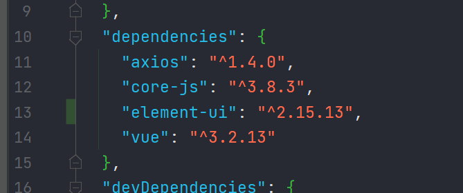


**element是支持 vue2.x 的，vue3.x 暂时还不支持 ElementUI**

如果直接使用，将会出现以下错误：

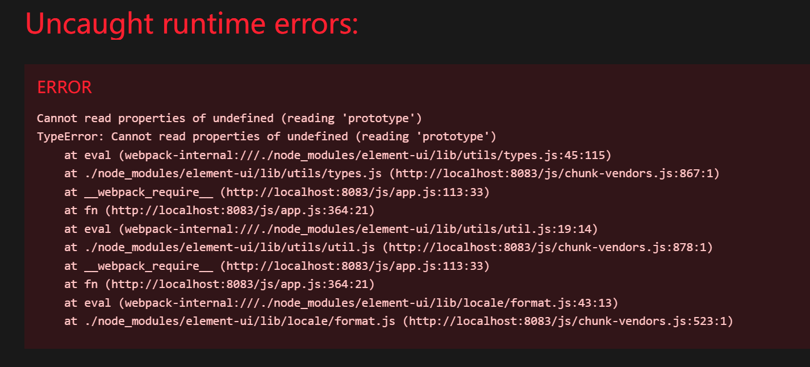


## vue3安装elementUI

命令：

```sh
npm install element-plus --save
```


```sh
PS D:\程序\2023Q3\vue-test> npm install element-plus --save

> vue-demi@0.14.5 postinstall D:\程序\2023Q3\vue-test\node_modules\vue-demi
> node ./scripts/postinstall.js

npm WARN element-ui@2.15.13 requires a peer of vue@^2.5.17 but none is installed. You must install peer dependencies yourself.
npm WARN optional SKIPPING OPTIONAL DEPENDENCY: fsevents@2.3.2 (node_modules\fsevents):
npm WARN notsup SKIPPING OPTIONAL DEPENDENCY: Unsupported platform for fsevents@2.3.2: wanted {"os":"darwin","arch":"any"} (current: {"os":"win32","arch":"x64"})

+ element-plus@2.3.6
added 19 packages from 25 contributors and audited 1008 packages in 67.979s

95 packages are looking for funding
  run `npm fund` for details

found 0 vulnerabilities

PS D:\程序\2023Q3\vue-test>
```


```sh
npm install @element-plus/icons-vue
```


```sh
PS D:\程序\2023Q3\vue-test> npm install @element-plus/icons-vue
npm WARN optional SKIPPING OPTIONAL DEPENDENCY: fsevents@2.3.2 (node_modules\fsevents):
npm WARN notsup SKIPPING OPTIONAL DEPENDENCY: Unsupported platform for fsevents@2.3.2: wanted {"os":"darwin","arch":"any"} (current: {"os":"win32","arch":"x64"})

+ @element-plus/icons-vue@2.1.0
updated 1 package and audited 1000 packages in 4.308s

95 packages are looking for funding
  run `npm fund` for details

found 0 vulnerabilities

PS D:\程序\2023Q3\vue-test>
```


```sh
npm install @vue/shared
```

```sh
PS D:\程序\2023Q3\vue-test> npm install @vue/shared
npm WARN optional SKIPPING OPTIONAL DEPENDENCY: fsevents@2.3.2 (node_modules\fsevents):
npm WARN notsup SKIPPING OPTIONAL DEPENDENCY: Unsupported platform for fsevents@2.3.2: wanted {"os":"darwin","arch":"any"} (current: {"os":"win32","arch":"x64"})

+ @vue/shared@3.3.4
added 1 package from 1 contributor and audited 1000 packages in 3.162s

95 packages are looking for funding
  run `npm fund` for details

found 0 vulnerabilities

PS D:\程序\2023Q3\vue-test>
```


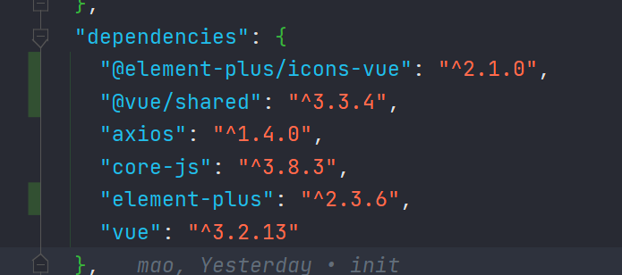


## 引入组件

vue2：

```js
import { createApp } from 'vue'
import App from './App18.vue'

import Vue from 'vue';
import ElementUI from 'element-ui';
import 'element-ui/lib/theme-chalk/index.css';
Vue.use(ElementUI);

createApp(App).mount('#app')
```


vue3：

```js
import { createApp } from 'vue'

import ElementPlus from 'element-plus'
import 'element-plus/dist/index.css'

import App from './App18.vue'

const app = createApp(App)

app.use(ElementPlus)
app.mount('#app')
```


## Button 按钮

```vue
<template>
  <div>
    <el-row>
      <el-button>默认按钮</el-button>
      <el-button type="primary">主要按钮</el-button>
      <el-button type="success">成功按钮</el-button>
      <el-button type="info">信息按钮</el-button>
      <el-button type="warning">警告按钮</el-button>
      <el-button type="danger">危险按钮</el-button>
    </el-row>

    <br>
    <br>

    <el-row>
      <el-button plain>朴素按钮</el-button>
      <el-button type="primary" plain>主要按钮</el-button>
      <el-button type="success" plain>成功按钮</el-button>
      <el-button type="info" plain>信息按钮</el-button>
      <el-button type="warning" plain>警告按钮</el-button>
      <el-button type="danger" plain>危险按钮</el-button>
    </el-row>

    <br>
    <br>

    <el-row>
      <el-button round>圆角按钮</el-button>
      <el-button type="primary" round>主要按钮</el-button>
      <el-button type="success" round>成功按钮</el-button>
      <el-button type="info" round>信息按钮</el-button>
      <el-button type="warning" round>警告按钮</el-button>
      <el-button type="danger" round>危险按钮</el-button>
    </el-row>


  </div>
</template>

<script>

export default {
  name: "App18"
}
</script>

<style scoped>

</style>
```


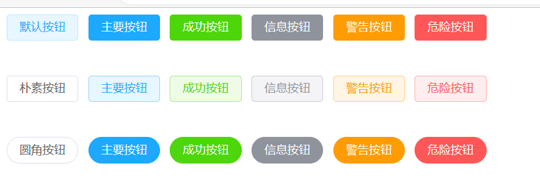


## Table 表格

```vue
<template>
  <div>

    <el-table
        :data="tableData"
        style="width: 100%">
      <el-table-column
          prop="id"
          label="学号"
          width="180">
      </el-table-column>
      <el-table-column
          prop="name"
          label="姓名"
          width="180">
      </el-table-column>
      <el-table-column
          prop="sex"
          label="性别"
          width="180">
      </el-table-column>
      <el-table-column
          prop="age"
          label="年龄"
          width="180">
      </el-table-column>
    </el-table>

  </div>
</template>

<script>
import {ElMessage} from 'element-plus'

export default {
  name: "App19",
  data()
  {
    return {
      tableData: (function ()
      {
        const data = [];
        for (let i = 0; i < 100; i++)
        {
          data.push({
            id: 100001 + i,
            name: "姓名" + (i + 1),
            sex: Math.random() > 0.5 ? "男" : "女",
            age: Math.round(Math.random() * 10 + 10)
          })
        }
        ElMessage({
          type: 'success',
          message: "加载完成"
        })
        return data;
      }())
    }
  }
}
</script>

<style scoped>

</style>
```


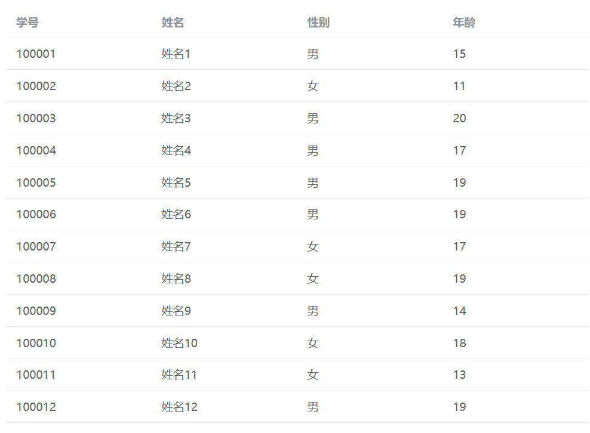


# Vue-Router

## 概述

vue 属于单页面应用，所谓的路由，就是根据浏览器路径不同，用不同的**视图组件**替换这个页面内容展示

vue-router是Vue.js官方的路由插件，它和vue.js是深度集成的，适合用于构建单页面应用。

ue的单页面应用是基于路由和组件的，路由用于设定访问路径，并将路径和组件映射起来。传统的页面应用，是用一些超链接来实现页面切换和跳转的。在vue-router单页面应用中，则是路径之间的切换，也就是组件的切换。路由模块的本质 就是建立起url和页面之间的映射关系。


至于我们为啥不能用a标签，这是因为用Vue做的都是单页应用，就相当于只有一个主的index.html页面，所以你写的标签是不起作用的，你必须使用vue-router来进行管理。


功能包括：

- 嵌套路由映射
- 动态路由选择
- 模块化、基于组件的路由配置
- 路由参数、查询、通配符
- 展示由 Vue.js 的过渡系统提供的过渡效果
- 细致的导航控制
- 自动激活 CSS 类的链接
- HTML5 history 模式或 hash 模式
- 可定制的滚动行为
- URL 的正确编码


## 官网地址和教程

官方网站：https://router.vuejs.org/zh/

教程地址：https://router.vuejs.org/zh/guide/


**vue2和vue3会有所不同**


## 安装

命令：

```sh
npm install vue-router@4
```


```sh
PS D:\程序\2023Q3\vue-test> npm install vue-router@4
npm WARN optional SKIPPING OPTIONAL DEPENDENCY: fsevents@2.3.2 (node_modules\fsevents):
npm WARN notsup SKIPPING OPTIONAL DEPENDENCY: Unsupported platform for fsevents@2.3.2: wanted {"os":"darwin","arch":"any"} (current: {"os":"win32","arch":"x64"})

+ vue-router@4.2.2
added 2 packages from 1 contributor and audited 1002 packages in 6.82s

96 packages are looking for funding
  run `npm fund` for details

found 0 vulnerabilities

PS D:\程序\2023Q3\vue-test>
```


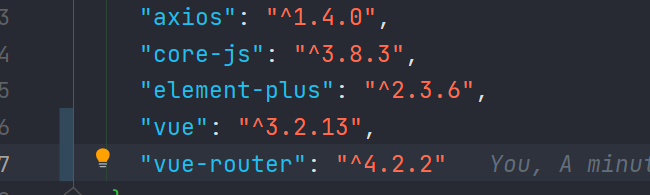


## 入门

src下的router目录创建Router1.vue：

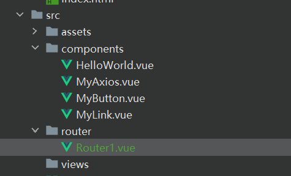


内容如下：

```vue
<script>

import {createRouter, createWebHashHistory} from 'vue-router'
import App from '@/App'
import App2 from '@/App2'
import App3 from '@/App3'
import App4 from '@/App4'
import App5 from '@/App5'
import App6 from '@/App6'
import App7 from '@/App7'
import App8 from '@/App8'
import App9 from '@/App9'
import App10 from '@/App10'
import App11 from '@/App11'
import App12 from '@/App12'
import App13 from '@/App13'
import App15 from '@/App15'
import App14 from '@/App14'
import App16 from '@/App16'
import App17 from '@/App17'
import App18 from '@/App18'
import App19 from '@/App19'


const routes = [
  {
    path: '/',
    component: App
  },
  {
    path: '/app2',
    component: App2
  },
  {
    path: '/app3',
    component: App3
  },
  {
    path: '/app4',
    component: App4
  },
  {
    path: '/app5',
    component: App5
  },
  {
    path: '/app6',
    component: App6
  },
  {
    path: '/app7',
    component: App7
  },
  {
    path: '/app8',
    component: App8
  },
  {
    path: '/app9',
    component: App9
  },
  {
    path: '/app10',
    component: App10
  },
  {
    path: '/app11',
    component: App11
  },
  {
    path: '/app12',
    component: App12
  },
  {
    path: '/app13',
    component: App13
  },
  {
    path: '/app14',
    component: App14
  },
  {
    path: '/app15',
    component: App15
  },
  {
    path: '/app16',
    component: App16
  },
  {
    path: '/app17',
    component: App17
  },
  {
    path: '/app18',
    component: App18
  },
  {
    path: '/app19',
    component: App19
  },
]

const router = createRouter({
  //内部提供了 history 模式的实现。为了简单起见，我们在这里使用 hash 模式。
  history: createWebHashHistory(),
  routes, // `routes: routes` 的缩写
})

export default router

</script>
```


更改main.js


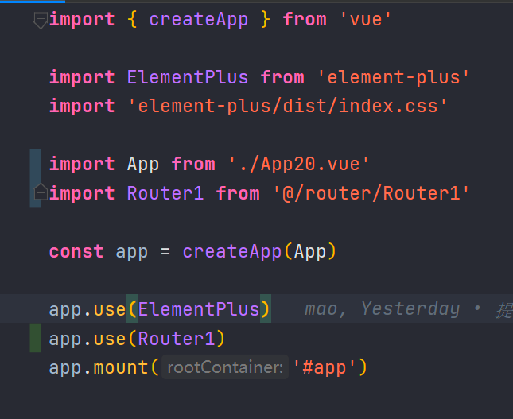


```js
import { createApp } from 'vue'

import ElementPlus from 'element-plus'
import 'element-plus/dist/index.css'

import App from './App20.vue'
import Router1 from '@/router/Router1'

const app = createApp(App)

app.use(ElementPlus)
app.use(Router1)
app.mount('#app')
```


App20.vue：

```vue
<template>

  <div class="all">
    <router-view class="r"></router-view>
  </div>

</template>

<script>
export default {
  name: "App20"
}
</script>

<style scoped>
.all {
  padding: 20px;
  background: #b5e3f1;
}
.r{
  background: cornflowerblue;
}

body {

}
</style>
```


手动更改浏览器地址栏，测试如下：

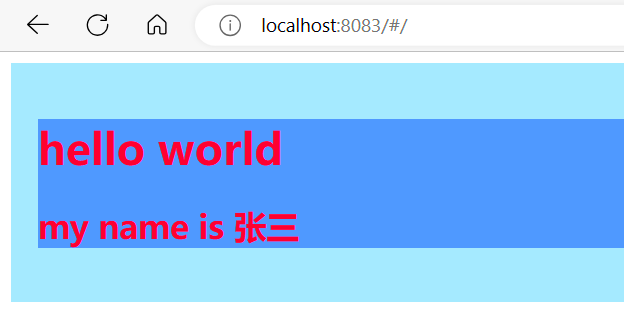


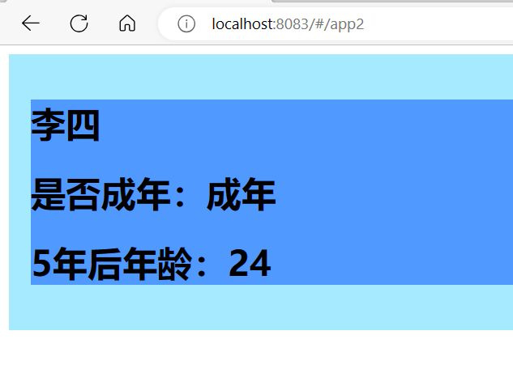


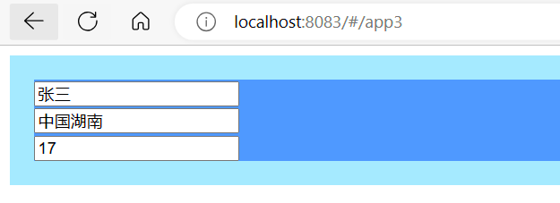


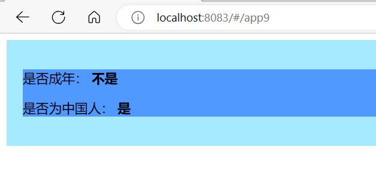


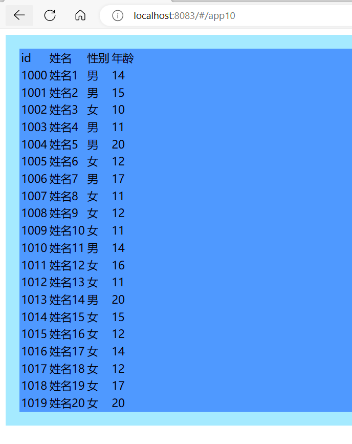


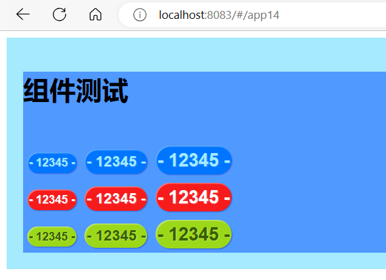


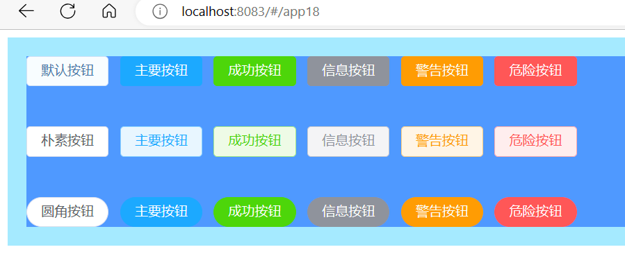


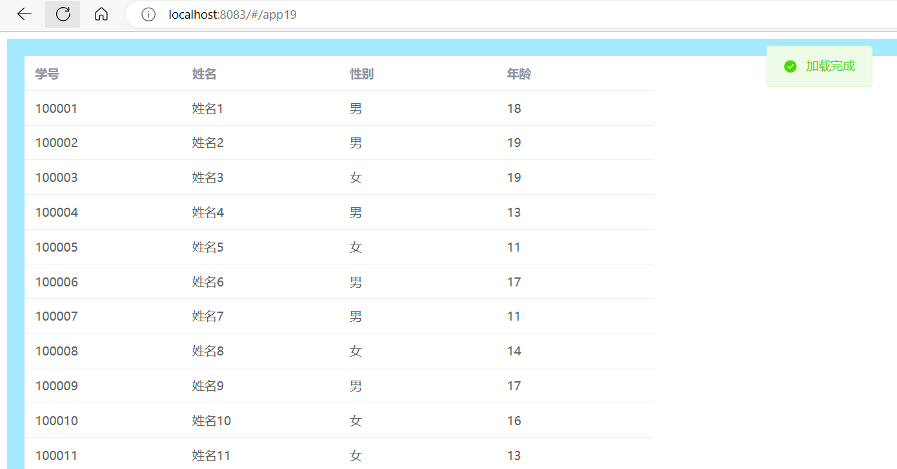


*  `<router-view>` 起到占位作用，改变路径后，这个路径对应的视图组件就会占据 `<router-view>` 的位置，替换掉它之前的内容


## 跳转

### 概述

有两种方式：

* 使用router-link标签跳转
* 使用js代码跳转


### router-link标签

```vue
<template>

  <el-container>
    <el-aside width="200px">
      <div class="link">

        <!--使用 router-link 组件进行导航 -->
        <!--通过传递 `to` 来指定链接 -->
        <router-link to="/">首页</router-link>
        <br>
        <router-link to="/app2">app2</router-link>
        <br>
        <router-link to="/app3">app3</router-link>
        <br>
        <router-link to="/app4">app4</router-link>
        <br>
        <router-link to="/app5">app5</router-link>
        <br>
        <router-link to="/app6">app6</router-link>
        <br>
        <router-link to="/app7">app7</router-link>
        <br>
        <router-link to="/app8">app8</router-link>
        <br>
        <router-link to="/app9">app9</router-link>
        <br>
        <router-link to="/app10">app10</router-link>
        <br>
        <router-link to="/app11">app11</router-link>
        <br>
        <router-link to="/app12">app12</router-link>
        <br>
        <router-link to="/app13">app13</router-link>
        <br>
        <router-link to="/app14">app14</router-link>
        <br>
        <router-link to="/app15">app15</router-link>
        <br>
        <router-link to="/app16">app16</router-link>
        <br>
        <router-link to="/app17">app17</router-link>
        <br>
        <router-link to="/app18">app18</router-link>
        <br>
        <router-link to="/app19">app19</router-link>

      </div>
    </el-aside>
    <el-container>
      <el-header>路由跳转</el-header>
      <el-main>
        <div class="all">
          <router-view class="r"></router-view>
        </div>
      </el-main>
    </el-container>
  </el-container>

</template>

<script>
export default {
  name: "App21"
}
</script>

<style scoped>
.all {
  padding: 20px;
  background: #b5e3f1;
}

.r {
  background: cornflowerblue;
}

.link{
  background: #42b983;
  height: 100vh;
}
</style>
```


main.js

```vue
import { createApp } from 'vue'

import ElementPlus from 'element-plus'
import 'element-plus/dist/index.css'

import App from './App21.vue'
import Router1 from '@/router/Router1'

const app = createApp(App)

app.use(ElementPlus)
app.use(Router1)
app.mount('#app')
```


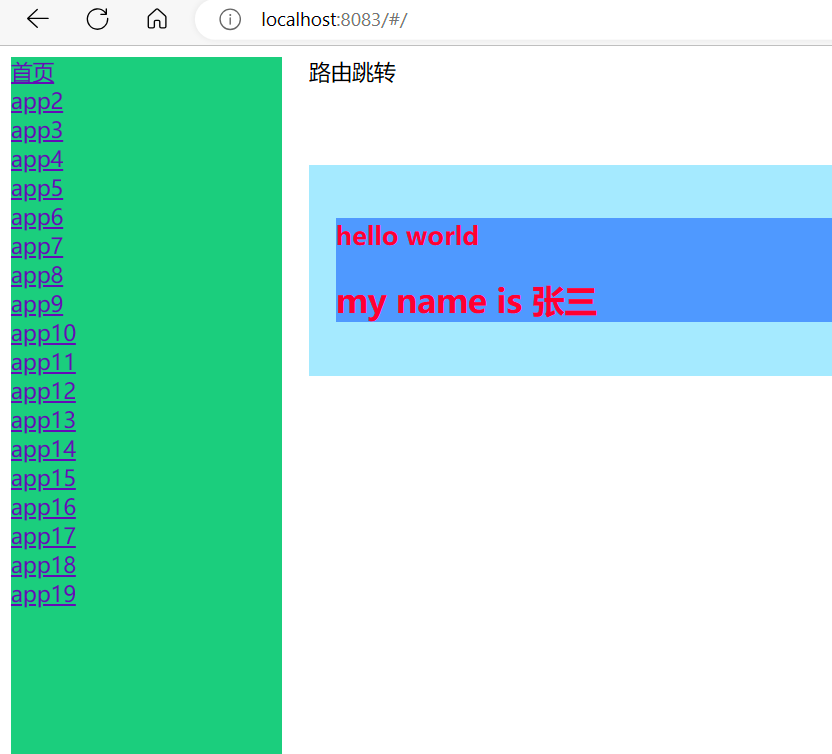


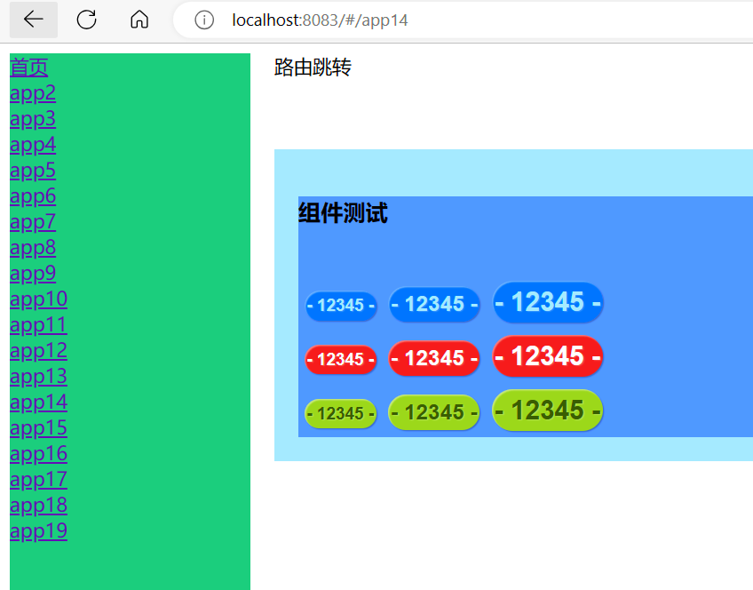


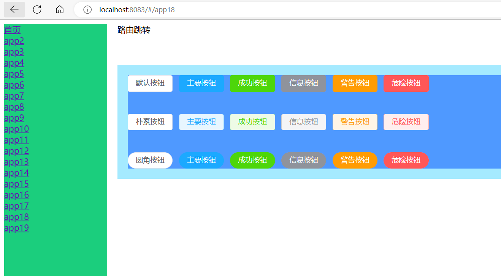


我们没有使用常规的 a 标签，而是使用一个自定义组件 router-link 来创建链接。这使得 Vue Router 可以在不重新加载页面的情况下更改 URL，处理 URL 的生成以及编码


### js代码

使用`this.$router.push('/')`来实现跳转


```vue
<template>

  <el-container>
    <el-aside width="200px">
      <div className="link">

        <br>
        <el-input type="text" size="large" autocomplete="false" v-model="to"/>
        <br>
        <el-button type="success" size="large" @click="go">点击跳转</el-button>

      </div>
    </el-aside>
    <el-container>
      <el-header>路由跳转</el-header>
      <el-main>
        <div className="all">
          <router-view className="r"></router-view>
        </div>
      </el-main>
    </el-container>
  </el-container>

</template>

<script>
export default {
  name: "App22",
  data()
  {
    return {
      to: "/",
    }
  },
  methods:
      {
        go()
        {
          console.log("跳转到：" + this.to)
          this.$router.push(this.to);
        }
      }

}
</script>

<style scoped>
.all {
  padding: 20px;
  background: #b5e3f1;
}

.r {
  background: cornflowerblue;
}

.link {
  background: #42b983;
  height: 100vh;
}
</style>
```


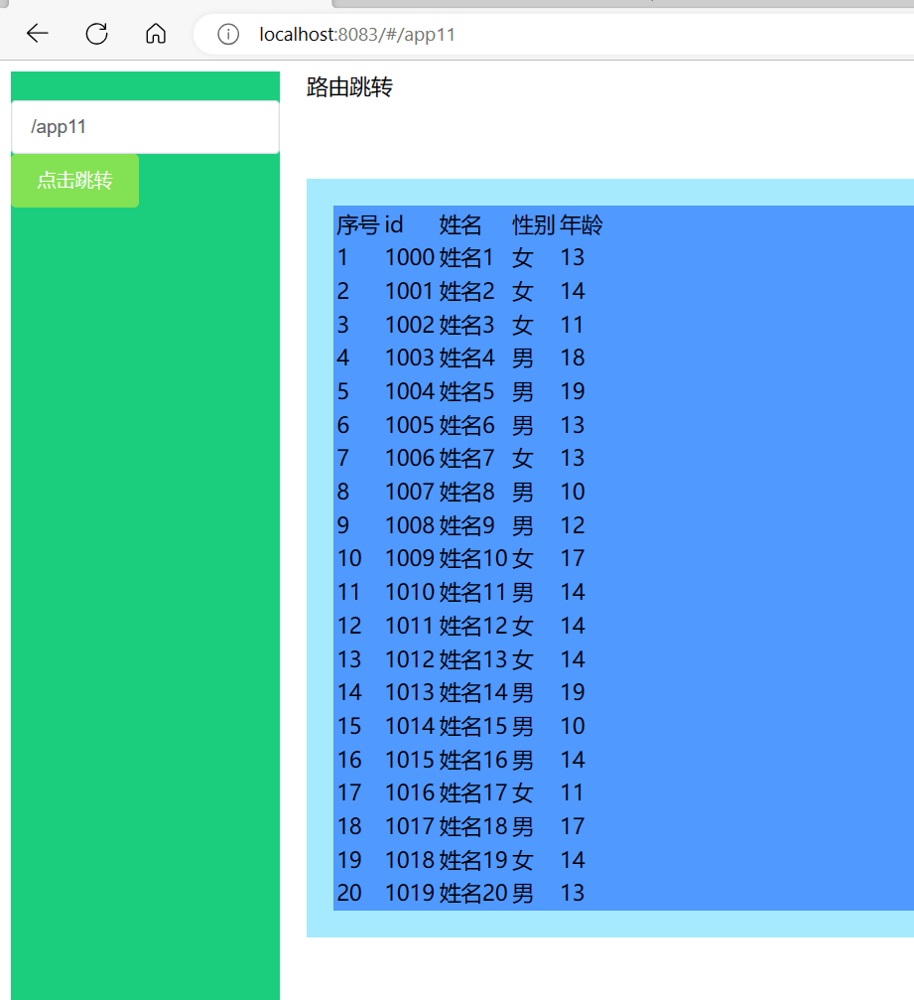


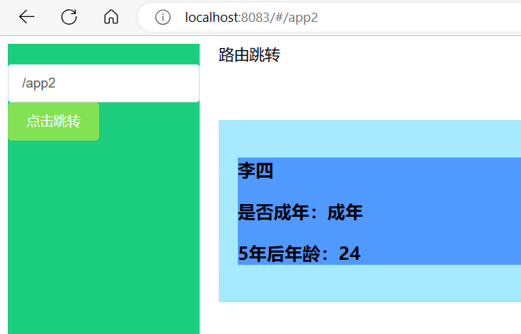


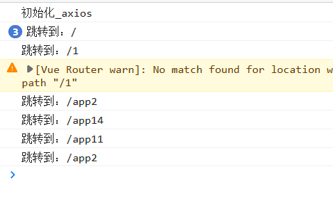


## 动态路由

对路由的添加通常是通过 routes 选项来完成的，但是在某些情况下，你可能想在应用程序已经运行的时候添加或删除路由。

动态路由主要通过两个函数实现。`router.addRoute()` 和 `router.removeRoute()`。它们**只**注册一个新的路由，也就是说，如果新增加的路由与当前位置相匹配，就需要你用 `router.push()` 或 `router.replace()` 来**手动导航**，才能显示该新路由


有几个不同的方法来删除现有的路由：

1. 通过添加一个名称冲突的路由。如果添加与现有途径名称相同的途径，会先删除路由，再添加路由：

```js
router.addRoute({ path: '/about', name: 'about', component: About })
// 这将会删除之前已经添加的路由，因为他们具有相同的名字且名字必须是唯一的
router.addRoute({ path: '/other', name: 'about', component: Other })
```


2. 通过调用 `router.addRoute()` 返回的回调
3. 通过使用 `router.removeRoute()` 按名称删除路由：

```js
router.addRoute({ path: '/about', name: 'about', component: About })
// 删除路由
router.removeRoute('about')
```


当路由被删除时，**所有的别名和子路由也会被同时删除**


要将嵌套路由添加到现有的路由中，可以将路由的 *name* 作为第一个参数传递给 `router.addRoute()`，这将有效地添加路由，就像通过 `children` 添加的一样：

```js
router.addRoute({ name: 'admin', path: '/admin', component: Admin })
router.addRoute('admin', { path: 'settings', component: AdminSettings })
```

相当于：

```js
router.addRoute({
  name: 'admin',
  path: '/admin',
  component: Admin,
  children: [{ path: 'settings', component: AdminSettings }],
})
```


Vue Router 提供了两个功能来查看现有的路由：

* `router.hasRoute()`：检查路由是否存在。
* `router.getRoutes()`：获取一个包含所有路由记录的数组。


创建Router2.vue

```vue
<script>

import {createRouter, createWebHashHistory} from 'vue-router'


//此数据可以从后端获取
const routes = [
  {
    id: 1,
    path: '/',
    component: "App"
  },
  {
    id: 2,
    path: '/app2',
    component: "App2"
  },
  {
    id: 3,
    path: '/app3',
    component: "App3"
  },
  {
    id: 4,
    path: '/app4',
    component: "App4"
  },
  {
    id: 5,
    path: '/app5',
    component: "App5"
  },
  {
    id: 6,
    path: '/app6',
    component: "App6"
  },
  {
    id: 7,
    path: '/app7',
    component: "App7"
  },
  {
    id: 8,
    path: '/app8',
    component: "App8"
  },
  {
    id: 9,
    path: '/app9',
    component: "App9"
  },
  {
    id: 10,
    path: '/app10',
    component: "App10"
  },
  {
    id: 11,
    path: '/app11',
    component: "App11"
  },
  {
    id: 12,
    path: '/app12',
    component: "App12"
  },
  {
    id: 13,
    path: '/app13',
    component: "App13"
  },
  {
    id: 14,
    path: '/app14',
    component: "App14"
  },
  {
    id: 15,
    path: '/app15',
    component: "App15"
  },
  {
    id: 16,
    path: '/app16',
    component: "App16"
  },
  {
    id: 17,
    path: '/app17',
    component: "App17"
  },
  {
    id: 18,
    path: '/app18',
    component: "App18"
  },
  {
    id: 19,
    path: '/app19',
    component: "App19"
  },
]

const router = createRouter({
  //内部提供了 history 模式的实现。为了简单起见，我们在这里使用 hash 模式。
  history: createWebHashHistory(),
  routes:[]
})


for (let i = 0; i < routes.length; i++)
{
  const r = routes[i];
  // 动态添加路由
  // 参数1：父路由名称
  // 参数2：路由信息对象
  router.addRoute("a", {
    path: r.path,
    name: r.id,
    //记住符号是 ` 而不是 ' 或者 "
    component: () => import(`@/${r.component}.vue`)
  })
  console.log("添加" + r.path)
}

export default router

</script>
```


修改main.js

```js
import { createApp } from 'vue'

import ElementPlus from 'element-plus'
import 'element-plus/dist/index.css'

import App from './App22.vue'
import Router2 from '@/router/Router2'

const app = createApp(App)

app.use(ElementPlus)
app.use(Router2)
app.mount('#app')
```


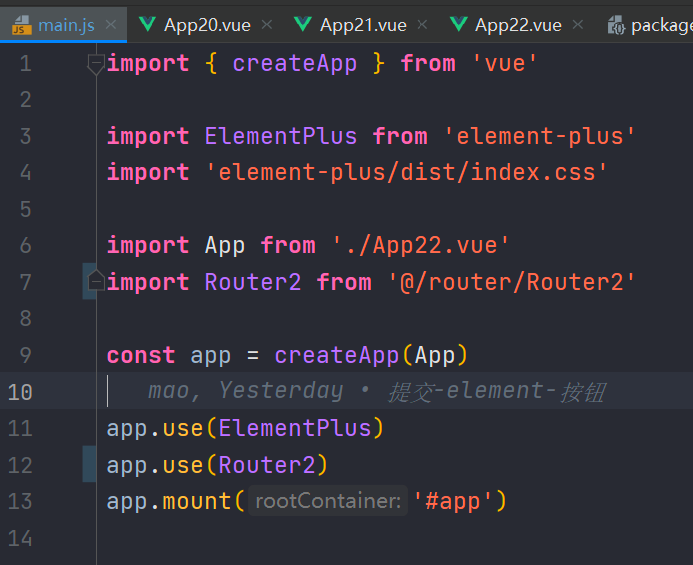


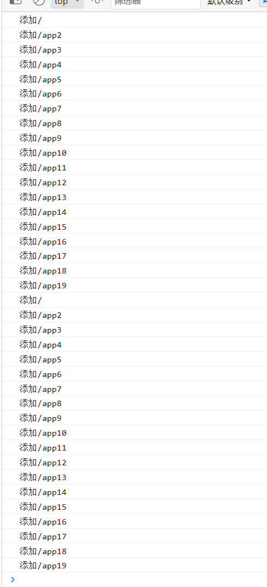


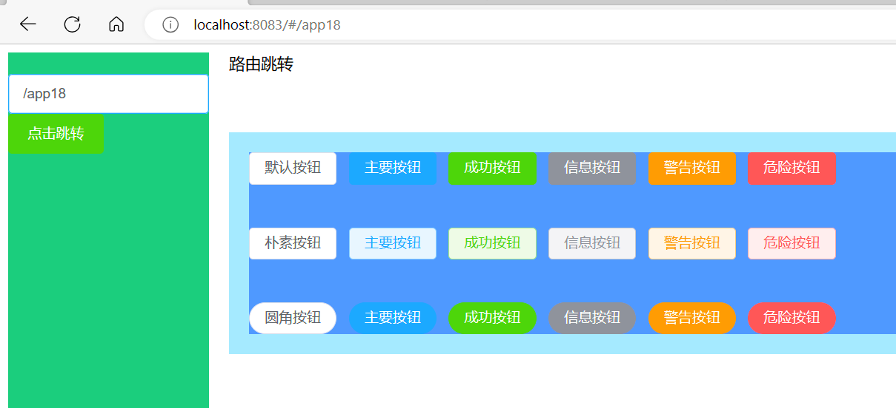


## 捕获所有路由或 404 Not found 路由

常规参数只匹配 url 片段之间的字符，用 `/` 分隔。如果我们想匹配**任意路径**，我们可以使用自定义的 *路径参数* 正则表达式，在 *路径参数* 后面的括号中加入 正则表达式 


编写404.vue

```vue
<template>
  <p>404 not found</p>
</template>

<script>
export default {
  name: "404"
}
</script>

<style scoped>
p {
  font-size: 5em;
  color: red;
}
</style>
```


```vue
<script>

import {createRouter, createWebHashHistory} from 'vue-router'


//此数据可以从后端获取
const routes = [
  {
    id: 1,
    path: '/',
    component: "App"
  },
  {
    id: 2,
    path: '/app2',
    component: "App2"
  },
  {
    id: 3,
    path: '/app3',
    component: "App3"
  },
  {
    id: 4,
    path: '/app4',
    component: "App4"
  },
  {
    id: 5,
    path: '/app5',
    component: "App5"
  },
  {
    id: 6,
    path: '/app6',
    component: "App6"
  },
  {
    id: 7,
    path: '/app7',
    component: "App7"
  },
  {
    id: 8,
    path: '/app8',
    component: "App8"
  },
  {
    id: 9,
    path: '/app9',
    component: "App9"
  },
  {
    id: 10,
    path: '/app10',
    component: "App10"
  },
  {
    id: 11,
    path: '/app11',
    component: "App11"
  },
  {
    id: 12,
    path: '/app12',
    component: "App12"
  },
  {
    id: 13,
    path: '/app13',
    component: "App13"
  },
  {
    id: 14,
    path: '/app14',
    component: "App14"
  },
  {
    id: 15,
    path: '/app15',
    component: "App15"
  },
  {
    id: 16,
    path: '/app16',
    component: "App16"
  },
  {
    id: 17,
    path: '/app17',
    component: "App17"
  },
  {
    id: 18,
    path: '/app18',
    component: "App18"
  },
  {
    id: 19,
    path: '/app19',
    component: "App19"
  },
  {
    id: 999,
    path: '/:pathMatch(.*)*',
    component: "views/404"
  },
]

const router = createRouter({
  //内部提供了 history 模式的实现。为了简单起见，我们在这里使用 hash 模式。
  history: createWebHashHistory(),
  routes:[]
})


for (let i = 0; i < routes.length; i++)
{
  const r = routes[i];
  // 动态添加路由
  // 参数1：父路由名称
  // 参数2：路由信息对象
  router.addRoute("a", {
    path: r.path,
    name: r.id,
    //记住符号是 ` 而不是 ' 或者 "
    component: () => import(`@/${r.component}.vue`)
  })
  console.log("添加" + r.path)
}

export default router

</script>
```


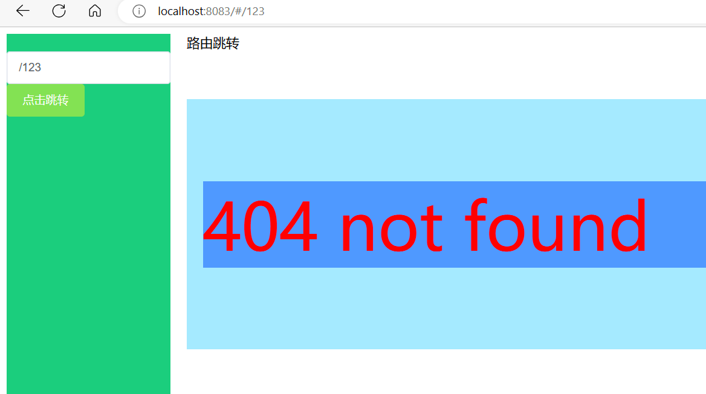


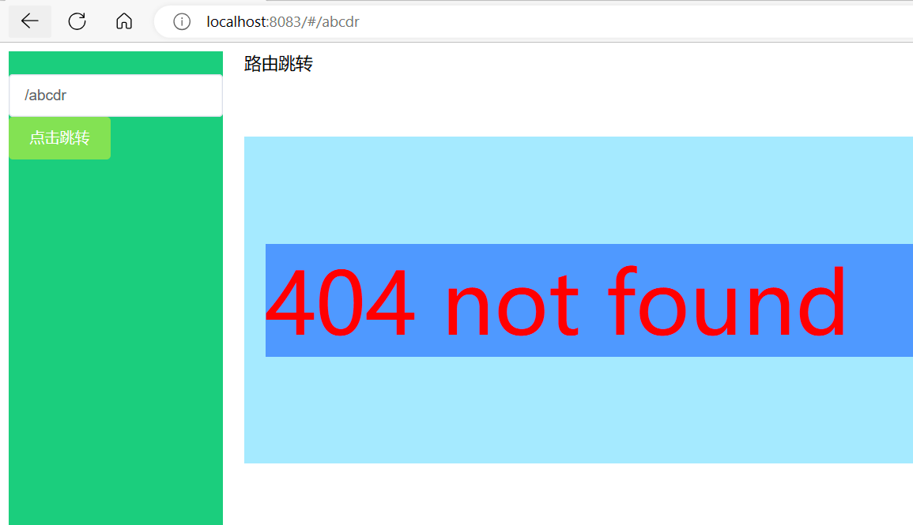


## 重置路由

在用户注销时应当重置路由


```vue
<script>

import {createRouter, createWebHashHistory} from 'vue-router'


//此数据可以从后端获取
const routes = [
  {
    id: 1,
    path: '/',
    component: "App"
  },
  {
    id: 2,
    path: '/app2',
    component: "App2"
  },
  {
    id: 3,
    path: '/app3',
    component: "App3"
  },
  {
    id: 4,
    path: '/app4',
    component: "App4"
  },
  {
    id: 5,
    path: '/app5',
    component: "App5"
  },
  {
    id: 6,
    path: '/app6',
    component: "App6"
  },
  {
    id: 7,
    path: '/app7',
    component: "App7"
  },
  {
    id: 8,
    path: '/app8',
    component: "App8"
  },
  {
    id: 9,
    path: '/app9',
    component: "App9"
  },
  {
    id: 10,
    path: '/app10',
    component: "App10"
  },
  {
    id: 11,
    path: '/app11',
    component: "App11"
  },
  {
    id: 12,
    path: '/app12',
    component: "App12"
  },
  {
    id: 13,
    path: '/app13',
    component: "App13"
  },
  {
    id: 14,
    path: '/app14',
    component: "App14"
  },
  {
    id: 15,
    path: '/app15',
    component: "App15"
  },
  {
    id: 16,
    path: '/app16',
    component: "App16"
  },
  {
    id: 17,
    path: '/app17',
    component: "App17"
  },
  {
    id: 18,
    path: '/app18',
    component: "App18"
  },
  {
    id: 19,
    path: '/app19',
    component: "App19"
  },
  {
    id: 999,
    path: '/:pathMatch(.*)*',
    component: "views/404"
  },
]

const router = createRouter({
  //内部提供了 history 模式的实现。为了简单起见，我们在这里使用 hash 模式。
  history: createWebHashHistory(),
  routes: []
})


for (let i = 0; i < routes.length; i++)
{
  const r = routes[i];
  // 动态添加路由
  // 参数1：父路由名称
  // 参数2：路由信息对象
  router.addRoute("a", {
    path: r.path,
    name: r.id,
    //记住符号是 ` 而不是 ' 或者 "
    component: () => import(`@/${r.component}.vue`)
  })
  console.log("添加" + r.path)
}

/**
 * 重置路由
 */
export function resetRouter()
{
  for (let i = 0; i < routes.length; i++)
  {
    const r = routes[i];
    if (r.id === 999)
    {
      break;
    }
    router.removeRoute(r.id);
  }
}

export default router

</script>
```


```vue
<template>

  <el-container>
    <el-aside width="200px">
      <div className="link">

        <br>
        <el-input type="text" size="large" autocomplete="false" v-model="to"/>
        <br>
        <el-button type="success" size="large" @click="go">点击跳转</el-button>
        <br>
        <el-button type="success" size="large" @click="resetRouter">点击重置路由</el-button>

      </div>
    </el-aside>
    <el-container>
      <el-header>路由跳转</el-header>
      <el-main>
        <div className="all">
          <router-view className="r"></router-view>
        </div>
      </el-main>
    </el-container>
  </el-container>

</template>

<script>
import {resetRouter} from '@/router/Router2'

export default {
  name: "App23",
  data()
  {
    return {
      to: "/",
    }
  },
  methods:
      {
        go()
        {
          console.log("跳转到：" + this.to)
          this.$router.push(this.to);
        },
        resetRouter()
        {
          console.log("重置路由")
          resetRouter();
        }
      }

}
</script>

<style scoped>
.all {
  padding: 20px;
  background: #b5e3f1;
}

.r {
  background: cornflowerblue;
}

.link {
  background: #42b983;
  height: 100vh;
}
</style>
```


点击重置后

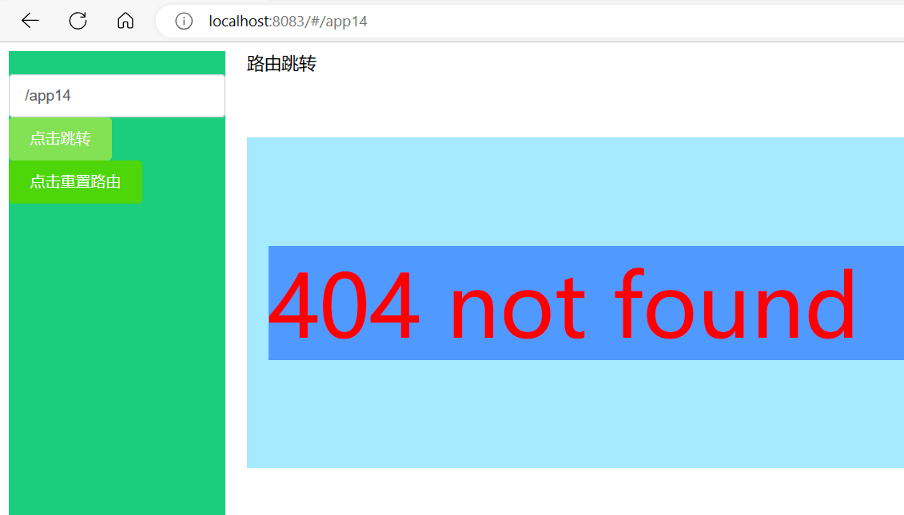


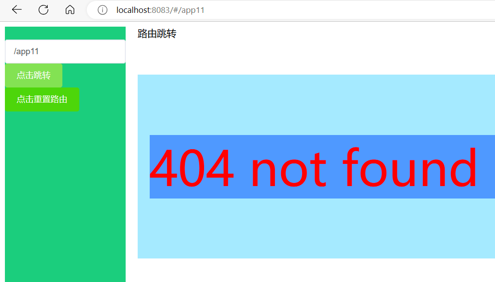


## 页面刷新问题

页面刷新后，会导致动态添加的路由失效，解决方法是将路由数据存入 sessionStorage 或者 localStorage 


```vue
<script>

import {createRouter, createWebHashHistory} from 'vue-router'


//此数据可以从后端获取
let routes = [
  {
    id: 1,
    path: '/',
    component: "App"
  },
  {
    id: 2,
    path: '/app2',
    component: "App2"
  },
  {
    id: 3,
    path: '/app3',
    component: "App3"
  },
  {
    id: 4,
    path: '/app4',
    component: "App4"
  },
  {
    id: 5,
    path: '/app5',
    component: "App5"
  },
  {
    id: 6,
    path: '/app6',
    component: "App6"
  },
  {
    id: 7,
    path: '/app7',
    component: "App7"
  },
  {
    id: 8,
    path: '/app8',
    component: "App8"
  },
  {
    id: 9,
    path: '/app9',
    component: "App9"
  },
  {
    id: 10,
    path: '/app10',
    component: "App10"
  },
  {
    id: 11,
    path: '/app11',
    component: "App11"
  },
  {
    id: 12,
    path: '/app12',
    component: "App12"
  },
  {
    id: 13,
    path: '/app13',
    component: "App13"
  },
  {
    id: 14,
    path: '/app14',
    component: "App14"
  },
  {
    id: 15,
    path: '/app15',
    component: "App15"
  },
  {
    id: 16,
    path: '/app16',
    component: "App16"
  },
  {
    id: 17,
    path: '/app17',
    component: "App17"
  },
  {
    id: 18,
    path: '/app18',
    component: "App18"
  },
  {
    id: 19,
    path: '/app19',
    component: "App19"
  },
  {
    id: 999,
    path: '/:pathMatch(.*)*',
    component: "views/404"
  },
]

const router = createRouter({
  //内部提供了 history 模式的实现。为了简单起见，我们在这里使用 hash 模式。
  history: createWebHashHistory(),
  routes: []
})

/**
 * 添加路由
 * @param array 数组
 */
function addRoutes(array)
{
  for (let i = 0; i < array.length; i++)
  {
    const r = array[i];
    // 动态添加路由
    // 参数1：父路由名称
    // 参数2：路由信息对象
    router.addRoute("a", {
      path: r.path,
      name: r.id,
      //记住符号是 ` 而不是 ' 或者 "
      component: () => import(`@/${r.component}.vue`)
    })
    console.log("添加" + r.path)
    routes = array;
  }
}

addRoutes(routes);

/**
 * 重置路由
 */
export function resetRouter()
{
  for (let i = 0; i < routes.length; i++)
  {
    const r = routes[i];
    if (r.id === 999)
    {
      break;
    }
    router.removeRoute(r.id);
  }
}

/**
 * 从SessionStorage里加载路由信息
 */
export function loadFromSessionStorage()
{
  console.log('从SessionStorage里加载路由信息')
  console.log(router.getRoutes().length)

  const result = JSON.parse(sessionStorage.getItem("router"))
  console.log(result)
  addRoutes(result);
}

/**
 * 保存路由信息到SessionStorage
 */
export function saveToSessionStorage()
{
  console.log("保存路由到SessionStorage")
  sessionStorage.setItem("router", JSON.stringify(routes))
}

export default router

</script>
```


```vue
<template>

  <el-container>
    <el-aside width="200px">
      <div className="link">

        <br>
        <el-input type="text" size="large" autocomplete="false" v-model="to"/>
        <br>
        <el-button type="success" size="large" @click="go">点击跳转</el-button>
        <br>
        <el-button type="success" size="large" @click="resetRouter">点击重置路由</el-button>
        <br>
        <el-button type="success" size="large" @click="saveToSessionStorage">保存路由信息</el-button>
        <br>
        <el-button type="success" size="large" @click="loadFromSessionStorage">加载路由信息</el-button>

      </div>
    </el-aside>
    <el-container>
      <el-header>路由跳转</el-header>
      <el-main>
        <div className="all">
          <router-view className="r"></router-view>
        </div>
      </el-main>
    </el-container>
  </el-container>

</template>

<script>
import {resetRouter, loadFromSessionStorage, saveToSessionStorage} from '@/router/Router2'

export default {
  name: "App24",
  data()
  {
    return {
      to: "/",
    }
  },
  methods:
      {
        go()
        {
          console.log("跳转到：" + this.to)
          this.$router.push(this.to);
        },
        resetRouter()
        {
          console.log("重置路由")
          resetRouter();
        },
        loadFromSessionStorage()
        {
          loadFromSessionStorage();
        },
        saveToSessionStorage()
        {
          saveToSessionStorage();
        }
      }

}
</script>

<style scoped>
.all {
  padding: 20px;
  background: #b5e3f1;
}

.r {
  background: cornflowerblue;
}

.link {
  background: #42b983;
  height: 100vh;
}
</style>
```


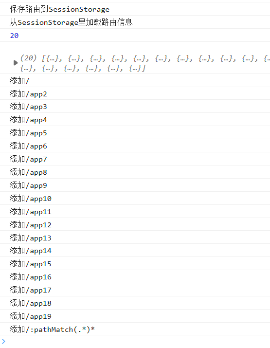


## 嵌套路由

一些应用程序的 UI 由多层嵌套的组件组成。在这种情况下，URL 的片段通常对应于特定的嵌套组件结构，例如：

```sh
/user/johnny/profile                     /user/johnny/posts
+------------------+                  +-----------------+
| User             |                  | User            |
| +--------------+ |                  | +-------------+ |
| | Profile      | |  +------------>  | | Posts       | |
| |              | |                  | |             | |
| +--------------+ |                  | +-------------+ |
+------------------+                  +-----------------+
```


Router3.vue

```vue
<script>

import {createRouter, createWebHashHistory} from 'vue-router'
import App from '@/App'
import App2 from '@/App2'
import App3 from '@/App3'
import App4 from '@/App4'
import App5 from '@/App5'
import App6 from '@/App6'
import App7 from '@/App7'
import App8 from '@/App8'
import App9 from '@/App9'
import App10 from '@/App10'
import App11 from '@/App11'
import App12 from '@/App12'
import App13 from '@/App13'
import App15 from '@/App15'
import App14 from '@/App14'
import App16 from '@/App16'
import App17 from '@/App17'
import App18 from '@/App18'
import App19 from '@/App19'
import C1 from '@/views/C1'
import C2 from '@/views/C2'
import NotFound from '@/views/404.vue'


const routes = [
  {
    path: '/',
    component: App
  },
  {
    path: "/c1",
    component: C1,
    children:
        [
          {
            path: '/c1/app2',
            component: App2
          },
          {
            path: '/c1/app3',
            component: App3
          },
          {
            path: '/c1/app4',
            component: App4
          },
          {
            path: '/c1/app5',
            component: App5
          },
          {
            path: '/c1/app6',
            component: App6
          },
          {
            path: '/c1/app7',
            component: App7
          },
          {
            path: '/c1/app8',
            component: App8
          },
          {
            path: '/c1/app9',
            component: App9
          },
          {
            path: '/c1/app10',
            component: App10
          },
          {
            path: '/c1/app11',
            component: App11
          },
        ]
  },
  {
    path: "/c2",
    component: C2,
    children:
        [
          {
            path: '/c2/app9',
            component: App9
          },
          {
            path: '/c2/app10',
            component: App10
          },
          {
            path: '/c2/app11',
            component: App11
          },
          {
            path: '/c2/app12',
            component: App12
          },
          {
            path: '/c2/app13',
            component: App13
          },
          {
            path: '/c2/app14',
            component: App14
          },
          {
            path: '/c2/app15',
            component: App15
          },
          {
            path: '/c2/app16',
            component: App16
          },
          {
            path: '/c2/app17',
            component: App17
          },
          {
            path: '/c2/app18',
            component: App18
          },
          {
            path: '/c2/app19',
            component: App19
          },
        ]
  },
  {
    path: '/:pathMatch(.*)*',
    component: NotFound
  }
]

const router = createRouter({
  //内部提供了 history 模式的实现。为了简单起见，我们在这里使用 hash 模式。
  history: createWebHashHistory(),
  routes, // `routes: routes` 的缩写
})

export default router

</script>
```


* 要将组件渲染到这个嵌套的 `router-view` 中，我们需要在路由中配置 `children`
* 以 / 开头的嵌套路径将被视为根路径。这允许你利用组件嵌套，而不必使用嵌套的 URL


C1.vue

```vue
<template>

  <el-container>
    <el-container>
      <el-header>嵌套路由-c1</el-header>
      <el-main>
        <div className="all">
          <router-view className="r"></router-view>
        </div>
      </el-main>
    </el-container>
  </el-container>

</template>

<script>
export default {
  name: "App22",
  data()
  {
    return {
      to: "/",
    }
  },
  methods:
      {
        go()
        {
          console.log("跳转到：" + this.to)
          this.$router.push(this.to);
        }
      }

}
</script>

<style scoped>
.all {
  padding: 20px;
  background: #b5e3f1;
}

.r {
  background: cornflowerblue;
}

.link {
  background: #42b983;
  height: 100vh;
}
</style>
```


C2.vue

```vue
<template>

  <el-container>
    <el-container>
      <el-header>嵌套路由-c2</el-header>
      <el-main>
        <div className="all">
          <router-view className="r"></router-view>
        </div>
      </el-main>
    </el-container>
  </el-container>

</template>

<script>
export default {
  name: "App22",
  data()
  {
    return {
      to: "/",
    }
  },
  methods:
      {
        go()
        {
          console.log("跳转到：" + this.to)
          this.$router.push(this.to);
        }
      }

}
</script>

<style scoped>
.all {
  padding: 20px;
  background: #b5e3f1;
}

.r {
  background: cornflowerblue;
}

.link {
  background: #42b983;
  height: 100vh;
}
</style>
```


```vue
<template>

  <el-container>
    <el-aside width="200px">
      <div className="link">

        <br>
        <el-input type="text" size="large" autocomplete="false" v-model="to"/>
        <br>
        <el-button type="success" size="large" @click="go">点击跳转</el-button>

      </div>
    </el-aside>
    <el-container>
      <el-header>路由跳转</el-header>
      <el-main>
        <div className="all">
          <router-view className="r"></router-view>
        </div>
      </el-main>
    </el-container>
  </el-container>

</template>

<script>
export default {
  name: "App25",
  data()
  {
    return {
      to: "/",
    }
  },
  methods:
      {
        go()
        {
          console.log("跳转到：" + this.to)
          this.$router.push(this.to);
        }
      }

}
</script>

<style scoped>
.all {
  padding: 20px;
  background: #b5e3f1;
}

.r {
  background: coral;
}

.link {
  background: #42b983;
  height: 100vh;
}
</style>
```


main.js

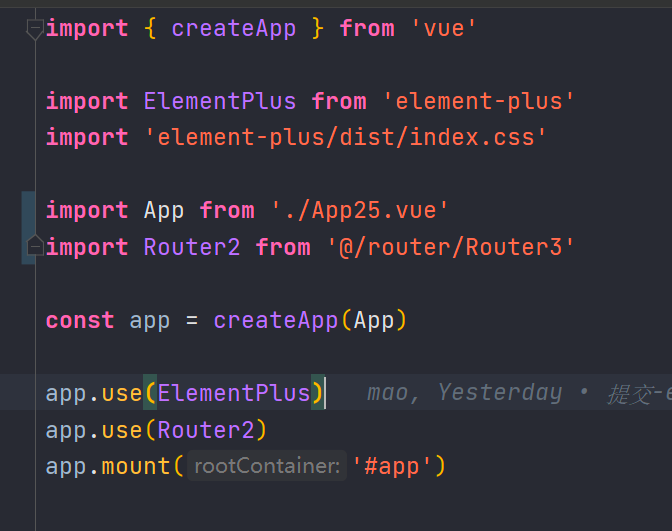


```js
import { createApp } from 'vue'

import ElementPlus from 'element-plus'
import 'element-plus/dist/index.css'

import App from './App25.vue'
import Router2 from '@/router/Router3'

const app = createApp(App)

app.use(ElementPlus)
app.use(Router2)
app.mount('#app')
```


测试

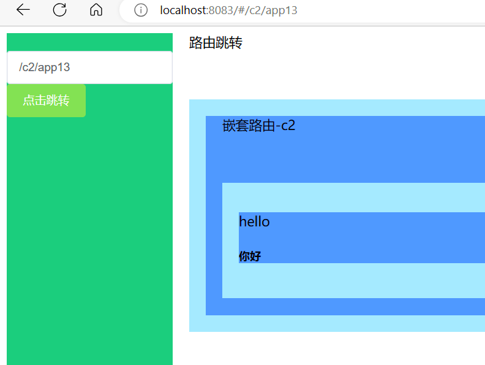


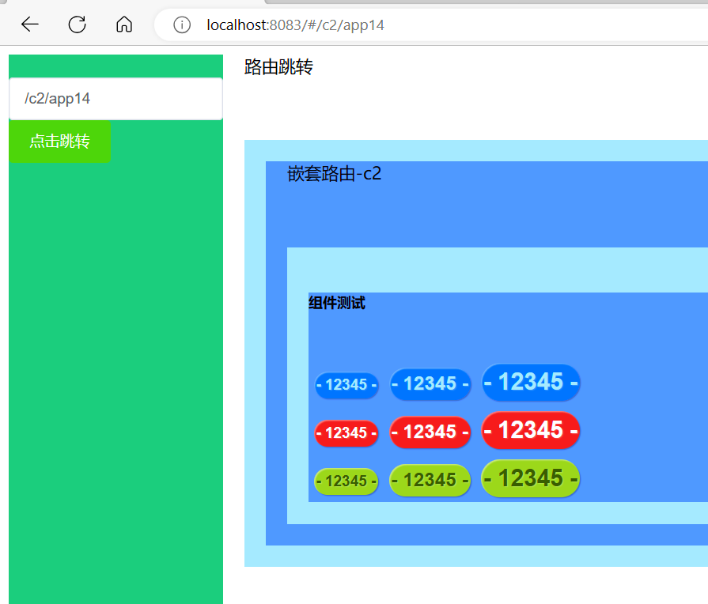


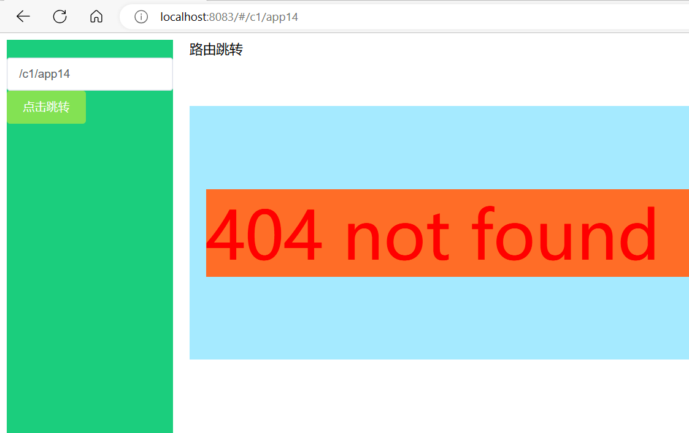


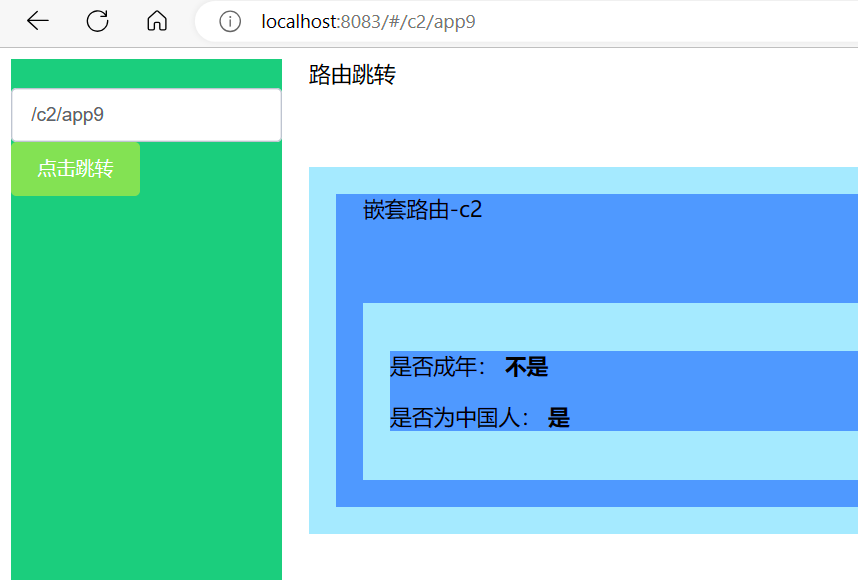


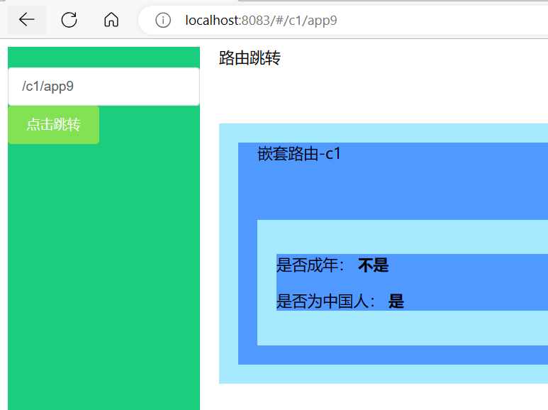


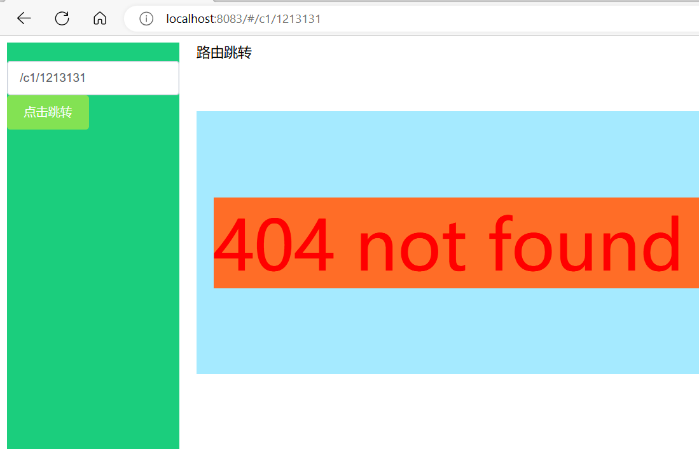


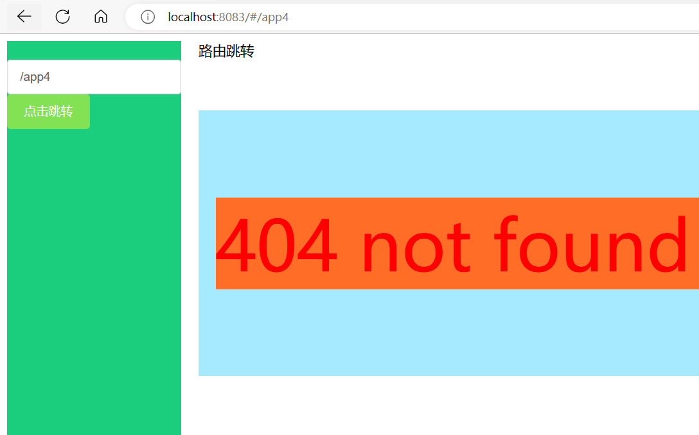


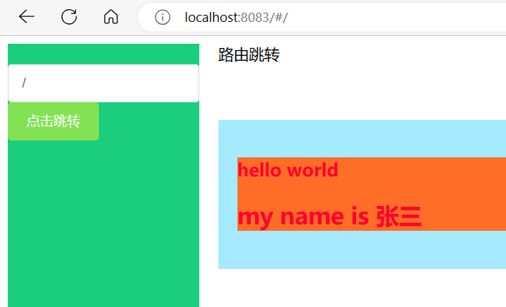


## 编程式导航

### push

在 Vue 实例中，你可以通过 $router 访问路由实例。因此你可以调用 `this.$router.push`

想要导航到不同的 URL，可以使用 router.push 方法。这个方法会向 history 栈添加一个新的记录，所以，当用户点击浏览器后退按钮时，会回到之前的 URL。

当你点击 \<router-link> 时，内部会调用这个方法，所以点击 \<router-link :to="..."> 相当于调用 router.push(...)


该方法的参数可以是一个字符串路径，或者一个描述地址的对象：

```js
// 字符串路径
router.push('/users/eduardo')

// 带有路径的对象
router.push({ path: '/users/eduardo' })

// 命名的路由，并加上参数，让路由建立 url
router.push({ name: 'user', params: { username: 'eduardo' } })

// 带查询参数，结果是 /register?plan=private
router.push({ path: '/register', query: { plan: 'private' } })

// 带 hash，结果是 /about#team
router.push({ path: '/about', hash: '#team' })
```


如果提供了 path，params 会被忽略

```js
const username = 'eduardo'
// 我们可以手动建立 url，但我们必须自己处理编码
router.push(`/user/${username}`) // -> /user/eduardo
// 同样
router.push({ path: `/user/${username}` }) // -> /user/eduardo
// 
router.push({ name: 'user', params: { username } }) // -> /user/eduardo
// `params` 不能与 `path` 一起使用
router.push({ path: '/user', params: { username } }) // -> /user
```


### 替换当前位置

它的作用类似于 `router.push`，唯一不同的是，它在导航时不会向 history 添加新记录


|              声明式               |        编程式         |
| :-------------------------------: | :-------------------: |
| `<router-link :to="..." replace>` | `router.replace(...)` |


也可以直接在传递给 router.push 的 routeLocation 中增加一个属性 replace: true：

```js
router.push({ path: '/home', replace: true })
// 相当于
router.replace({ path: '/home' })
```


### 横跨历史

该方法采用一个整数作为参数，表示在历史堆栈中前进或后退多少步，类似于 `window.history.go(n)`


```js
// 向前移动一条记录，与 router.forward() 相同
router.go(1)

// 返回一条记录，与 router.back() 相同
router.go(-1)

// 前进 3 条记录
router.go(3)

// 如果没有那么多记录，静默失败
router.go(-100)
router.go(100)
```


## 命名路由

除了 `path` 之外，你还可以为任何路由提供 `name`。这有以下优点：

- 没有硬编码的 URL
- `params` 的自动编码/解码。
- 防止你在 url 中出现打字错误。
- 绕过路径排序


要链接到一个命名的路由，可以向 `router-link` 组件的 `to` 属性传递一个对象：

```js
<router-link :to="{ name: 'user', params: { username: 'erina' }}">
  User
</router-link>
```


## 命名视图

### 概述

有时候想同时 (同级) 展示多个视图，而不是嵌套展示，例如创建一个布局，有 `sidebar` (侧导航) 和 `main` (主内容) 两个视图，这个时候命名视图就派上用场了。你可以在界面中拥有多个单独命名的视图，而不是只有一个单独的出口。如果 `router-view` 没有设置名字，那么默认为 `default`。


### 使用

示例：

```vue
<router-view class="view left-sidebar" name="LeftSidebar"></router-view>
<router-view class="view main-content"></router-view>
<router-view class="view right-sidebar" name="RightSidebar"></router-view>
```


一个视图使用一个组件渲染，因此对于同个路由，多个视图就需要多个组件。确保正确使用 `components`

```js
const router = createRouter({
  history: createWebHashHistory(),
  routes: [
    {
      path: '/',
      components: {
        default: Home,
        // LeftSidebar: LeftSidebar 的缩写
        LeftSidebar,
        // 它们与 `<router-view>` 上的 `name` 属性匹配
        RightSidebar,
      },
    },
  ],
})
```


App26.vue

```vue
<template>

  <div class="div">
    <hr>
    <router-view class="r1" name="r1"></router-view>
    <hr>
    <router-view class="r2"></router-view>
    <hr>
    <router-view class="r3" name="r3"></router-view>
    <hr>
  </div>

</template>

<script>
export default {
  name: "App26"
}
</script>

<style scoped>
.div{
  background: #b5e3f1;
}
.r1{
  background: blueviolet;
}
.r2{
  background: #42b983;
}

.r3{
  background: darkorange;
}
</style>
```


Router4.vue

```vue
<script>

import {createRouter, createWebHashHistory} from 'vue-router'
import App from '@/App'
import App2 from '@/App2'
import App3 from '@/App3'
import App4 from '@/App4'
import App5 from '@/App5'
import App6 from '@/App6'
import App7 from '@/App7'
import App8 from '@/App8'
import App9 from '@/App9'
import App10 from '@/App10'
import App11 from '@/App11'
import App12 from '@/App12'
import App13 from '@/App13'
import App15 from '@/App15'
import App14 from '@/App14'
import App16 from '@/App16'
import App17 from '@/App17'
import App18 from '@/App18'
import App19 from '@/App19'
import NotFound from '@/views/404'


const routes = [
  {
    path: '/',
    components:
        {
          default: App,
          r1: App2,
          r2: App3,
          r3: App4,
        }
  },
  {
    path: '/app5',
    components:
        {
          default: App5,
          r1: App6,
          r2: App7,
          r3: App8,
        }
  },
  {
    path: '/app9',
    components:
        {
          default: App9,
          r1: App10,
          r2: App11,
          r3: App12,
        }
  },
  {
    path: '/app13',
    component: App13
  },
  {
    path: '/app14',
    component: App14
  },
  {
    path: '/app15',
    component: App15
  },
  {
    path: '/app16',
    component: App16
  },
  {
    path: '/app17',
    component: App17
  },
  {
    path: '/app18',
    component: App18
  },
  {
    path: '/app19',
    component: App19
  },
  {
    path: '/:pathMatch(.*)*',
    component: NotFound
  }
]

const router = createRouter({
  //内部提供了 history 模式的实现。为了简单起见，我们在这里使用 hash 模式。
  history: createWebHashHistory(),
  routes, // `routes: routes` 的缩写
})

export default router

</script>
```


更改main.js

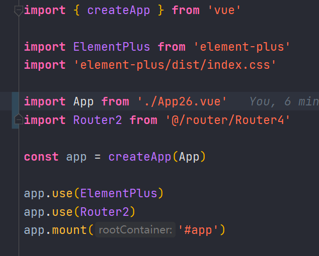


```js
import { createApp } from 'vue'

import ElementPlus from 'element-plus'
import 'element-plus/dist/index.css'

import App from './App26.vue'
import Router2 from '@/router/Router4'

const app = createApp(App)

app.use(ElementPlus)
app.use(Router2)
app.mount('#app')
```


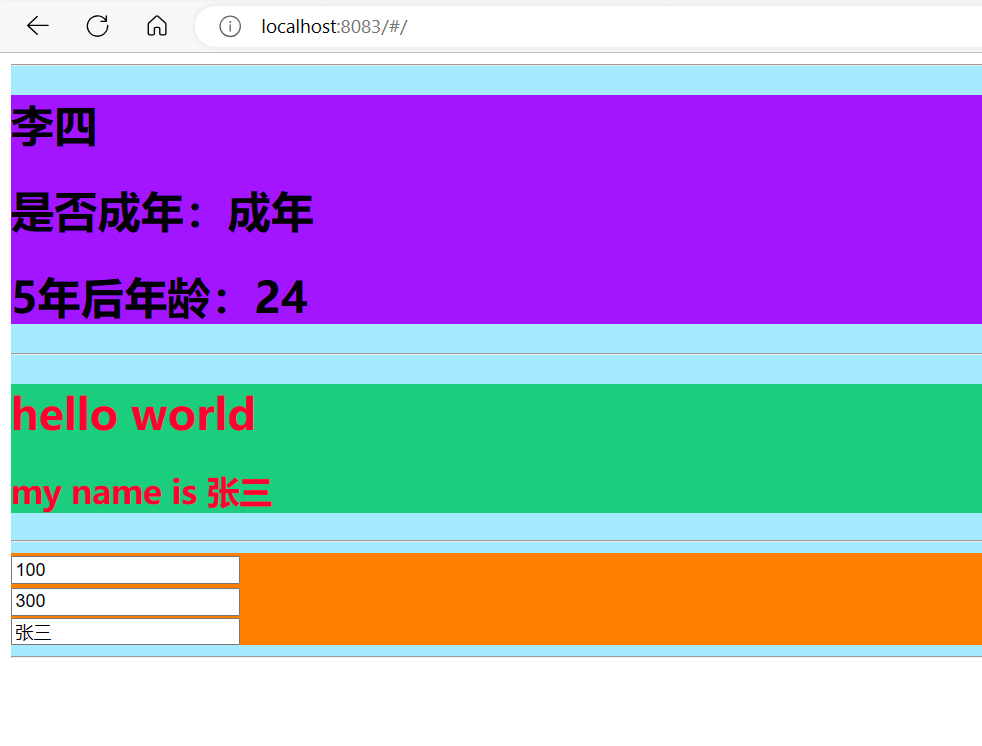


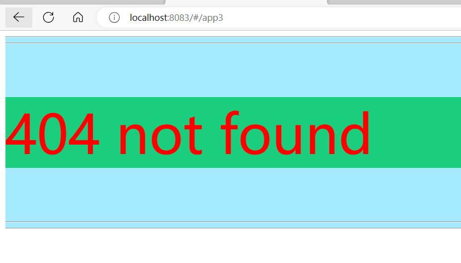


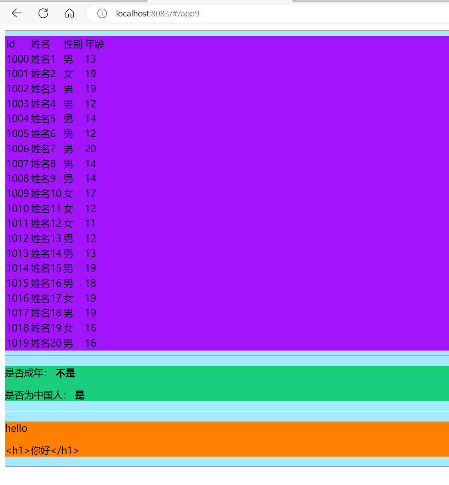


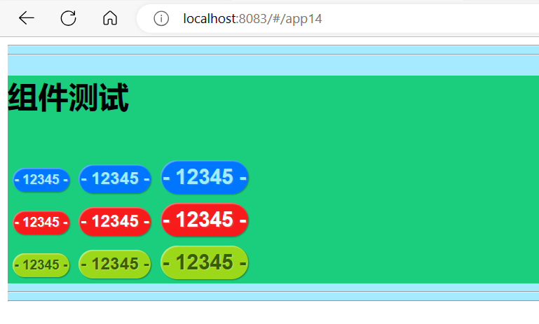


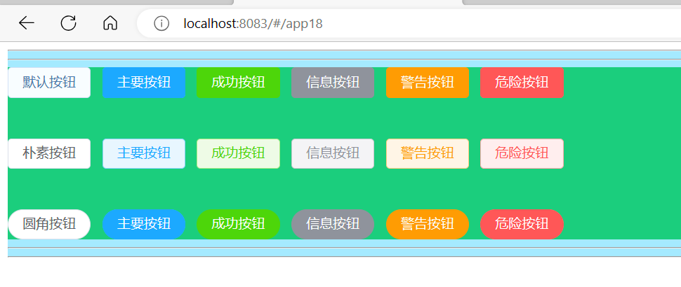


### 嵌套命名视图

我们也有可能使用命名视图创建嵌套视图的复杂布局。这时需要用到的嵌套 `router-view` 组件


```sh
/settings/emails                                       /settings/profile
+-----------------------------------+                  +------------------------------+
| UserSettings                      |                  | UserSettings                 |
| +-----+-------------------------+ |                  | +-----+--------------------+ |
| | Nav | UserEmailsSubscriptions | |  +------------>  | | Nav | UserProfile        | |
| |     +-------------------------+ |                  | |     +--------------------+ |
| |     |                         | |                  | |     | UserProfilePreview | |
| +-----+-------------------------+ |                  | +-----+--------------------+ |
+-----------------------------------+                  +------------------------------+
```


```html
<!-- UserSettings.vue -->
<div>
  <h1>User Settings</h1>
  <NavBar />
  <router-view />
  <router-view name="helper" />
</div>
```


```js
{
  path: '/settings',
  // 你也可以在顶级路由就配置命名视图
  component: UserSettings,
  children: [{
    path: 'emails',
    component: UserEmailsSubscriptions
  }, {
    path: 'profile',
    components: {
      default: UserProfile,
      helper: UserProfilePreview
    }
  }]
}
```


## 重定向

重定向也是通过 routes 配置来完成


下面例子是从 `/home` 重定向到 `/`：

```JS
const routes = [{ path: '/home', redirect: '/' }]
```


重定向的目标也可以是一个命名的路由：

```JS
const routes = [{ path: '/home', redirect: { name: 'homepage' } }]
```


甚至是一个方法，动态返回重定向目标：

```JS
const routes = [
  {
    // /search/screens -> /search?q=screens
    path: '/search/:searchText',
    redirect: to => {
      // 方法接收目标路由作为参数
      // return 重定向的字符串路径/路径对象
      return { path: '/search', query: { q: to.params.searchText } }
    },
  },
  {
    path: '/search',
    // ...
  },
]
```


也可以重定向到相对位置：

```js
const routes = [
  {
    // 将总是把/users/123/posts重定向到/users/123/profile。
    path: '/users/:id/posts',
    redirect: to => {
      // 该函数接收目标路由作为参数
      // 相对位置不以`/`开头
      // 或 { path: 'profile'}
      return 'profile'
    },
  },
]
```


在写 redirect 的时候，可以省略 component 配置，因为它从来没有被直接访问过，所以没有组件要渲染。唯一的例外是嵌套路由：如果一个路由记录有 children 和 redirect 属性，它也应该有 component 属性。


将所有找不到的页面和/app13页面都重定向到404页面：


Router5.vue

```vue
<script>

import {createRouter, createWebHashHistory} from 'vue-router'
import App from '@/App'
import App2 from '@/App2'
import App3 from '@/App3'
import App4 from '@/App4'
import App5 from '@/App5'
import App6 from '@/App6'
import App7 from '@/App7'
import App8 from '@/App8'
import App9 from '@/App9'
import App10 from '@/App10'
import App11 from '@/App11'
import App12 from '@/App12'
import App13 from '@/App13'
import App15 from '@/App15'
import App14 from '@/App14'
import App16 from '@/App16'
import App17 from '@/App17'
import App18 from '@/App18'
import App19 from '@/App19'
import NotFound from '@/views/404'


const routes = [
  {
    path: '/',
    components:
        {
          default: App,
          r1: App2,
          r2: App3,
          r3: App4,
        }
  },
  {
    path: '/app5',
    components:
        {
          default: App5,
          r1: App6,
          r2: App7,
          r3: App8,
        }
  },
  {
    path: '/app9',
    components:
        {
          default: App9,
          r1: App10,
          r2: App11,
          r3: App12,
        }
  },
  {
    path: '/app13',
    component: App13,
    redirect:"/404"
  },
  {
    path: '/app14',
    component: App14
  },
  {
    path: '/app15',
    component: App15
  },
  {
    path: '/app16',
    component: App16
  },
  {
    path: '/app17',
    component: App17
  },
  {
    path: '/app18',
    component: App18
  },
  {
    path: '/app19',
    component: App19
  },
  {
    path: '/404',
    component: NotFound
  },
  {
    path: '/:pathMatch(.*)*',
    redirect:"/404"
  }
]

const router = createRouter({
  //内部提供了 history 模式的实现。为了简单起见，我们在这里使用 hash 模式。
  history: createWebHashHistory(),
  routes, // `routes: routes` 的缩写
})

export default router

</script>
```


main.js

```js
import { createApp } from 'vue'

import ElementPlus from 'element-plus'
import 'element-plus/dist/index.css'

import App from './App26.vue'
import Router2 from '@/router/Router5'

const app = createApp(App)

app.use(ElementPlus)
app.use(Router2)
app.mount('#app')
```


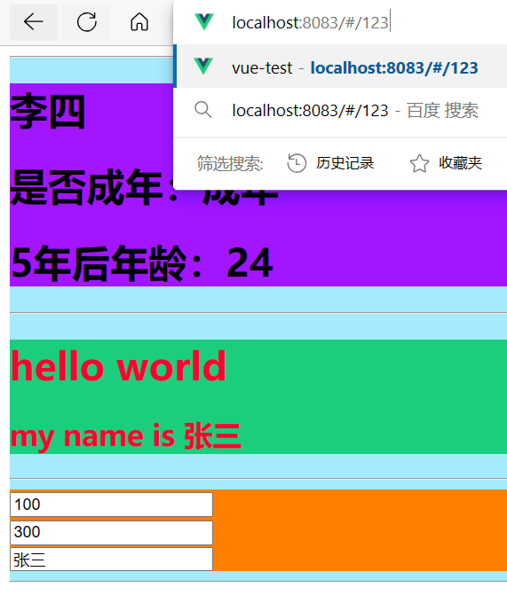


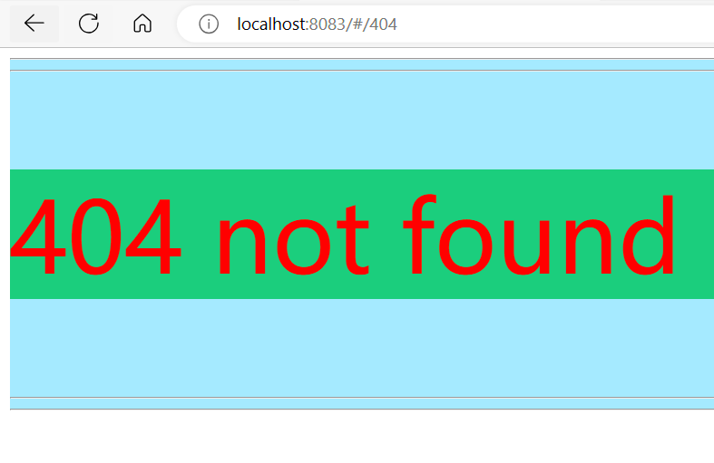


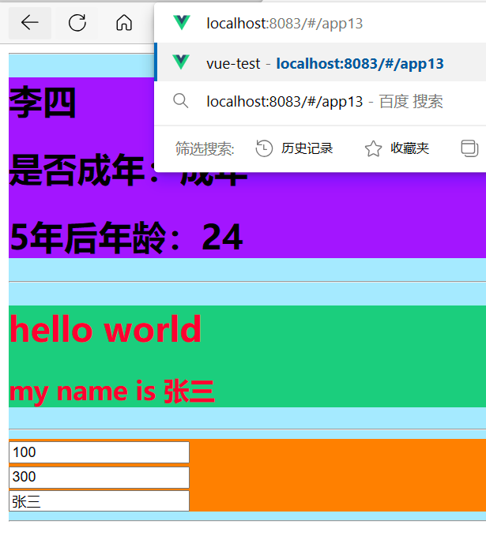


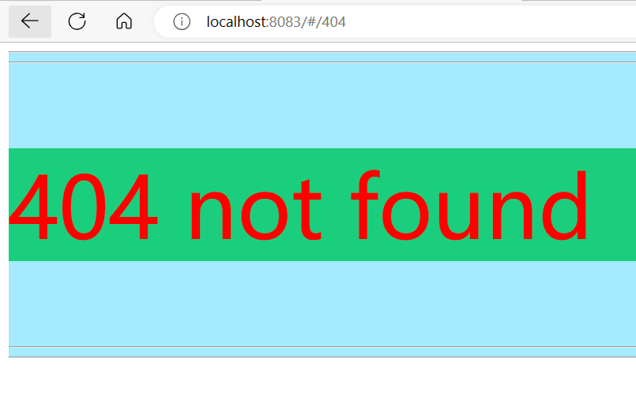


## 重定向别名

重定向是指当用户访问 `/home` 时，URL 会被 `/` 替换，然后匹配成 `/`

**将 `/` 别名为 `/home`，意味着当用户访问 `/home` 时，URL 仍然是 `/home`，但会被匹配为用户正在访问 `/`**


上面对应的路由配置为：

```js
const routes = [{ path: '/', component: Homepage, alias: '/home' }]
```


通过别名，你可以自由地将 UI 结构映射到一个任意的 URL，而不受配置的嵌套结构的限制。使别名以 `/` 开头，以使嵌套路径中的路径成为绝对路径。你甚至可以将两者结合起来，用一个数组提供多个别名


将 / 目录起别名 ['/aaa', '/bbb', '/ccc']，将 /app19 目录起别名 table


Router6.vue

```vue
<script>

import {createRouter, createWebHashHistory} from 'vue-router'
import App from '@/App'
import App2 from '@/App2'
import App3 from '@/App3'
import App4 from '@/App4'
import App5 from '@/App5'
import App6 from '@/App6'
import App7 from '@/App7'
import App8 from '@/App8'
import App9 from '@/App9'
import App10 from '@/App10'
import App11 from '@/App11'
import App12 from '@/App12'
import App13 from '@/App13'
import App15 from '@/App15'
import App14 from '@/App14'
import App16 from '@/App16'
import App17 from '@/App17'
import App18 from '@/App18'
import App19 from '@/App19'
import NotFound from '@/views/404'


const routes = [
  {
    path: '/',
    components:
        {
          default: App,
          r1: App2,
          r2: App3,
          r3: App4,
        },
    alias: ['/aaa', '/bbb', '/ccc']
  },
  {
    path: '/app5',
    components:
        {
          default: App5,
          r1: App6,
          r2: App7,
          r3: App8,
        }
  },
  {
    path: '/app9',
    components:
        {
          default: App9,
          r1: App10,
          r2: App11,
          r3: App12,
        }
  },
  {
    path: '/app13',
    component: App13,
    redirect: "/404"
  },
  {
    path: '/app14',
    component: App14
  },
  {
    path: '/app15',
    component: App15
  },
  {
    path: '/app16',
    component: App16
  },
  {
    path: '/app17',
    component: App17
  },
  {
    path: '/app18',
    component: App18
  },
  {
    path: '/app19',
    component: App19,
    alias: '/table'
  },
  {
    path: '/404',
    component: NotFound
  },
  {
    path: '/:pathMatch(.*)*',
    redirect: "/404"
  }
]

const router = createRouter({
  //内部提供了 history 模式的实现。为了简单起见，我们在这里使用 hash 模式。
  history: createWebHashHistory(),
  routes, // `routes: routes` 的缩写
})

export default router

</script>
```


```js
import { createApp } from 'vue'

import ElementPlus from 'element-plus'
import 'element-plus/dist/index.css'

import App from './App26.vue'
import Router2 from '@/router/Router6'

const app = createApp(App)

app.use(ElementPlus)
app.use(Router2)
app.mount('#app')
```


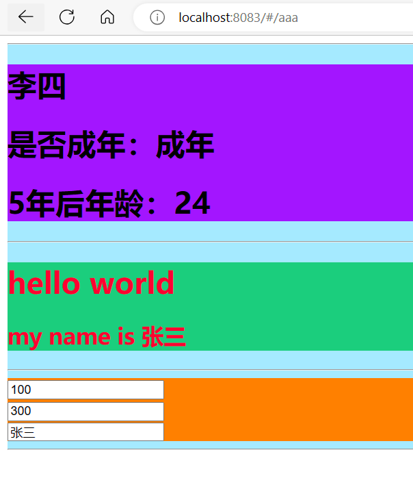


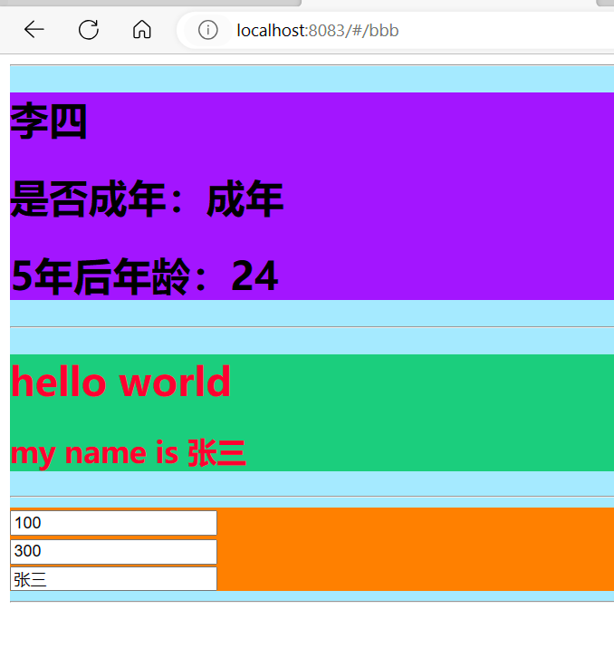

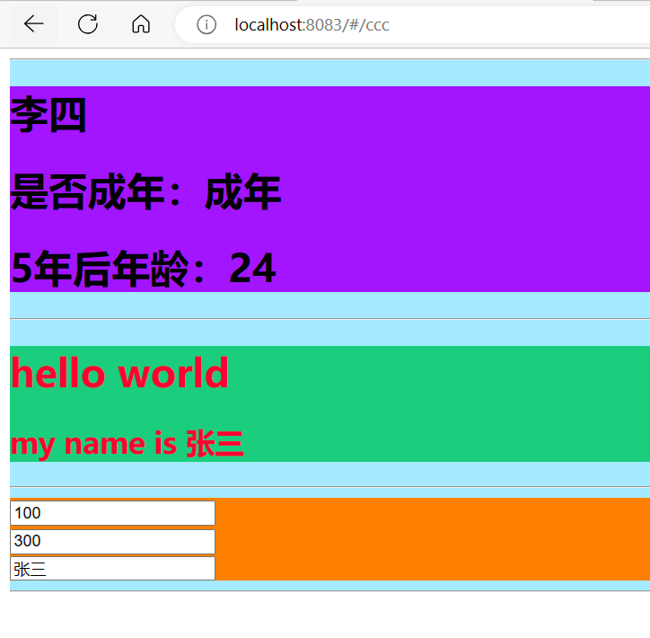


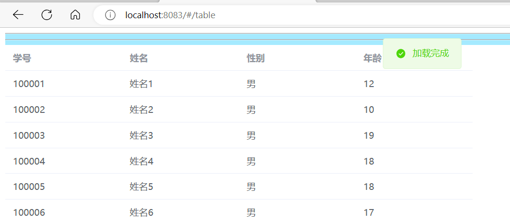


## 路由组件传参

组件中使用 `$route` 会与路由紧密耦合，这限制了组件的灵活性，因为它只能用于特定的 URL。虽然这不一定是件坏事，但我们可以通过 `props` 配置来解除这种行为


我们可以将下面的代码

```js
const User = {
  template: '<div>User {{ $route.params.id }}</div>'
}
const routes = [{ path: '/user/:id', component: User }]
```

替换成

```js
const User = {
  // 请确保添加一个与路由参数完全相同的 prop 名
  props: ['id'],
  template: '<div>User {{ id }}</div>'
}
const routes = [{ path: '/user/:id', component: User, props: true }]
```


当 `props` 设置为 `true` 时，`route.params` 将被设置为组件的 props


对于有命名视图的路由，你必须为每个命名视图定义 `props` 配置：

```js
const routes = [
  {
    path: '/user/:id',
    components: { default: User, sidebar: Sidebar },
    props: { default: true, sidebar: false }
  }
]
```


当 `props` 是一个对象时，它将原样设置为组件 props

```js
const routes = [
  {
    path: '/promotion/from-newsletter',
    component: Promotion,
    props: { newsletterPopup: false }
  }
]
```


你可以创建一个返回 props 的函数。这允许你将参数转换为其他类型

```js
const routes = [
  {
    path: '/search',
    component: SearchUser,
    props: route => ({ query: route.query.q })
  }
]
```


URL `/search?q=vue` 将传递 `{query: 'vue'}` 作为 props 传给 `SearchUser` 组件


## 不同的历史模式

### 概述

在创建路由器实例时，`history` 配置允许我们在不同的历史模式中进行选择


### Hash 模式

hash 模式是用 `createWebHashHistory()` 创建的

```js
import { createRouter, createWebHashHistory } from 'vue-router'

const router = createRouter({
  history: createWebHashHistory(),
  routes: [
    //...
  ],
})
```


它在内部传递的实际 URL 之前使用了一个哈希字符（`#`）。由于这部分 URL 从未被发送到服务器，所以它不需要在服务器层面上进行任何特殊处理。不过，**它在 SEO 中确实有不好的影响**。

vue-router默认hash模式,使用url的哈希(hash)来模拟一个完整的URL，当URL改变时，页面不会重新加载

`#`号后面的参数不会传送给服务器，兼容性好，不会作为路径的一部分发送给服务器，也就是它不会包括在`HTTP`请求体中，对后端完全没有影响

页面刷新时，会停留在当前页面，不会重新加载


### HTML5 模式

用 `createWebHistory()` 创建 HTML5 模式，推荐使用这个模式：

```js
import { createRouter, createWebHistory } from 'vue-router'

const router = createRouter({
  history: createWebHistory(),
  routes: [
    //...
  ],
})
```


当使用这种历史模式时，URL 会看起来很 "正常"，例如 `https://example.com/user/id`

不过，问题来了。由于我们的应用是一个单页的客户端应用，如果没有适当的服务器配置，用户在浏览器中直接访问 `https://example.com/user/id`，就会得到一个 404 错误。

要解决这个问题，你需要做的就是在你的服务器上添加一个简单的回退路由。如果 URL 不匹配任何静态资源，它应提供与你的应用程序中的 `index.html` 相同的页面

在hash模式下,使用hash符号之前的内容会被包含在请求体中,#号后面的不会发送给服务器

而`history`模式下,前端的`URL`必须和实际向后端发起请求的`URL`保持一致

改变 URL 会引起页面加载


Router7.vue

```vue
<script>

import {createRouter, createWebHistory} from 'vue-router'
import App from '@/App'
import App2 from '@/App2'
import App3 from '@/App3'
import App4 from '@/App4'
import App5 from '@/App5'
import App6 from '@/App6'
import App7 from '@/App7'
import App8 from '@/App8'
import App9 from '@/App9'
import App10 from '@/App10'
import App11 from '@/App11'
import App12 from '@/App12'
import App13 from '@/App13'
import App15 from '@/App15'
import App14 from '@/App14'
import App16 from '@/App16'
import App17 from '@/App17'
import App18 from '@/App18'
import App19 from '@/App19'
import NotFound from '@/views/404'


const routes = [
  {
    path: '/',
    components:
        {
          default: App,
          r1: App2,
          r2: App3,
          r3: App4,
        },
    alias: ['/aaa', '/bbb', '/ccc']
  },
  {
    path: '/app5',
    components:
        {
          default: App5,
          r1: App6,
          r2: App7,
          r3: App8,
        }
  },
  {
    path: '/app9',
    components:
        {
          default: App9,
          r1: App10,
          r2: App11,
          r3: App12,
        }
  },
  {
    path: '/app13',
    component: App13,
    redirect: "/404"
  },
  {
    path: '/app14',
    component: App14
  },
  {
    path: '/app15',
    component: App15
  },
  {
    path: '/app16',
    component: App16
  },
  {
    path: '/app17',
    component: App17
  },
  {
    path: '/app18',
    component: App18
  },
  {
    path: '/app19',
    component: App19,
    alias: '/table'
  },
  {
    path: '/404',
    component: NotFound
  },
  {
    path: '/:pathMatch(.*)*',
    redirect: "/404"
  }
]

const router = createRouter({
  //createWebHistory
  history: createWebHistory(),
  routes, // `routes: routes` 的缩写
})

export default router

</script>
```


main.js

```js
import { createApp } from 'vue'

import ElementPlus from 'element-plus'
import 'element-plus/dist/index.css'

import App from './App26.vue'
import Router2 from '@/router/Router7'

const app = createApp(App)

app.use(ElementPlus)
app.use(Router2)
app.mount('#app')
```


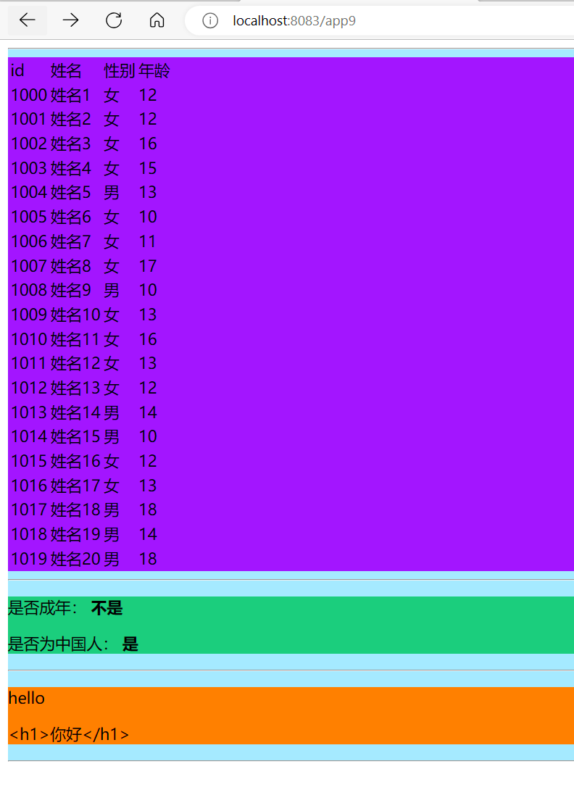


## 导航守卫

### 概述

正如其名，vue-router 提供的导航守卫主要用来通过跳转或取消的方式守卫导航。这里有很多方式植入路由导航中：全局的，单个路由独享的，或者组件级的。

当Router（路由）之间发生跳转时，会触发导航守卫。（url发生改变时就会触发导航守卫）

可以看成路由的钩子函数（生命周期函数），相当于后端spring的拦截器


### 全局前置守卫

可以使用 `router.beforeEach` 注册一个全局前置守卫：

```js
const router = createRouter({ ... })

router.beforeEach((to, from) => {
  // ...
  // 返回 false 以取消导航
  return false
})
```


当一个导航触发时，全局前置守卫按照创建顺序调用。守卫是异步解析执行，此时导航在所有守卫 resolve 完之前一直处于**等待中**。


每个守卫方法接收两个参数：

* 即将要进入的路由对象
* 要离开的路由对象


可以返回的值如下：

* `false`: 取消当前的导航。如果浏览器的 URL 改变了(可能是用户手动或者浏览器后退按钮)，那么 URL 地址会重置到 `from` 路由对应的地址。
* 一个路由地址: 通过一个路由地址跳转到一个不同的地址，就像你调用 router.push() 一样，你可以设置诸如 replace: true 或 name: 'home' 之类的配置。当前的导航被中断，然后进行一个新的导航，就和 from 一样


如果遇到了意料之外的情况，可能会抛出一个 Error。这会取消导航并且调用 router.onError() 注册过的回调。

如果什么都没有，`undefined` 或返回 `true`，**则导航是有效的**，并调用下一个导航守卫


编写Router8.vue，调转的时候，有0.5的概率调转失败，0.5的概率跳转成功，这0.5概率的成功率中，有0.5的概率跳转到/app9页面：

```vue
<script>

import {createRouter, createWebHashHistory} from 'vue-router'
import App from '@/App'
import App2 from '@/App2'
import App3 from '@/App3'
import App4 from '@/App4'
import App5 from '@/App5'
import App6 from '@/App6'
import App7 from '@/App7'
import App8 from '@/App8'
import App9 from '@/App9'
import App10 from '@/App10'
import App11 from '@/App11'
import App12 from '@/App12'
import App13 from '@/App13'
import App15 from '@/App15'
import App14 from '@/App14'
import App16 from '@/App16'
import App17 from '@/App17'
import App18 from '@/App18'
import App19 from '@/App19'
import NotFound from '@/views/404'


const routes = [
  {
    path: '/',
    components:
        {
          default: App,
          r1: App2,
          r2: App3,
          r3: App4,
        },
    alias: ['/aaa', '/bbb', '/ccc']
  },
  {
    path: '/app5',
    components:
        {
          default: App5,
          r1: App6,
          r2: App7,
          r3: App8,
        }
  },
  {
    path: '/app9',
    components:
        {
          default: App9,
          r1: App10,
          r2: App11,
          r3: App12,
        }
  },
  {
    path: '/app13',
    component: App13,
    redirect: "/404"
  },
  {
    path: '/app14',
    component: App14
  },
  {
    path: '/app15',
    component: App15
  },
  {
    path: '/app16',
    component: App16
  },
  {
    path: '/app17',
    component: App17
  },
  {
    path: '/app18',
    component: App18
  },
  {
    path: '/app19',
    component: App19,
    alias: '/table'
  },
  {
    path: '/404',
    component: NotFound
  },
  {
    path: '/:pathMatch(.*)*',
    redirect: "/404"
  }
]

const router = createRouter({
  //内部提供了 history 模式的实现。为了简单起见，我们在这里使用 hash 模式。
  history: createWebHashHistory(),
  routes, // `routes: routes` 的缩写
})

router.beforeEach((to, from) =>
{
  console.log("从" + from.path + "到" + to.path)
  if (to.path === "/404")
  {
    return true;
  }
  //0.5的概率放行
  if (Math.random() > 0.5)
  {
    console.log("放行")
    return true
  }
  console.log("不放行")
  return false
})

router.beforeEach((to, from) =>
{
  console.log("第二个全局前置守卫")
  if (to.path === "/404")
  {
    return true;
  }
  if (Math.random() > 0.5)
  {
    console.log("放行")
    return true
  }
  else
  {
    console.log("转/app9")
    return {path: '/app9'}
  }
})

export default router

</script>
```


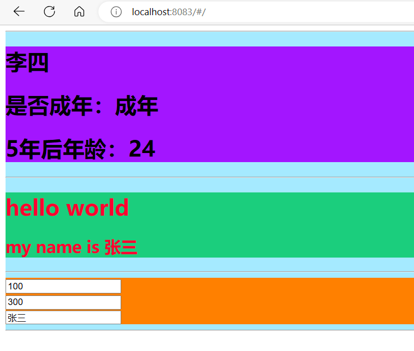

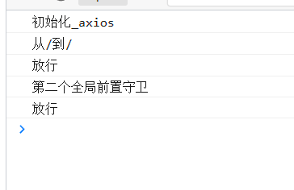


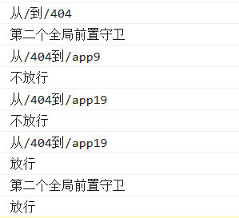


在之前的 Vue Router 版本中，也是可以使用 第三个参数 next 的。这是一个常见的错误来源，可以通过 RFC 来消除错误。

**`next` 函数在任何给定的导航守卫中都被严格调用一次。它可以出现多于一次，**但是只能在所有的逻辑路径都不重叠的情况下**，否则钩子永远都不会被解析或报错**（白话理解：给定的导航守卫一**次只能有一个next被运行**）


错误的示例：

```js
// BAD
router.beforeEach((to, from, next) => {
  if (to.name !== 'Login' && !isAuthenticated) next({ name: 'Login' })
  // 如果用户未能验证身份，则 `next` 会被调用两次
  next()
})
```


正确的示例：

```js
// GOOD
router.beforeEach((to, from, next) => {
  if (to.name !== 'Login' && !isAuthenticated) next({ name: 'Login' })
  else next()
})
```


### 全局解析守卫

你可以用 `router.beforeResolve` 注册一个全局守卫。这和 `router.beforeEach` 类似，因为它在**每次导航**时都会触发，不同的是，解析守卫刚好会在导航被确认之前、**所有组件内守卫和异步路由组件被解析之后**调用。


`router.beforeResolve` 是获取数据或执行任何其他操作（如果用户无法进入页面时你希望避免执行的操作）的理想位置。


```js
router.beforeResolve(async to => {
  if (to.meta.requiresCamera) {
    try {
      await askForCameraPermission()
    } catch (error) {
      if (error instanceof NotAllowedError) {
        // ... 处理错误，然后取消导航
        return false
      } else {
        // 意料之外的错误，取消导航并把错误传给全局处理器
        throw error
      }
    }
  }
})
```


### 全局后置钩子

你也可以注册全局后置钩子，然而和守卫不同的是，这些钩子不会接受 `next` 函数也不会改变导航本身：

它们对于分析、更改页面标题、声明页面等辅助功能以及许多其他事情都很有用。

```js
router.afterEach((to, from) => {
  sendToAnalytics(to.fullPath)
})
```


```vue
<script>

import {createRouter, createWebHashHistory} from 'vue-router'
import App from '@/App'
import App2 from '@/App2'
import App3 from '@/App3'
import App4 from '@/App4'
import App5 from '@/App5'
import App6 from '@/App6'
import App7 from '@/App7'
import App8 from '@/App8'
import App9 from '@/App9'
import App10 from '@/App10'
import App11 from '@/App11'
import App12 from '@/App12'
import App13 from '@/App13'
import App15 from '@/App15'
import App14 from '@/App14'
import App16 from '@/App16'
import App17 from '@/App17'
import App18 from '@/App18'
import App19 from '@/App19'
import NotFound from '@/views/404'


const routes = [
  {
    path: '/',
    components:
        {
          default: App,
          r1: App2,
          r2: App3,
          r3: App4,
        },
    alias: ['/aaa', '/bbb', '/ccc']
  },
  {
    path: '/app5',
    components:
        {
          default: App5,
          r1: App6,
          r2: App7,
          r3: App8,
        }
  },
  {
    path: '/app9',
    components:
        {
          default: App9,
          r1: App10,
          r2: App11,
          r3: App12,
        }
  },
  {
    path: '/app13',
    component: App13,
    redirect: "/404"
  },
  {
    path: '/app14',
    component: App14
  },
  {
    path: '/app15',
    component: App15
  },
  {
    path: '/app16',
    component: App16
  },
  {
    path: '/app17',
    component: App17
  },
  {
    path: '/app18',
    component: App18
  },
  {
    path: '/app19',
    component: App19,
    alias: '/table'
  },
  {
    path: '/404',
    component: NotFound
  },
  {
    path: '/:pathMatch(.*)*',
    redirect: "/404"
  }
]

const router = createRouter({
  //内部提供了 history 模式的实现。为了简单起见，我们在这里使用 hash 模式。
  history: createWebHashHistory(),
  routes, // `routes: routes` 的缩写
})

router.beforeEach((to, from) =>
{
  console.log("第一个全局前置守卫")
  if (to.path === "/404")
  {
    return true;
  }
  //0.5的概率放行
  if (Math.random() > 0.5)
  {
    console.log("放行")
    return true
  }
  console.log("不放行")
  return false
})

router.beforeEach((to, from) =>
{
  console.log("第二个全局前置守卫")
  if (to.path === "/404")
  {
    return true;
  }
  if (Math.random() > 0.5)
  {
    console.log("放行")
    return true
  }
  else
  {
    console.log("转/app9")
    return {path: '/app9'}
  }
})

router.afterEach((to, from) =>
{
  console.log("全局后置钩子")
  console.log("从" + from.path + "到" + to.path)
})

export default router

</script>
```


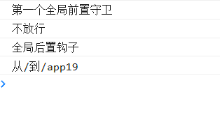


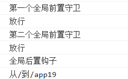


### 路由独享的守卫

可以直接在路由配置上定义 `beforeEnter` 守卫：

```js
const routes = [
  {
    path: '/users/:id',
    component: UserDetails,
    beforeEnter: (to, from) => {
      // reject the navigation
      return false
    },
  },
]
```


`beforeEnter` 守卫 **只在进入路由时触发**，不会在 `params`、`query` 或 `hash` 改变时触发。例如，从 `/users/2` 进入到 `/users/3` 或者从 `/users/2#info` 进入到 `/users/2#projects`。它们只有在 **从一个不同的** 路由导航时，才会被触发。


也可以将一个函数数组传递给 `beforeEnter`

```js
function removeQueryParams(to) {
  if (Object.keys(to.query).length)
    return { path: to.path, query: {}, hash: to.hash }
}

function removeHash(to) {
  if (to.hash) return { path: to.path, query: to.query, hash: '' }
}

const routes = [
  {
    path: '/users/:id',
    component: UserDetails,
    beforeEnter: [removeQueryParams, removeHash],
  },
  {
    path: '/about',
    component: UserDetails,
    beforeEnter: [removeQueryParams],
  },
]
```


Router9.vue

```vue
<script>

import {createRouter, createWebHashHistory} from 'vue-router'
import App from '@/App'
import App2 from '@/App2'
import App3 from '@/App3'
import App4 from '@/App4'
import App5 from '@/App5'
import App6 from '@/App6'
import App7 from '@/App7'
import App8 from '@/App8'
import App9 from '@/App9'
import App10 from '@/App10'
import App11 from '@/App11'
import App12 from '@/App12'
import App13 from '@/App13'
import App15 from '@/App15'
import App14 from '@/App14'
import App16 from '@/App16'
import App17 from '@/App17'
import App18 from '@/App18'
import App19 from '@/App19'
import NotFound from '@/views/404'

function f1()
{
  console.log("第一个路由独享的守卫")
  return true;
}

function f2()
{
  console.log("第二个路由独享的守卫")
  return true;
}

const routes = [
  {
    path: '/',
    components:
        {
          default: App,
          r1: App2,
          r2: App3,
          r3: App4,
        },
    alias: ['/aaa', '/bbb', '/ccc']
  },
  {
    path: '/app5',
    components:
        {
          default: App5,
          r1: App6,
          r2: App7,
          r3: App8,
        },
    beforeEnter: [f1, f2]
  },
  {
    path: '/app9',
    components:
        {
          default: App9,
          r1: App10,
          r2: App11,
          r3: App12,
        },
    beforeEnter: (to, from) =>
    {
      console.log("从" + from.path + "到" + to.path)
      //0.5的概率放行
      if (Math.random() > 0.5)
      {
        console.log("放行")
        return true
      }
      console.log("不放行")
      return false
    }
  },
  {
    path: '/app13',
    component: App13,
    redirect: "/404"
  },
  {
    path: '/app14',
    component: App14,
    beforeEnter: [f1, f2]
  },
  {
    path: '/app15',
    component: App15
  },
  {
    path: '/app16',
    component: App16
  },
  {
    path: '/app17',
    component: App17
  },
  {
    path: '/app18',
    component: App18
  },
  {
    path: '/app19',
    component: App19,
    alias: '/table'
  },
  {
    path: '/404',
    component: NotFound
  },
  {
    path: '/:pathMatch(.*)*',
    redirect: "/404"
  }
]

const router = createRouter({
  //内部提供了 history 模式的实现。为了简单起见，我们在这里使用 hash 模式。
  history: createWebHashHistory(),
  routes, // `routes: routes` 的缩写
})


export default router

</script>
```


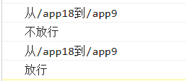


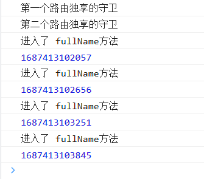


### 组件内的守卫

可以在路由组件内直接定义路由导航守卫(传递给路由配置的)

你可以为路由组件添加以下配置：

- `beforeRouteEnter`
- `beforeRouteUpdate`
- `beforeRouteLeave`


```js
const UserDetails = {
  template: `...`,
  beforeRouteEnter(to, from) {
    // 在渲染该组件的对应路由被验证前调用
    // 不能获取组件实例 `this` ！
    // 因为当守卫执行时，组件实例还没被创建！
  },
  beforeRouteUpdate(to, from) {
    // 在当前路由改变，但是该组件被复用时调用
    // 举例来说，对于一个带有动态参数的路径 `/users/:id`，在 `/users/1` 和 `/users/2` 之间跳转的时候，
    // 由于会渲染同样的 `UserDetails` 组件，因此组件实例会被复用。而这个钩子就会在这个情况下被调用。
    // 因为在这种情况发生的时候，组件已经挂载好了，导航守卫可以访问组件实例 `this`
  },
  beforeRouteLeave(to, from) {
    // 在导航离开渲染该组件的对应路由时调用
    // 与 `beforeRouteUpdate` 一样，它可以访问组件实例 `this`
  },
}
```


`beforeRouteEnter` 守卫 **不能** 访问 `this`，因为守卫在导航确认前被调用，因此即将登场的新组件还没被创建。

不过，你可以通过传一个回调给 `next` 来访问组件实例。在导航被确认的时候执行回调，并且把组件实例作为回调方法的参数：


App27.vue

```vue
<template>
  <h1>组件内的守卫</h1>
  <h2>{{$route.query.id}}</h2>
</template>

<script>
export default {
  name: "App27",
  data()
  {
    return {}
  },
  beforeRouteEnter: (to, from) =>
  {
    // 在渲染该组件的对应路由被验证前调用
    // 不能获取组件实例 `this` ！
    // 因为当守卫执行时，组件实例还没被创建！
    console.log("执行 beforeRouteEnter 方法")
  },
  beforeRouteUpdate: (to, from) =>
  {
    // 在当前路由改变，但是该组件被复用时调用
    // 举例来说，对于一个带有动态参数的路径 `/users/:id`，在 `/users/1` 和 `/users/2` 之间跳转的时候，
    // 由于会渲染同样的 `UserDetails` 组件，因此组件实例会被复用。而这个钩子就会在这个情况下被调用。
    // 因为在这种情况发生的时候，组件已经挂载好了，导航守卫可以访问组件实例 `this`
    console.log("执行 beforeRouteUpdate 方法")

  },
  beforeRouteLeave: (to, from) =>
  {
    // 在导航离开渲染该组件的对应路由时调用
    // 与 `beforeRouteUpdate` 一样，它可以访问组件实例 `this`
    console.log("执行 beforeRouteLeave 方法")
  },

}
</script>

<style scoped>

</style>
```


Router10.vue

```vue
<script>

import {createRouter, createWebHashHistory} from 'vue-router'
import App from '@/App'
import App2 from '@/App2'
import App3 from '@/App3'
import App4 from '@/App4'
import App5 from '@/App5'
import App6 from '@/App6'
import App7 from '@/App7'
import App8 from '@/App8'
import App9 from '@/App9'
import App10 from '@/App10'
import App11 from '@/App11'
import App12 from '@/App12'
import App13 from '@/App13'
import App15 from '@/App15'
import App14 from '@/App14'
import App16 from '@/App16'
import App17 from '@/App17'
import App18 from '@/App18'
import App19 from '@/App19'
import App_27 from '@/App27'
import NotFound from '@/views/404'

function f1()
{
  console.log("第一个路由独享的守卫")
  return true;
}

function f2()
{
  console.log("第二个路由独享的守卫")
  return true;
}

const routes = [
  {
    path: '/',
    components:
        {
          default: App,
          r1: App2,
          r2: App3,
          r3: App4,
        },
    alias: ['/aaa', '/bbb', '/ccc']
  },
  {
    path: '/app5',
    components:
        {
          default: App5,
          r1: App6,
          r2: App7,
          r3: App8,
        },
    beforeEnter: [f1, f2]
  },
  {
    path: '/app9',
    components:
        {
          default: App9,
          r1: App10,
          r2: App11,
          r3: App12,
        },
    beforeEnter: (to, from) =>
    {
      console.log("从" + from.path + "到" + to.path)
      //0.5的概率放行
      if (Math.random() > 0.5)
      {
        console.log("放行")
        return true
      }
      console.log("不放行")
      return false
    }
  },
  {
    path: '/app13',
    component: App13,
    redirect: "/404"
  },
  {
    path: '/app14',
    component: App14,
    beforeEnter: [f1, f2]
  },
  {
    path: '/app15',
    component: App15
  },
  {
    path: '/app16',
    component: App16
  },
  {
    path: '/app17',
    component: App17
  },
  {
    path: '/app18',
    component: App18,
  },
  {
    path: '/app19',
    component: App19,
    alias: '/table'
  },
  {
    path: '/app27',
    component: App_27,
  },
  {
    path: '/404',
    component: NotFound
  },
  {
    path: '/:pathMatch(.*)*',
    redirect: "/404"
  }
]

const router = createRouter({
  //内部提供了 history 模式的实现。为了简单起见，我们在这里使用 hash 模式。
  history: createWebHashHistory(),
  routes, // `routes: routes` 的缩写
})


export default router

</script>
```


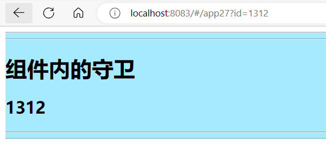


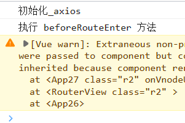


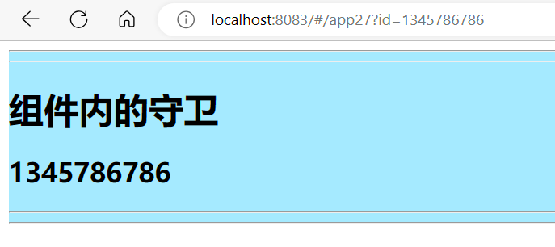

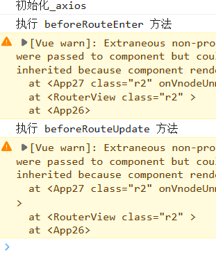


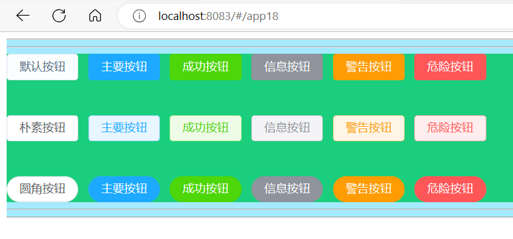


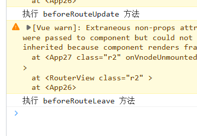


注意 `beforeRouteEnter` 是支持给 `next` 传递回调的唯一守卫。对于 `beforeRouteUpdate` 和 `beforeRouteLeave` 来说，`this` 已经可用了，所以*不支持* 传递回调，因为没有必要了：

```js
beforeRouteUpdate (to, from) {
  // just use `this`
  this.name = to.params.name
}
```


这个 **离开守卫** 通常用来预防用户在还未保存修改前突然离开。该导航可以通过返回 `false` 来取消。

```js
beforeRouteLeave (to, from) {
  const answer = window.confirm('Do you really want to leave? you have unsaved changes!')
  if (!answer) 
      return false
}
```


```vue
<template>
  <h1>组件内的守卫</h1>
  <h2>{{ $route.query.id }}</h2>
</template>

<script>
import {ElMessage} from 'element-plus'


export default {
  name: "App27",
  data()
  {
    return {
      id: this.$route.query.id
    }
  },
  beforeRouteEnter: (to, from) =>
  {
    // 在渲染该组件的对应路由被验证前调用
    // 不能获取组件实例 `this` ！
    // 因为当守卫执行时，组件实例还没被创建！
    console.log("执行 beforeRouteEnter 方法")
  },
  beforeRouteUpdate: (to, from) =>
  {
    // 在当前路由改变，但是该组件被复用时调用
    // 举例来说，对于一个带有动态参数的路径 `/users/:id`，在 `/users/1` 和 `/users/2` 之间跳转的时候，
    // 由于会渲染同样的 `UserDetails` 组件，因此组件实例会被复用。而这个钩子就会在这个情况下被调用。
    // 因为在这种情况发生的时候，组件已经挂载好了，导航守卫可以访问组件实例 `this`
    console.log("执行 beforeRouteUpdate 方法")

  },
  beforeRouteLeave(to, from)
  {
    // 在导航离开渲染该组件的对应路由时调用
    // 与 `beforeRouteUpdate` 一样，它可以访问组件实例 `this`
    console.log("执行 beforeRouteLeave 方法")
    ElMessage.info({
      message: "即将离开/app27",
      center: true,
    })
    if (this.id === undefined || this.id !== '123')
    {
      ElMessage.error({
        message: "id 参数不为123，无法离开",
        center: true,
      })
      return false
    }
    else
    {
      ElMessage.success({
        message: "成功离开/app27",
        center: true,
      })
      return true
    }
  },

}
</script>

<style scoped>

</style>
```


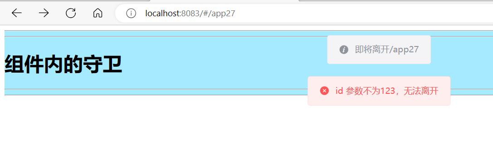


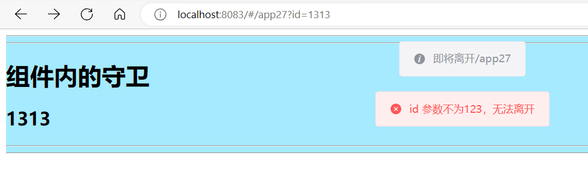


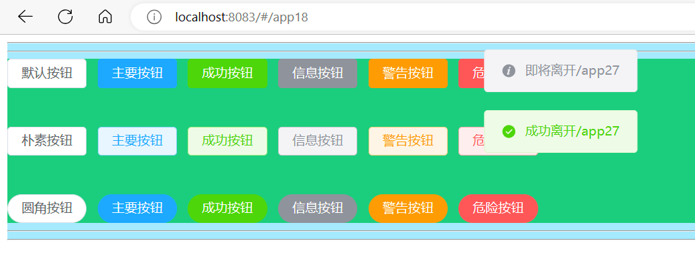


### 导航解析流程

1. 导航被触发。
2. 在失活的组件里调用 `beforeRouteLeave` 守卫。
3. 调用全局的 `beforeEach` 守卫。
4. 在重用的组件里调用 `beforeRouteUpdate` 守卫(2.2+)。
5. 在路由配置里调用 `beforeEnter`。
6. 解析异步路由组件。
7. 在被激活的组件里调用 `beforeRouteEnter`。
8. 调用全局的 `beforeResolve` 守卫(2.5+)。
9. 导航被确认。
10. 调用全局的 `afterEach` 钩子。
11. 触发 DOM 更新。
12. 调用 `beforeRouteEnter` 守卫中传给 `next` 的回调函数，创建好的组件实例会作为回调函数的参数传入。


## 路由元信息

有时，你可能希望将任意信息附加到路由上，如过渡名称、谁可以访问路由等。这些事情可以通过接收属性对象的`meta`属性来实现，并且它可以在路由地址和导航守卫上都被访问到。定义路由的时候你可以这样配置 `meta` 字段：

```js
const routes = [
  {
    path: '/posts',
    component: PostsLayout,
    children: [
      {
        path: 'new',
        component: PostsNew,
        // 只有经过身份验证的用户才能创建帖子
        meta: { requiresAuth: true }
      },
      {
        path: ':id',
        component: PostsDetail
        // 任何人都可以阅读文章
        meta: { requiresAuth: false }
      }
    ]
  }
]
```


`routes` 配置中的每个路由对象为 **路由记录**。路由记录可以是嵌套的，因此，当一个路由匹配成功后，它可能匹配多个路由记录。

例如，根据上面的路由配置，`/posts/new` 这个 URL 将会匹配父路由记录 (`path: '/posts'`) 以及子路由记录 (`path: 'new'`)。


一个路由匹配到的所有路由记录会暴露为 `$route` 对象(还有在导航守卫中的路由对象)的`$route.matched` 数组。我们需要遍历这个数组来检查路由记录中的 `meta` 字段，但是 Vue Router 还为你提供了一个 `$route.meta` 方法，它是一个非递归合并**所有 `meta`** 字段的（从父字段到子字段）的方法


```js
router.beforeEach((to, from) => {
  // 而不是去检查每条路由记录
  // to.matched.some(record => record.meta.requiresAuth)
  if (to.meta.requiresAuth && !auth.isLoggedIn()) {
    // 此路由需要授权，请检查是否已登录
    // 如果没有，则重定向到登录页面
    return {
      path: '/login',
      // 保存我们所在的位置，以便以后再来
      query: { redirect: to.fullPath },
    }
  }
})
```


```vue
<template>
  <h1>组件内的守卫</h1>
  <h2>id={{ $route.query.id }}</h2>
  <h2>a={{ $route.meta.a }}</h2>
  <h2>b={{ $route.meta.b }}</h2>
</template>

<script>
import {ElMessage} from 'element-plus'


export default {
  name: "App27",
  data()
  {
    return {
      id: this.$route.query.id
    }
  },
  beforeRouteEnter(to, from)
  {
    // 在渲染该组件的对应路由被验证前调用
    // 不能获取组件实例 `this` ！
    // 因为当守卫执行时，组件实例还没被创建！
    console.log("执行 beforeRouteEnter 方法")
    console.log(to.meta.a)
    console.log(to.meta.b)
  },
  beforeRouteUpdate: (to, from) =>
  {
    // 在当前路由改变，但是该组件被复用时调用
    // 举例来说，对于一个带有动态参数的路径 `/users/:id`，在 `/users/1` 和 `/users/2` 之间跳转的时候，
    // 由于会渲染同样的 `UserDetails` 组件，因此组件实例会被复用。而这个钩子就会在这个情况下被调用。
    // 因为在这种情况发生的时候，组件已经挂载好了，导航守卫可以访问组件实例 `this`
    console.log("执行 beforeRouteUpdate 方法")

  },
  beforeRouteLeave(to, from)
  {
    // 在导航离开渲染该组件的对应路由时调用
    // 与 `beforeRouteUpdate` 一样，它可以访问组件实例 `this`
    console.log("执行 beforeRouteLeave 方法")
    ElMessage.info({
      message: "即将离开/app27",
      center: true,
    })
    console.log(typeof this.id)
    if (this.id === undefined || this.id !== '123')
    {
      ElMessage.error({
        message: "id 参数不为123，无法离开",
        center: true,
      })
      return false
    }
    else
    {
      ElMessage.success({
        message: "成功离开/app27",
        center: true,
      })
      return true
    }
  },

}
</script>

<style scoped>

</style>
```


```vue
<script>

import {createRouter, createWebHashHistory} from 'vue-router'
import App from '@/App'
import App2 from '@/App2'
import App3 from '@/App3'
import App4 from '@/App4'
import App5 from '@/App5'
import App6 from '@/App6'
import App7 from '@/App7'
import App8 from '@/App8'
import App9 from '@/App9'
import App10 from '@/App10'
import App11 from '@/App11'
import App12 from '@/App12'
import App13 from '@/App13'
import App15 from '@/App15'
import App14 from '@/App14'
import App16 from '@/App16'
import App17 from '@/App17'
import App18 from '@/App18'
import App19 from '@/App19'
import App_27 from '@/App27'
import NotFound from '@/views/404'

function f1()
{
  console.log("第一个路由独享的守卫")
  return true;
}

function f2()
{
  console.log("第二个路由独享的守卫")
  return true;
}

const routes = [
  {
    path: '/',
    components:
        {
          default: App,
          r1: App2,
          r2: App3,
          r3: App4,
        },
    alias: ['/aaa', '/bbb', '/ccc']
  },
  {
    path: '/app5',
    components:
        {
          default: App5,
          r1: App6,
          r2: App7,
          r3: App8,
        },
    beforeEnter: [f1, f2]
  },
  {
    path: '/app9',
    components:
        {
          default: App9,
          r1: App10,
          r2: App11,
          r3: App12,
        },
    beforeEnter: (to, from) =>
    {
      console.log("从" + from.path + "到" + to.path)
      //0.5的概率放行
      if (Math.random() > 0.5)
      {
        console.log("放行")
        return true
      }
      console.log("不放行")
      return false
    }
  },
  {
    path: '/app13',
    component: App13,
    redirect: "/404"
  },
  {
    path: '/app14',
    component: App14,
    beforeEnter: [f1, f2]
  },
  {
    path: '/app15',
    component: App15
  },
  {
    path: '/app16',
    component: App16
  },
  {
    path: '/app17',
    component: App17
  },
  {
    path: '/app18',
    component: App18,
  },
  {
    path: '/app19',
    component: App19,
    alias: '/table'
  },
  {
    path: '/app27',
    component: App_27,
    meta: {a: 131234, b: 666666}
  },
  {
    path: '/404',
    component: NotFound
  },
  {
    path: '/:pathMatch(.*)*',
    redirect: "/404"
  }
]

const router = createRouter({
  //内部提供了 history 模式的实现。为了简单起见，我们在这里使用 hash 模式。
  history: createWebHashHistory(),
  routes, // `routes: routes` 的缩写
})


export default router

</script>
```


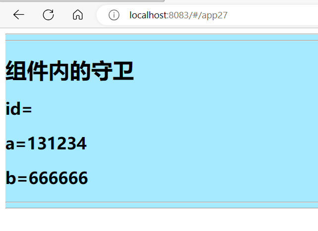

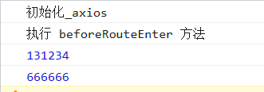


## 数据获取

### 概述

有时候，进入某个路由后，需要从服务器获取数据。例如，在渲染用户信息时，你需要从服务器获取用户的数据。我们可以通过两种方式来实现：

- **导航完成之后获取**：先完成导航，然后在接下来的组件生命周期钩子中获取数据。在数据获取期间显示“加载中”之类的指示。
- **导航完成之前获取**：导航完成前，在路由进入的守卫中获取数据，在数据获取成功后执行导航。

从技术角度讲，两种方式都不错 ，就看你想要的用户体验是哪种。


### 导航完成后获取数据

当你使用这种方式时，我们会马上导航和渲染组件，然后在组件的 created 钩子中获取数据。这让我们有机会在数据获取期间展示一个 loading 状态，还可以在不同视图间展示不同的 loading 状态。


假设我们有一个 `Post` 组件，需要基于 `$route.params.id` 获取文章数据：

```vue
<template>
  <div class="post">
    <div v-if="loading" class="loading">Loading...</div>

    <div v-if="error" class="error">{{ error }}</div>

    <div v-if="post" class="content">
      <h2>{{ post.title }}</h2>
      <p>{{ post.body }}</p>
    </div>
  </div>
</template>
```


```js
export default {
  data() {
    return {
      loading: false,
      post: null,
      error: null,
    }
  },
  created() {
    // watch 路由的参数，以便再次获取数据
    this.$watch(
      () => this.$route.params,
      () => {
        this.fetchData()
      },
      // 组件创建完后获取数据，
      // 此时 data 已经被 observed 了
      { immediate: true }
    )
  },
  methods: {
    fetchData() {
      this.error = this.post = null
      this.loading = true
      // replace `getPost` with your data fetching util / API wrapper
      getPost(this.$route.params.id, (err, post) => {
        this.loading = false
        if (err) {
          this.error = err.toString()
        } else {
          this.post = post
        }
      })
    },
  },
}
```


### 在导航完成前获取数据

通过这种方式，我们在导航转入新的路由前获取数据。我们可以在接下来的组件的 `beforeRouteEnter` 守卫中获取数据，当数据获取成功后只调用 `next` 方法

在为后面的视图获取数据时，用户会停留在当前的界面，因此建议在数据获取期间，显示一些进度条或者别的指示。如果数据获取失败，同样有必要展示一些全局的错误提醒。


```js
export default {
  data() {
    return {
      post: null,
      error: null,
    }
  },
  beforeRouteEnter(to, from, next) {
    getPost(to.params.id, (err, post) => {
      next(vm => vm.setData(err, post))
    })
  },
  // 路由改变前，组件就已经渲染完了
  // 逻辑稍稍不同
  async beforeRouteUpdate(to, from) {
    this.post = null
    try {
      this.post = await getPost(to.params.id)
    } catch (error) {
      this.error = error.toString()
    }
  },
}
```


## 过渡动效

想要在你的路径组件上使用转场，并对导航进行动画处理，需要使用 v-slot API：

```vue
<router-view v-slot="{ Component }">
  <transition name="fade">
    <component :is="Component" />
  </transition>
</router-view>
```


Vue 可能会自动复用看起来相似的组件，从而忽略了任何过渡。幸运的是，可以添加一个 key 属性来强制过渡。这也允许你在相同路由上使用不同的参数触发过渡：

```vue
<router-view v-slot="{ Component, route }">
  <transition name="fade">
    <component :is="Component" :key="route.path" />
  </transition>
</router-view>
```


## 滚动行为

使用前端路由，当切换到新路由时，想要页面滚到顶部，或者是保持原先的滚动位置，就像重新加载页面那样。 vue-router 能做到，而且更好，它让你可以自定义路由切换时页面如何滚动。


**注意: 这个功能只在支持 history.pushState 的浏览器中可用。**


当创建一个 Router 实例，你可以提供一个 `scrollBehavior` 方法：

```js
const router = createRouter({
  history: createWebHashHistory(),
  routes: [...],
  scrollBehavior (to, from, savedPosition) {
    // return 期望滚动到哪个的位置
  }
})
```


`scrollBehavior` 函数接收 `to`和` from` 路由对象

`savedPosition`，只有当这是一个 `popstate` 导航时才可用（由浏览器的后退/前进按钮触发）


该函数可以返回一个 `ScrollToOptions` 位置对象:

```js
const router = createRouter({
  scrollBehavior(to, from, savedPosition) {
    // 始终滚动到顶部
    return { top: 0 }
  },
})
```


可以通过 `el` 传递一个 CSS 选择器或一个 DOM 元素。在这种情况下，`top` 和 `left` 将被视为该元素的相对偏移量：

```js
const router = createRouter({
  scrollBehavior(to, from, savedPosition) {
    // 始终在元素 #main 上方滚动 10px
    return {
      // 也可以这么写
      // el: document.getElementById('main'),
      el: '#main',
      top: -10,
    }
  },
})
```


如果返回一个 falsy 的值，或者是一个空对象，那么不会发生滚动。


按下 后退/前进 按钮时，就会像浏览器的原生表现那样：

```js
const router = createRouter({
  scrollBehavior(to, from, savedPosition) {
    if (savedPosition) {
      return savedPosition
    } else {
      return { top: 0 }
    }
  },
})
```


有时候，我们需要在页面中滚动之前稍作等待。例如，当处理过渡时，我们希望等待过渡结束后再滚动。要做到这一点，你可以返回一个 Promise，它可以返回所需的位置描述符。下面是一个例子，我们在滚动前等待 500ms：

```js
const router = createRouter({
  scrollBehavior(to, from, savedPosition) {
    return new Promise((resolve, reject) => {
      setTimeout(() => {
        resolve({ left: 0, top: 0 })
      }, 500)
    })
  },
})
```


```vue
<script>

import {createRouter, createWebHashHistory} from 'vue-router'
import App from '@/App'
import App2 from '@/App2'
import App3 from '@/App3'
import App4 from '@/App4'
import App5 from '@/App5'
import App6 from '@/App6'
import App7 from '@/App7'
import App8 from '@/App8'
import App9 from '@/App9'
import App10 from '@/App10'
import App11 from '@/App11'
import App12 from '@/App12'
import App13 from '@/App13'
import App15 from '@/App15'
import App14 from '@/App14'
import App16 from '@/App16'
import App17 from '@/App17'
import App18 from '@/App18'
import App19 from '@/App19'
import App_27 from '@/App27'
import App28 from '@/App28'
import NotFound from '@/views/404'

function f1()
{
  console.log("第一个路由独享的守卫")
  return true;
}

function f2()
{
  console.log("第二个路由独享的守卫")
  return true;
}

const routes = [
  {
    path: '/',
    components:
        {
          default: App,
          r1: App2,
          r2: App3,
          r3: App4,
        },
    alias: ['/aaa', '/bbb', '/ccc']
  },
  {
    path: '/app5',
    components:
        {
          default: App5,
          r1: App6,
          r2: App7,
          r3: App8,
        },
    beforeEnter: [f1, f2]
  },
  {
    path: '/app9',
    components:
        {
          default: App9,
          r1: App10,
          r2: App11,
          r3: App12,
        },
    beforeEnter: (to, from) =>
    {
      console.log("从" + from.path + "到" + to.path)
      //0.5的概率放行
      if (Math.random() > 0.5)
      {
        console.log("放行")
        return true
      }
      console.log("不放行")
      return false
    }
  },
  {
    path: '/app13',
    component: App13,
    redirect: "/404"
  },
  {
    path: '/app14',
    component: App14,
    beforeEnter: [f1, f2]
  },
  {
    path: '/app15',
    component: App15
  },
  {
    path: '/app16',
    component: App16
  },
  {
    path: '/app17',
    component: App17
  },
  {
    path: '/app18',
    component: App18,
  },
  {
    path: '/app19',
    component: App19,
    alias: '/table'
  },
  {
    path: '/app27',
    component: App_27,
    meta: {a: 131234, b: 666666}
  },
  {
    path: '/app28',
    component: App28,
  },
  {
    path: '/404',
    component: NotFound
  },
  {
    path: '/:pathMatch(.*)*',
    redirect: "/404"
  }
]

const router = createRouter({
  //内部提供了 history 模式的实现。为了简单起见，我们在这里使用 hash 模式。
  history: createWebHashHistory(),
  routes, // `routes: routes` 的缩写
  scrollBehavior(to, from, savedPosition)
  {
    console.log(savedPosition)
    //return {top: 2000, left: 0}

    // 滚动到锚点
    if (to.hash)
    {
      return {
        selector: to.hash,
        // 平滑滚动
        behavior: 'smooth',
      }
    }

    return new Promise((resolve, reject) =>
    {
      setTimeout(() =>
      {
        resolve({left: 0, top: 2000})
      }, 1000)
    })
  }
})


export default router

</script>
```


```vue
<template>
  <div>

    <el-table
        :data="tableData"
        style="width: 100%">
      <el-table-column
          prop="id"
          label="学号"
          width="180">
      </el-table-column>
      <el-table-column
          prop="name"
          label="姓名"
          width="180">
      </el-table-column>
      <el-table-column
          prop="sex"
          label="性别"
          width="180">
      </el-table-column>
      <el-table-column
          prop="age"
          label="年龄"
          width="180">
      </el-table-column>
    </el-table>

  </div>
</template>

<script>
import {ElMessage} from 'element-plus'

export default {
  name: "App19",
  data()
  {
    return {
      tableData: (function ()
      {
        const data = [];
        for (let i = 0; i < 500; i++)
        {
          data.push({
            id: 100001 + i,
            name: "姓名" + (i + 1),
            sex: Math.random() > 0.5 ? "男" : "女",
            age: Math.round(Math.random() * 10 + 10)
          })
        }
        ElMessage({
          type: 'success',
          message: "加载完成"
        })
        return data;
      }())
    }
  }
}
</script>

<style scoped>

</style>
```


## 动态菜单

```html
<script>
const options = {
    mounted() {
        const serverRoutes = sessionStorage.getItem('serverRoutes');
        const array = JSON.parse(serverRoutes);
        const map = new Map();
        for(const obj of array) {
            map.set(obj.id, obj);
        }
        const top = [];
        for(const obj of array) {
            const parent = map.get(obj.pid);
            if(parent) {
                parent.children ??= [];
                parent.children.push(obj);
            } else {
                top.push(obj);
            }
        }
        this.top = top;
    },
    data() {
        return {
            top: []
        }
    }
}
export default options;
</script>
```


```html
<el-menu router background-color="#545c64" text-color="#fff" active-text-color="#ffd04b" :unique-opened="true">
    <template v-for="m1 of top">
<el-submenu v-if="m1.children" :key="m1.id" :index="m1.path">
    <span slot="title">
        <i :class="m1.icon"></i> {{m1.name}}
        </span>
    <el-menu-item v-for="m2 of m1.children" :key="m2.id" :index="m2.path">
        <span slot="title">
            <i :class="m2.icon"></i> {{m2.name}}
        </span>
        </el-menu-item>
        </el-submenu>
<el-menu-item v-else :key="m1.id" :index="m1.path">
    <span slot="title">
        <i :class="m1.icon"></i> {{m1.name}}
        </span>
        </el-menu-item>
    </template>
</el-menu>
```


# Vuex

## 概述

uex 是一个专门为 Vue.js 应用程序开发的**状态管理模式**，它采用集中式存储管理应用的所有组件状态，并以相应的规则保证状态以一种可预测的方式发生变化。可以理解为：将多个组件共享的变量全部存储在一个对象里面，然后将这个对象放在顶层的 Vue 实例中，让其他组件可以使用，它最大的特点是响应式。

一般情况下，我们会在 Vuex 中存放一些需要在多个界面中进行共享的信息。比如用户的登录状态、用户名称、头像、地理位置信息、商品的收藏、购物车中的物品等，这些状态信息，我们可以放在统一的地方，对它进行保存和管理。

与之对比 localStorage 与 sessionStorage 也能共享数据，但缺点是数据并非响应式


让我们从一个简单的 Vue 计数应用开始：

```js
const Counter = {
  // 状态
  data () {
    return {
      count: 0
    }
  },
  // 视图
  template: `
    <div>{{ count }}</div>
  `,
  // 操作
  methods: {
    increment () {
      this.count++
    }
  }
}

createApp(Counter).mount('#app')
```


这个状态自管理应用包含以下几个部分：

- **状态**，驱动应用的数据源；
- **视图**，以声明方式将**状态**映射到视图；
- **操作**，响应在**视图**上的用户输入导致的状态变化。


但是，当我们的应用遇到**多个组件共享状态**时，单向数据流的简洁性很容易被破坏：

- 多个视图依赖于同一状态。
- 来自不同视图的行为需要变更同一状态。


对于问题一，传参的方法对于多层嵌套的组件将会非常繁琐，并且对于兄弟组件间的状态传递无能为力。对于问题二，我们经常会采用父子组件直接引用或者通过事件来变更和同步状态的多份拷贝。以上的这些模式非常脆弱，通常会导致无法维护的代码。

因此，我们为什么不把组件的共享状态抽取出来，以一个全局单例模式管理呢？在这种模式下，我们的组件树构成了一个巨大的“视图”，不管在树的哪个位置，任何组件都能获取状态或者触发行为！

通过定义和隔离状态管理中的各种概念并通过强制规则维持视图和状态间的独立性，我们的代码将会变得更结构化且易维护。

这就是 Vuex 背后的基本思想


## 教程

https://vuex.vuejs.org/zh/installation.html


**vue2和vue3会有所不同**


## 安装

命令：

```sh
npm install vuex@next --save
```


```sh
PS D:\程序\2023Q3\vue-test> npm install vuex@next --save
npm WARN optional SKIPPING OPTIONAL DEPENDENCY: fsevents@2.3.2 (node_modules\fsevents):
npm WARN notsup SKIPPING OPTIONAL DEPENDENCY: Unsupported platform for fsevents@2.3.2: wanted {"os":"darwin","arch":"any"} (current: {"os":"win32","arch":"x64"})

+ vuex@4.0.2
added 1 package from 1 contributor and audited 1003 packages in 8.203s

96 packages are looking for funding
  run `npm fund` for details

found 0 vulnerabilities

PS D:\程序\2023Q3\vue-test>
```


如果在package.json中看到了`"vuex": "^xxx"`，则安装成功

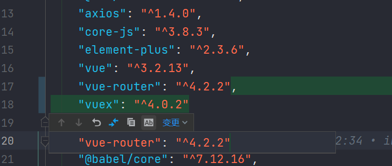


## 入门

创建src/store/index.js，内容如下：

```js
import {createStore} from 'vuex'

// 创建一个新的 store 实例
const store = createStore({
    state()
    {
        return {
            count: 0,
            name: '',
            age: 18
        }
    },
    mutations: {
        increment(state)
        {
            state.count++
        },
        updateName(state, name)
        {
            state.name = name;
        },
        updateAge(state, age)
        {
            state.age = age;
        }
    }
})

export default store;
```


在 Vue 组件中， 可以通过 `this.$store` 访问store实例

mutations 方法不能直接调用，只能通过 `store.commit(mutation方法名, 参数)` 来间接调用


App29.vue

```vue
<template>
  <div>

    <h1>count数量：{{ $store.state.count }}</h1>
    <br>

    <h1>名字：{{ $store.state.name }}</h1>
    <br>

    <h1>年龄：{{ $store.state.age }}</h1>
    <br>

    <el-button type="success" size="large" @click="f1">count自增</el-button>
    <br>
    <el-input type="text" size="large" v-model="name" @change="f2"></el-input>

    <br>
    <el-input type="number" size="large" autocomplete="年龄" v-model="age" @change="f3"></el-input>

  </div>
</template>

<script>
export default {
  name: "App29",
  data()
  {
    return {
      name: "",
      age: 0,
    }
  },
  methods:
      {
        f1()
        {
          this.$store.commit("increment")
        },
        f2()
        {
          console.log(this.name)
          this.$store.commit("updateName", this.name)
        },
        f3()
        {
          console.log(this.age)
          this.$store.commit("updateAge", this.age)
        }
      }
}
</script>

<style scoped>

</style>
```


main.js


```js
import {createApp} from 'vue'

import ElementPlus from 'element-plus'
import 'element-plus/dist/index.css'

import App from './App29.vue'
import Router2 from '@/router/Router11'
import Store from '@/store/index'

const app = createApp(App)

app.use(ElementPlus)
app.use(Router2)
app.use(Store)
app.mount('#app')
```


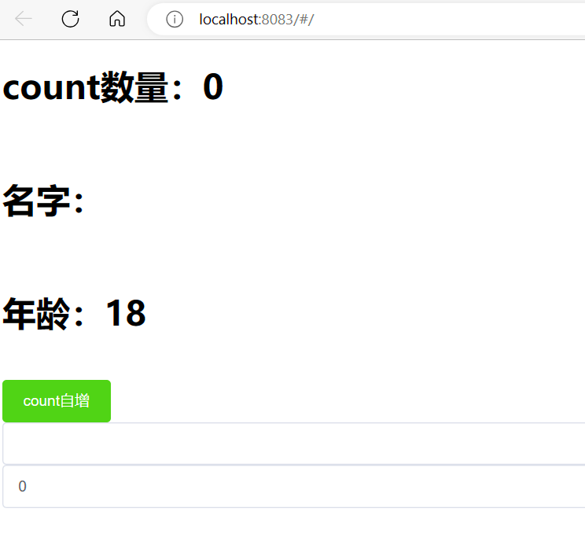


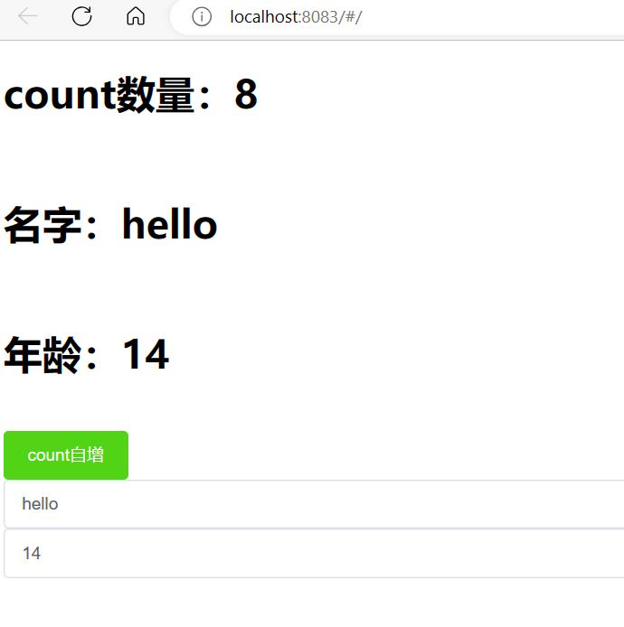


由于 store 中的状态是响应式的，在组件中调用 store 中的状态简单到仅需要在计算属性中返回即可。触发变化也仅仅是在组件的 methods 中提交 mutation。


## State

